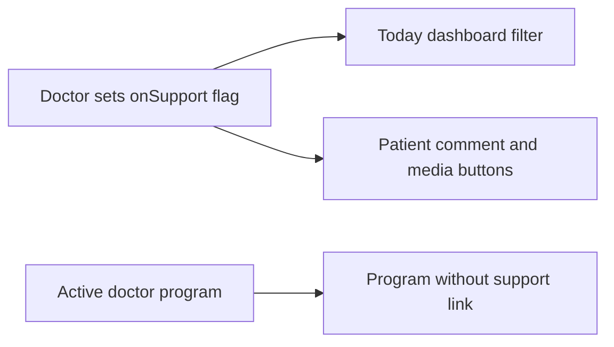

# План: актуальная очередь (врач + пациент + CMS)

**Синхронизация:** 2026-06-02. Репозиторий: [`docs/ACTIVE_WORKQUEUE.md`](docs/ACTIVE_WORKQUEUE.md), [`docs/TODO.md`](docs/TODO.md) §Doctor card. Фаза 1 детально: `phase1_support_model_7c745931.plan.md`.

## Источник правды

- Сводка задач: [`docs/TODO.md`](docs/TODO.md) §Doctor card, §CMS, §Patient
- Контекст roadmap: [`docs/APP_RESTRUCTURE_INITIATIVE/ROADMAP_2.md`](docs/APP_RESTRUCTURE_INITIATIVE/ROADMAP_2.md), [`docs/DOCTOR_PATIENT_CARD_TREATMENT_PROGRAM_INITIATIVE/ROADMAP.md`](docs/DOCTOR_PATIENT_CARD_TREATMENT_PROGRAM_INITIATIVE/ROADMAP.md)
- **Вне scope «сейчас»:** D5 `domain→kind`, полная переработка `/diary`, курсы, proactive-лента (после карточки), UX истории тестов (после доработки элементов тестов)
- UX-референсы для карточки врача: care management dashboards обычно строятся вокруг **patient header + active care plan + clinical timeline + vitals/observations graph + tasks/alerts**. Ориентиры: Microsoft Care Management (care plans, clinical timeline, care coordinator dashboard), Fire Arrow patient clinical data (observation graph + event timeline), общие healthcare dashboard patterns (open tasks, vitals, timeline, quick actions).

---

## Фаза 0 — Hotfix UI «Упражнения» (P0) — **закрыта**

**Проблема:** в списке элементов вкладки «Программа» кнопка «Комментарии» визуально занимала всю ширину; «Отметить выполнение» не помещалось на экран.

**Где:** [`apps/webapp/src/app/app/patient/treatment/PatientTreatmentProgramStagePageProgramSection.tsx`](apps/webapp/src/app/app/patient/treatment/PatientTreatmentProgramStagePageProgramSection.tsx) — footer строки плитки; согласование с [`PatientProgramStageItemPageClient.tsx`](apps/webapp/src/app/app/patient/treatment/PatientProgramStageItemPageClient.tsx).

**Сделано:**
- Убрана иконка `MessageCircle` у кнопки «Комментарии».
- Компактная кнопка: короткая подпись + бейдж счётчика; `shrink-0`, `max-width` / `whitespace-nowrap` по необходимости.
- Ряд кнопок: `flex-nowrap`, у «Отметить выполнение» — `min-w-0 flex-1`, обе кнопки на типовой mobile ширине patient shell.

**DoD:** [x] на узком viewport обе кнопки видны без горизонтального скролла; «Комментарии» без иконки, с бейджем при count > 0.

---

## Фаза 1 — «На сопровождении» и гейты комментариев/медиа — **закрыта**

Реализация по плану `phase1_support_model_7c745931` (таблица `doctor_patient_support`, не `platform_users.metadata`).

**Сделано (кратко):**
- Drizzle `doctor_patient_support` + миграция `0101` + backfill активных doctor-программ.
- Порт/сервис: `getClientSupport`, `updateClientSupport`, `getPatientProgramInteractionPolicy`, фильтры `supportStatus`.
- Врач: `DoctorClientSupportPanel`, `GET/PATCH …/support-settings`, doctor-scope defaults в `/app/settings`.
- «Сегодня»: `onSupportCount` по флагу; `?support=on`, `?support=programWithoutSupport`.
- Пациент: `programCommentsInteraction` / `programMediaInteraction` (visible/disabled); API gates `patient_support_*_disabled`.
- Док: `DOCTOR_DASHBOARD_METRICS.md`, `TODO.md`, `PROMO_ASSIGNMENT_SOURCE.md`, `api.md`, LOG инициативы.

**DoD:** [x] врач вручную ведёт сопровождение; «Сегодня» и patient UX согласованы с флагами; старый SQL «active program = on support» снят.

---

## Фаза 2A — Спроектировать карточку пациента врача

**Почему отдельно от реализации:** текущий `ClientProfileCard` уже содержит чат, записи, заметки, программу, тесты, ЛФК, симптомы, контакты и admin-детали в одной длинной странице. Это задача уровня IA/продуктового дизайна; её не отдавать Composer как «поправь UI». Сначала нужен короткий дизайн-док, потом реализация по нему.

**Deliverable:** новый дизайн-план, например [`docs/DOCTOR_PATIENT_CARD_TREATMENT_PROGRAM_INITIATIVE/CARD_REDESIGN_PLAN.md`](docs/DOCTOR_PATIENT_CARD_TREATMENT_PROGRAM_INITIATIVE/CARD_REDESIGN_PLAN.md). В нём должны быть:

- **Data inventory:** какие данные уже есть в `ClientProfile`, `treatmentProgramInstancesInitial`, `pendingProgramTestEvaluations`, `messageHistory`, booking history, symptom entries, LFK sessions; какие новые read-модели нужны.
- **User tasks:** что врач делает за 10 секунд после открытия карточки: понять статус сопровождения, увидеть активную программу, увидеть проблемы, ответить пациенту, открыть тест, перейти к записи.
- **IA/layout:** desktop и mobile структура, какие блоки above-the-fold, что collapsible, что в табах/якорях.
- **Component decomposition:** какие новые компоненты выделить из `ClientProfileCard`, какие оставить existing panels.
- **Data/API contract:** какие агрегаты грузить в RSC, что грузить lazy/on-demand, чтобы карточка не стала тяжёлой.
- **Migration path:** как оставить старые anchors (`#doctor-client-section-*`) и не сломать ссылки из писем/инбокса.
- **Acceptance checklist:** что считается «хаос убран», какие сценарии вручную проверить.

**Рекомендуемая структура карточки (после дизайна):**

1. **Patient Header / Care Bar**: имя, телефон, ближайшая запись, «На сопровождении», быстрые действия `Чат`, `Программа`, `История`.
2. **Action Strip**: «К проверке», непрочитанные комментарии/медиа, несохранённые изменения программы (если будет).
3. **Overview Grid**: слева активная программа, справа самочувствие/выполнение.
4. **Care Plan Block**: текущий этап + список упражнений/рекомендаций с маленькими превью; CTA «Открыть программу».
5. **Observations Chart**: график самочувствия с периодом и markers выполнения/пропусков упражнений.
6. **Program Discussion Inbox**: комментарии и media submissions по упражнениям, быстрый ответ врача.
7. **Clinical Timeline**: короткая лента «что изменилось» без технических event names; запись/тест/комментарий/изменение программы.
8. **Secondary Sections**: заметки, история записей, legacy ЛФК, admin/debug — ниже, collapsible или tabs.

**DoD фазы 2A:** есть утверждённый `CARD_REDESIGN_PLAN.md` с IA, component map, data contract, execution slices и checklist. Только после этого начинать код карточки.

---

## Фаза 2B — Реализовать карточку по дизайн-плану

**Цель:** убрать «простыню», сгруппировать блоки и дать врачу рабочий обзор без полного переписывания всех доменов за один PR.

**DoD:** врач видит программу, самочувствие графиком, комментарии/медиа и «что изменилось» без скролла через 5 экранов хаоса.

---

## Фаза 3 — Редактор назначенной программы: черновик + save

**DoD:** врач правит программу без серии confirm на каждый клик; один save; завершение программы закрывает все этапы.

---

## Фаза 4 — Добавление из каталога (фильтры)

**DoD:** фильтры регион + тип нагрузки в `InstanceAddLibraryItemDialog`.

---

## Фаза 5 — Inbox врача (вторичный, после карточки)

Cross-patient «К проверке» на «Сегодня»; `focusItemId` на экране программы.

---

## Фаза 6 — CMS enum + `/help`

**DoD:** админка управляет статьями; `/help` не заглушка.

---

## Фаза 7 — Низкий приоритет

- Мелкий хвост UX списка/конструктора **шаблонов программ**.
- Proactive-лента на «Сегодня» — **после** фаз 1–2.
- [x] `docs/ACTIVE_WORKQUEUE.md` заведён; TODO/LOG синхронизированы после фаз 0–1.

---

## Продуктовые решения (уже зафиксированы, не reopen)

- Срок этапа **не обязателен**.
- Persistent-рекомендации после завершения → **история**; в активной программе — **общее промо**.
- UX истории попыток тестов — отложено.

---

## Порядок исполнения (актуальный)

1. ~~**Фаза 0** (hotfix)~~ — **закрыта.**
2. ~~**Фаза 1** (флаги сопровождения)~~ — **закрыта.**
3. **Фаза 2A** дизайн карточки — **следующая.**
4. **Фаза 2B** реализация карточки.
5. **Фаза 3** черновик редактора.
6. **Фаза 4** фильтры каталога.
7. **Фаза 5–6** inbox + CMS/help.
8. **Фаза 7** по остаточному времени.

**CI:** полный `pnpm run ci` — перед push; между фазами — узкие vitest/lint по области ([`.cursor/rules/test-execution-policy.md`](.cursor/rules/test-execution-policy.md)).

**Документация:** `LOG.md` в doctor-инициативе + `APP_RESTRUCTURE_INITIATIVE/LOG.md` после каждой фазы; [`docs/ACTIVE_WORKQUEUE.md`](docs/ACTIVE_WORKQUEUE.md) / [`docs/TODO.md`](docs/TODO.md).
