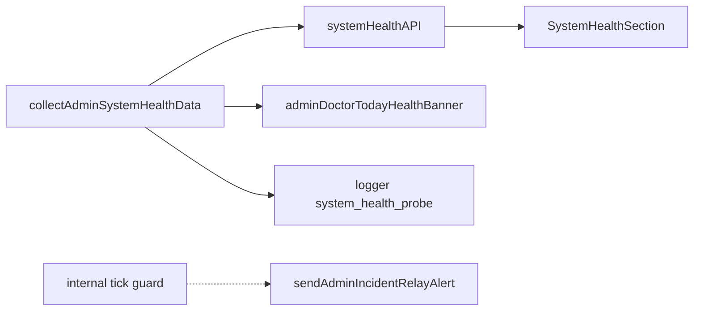

# Admin DB guard monitoring

**Статус:** `completed` (2026-05-15). Исполнение и команды проверки — в [`docs/OPERATOR_HEALTH_ALERTING_INITIATIVE/LOG.md`](../../docs/OPERATOR_HEALTH_ALERTING_INITIATIVE/LOG.md) § 2026-05-15.

## Контекст (что уже есть)

- Сводка **«Здоровье системы»**: [`collectAdminSystemHealthData.ts`](apps/webapp/src/app-layer/health/collectAdminSystemHealthData.ts) → [`route.ts`](apps/webapp/src/app/api/admin/system-health/route.ts) → [`SystemHealthSection.tsx`](apps/webapp/src/app/app/settings/SystemHealthSection.tsx).
- Паттерн очереди в БД уже задан для **`outgoing_delivery_queue`**: [`getOutgoingDeliveryQueueHealth`](apps/webapp/src/infra/repos/pgOperatorHealthRead.ts) (`Promise.all` агрегатов ~L114–L160), порог баннера [`ADMIN_DELIVERY_DUE_BACKLOG_WARNING`](apps/webapp/src/modules/operator-health/adminHealthThresholds.ts), учёт в [`adminDoctorTodayHealthBannerFromSystemHealth`](apps/webapp/src/app-layer/health/adminDoctorTodayHealthBanner.ts) (`deadTotal` / `dueBacklog`).
- Тип ответа **`SystemHealthResponse`** объявлен в том же файле, что и сборщик (~L198+); других потребителей типа кроме баннера врача **нет** (`rg SystemHealthResponse` → только `collectAdminSystemHealthData` + `adminDoctorTodayHealthBanner`).
- Воркер очереди: [`runIntegratorPushWorkerTick`](apps/webapp/src/infra/integrator-push/runIntegratorPushWorkerTick.ts), cron-скрипт [`integrator-push-outbox-tick.ts`](apps/webapp/scripts/integrator-push-outbox-tick.ts).

## Цель продукта

Админ видит на **«Здоровье системы»** риск по **`public.integrator_push_outbox`** (застой / dead / processing) после рефакторов Drizzle/pg. Врачебный баннер «Требуется внимание…» **не должен игнорировать** критичное состояние этой очереди, если оно уже отражено в порогах (паритет с `outgoingDelivery`).

## Канон таблицы `integrator_push_outbox` (не гадать при реализации)

Источник: [`apps/webapp/db/schema/schema.ts`](apps/webapp/db/schema/schema.ts) — `integratorPushOutbox` (~L1645+).

| Поле (SQL) | Смысл для health |
|------------|------------------|
| `status` | Только: `pending` \| `processing` \| `done` \| `dead` (CHECK в DDL) |
| `next_try_at` | Для **due-pending**: сравнение с `now()` (как `next_retry_at` у исходящей доставки) |
| `updated_at` | Активность / «зависший» `processing` (паттерн `processingCount` + `max(updated_at)` как в outgoing) |
| `attempts_done` / `max_attempts` | Опционально в снимке для UI «на исходе попыток» — **в MVP не обязательно**, не раздувать payload без запроса |
| `kind` | Для `group by` как `dueByKind` — **только агрегаты**, не список id |
| `payload` | **Не** отдавать в API/UI (только счётчики / возрасты) |

Индекс: `idx_integrator_push_outbox_due` на `(status, next_try_at)` WHERE `status = 'pending'` — запросы класса «due pending» должны быть индекс-дружелюбны (`status` + `next_try_at`).

## Контракт снимка (MVP)

Минимум (зеркалирование смысла `OutgoingDeliveryQueueHealthSnapshot`):

1. **`dueBacklog`**: `count(*)` WHERE `status = 'pending'` AND `next_try_at <= now()` (строки, которые воркер уже может забирать).
2. **`deadTotal`**: `count(*)` WHERE `status = 'dead'`.
3. **`processingCount`**: `count(*)` WHERE `status = 'processing'`.
4. **`oldestDueAgeSeconds`**: возраст «хвоста» due-pending — дисциплина зафиксирована в [`LOG.md`](../../docs/OPERATOR_HEALTH_ALERTING_INITIATIVE/LOG.md) § 2026-05-15.
5. **`lastQueueActivityAt`**: `max(updated_at)` по таблице (как `lastQueueActivityAt` у outgoing).
6. **По `kind`**: `dueByKind` / `deadByKind` — **если** дешёвый `group by` в том же `Promise.all`; если раздувает время пробы — в MVP только totals + запись в LOG «kind breakdown — backlog».

Реализация: **Drizzle** в [`pgOperatorHealthRead.ts`](apps/webapp/src/infra/repos/pgOperatorHealthRead.ts), метод порта в [`ports.ts`](apps/webapp/src/modules/operator-health/ports.ts).

## Scope (разрешено)

- `apps/webapp/src/modules/operator-health/**`
- `apps/webapp/src/infra/repos/pgOperatorHealthRead.ts`
- `apps/webapp/src/app-layer/di/buildAppDeps.ts` — только если нужна новая проводка (обычно порт уже в deps).
- `apps/webapp/src/app-layer/health/collectAdminSystemHealthData.ts`
- `apps/webapp/src/app-layer/health/adminDoctorTodayHealthBanner.ts`
- `apps/webapp/src/app/api/admin/system-health/route.ts`, `route.test.ts`
- `apps/webapp/src/app/app/settings/SystemHealthSection.tsx`, существующие `SystemHealthSection*.test.tsx`
- Чтение схемы: `apps/webapp/db/schema/schema.ts` (без новых миграций).

## Вне scope

- Новые DDL / изменения `integrator_push_outbox`.
- Новые env для секретов/URL (ключи — через `system_settings` + `ALLOWED_KEYS`, см. workspace rules).
- Полный diff `system_settings` public vs integrator.

## Фаза A — MVP (выполнено)

### A1 — порт, SQL-снимок, пороги

1. Добавить тип снимка (`IntegratorPushOutboxHealthSnapshot`) в `ports.ts` и метод `getIntegratorPushOutboxHealth()` в `OperatorHealthReadPort`.
2. Реализовать в `pgOperatorHealthRead` пакет запросов через **`Promise.all`** по образцу `getOutgoingDeliveryQueueHealth` (не N+1 в цикле).
3. Модуль классификации (`integratorPushOutboxHealth.ts`): **`classifyIntegratorPushOutboxSystemHealthStatus`** + именованные константы; due-backlog warning = **`ADMIN_DELIVERY_DUE_BACKLOG_WARNING`**; плюс правила по `oldestDueAgeSeconds` и зависшему `processing`.

**Чеклист A1**

- [x] `rg integratorPushOutbox` — импорт таблицы только из `pgOperatorHealthRead` / schema, не из `modules/**`.
- [x] ESLint: в `modules/**` нет `@/infra/db/*` и `@/infra/repos/*`.
- [x] В API/UI **нет** `payload`, `idempotency_key` как строк к пользователю.
- [x] Unit-тест классификатора + кейсы в `route.test.ts` + фиксация в LOG.

### A2 — collect, `meta.probes`, баннер

1. Расширить `SystemHealthResponse` блоком `integratorPushOutbox` и **`meta.probes.integratorPushOutbox`** по тому же шаблону, что `outgoingDelivery`.
2. В `collectAdminSystemHealthData`: при ошибке чтения — `ProbeResult` с `errorCode` **без** stack/SQL в пользовательском JSON (как соседние пробы).
3. **`adminDoctorTodayHealthBannerFromSystemHealth`**: ветка по новому блоку, **тот же** классификатор.

**Чеклист A2**

- [x] `pnpm --filter @bersoncare/webapp run test:inprocess -- src/app/api/admin/system-health/route.test.ts` (из корня монорепо).
- [x] RTL `SystemHealthSection*.test.tsx` при правках карточки.

### A3 — UI

1. Карточка в `SystemHealthSection`: статус (`ok`/`degraded`/`error`), `dueBacklog`, `deadTotal`, `processingCount`, при наличии — кратко oldest age / last activity (одна строка без абзацев).

**Чеклист A3**

- [x] Визуальный паттерн как у соседних карточек health (бейдж/заголовок).
- [x] Без лишних `data-testid`.

### A4 — LOG

1. Запись в [`LOG.md`](../../docs/OPERATOR_HEALTH_ALERTING_INITIATIVE/LOG.md) § 2026-05-15: ссылка на этот план, пороги, дисциплина `oldestDueAgeSeconds`, B/C выполнены.

### Инварианты

- Пороги в коде (не `system_settings` для числовых порогов MVP).
- Маршрут [`system-health/route.ts`](apps/webapp/src/app/api/admin/system-health/route.ts) без бизнес-логики SQL.

### Верификация перед merge

- [x] `pnpm --filter @bersoncare/webapp run lint`
- [x] `pnpm --filter @bersoncare/webapp run typecheck`
- [x] Тесты из чеклистов A2; полный `pnpm run ci` — по политике репозитория перед merge в основную ветку.

## Definition of Done (MVP)

1. [x] `GET /api/admin/system-health` содержит блок outbox + `meta.probes.integratorPushOutbox`; [`route.test.ts`](apps/webapp/src/app/api/admin/system-health/route.test.ts) обновлён.
2. [x] UI «Здоровье системы» показывает новую карточку с согласованным статусом.
3. [x] `adminDoctorTodayHealthBannerFromSystemHealth` учитывает критичное состояние outbox по тем же правилам, что и агрегированный статус для админа.
4. [x] Классификатор покрыт тестами (unit + route).
5. [x] Запись в [`LOG.md`](../../docs/OPERATOR_HEALTH_ALERTING_INITIATIVE/LOG.md).
6. [x] `lint` + `typecheck` webapp; `pnpm run ci` перед merge — по правилам команды.

## B / C (выполнено в том же PR)

- **B:** `writeAuditLogDedupeOpenConflictKey`, `action: system_health_integrator_push_outbox`, дедуп по `conflict_key` (см. LOG).
- **C:** топик `system_health_db_guard` в `admin_incident_alert_config`, `POST /api/internal/system-health-guard/tick` с Bearer **`INTERNAL_JOB_SECRET`** (без отдельного admin-ключа для секрета tick), `runIntegratorPushOutboxHealthGuardTick`, документация в `deploy/HOST_DEPLOY_README.md` и [`SERVER CONVENTIONS.md`](../../docs/ARCHITECTURE/SERVER%20CONVENTIONS.md).

## Ключевые пути (реализация)

- [`integratorPushOutboxHealth.ts`](apps/webapp/src/modules/operator-health/integratorPushOutboxHealth.ts)
- [`pgOperatorHealthRead.ts`](apps/webapp/src/infra/repos/pgOperatorHealthRead.ts)
- [`collectAdminSystemHealthData.ts`](apps/webapp/src/app-layer/health/collectAdminSystemHealthData.ts)
- [`system-health-guard/tick/route.ts`](apps/webapp/src/app/api/internal/system-health-guard/tick/route.ts)
- [`runIntegratorPushOutboxHealthGuardTick.ts`](apps/webapp/src/modules/operator-health/runIntegratorPushOutboxHealthGuardTick.ts)

## Отчёт исполнителя (закрытие)

- Список модулей — см. коммиты по ветке; контракт снимка и relay — в LOG § 2026-05-15.
- Kind breakdown в снимке — при необходимости отдельная задача.
