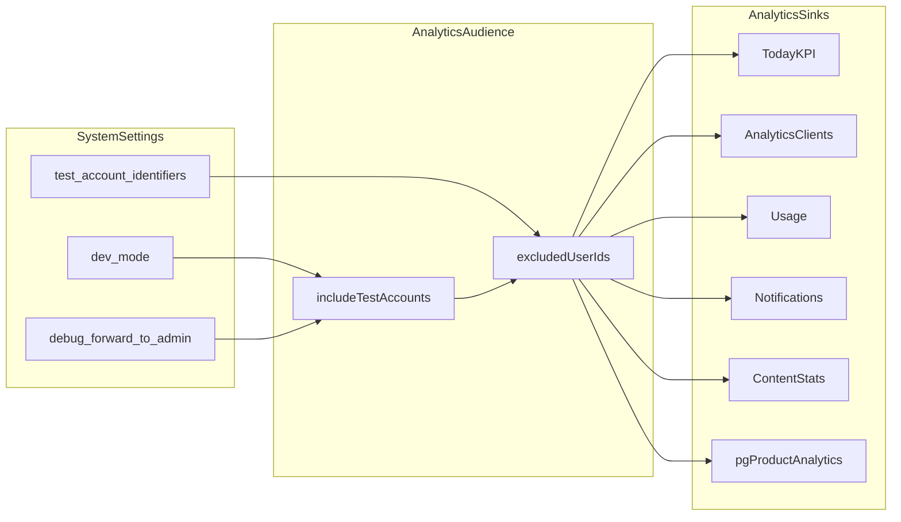

# Аналитика: усиленный исполнимый план

**Статус:** закрыт (2026-06-05). Канонический файл — этот архив в репозитории.

## 0) Цели, инварианты, границы

### Цели

1. Тестовые аккаунты не должны попадать в аналитику по умолчанию.
2. Исключение снимается только если включен хотя бы один флаг:
   - `dev_mode=true`
   - `debug_forward_to_admin=true`
3. Все KPI-карточки в заявленных экранах кликабельны по всей карточке, а не только по числу.
4. Drill-down по аккаунтам приводится к единому UX как на `analytics/clients`.

### Жесткие инварианты

- Источник тестовых идентификаторов: `system_settings.test_account_identifiers` ([`apps/webapp/src/modules/system-settings/testAccounts.ts`](../../../apps/webapp/src/modules/system-settings/testAccounts.ts)).
- Для product analytics сохраняем текущее исключение staff-ролей (`admin`/`doctor`) вне зависимости от debug/dev.
- Технические видеометрики (`videoPlayback`, `videoPlaybackClient`) не переводим в user drill-down.
- Не меняем patient UI, auth-flow, ingest событий.

### Scope

- Разрешено менять только:
  - `apps/webapp/src/app/app/doctor/**` (analytics/today/content usage карточки и dialogs)
  - `apps/webapp/src/app/api/**` (только аналитические endpoints)
  - `apps/webapp/src/app-layer/analytics/**` (request-scoped audience loader)
  - `apps/webapp/src/modules/**` (analytics audience helper, порты)
  - `apps/webapp/src/infra/repos/**` (аналитические выборки)
  - `docs/ARCHITECTURE/DOCTOR_DASHBOARD_METRICS.md`
- Вне scope:
  - patient routes
  - integrator app
  - новые env-переменные
  - изменение состава полей `test_account_identifiers` UI

---

## 1) Архитектурное решение (фиксируем до реализации)

### Decision table: включать ли тестовых в аналитику

| dev_mode | debug_forward_to_admin | includeTestAccounts |
|---|---|---|
| false | false | false |
| true | false | true |
| false | true | true |
| true | true | true |

### Единый pipeline



**Request-scoped loader:** [`apps/webapp/src/app-layer/analytics/loadAnalyticsAudience.ts`](../../../apps/webapp/src/app-layer/analytics/loadAnalyticsAudience.ts) — `loadDoctorAnalyticsAudience()` / `loadProductAnalyticsAudience()`; один вызов на HTTP/RSC-запрос.

---

## 2) Фазы исполнения (с критериями входа/выхода)

### Phase 0 — Baseline и разметка рисков

**Сделать:**

- Зафиксировать текущие точки расчета:
  - [`apps/webapp/src/infra/repos/pgProductAnalytics.ts`](../../../apps/webapp/src/infra/repos/pgProductAnalytics.ts)
  - [`apps/webapp/src/infra/repos/pgDoctorClients.ts`](../../../apps/webapp/src/infra/repos/pgDoctorClients.ts)
  - [`apps/webapp/src/infra/repos/pgDoctorCanonicalAppointments.ts`](../../../apps/webapp/src/infra/repos/pgDoctorCanonicalAppointments.ts)
  - [`apps/webapp/src/infra/repos/pgAdminPlatformUserStats.ts`](../../../apps/webapp/src/infra/repos/pgAdminPlatformUserStats.ts)
  - [`apps/webapp/src/infra/repos/pgDoctorAnalyticsMetricAccounts.ts`](../../../apps/webapp/src/infra/repos/pgDoctorAnalyticsMetricAccounts.ts)
  - [`apps/webapp/src/app-layer/stats/loadAdminReminderStats.ts`](../../../apps/webapp/src/app-layer/stats/loadAdminReminderStats.ts)
  - [`apps/webapp/src/app-layer/stats/reminderNotificationPeopleStats.ts`](../../../apps/webapp/src/app-layer/stats/reminderNotificationPeopleStats.ts)
- Зафиксировать все call-sites `DoctorStatCard`.

**Выходной критерий:**

- Полный список мест, где участвует `platform_users`/`platform_user_id`.

---

### Phase 1 — Единый analyticsAudience helper

**Сделать:**

- Модуль: [`apps/webapp/src/modules/analytics/analyticsAudience.ts`](../../../apps/webapp/src/modules/analytics/analyticsAudience.ts).
- Реализовать:
  - `readAnalyticsIncludeTestAccounts(...)` (`dev_mode || debug_forward_to_admin`)
  - `resolveAnalyticsExcludedUserIds(...)`
  - SQL helper: `appendSqlExcludeUserIds`, `drizzleExcludeUserIdColumn`.
- Перенести дублируемую логику из `pgProductAnalytics`.

**Проверки фазы:**

- Unit tests [`apps/webapp/src/modules/analytics/analyticsAudience.test.ts`](../../../apps/webapp/src/modules/analytics/analyticsAudience.test.ts):
  - flags off → include=false
  - `dev_mode=true` → include=true
  - `debug_forward_to_admin=true` → include=true
  - **оба флага on** → include=true
  - `appendSqlExcludeUserIds` с пустым/непустым списком
- Staff exclusion для product path — в `resolveAnalyticsExcludedUserIds` с `excludeStaffRoles` (покрытие через product analytics repo/integration).

**Выходной критерий:**

- Один канонический helper без копипасты.

---

### Phase 2 — Подключение фильтра в data layer

**Сделать:**

- Подключить `excludedUserIds` в:
  - [`pgDoctorClients.ts`](../../../apps/webapp/src/infra/repos/pgDoctorClients.ts): `getClientContactBreakdown`, `countRecentClientsWithoutMessagingChannels`, `getDashboardPatientMetrics`
  - [`pgDoctorCanonicalAppointments.ts`](../../../apps/webapp/src/infra/repos/pgDoctorCanonicalAppointments.ts): `getAppointmentStats`, `getDashboardAppointmentMetrics`
  - [`pgAdminPlatformUserStats.ts`](../../../apps/webapp/src/infra/repos/pgAdminPlatformUserStats.ts)
  - [`pgDoctorAnalyticsMetricAccounts.ts`](../../../apps/webapp/src/infra/repos/pgDoctorAnalyticsMetricAccounts.ts)
  - [`loadAdminReminderStats.ts`](../../../apps/webapp/src/app-layer/stats/loadAdminReminderStats.ts)
  - [`reminderNotificationPeopleStats.ts`](../../../apps/webapp/src/app-layer/stats/reminderNotificationPeopleStats.ts)
  - [`pgProductAnalytics.ts`](../../../apps/webapp/src/infra/repos/pgProductAnalytics.ts) через helper

**Проверки фазы:**

- `rg`-проверка: нет старых локальных функций исключения test users в нескольких местах.

**Выходной критерий:**

- Во всех аналитических выборках единая логика включения/исключения test users.

---

### Phase 3 — Прокидка audience через API/RSC

**Сделать:**

- Читать audience один раз на запрос через `loadDoctorAnalyticsAudience()` / `loadProductAnalyticsAudience()`:
  - [`apps/webapp/src/app/api/admin/doctor-analytics-appointments/route.ts`](../../../apps/webapp/src/app/api/admin/doctor-analytics-appointments/route.ts)
  - [`apps/webapp/src/app/api/admin/doctor-analytics-metric-accounts/route.ts`](../../../apps/webapp/src/app/api/admin/doctor-analytics-metric-accounts/route.ts)
  - [`apps/webapp/src/app/api/admin/platform-user-registration-stats/route.ts`](../../../apps/webapp/src/app/api/admin/platform-user-registration-stats/route.ts)
  - [`apps/webapp/src/app/api/admin/platform-user-subscriber-stats/route.ts`](../../../apps/webapp/src/app/api/admin/platform-user-subscriber-stats/route.ts)
  - [`apps/webapp/src/app/api/admin/product-analytics/route.ts`](../../../apps/webapp/src/app/api/admin/product-analytics/route.ts) → через `loadAdminProductAnalytics`
  - [`apps/webapp/src/app/api/admin/reminder-stats/route.ts`](../../../apps/webapp/src/app/api/admin/reminder-stats/route.ts)
  - [`apps/webapp/src/app/api/doctor/content-stats/route.ts`](../../../apps/webapp/src/app/api/doctor/content-stats/route.ts)
  - [`apps/webapp/src/app/app/doctor/page.tsx`](../../../apps/webapp/src/app/app/doctor/page.tsx)
  - [`apps/webapp/src/app/app/doctor/analytics/clients/page.tsx`](../../../apps/webapp/src/app/app/doctor/analytics/clients/page.tsx)

**Проверки фазы:**

- Route test: [`apps/webapp/src/app/api/doctor/analytics-metric-accounts/route.test.ts`](../../../apps/webapp/src/app/api/doctor/analytics-metric-accounts/route.test.ts) — передача `excludedUserIds`, whitelist метрик для doctor route.

**Выходной критерий:**

- Серверные surface получают одинаковую audience-политику.

---

### Phase 4 — Рефакторинг DoctorStatCard на click-anywhere

**Сделать:**

- [`apps/webapp/src/app/app/doctor/analytics/clients/DoctorStatCard.tsx`](../../../apps/webapp/src/app/app/doctor/analytics/clients/DoctorStatCard.tsx):
  - только `onClick` (whole-card), без `onValueClick`
  - при `href`: карточка как `Link` без вторичной ссылки «Открыть»
  - интерактивная карточка — нативный `<button>` (focus/hover/keyboard)
- Тест: [`DoctorStatCard.test.tsx`](../../../apps/webapp/src/app/app/doctor/analytics/clients/DoctorStatCard.test.tsx)

**Проверки фазы:**

- `rg "onValueClick" apps/webapp/src/app/app/doctor` → 0
- клик по заголовку и по значению; активация Enter на `<button>`

**Выходной критерий:**

- Вся площадь карточки интерактивна и доступна с клавиатуры.

---

### Phase 5 — Drill-down: «Сегодня» (`/app/doctor`)

**Сделать:**

- Ключи `today_*` в [`ports.ts`](../../../apps/webapp/src/modules/doctor-analytics-metric-accounts/ports.ts) и [`pgDoctorAnalyticsMetricAccounts.ts`](../../../apps/webapp/src/infra/repos/pgDoctorAnalyticsMetricAccounts.ts)
- UI: `DoctorTodayDashboard` + dialog; KPI через `DoctorStatCard` + `onClick`
- Doctor-safe route: [`GET /api/doctor/analytics-metric-accounts`](../../../apps/webapp/src/app/api/doctor/analytics-metric-accounts/route.ts) — whitelist только `DOCTOR_TODAY_METRIC_KEYS`

**Выходной критерий:**

- KPI «Сегодня» открывают drill-down аккаунтов без расширения admin-only surface для врача.

---

### Phase 6 — Drill-down: Usage, Notifications, Content

**Usage (`/app/doctor/usage`):**

- Карточечный drill-down только для **«Активных клиентов»** (`UsageMetricAccountsDialog` из `data.clients`); остальные KPI — агрегаты без user-list (не кликабельны по продуктовому замыслу).

**Notifications (`/app/doctor/analytics/notifications`):**

- Metric keys: `notif_reminders_sent`, `notif_reminders_failed`, `notif_push_opened`
- `windowHours` в admin metric-accounts API

**Content (`/app/doctor/material-ratings`):**

- `KpiCard` → `DoctorStatCard`
- User drill-down только для user-centric метрик
- Видео KPI → `/app/doctor/system-health`

**Выходной критерий:**

- На Usage / Notifications / Content карточки кликабельны по всей площади и ведут к ожидаемому действию.

---

### Phase 7 — Матрица верификации и тесты

#### Функциональная матрица

| Сценарий | Ожидание |
|---|---|
| flags off + test account | не попадает ни в one KPI на Today/Analytics/Usage/Notifications/Content |
| dev_mode on | test account попадает в выборки |
| debug_forward_to_admin on | test account попадает в выборки |
| оба флага on | поведение как include=true |
| клик по цифре и по заголовку карточки | одинаковый result |
| клавиатура Enter/Space на карточке-кнопке | тот же drill-down |

#### Закрытый набор тестов (lean policy)

| Область | Файл |
|---|---|
| audience flags (4 режима) + `resolveAnalyticsExcludedUserIds` + SQL helpers | `modules/analytics/analyticsAudience.test.ts` |
| DoctorStatCard click + Enter/Space | `app/app/doctor/analytics/clients/DoctorStatCard.test.tsx` |
| Today dashboard smoke | `app/app/doctor/DoctorTodayDashboard.test.tsx` |
| Today KPI section + drill-down | `app/app/doctor/DoctorTodayKpiSection.test.tsx` |
| doctor metric-accounts route (excluded + includeTestAccounts) | `app/api/doctor/analytics-metric-accounts/route.test.ts` |
| metric-accounts repo (`today_*`, `notif_*`, windowHours) | `infra/repos/pgDoctorAnalyticsMetricAccounts.test.ts` |

#### Локальные команды проверки

```bash
pnpm --dir apps/webapp exec vitest run \
  src/modules/analytics/analyticsAudience.test.ts \
  src/app/app/doctor/analytics/clients/DoctorStatCard.test.tsx \
  src/app/api/doctor/analytics-metric-accounts/route.test.ts \
  src/infra/repos/pgDoctorAnalyticsMetricAccounts.test.ts \
  src/app/app/doctor/DoctorTodayKpiSection.test.tsx
rg "onValueClick" apps/webapp/src/app/app/doctor
```

**Выходной критерий:**

- Матрица закрыта; `rg onValueClick` в doctor analytics — 0.

---

### Phase 8 — Документация

**Сделать:**

- Обновить [`docs/ARCHITECTURE/DOCTOR_DASHBOARD_METRICS.md`](../../../docs/ARCHITECTURE/DOCTOR_DASHBOARD_METRICS.md):
  - § «Исключение тестовых аккаунтов из аналитики»
  - KPI «Сегодня» и drill-down через `GET /api/doctor/analytics-metric-accounts`

**Выходной критерий:**

- Документ отражает runtime-политику audience и поверхности drill-down.

---

## Приложение A — Риски и rollback

### Основные риски

1. Расхождение агрегатов и drill-down (разные WHERE условия).
2. Перфоманс на больших `NOT IN (...)`.
3. Регресс кликабельности из-за nested interactive элементов.

### Митигации

- Один shared helper и переиспользование WHERE-шаблона.
- При большом списке excluded ids — join/CTE в helper для SQL-путей.
- `DoctorStatCard`: `<Link>` или `<button>`, не вложенные interactive в `<article>`.

### Rollback (исторически)

- Переходный alias `onValueClick` использовался на Phase 4; **удалён** после миграции всех call-sites на `onClick`.
- При поломке drill-down на одном экране — временный `href` fallback без отката audience-фильтра.

---

## Definition of Done

- [x] Во всех целевых analytics surfaces test users исключаются по умолчанию.
- [x] При `dev_mode || debug_forward_to_admin` test users включаются.
- [x] `DoctorStatCard` кликабелен по всей площади, а не только по числу.
- [x] KPI карточки целевых экранов открывают корректный drill-down/навигацию.
- [x] Нет `onValueClick` в doctor analytics коде.
- [x] Обновлен [`docs/ARCHITECTURE/DOCTOR_DASHBOARD_METRICS.md`](../../../docs/ARCHITECTURE/DOCTOR_DASHBOARD_METRICS.md).
- [x] Пройден набор целевых тестов по Phase 7.
