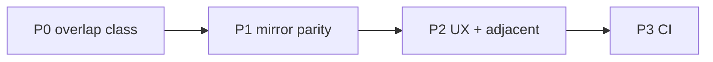

# Закрытие всех оставшихся booking-gaps (усиленный)

## Уже сделано (не повторять)

| ID | Что |
|----|-----|
| G1 | partial flags в `POST /api/booking/cancel` и `/reschedule` |
| G2/G3 | `rollbackRubitimeFirstCreate` — `deleteRecord` + cancel orphan `be_appointments` |
| — | GCal на `remove-record` в integrator |
| — | Mirror bundle 277 тестов + `pnpm run ci` green |
| — | Webhook tests mock `getRubitimeWebhookToken` |

**Вне scope:** legacy reschedule (`no_canonical`); prod deploy/GCal cleanup; E2E browser matrix; `bridge projectAll`.

---

## Приоритеты



| Фаза | Цель | Риск если не сделать |
|------|------|----------------------|
| **P0** | Убрать класс double-insert / overlap на rubitime-first | Повтор инцидента 2026-06-06 |
| **P1** | Симметрия create/cancel/reschedule + legacy API | Перенос отклоняется; hard delete в doctor API |
| **P2** | Пациент видит partial failure; web-push tick | Тихие сбои mirror; 22P02 в reminders |
| **P3** | Регрессия | — |

---

## P0 — Устранение overlap-класса (критично)

### Проблема (сильнее, чем «retry»)

Сейчас при `rubitimeFirst` и `getAppointmentIdByRubitimeExternalId === null` код **всё ещё** вызывает `createAppointment` ([`canonicalCreate.ts`](apps/webapp/src/modules/patient-booking/canonicalCreate.ts) L234+). Тест явно это ожидает (`canonicalCreate.test.ts` «skips assertSlotAvailable» → `createAppointment` called). Это **корневая** причина overlap, retry только снижает частоту.

### Фикс (каноническое решение)

При `rubitimeFirst && rubitimeId`:

1. `waitForRubitimeProjectionMapping` — до **5** попыток, **100ms** пауза (итого до ~500ms; fake timers в тестах).
2. Если mapping найден → adopt (как сейчас).
3. Если **не** найден после retry → `rollbackRubitimeFirstCreate` + `markFailedSync` + throw **`rubitime_projection_not_ready`**.
4. **`createAppointment` при rubitimeFirst — запретить полностью** (удалить fallback-ветку).

**Поведение для пользователя:** редкий «не удалось завершить запись, попробуйте снова» вместо ложного `slot_overlap` и мусора в GCal/Rubitime.

**Тесты** ([`canonicalCreate.test.ts`](apps/webapp/src/modules/patient-booking/canonicalCreate.test.ts)):

- [x] mapping на 2-й попытке → adopt, `createAppointment` **не** вызывается
- [x] mapping never → `deleteRecord`, throw `rubitime_projection_not_ready` (без `transitionAppointmentStatus` — канона ещё нет)
- [x] **Обновить** тест «skips assertSlotAvailable»: mock mapping на 1-й попытке (не ожидать `createAppointment`)

**UI:** добавить `rubitime_projection_not_ready` в [`bookingCreateErrorMessages.ts`](apps/webapp/src/app/app/patient/cabinet/bookingCreateErrorMessages.ts).

### P0-b — Shared rollback module

Вынести в [`apps/webapp/src/modules/patient-booking/rubitimeCreateRollback.ts`](apps/webapp/src/modules/patient-booking/rubitimeCreateRollback.ts) (новый):

- `waitForRubitimeProjectionMapping(deps, { organizationId, rubitimeId, attempts, delayMs })`
- `rollbackFailedRubitimeCreate(deps, opts)` — текущая логика `rollbackRubitimeFirstCreate`

Использовать из:

- [`canonicalCreate.ts`](apps/webapp/src/modules/patient-booking/canonicalCreate.ts)
- [`staffRubitimeManualBooking.ts`](apps/webapp/src/app-layer/booking/staffRubitimeManualBooking.ts) (create-rollback)

Unit-тест: [`rubitimeCreateRollback.test.ts`](apps/webapp/src/modules/patient-booking/rubitimeCreateRollback.test.ts).

---

## P1 — Симметрия сценариев

### 1. G4 — Patient reschedule при `slots=rubitime`

**Проблема:** create skip assert; reschedule — always assert ([`service.ts`](apps/webapp/src/modules/patient-booking/service.ts) ~547).

**Фикс:**

```typescript
const slotsReadSource = (await input.resolveSlotsReadSource?.()) ?? "canonical";
if (slotsReadSource !== "rubitime") {
  await input.bookingScheduling.assertSlotAvailable({ ... });
}
```

**Принятый риск:** как у create — доверяем Rubitime-слоту; canonical exclusion на lifecycle reschedule всё ещё защищает от double-book в каноне при гонках.

**Тесты:** [`service.test.ts`](apps/webapp/src/modules/patient-booking/service.test.ts) — `resolveSlotsReadSource: rubitime` → assert не вызван; `canonical` → assert вызван.

**Доки:** [`patient-booking.md`](apps/webapp/src/modules/patient-booking/patient-booking.md) § перенос.

---

### 2. G6 — Legacy doctor cancel API

[`POST /api/doctor/appointments/rubitime/cancel`](apps/webapp/src/app/api/doctor/appointments/rubitime/cancel/route.ts) сейчас → `remove-record`.

**Фикс:** `postIntegratorSignedJson("/api/bersoncare/rubitime/update-record", { recordId, status: 4 })` — как [`bookingM2mApi.cancelRecord`](apps/webapp/src/modules/integrator/bookingM2mApi.ts).

**Тест:** [`route.test.ts`](apps/webapp/src/app/api/doctor/appointments/rubitime/cancel/route.test.ts) — ожидать `update-record`, не `remove-record`.

**Доки:** [`INTEGRATOR_CONTRACT.md`](apps/webapp/INTEGRATOR_CONTRACT.md), [`BOOKING_MIRROR_INTEGRITY_CONTRACT.md`](docs/BOOKING_REWORK_INITIATIVE/BOOKING_MIRROR_INTEGRITY_CONTRACT.md) — снять defer для этого route.

UI-вызовов нет (только API + тесты).

---

### 3. Унификация create-rollback: `deleteRecord` vs `cancelRecord`

| Место | Сейчас | Должно быть |
|-------|--------|-------------|
| [`staffRubitimeManualBooking.ts`](apps/webapp/src/app-layer/booking/staffRubitimeManualBooking.ts) L67–73 | `cancelRecord` после failed create | `deleteRecord` |
| [`service.ts`](apps/webapp/src/modules/patient-booking/service.ts) legacy create L377, 395 | `cancelRecord` на rollback | `deleteRecord` (create-rollback) |
| Staff/doctor **cancel** существующей записи | `cancelRecord` / status 4 | **без изменений** |
| Staff manual-reschedule Rubitime rollback | revert `update-record` | **без изменений** |

**Тесты:**

- [`staffRubitimeManualBooking.test.ts`](apps/webapp/src/app-layer/booking/staffRubitimeManualBooking.test.ts) — новый
- [`service.test.ts`](apps/webapp/src/modules/patient-booking/service.test.ts) — legacy path rollback → `deleteRecord` (если есть тест; иначе добавить узкий)

**Не трогать:** [`staffRubitimeMirrorOutbound.ts`](apps/webapp/src/app-layer/booking/staffRubitimeMirrorOutbound.ts) `syncStaffCancelToRubitime` — это отмена, не create-rollback.

---

## P2 — UX и смежные баги

### 4. Patient UI — partial outcomes (G1 downstream)

API отдаёт flags; UI молчит:

- [`CabinetBookingActions.tsx`](apps/webapp/src/app/app/patient/cabinet/CabinetBookingActions.tsx) — cancel
- [`useRescheduleBooking.ts`](apps/webapp/src/app/app/patient/cabinet/useRescheduleBooking.ts) — reschedule (покрывает [`ConfirmStepClient.tsx`](apps/webapp/src/app/app/patient/booking/new/confirm/ConfirmStepClient.tsx))

**Фикс:**

1. Тип [`PatientBookingPartialOutcome`](apps/webapp/src/modules/patient-booking/types.ts) — optional flags из контракта.
2. [`bookingPartialOutcomeToast.ts`](apps/webapp/src/shared/booking/bookingPartialOutcomeToast.ts):
   - `rubitimeMirrorFailed` → `toast.warning("Запись обновлена. Синхронизация с расписанием может занять время.")`
   - `notificationOutcomeFailed` → не показывать пациенту (internal)
   - payment/membership/product — **не показывать**
3. Вызов из cancel/reschedule success path после `toast.success`.

**Тесты:** расширить [`useRescheduleBooking`](apps/webapp/src/app/app/patient/cabinet/useRescheduleBooking.ts) unit test или [`ConfirmStepClient.test.tsx`](apps/webapp/src/app/app/patient/booking/new/confirm/ConfirmStepClient.test.tsx) — mock fetch с `rubitimeMirrorFailed: true`.

---

### 5. Web-push `ANY()` bug

[`pgWebPushOnlyReminders.ts`](apps/webapp/src/infra/repos/pgWebPushOnlyReminders.ts) L195:

```sql
-- было (ломается на single uuid):
WHERE id = ANY(${ids})
-- fix:
WHERE id = ANY(${ids}::uuid[])
```

**Тест:** [`pgWebPushOnlyReminders.pg.test.ts`](apps/webapp/src/infra/repos/pgWebPushOnlyReminders.pg.test.ts) — UPDATE после claim содержит `::uuid[]`.

---

## P2 — Документация

| Файл | Изменение |
|------|-----------|
| [`BOOKING_MIRROR_INTEGRITY_CONTRACT.md`](docs/BOOKING_REWORK_INITIATIVE/BOOKING_MIRROR_INTEGRITY_CONTRACT.md) | rubitime-first: no native fallback; CR-A-pkg rollback = deleteRecord; doctor cancel API = status 4 |
| [`patient-booking.md`](apps/webapp/src/modules/patient-booking/patient-booking.md) | reschedule skip assert; `rubitime_projection_not_ready` |
| [`api.md`](apps/webapp/src/app/api/api.md) | partial flags уже есть; добавить новый error code create |
| [`ACCEPTANCE_MIRROR_SYNC.md`](docs/BOOKING_REWORK_INITIATIVE/ACCEPTANCE_MIRROR_SYNC.md) | +rubitimeCreateRollback.test.ts; снят defer doctor cancel; smoke #7–8 |
| [`RUBITIME_BOOKING_PIPELINE.md`](docs/ARCHITECTURE/RUBITIME_BOOKING_PIPELINE.md) | rubitime-first adopt, `deleteRecord` rollback, reschedule skip assert, patient partial UI |
| [`LOG.md`](docs/BOOKING_REWORK_INITIATIVE/LOG.md) | closeout entry + archive plan paths |
| [`README.md`](docs/BOOKING_REWORK_INITIATIVE/README.md), [`ROADMAP.md`](docs/BOOKING_REWORK_INITIATIVE/ROADMAP.md) | ссылки на gaps closeout + scenarios audit plans |
| [`booking-appointment-sync/README.md`](apps/webapp/src/modules/booking-appointment-sync/README.md) | rubitime-first create row |

---

## P3 — Верификация (Definition of Done)

### Targeted (после каждой фазы)

```bash
# P0
pnpm --dir apps/webapp exec vitest run \
  src/modules/patient-booking/rubitimeCreateRollback.test.ts \
  src/modules/patient-booking/canonicalCreate.test.ts

# P1
pnpm --dir apps/webapp exec vitest run \
  src/modules/patient-booking/service.test.ts \
  src/app/api/doctor/appointments/rubitime/cancel/route.test.ts \
  src/app-layer/booking/staffRubitimeManualBooking.test.ts

# P2
pnpm --dir apps/webapp exec vitest run \
  src/app/api/booking/cancel/route.test.ts \
  src/app/api/booking/reschedule/route.test.ts \
  src/infra/repos/pgWebPushOnlyReminders.pg.test.ts
```

### Regression bundle

```bash
pnpm --dir apps/webapp exec vitest run \
  src/modules/booking-appointment-sync \
  src/modules/patient-booking \
  src/app-layer/booking/staffManualCancelAfterCanonical.test.ts \
  src/modules/integrator/events.test.ts \
  src/app/api/doctor/booking-engine/appointments/manual/route.test.ts \
  src/app/api/admin/booking-engine/appointments/manual/route.test.ts \
  "src/app/api/doctor/booking-engine/appointments/[id]/manual-reschedule/route.test.ts" \
  "src/app/api/doctor/booking-engine/appointments/[id]/manual-cancel/route.test.ts"

pnpm --dir apps/integrator exec vitest run \
  src/integrations/rubitime/recordM2mRoute.test.ts \
  src/integrations/rubitime/webhook.test.ts
```

### Barrier

```bash
pnpm install --frozen-lockfile && pnpm run ci
```

### Post-deploy smoke (ручной, не в PR)

| ID | Действие | Инвариант |
|----|----------|-----------|
| CR-A | Patient create | 1 Rubitime, 1 `be_appointments`, 1 GCal, confirmed |
| CR-A-fail | Симуляция slow projection | `failed_sync`, нет duplicate canon, GCal cleaned |
| CN-P | Cancel | status 4, GCal ❌ not deleted |
| RS-P | Reschedule rubitime slot | слот обновлён в canon + Rubitime |
| Partial | Cancel при down Rubitime | UI success + warning toast |

SQL — [`LOG.md`](docs/BOOKING_REWORK_INITIATIVE/LOG.md) §2026-06-06.

---

## Матрица: что закрываем vs остаётся

| Gap | После плана | Остаётся |
|-----|-------------|----------|
| G4 reschedule assert | **Закрыт** | — |
| Race / overlap create | **Закрыт** (no fallback) | крайне редкий `projection_not_ready` UX |
| G6 legacy cancel API | **Закрыт** | — |
| G7 staff tests | **Закрыт** | — |
| G1 patient UI | **Закрыт** | doctor UI partial (low) |
| Legacy service rollback | **Закрыт** | — |
| Web-push ANY | **Закрыт** | — |
| Legacy reschedule | — | **Out of scope** |
| Prod deploy | — | **Ops** |
| E2E browser | — | Backlog |

---

## Итоговая уверенность

После выполнения плана + deploy + smoke:

- **Prod-режим `slots=rubitime`:** create/cancel/reschedule — кодово закрыты все известные классы инцидента.
- **«Все-все-все варианты»:** автотесты + mirror bundle + CI; live Rubitime/GCal — только post-deploy smoke.
- **Не «навсегда без сюрпризов»:** inbound echo guard, ops backfill, cutover на canonical slots — отдельные эволюционные риски.
