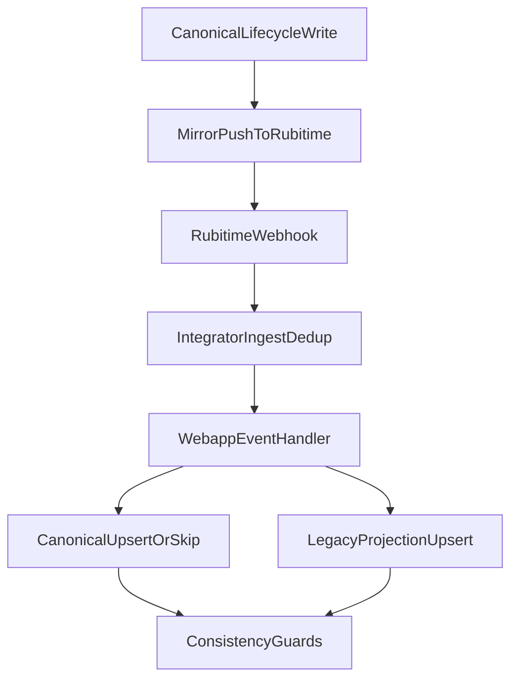

# План стабилизации цепочек записи (Rubitime ↔ канон)

## Scope и границы

- **В scope (изменяем):**
  - [apps/webapp/src/modules/patient-booking/canonicalCreate.ts](apps/webapp/src/modules/patient-booking/canonicalCreate.ts)
  - [apps/webapp/src/modules/patient-booking/service.ts](apps/webapp/src/modules/patient-booking/service.ts)
  - [apps/webapp/src/modules/patient-booking/patientMirrorOutbound.ts](apps/webapp/src/modules/patient-booking/patientMirrorOutbound.ts)
  - [apps/webapp/src/infra/repos/pgPatientBookings.ts](apps/webapp/src/infra/repos/pgPatientBookings.ts)
  - [apps/webapp/src/app-layer/di/buildAppDeps.ts](apps/webapp/src/app-layer/di/buildAppDeps.ts)
  - [apps/webapp/src/app/api/doctor/booking-engine/appointments/manual/route.ts](apps/webapp/src/app/api/doctor/booking-engine/appointments/manual/route.ts)
  - [apps/webapp/src/app/api/admin/booking-engine/appointments/manual/route.ts](apps/webapp/src/app/api/admin/booking-engine/appointments/manual/route.ts)
  - [apps/webapp/src/app/api/doctor/booking-engine/appointments/[id]/manual-cancel/route.ts](apps/webapp/src/app/api/doctor/booking-engine/appointments/[id]/manual-cancel/route.ts)
  - [apps/webapp/src/app/api/admin/booking-engine/appointments/[id]/manual-cancel/route.ts](apps/webapp/src/app/api/admin/booking-engine/appointments/[id]/manual-cancel/route.ts)
  - [apps/webapp/src/app/api/doctor/booking-engine/appointments/[id]/manual-reschedule/route.ts](apps/webapp/src/app/api/doctor/booking-engine/appointments/[id]/manual-reschedule/route.ts)
  - [apps/webapp/src/app/api/admin/booking-engine/appointments/[id]/manual-reschedule/route.ts](apps/webapp/src/app/api/admin/booking-engine/appointments/[id]/manual-reschedule/route.ts)
  - [apps/webapp/src/infra/repos/pgBookingAppointmentLifecycle.ts](apps/webapp/src/infra/repos/pgBookingAppointmentLifecycle.ts)
  - [apps/webapp/src/modules/integrator/events.ts](apps/webapp/src/modules/integrator/events.ts)
  - [apps/webapp/src/modules/booking-appointment-sync/service.ts](apps/webapp/src/modules/booking-appointment-sync/service.ts)
  - [apps/webapp/src/modules/booking-appointment-sync/buildCanonicalSnapshot.ts](apps/webapp/src/modules/booking-appointment-sync/buildCanonicalSnapshot.ts)
  - [apps/webapp/src/modules/booking-appointment-sync/loopGuard.ts](apps/webapp/src/modules/booking-appointment-sync/loopGuard.ts)
  - [apps/integrator/src/integrations/rubitime/connector.ts](apps/integrator/src/integrations/rubitime/connector.ts)
  - [apps/integrator/src/kernel/eventGateway/index.ts](apps/integrator/src/kernel/eventGateway/index.ts)
  - [apps/integrator/src/kernel/eventGateway/dedup.ts](apps/integrator/src/kernel/eventGateway/dedup.ts)
  - [apps/integrator/src/infra/db/repos/idempotencyKeys.ts](apps/integrator/src/infra/db/repos/idempotencyKeys.ts)
  - [apps/integrator/src/integrations/rubitime/recordM2mRoute.ts](apps/integrator/src/integrations/rubitime/recordM2mRoute.ts)
  - [apps/integrator/src/integrations/rubitime/normalizeUpdateRecordPatch.ts](apps/integrator/src/integrations/rubitime/normalizeUpdateRecordPatch.ts)
  - [apps/integrator/src/integrations/rubitime/internalContract.ts](apps/integrator/src/integrations/rubitime/internalContract.ts)
  - [apps/webapp/INTEGRATOR_CONTRACT.md](apps/webapp/INTEGRATOR_CONTRACT.md)

- **Вне scope (не изменяем в этом плане):**
  - крупные DDL-миграции схемы `be_*`/`patient_bookings`, кроме **минимального guard-а**, прямо нужного для закрытия online double-book / lifecycle race в фазе 3
  - переезд на новый движок уведомлений
  - полная переработка политики статусов appointment FSM
  - изменение продуктовой политики штрафов/возвратов; план меняет только целостность применения уже существующих решений

## Целевая модель поведения

- Канон (`be_appointments`) остаётся primary source of truth.
- Ошибка внешнего mirror не должна маскироваться как «всё ок», но и не должна оставлять ложный HTTP-результат, противоречащий уже-коммиченной canonical операции.
- Inbound dedup/echo не должен приводить к «обновили legacy, но пропустили canonical» без явного маркера/обработки.
- Любой partial outcome должен быть видим: через API-флаг, history/audit/log или DLQ/incident, а не только `console.warn`.
- `appointment_records` и `patient_bookings` не обязаны быть транзакционно едины с `be_appointments`, но не должны «оживлять» отменённый/перенесённый канон из stale webhook без явного правила.

## Фаза 0 — Контракт и безопасные рамки

- **Изменения:**
  - Зафиксировать ADR/decision comments в коде по ключевым правилам:
    - canonical-first cancel/reschedule
    - поведение API при external mirror fail после canonical commit
    - dedup/echo invariant между `be_appointments` и `appointment_records`
    - bridge flag policy: какие staff/admin/patient outbound пути обязаны уважать `booking_rubitime_bridge_enabled`, а какие зависят от `booking_slots_read_source=rubitime`
    - единая cancel semantics: `update-record status:4` vs `remove-record`
- **Чек-лист:**
  - [ ] Сверить контракт в [docs/ARCHITECTURE/RUBITIME_BOOKING_PIPELINE.md](docs/ARCHITECTURE/RUBITIME_BOOKING_PIPELINE.md)
  - [ ] Привести комментарии route/service к одному поведению
  - [ ] Явно отметить, где `best-effort`, где `strict`
  - [ ] Зафиксировать, какие partial failures возвращаются клиенту как `ok + flags`, а какие остаются hard error до commit
  - [ ] Проверить, что план не содержит размытых пунктов внутри scope
- **Проверки:**
  - [ ] `rg "best-effort|rollback|external_slot_taken|echo_guard" apps/webapp/src apps/integrator/src`
  - [ ] `rg "remove-record|status: 4|booking_rubitime_bridge_enabled|rubitimeMirrorFailed" apps/webapp/src apps/integrator/src docs/ARCHITECTURE/RUBITIME_BOOKING_PIPELINE.md`

## Фаза 1 — Create consistency (critical)

- **Изменения:**
  1. Исправить prepayment-путь, чтобы `rubitime_id`/`rubitime_manage_url` не терялись:
     - расширить `markAwaitingPayment` и вызов из `canonicalCreate`.
     - обеспечить сохранение и перенос в `markConfirmedByCanonicalAppointment`.
  2. Уравнять doctor/admin manual create:
     - вынести shared create+rubitime-sync orchestration в app-layer helper.
     - для admin route включить тот же sync/mapping/rollback policy, что в doctor route.
  3. Закрыть orphan-gap в doctor manual create:
     - выполнять `resolveRubitimeSyncContext` до canonical insert (или гарантированный rollback при ошибке контекста после insert).
  4. Закрыть Rubitime-first rollback при package/product failure:
     - если Rubitime record уже создан, а `reserveForAppointment` / `consumeVisitForAppointment` падает, выполнить согласованный внешний rollback (`cancelRecord status:4` или delete только если контракт фазы 0 оставляет это для create rollback).
  5. Обработать `projectionWarning` от integrator `create-record`:
     - не игнорировать warning в webapp; записывать observable warning и/или выполнять fallback projection, чтобы doctor UI не терял запись.
- **Чек-лист:**
  - [ ] `markAwaitingPayment` принимает rubitime данные
  - [ ] prepayment create сохраняет rubitime linkage в `patient_bookings`
  - [ ] `onAppointmentPaymentConfirmed` не обнуляет linkage
  - [ ] admin manual create делает Rubitime create+mapping при доступном context
  - [ ] doctor/manual не оставляет orphan canonical при `rubitime_mapping_missing`
  - [ ] package/product failure после Rubitime create не оставляет живую внешнюю запись без canonical/booking соответствия
  - [ ] `projectionWarning` из integrator create не остаётся полностью тихим для оператора/лога
- **Проверки:**
  - [ ] `pnpm --dir apps/webapp exec vitest run src/modules/patient-booking/canonicalCreate.test.ts`
  - [ ] `pnpm --dir apps/webapp exec vitest run src/app/api/doctor/booking-engine/appointments/manual/route.test.ts`
  - [ ] добавить и прогнать `src/app/api/admin/booking-engine/appointments/manual/route.test.ts`
  - [ ] добавить кейсы: prepayment keeps `rubitimeId`, package/product failure rolls back external record, `projectionWarning` logged/fallbacked

## Фаза 2 — Cancel/reschedule consistency (critical)

- **Изменения:**
  1. Staff/admin manual-cancel:
     - после canonical commit не возвращать «фатальную» ошибку как будто операция не произошла;
     - вернуть deterministic outcome (`ok` + explicit flags `rubitimeMirrorFailed`, `paymentOutcomeFailed`, `membershipOutcomeFailed`) и записать инцидент/аудит.
  2. Patient reschedule:
     - прокинуть `rubitimeMirrorFailed` аналогично cancel.
  3. Упорядочить side effects:
     - non-critical side effects (projection/notify) изолировать try/catch;
     - критичные доменные ошибки явно маркировать в ответе и history.
  4. Patient cancel:
     - обернуть `payments.applyCancelPaymentOutcome`, `memberships.applyCancelPackageOutcome`, `products.applyCancelVisitOutcome`, `patchLatestCancellationNotifications` так, чтобы уже-коммиченный `patientCancel` не оставлял API 500 и вечный `cancelling` без явного флага.
  5. Staff outbound gate:
     - staff/admin cancel/reschedule/create должны уважать контракт bridge flag из фазы 0; при выключенном bridge не отправлять неожиданный Rubitime outbound, кроме rubitime-first create режима.
  6. Inbound stale webhook vs failed outbound cancel:
     - запретить Rubitime inbound «оживлять» `patient_bookings` native row после canonical cancel без проверки canonical status/mapping attribution.
- **Чек-лист:**
  - [ ] cancel route не даёт ложный 502 после уже-коммиченного cancel
  - [ ] patient reschedule возвращает флаг mirror failure
  - [ ] side effects не роняют уже завершённый lifecycle
  - [ ] notification/status patches не теряются при частичных сбоях
  - [ ] patient cancel не оставляет `patient_bookings.status='cancelling'` при payment/package/product side-effect failure
  - [ ] staff/admin routes не обходят `booking_rubitime_bridge_enabled` вопреки контракту
  - [ ] inbound webhook не переводит native `patient_bookings` из cancelled обратно в active при cancelled canonical
- **Проверки:**
  - [ ] `pnpm --dir apps/webapp exec vitest run src/app/api/doctor/booking-engine/appointments/\[id\]/manual-cancel/route.test.ts src/app/api/admin/booking-engine/appointments/\[id\]/manual-cancel/route.test.ts`
  - [ ] `pnpm --dir apps/webapp exec vitest run src/modules/patient-booking/service.test.ts src/modules/patient-booking/patientMirrorOutbound.test.ts`
  - [ ] добавить кейсы: payment/package/product cancel side-effect failure, patient reschedule mirror failure flag, stale inbound does not revive cancelled native booking

## Фаза 3 — Защита от гонок lifecycle

- **Изменения:**
  - В [apps/webapp/src/infra/repos/pgBookingAppointmentLifecycle.ts](apps/webapp/src/infra/repos/pgBookingAppointmentLifecycle.ts):
    - добавить row lock (`FOR UPDATE`) и/или conditional updates по ожидаемому статусу.
    - исключить lost-update при параллельных cancel/reschedule.
  - Закрыть online double-book:
    - добавить явный guard для `specialist_id IS NULL` сценариев на уровне транзакции/репозитория;
    - если без DB constraint нельзя получить корректную гарантию, добавить минимальную миграцию с узким constraint/index и rollback-safe тест.
  - Зафиксировать expected-current-state checks для `applyCancellation` / `applyReschedule`, чтобы stale snapshot не применялся после конкурентного изменения.
- **Чек-лист:**
  - [ ] параллельные cancel/reschedule не создают конфликтные финальные статусы
  - [ ] reschedule не применяет старый snapshot после конкурентного cancel
  - [ ] online ветка имеет явный guard и задокументированное ограничение
  - [ ] повторный cancel того же target status не создаёт лишние cancellation rows без idempotency policy
  - [ ] insert/update race даёт deterministic domain error (`slot_overlap` / `state_conflict`), а не silent overwrite
- **Проверки:**
  - [ ] добавить конкурентные unit/integration тесты для lifecycle repo
  - [ ] `pnpm --dir apps/webapp exec vitest run src/infra/repos/pgBookingAppointmentLifecycle*.test.ts src/modules/booking-appointment-lifecycle/*.test.ts`
  - [ ] если добавлена миграция: `pnpm --dir apps/webapp exec drizzle-kit check` или существующий project-specific migration validation script

## Фаза 4 — Inbound dedup/echo и cross-store инварианты

- **Изменения:**
  1. Integrator dedup:
     - расширить fingerprint (payload hash/ключевые поля payload) в [apps/integrator/src/integrations/rubitime/connector.ts](apps/integrator/src/integrations/rubitime/connector.ts).
     - скорректировать gateway, чтобы pipeline failure не блокировал повтор на весь TTL.
  2. Webapp event handler:
     - если `mirrorResult.action === "skipped_echo_guard"`, не обновлять `appointment_records`/`patient_bookings` как обычный inbound update без специальной ветки.
  3. Свести порядок canonical/legacy upsert к согласованному invariant.
  4. First insert race:
     - добавить lock/upsert strategy для первого inbound Rubitime id, чтобы два webhook не создавали duplicate `be_appointments` или unique violation без retry.
  5. Stale mapping:
     - mapping есть, canonical row отсутствует — вернуть отдельный outcome (`stale_mapping_missing_canonical`), лог/инцидент и предсказуемую обработку, не `skipped_echo_guard`.
  6. Existing scope для legacy projection:
     - projection snapshot должен использовать те же merged refs, что canonical update, чтобы `appointment_records.branch_id` не терялся при unmapped scope.
- **Чек-лист:**
  - [ ] payload-only изменения не дропаются dedup-ом
  - [ ] failed pipeline допускает корректный retry
  - [ ] echo guard не создаёт canonical/legacy divergence
  - [ ] stale mapping path не маскируется под обычный echo skip
  - [ ] concurrent first webhook insert не создаёт duplicate canonical row и не уходит в необработанный 500/422
  - [ ] `appointment_records` получает preserved branchId/scope при mapped inbound update с missing Rubitime mapping
  - [ ] integrator local `booking.upsert` и webapp fanout converges даже при частичном fanout failure; DLQ сценарий описан
- **Проверки:**
  - [ ] `pnpm --dir apps/integrator exec vitest run src/integrations/rubitime/*webhook*test.ts src/integrations/rubitime/*connector*test.ts`
  - [ ] `pnpm --dir apps/webapp exec vitest run src/modules/integrator/events.test.ts src/infra/repos/pgBookingRubitimeBridge.test.ts src/modules/booking-appointment-sync/*.test.ts`
  - [ ] добавить кейсы: duplicate payload with changed body not dropped, pipeline failure retry, echo guard skips legacy writes, stale mapping outcome, preserved existing scope in `appointment_records`

## Фаза 5 — Timezone + cancel semantics унификация в M2M

- **Изменения:**
  - В [apps/integrator/src/integrations/rubitime/recordM2mRoute.ts](apps/integrator/src/integrations/rubitime/recordM2mRoute.ts):
    - для `update-record` использовать branch timezone (как в create), а не app display timezone, когда есть branch context.
  - Убрать расхождение `remove-record` vs `status:4`:
    - выбрать единый путь cancel для staff/admin/patient (рекомендуемо: `update-record status:4`) и привести route-обработчики к нему.
  - Усилить patch contract:
    - empty patch возвращает 400, а не уходит в Rubitime как no-op;
    - string numeric ids/status нормализуются или явно отклоняются с 400;
    - contact поля (`name`, `phone`, `email`) либо поддерживаются, либо явно документированы как unsupported.
  - Устранить retry asymmetry:
    - старые doctor proxy paths должны использовать тот же retry/signed client или быть переведены на общий M2M helper.
  - Обновить [apps/integrator/src/integrations/rubitime/internalContract.ts](apps/integrator/src/integrations/rubitime/internalContract.ts): включить `update-record` как официальный endpoint.
- **Чек-лист:**
  - [ ] одинаковая timezone policy для create/update
  - [ ] единая cancel semantics во всех outbound entrypoints
  - [ ] нормализация patch не дропает валидные string-id без явной причины
  - [ ] empty patch не даёт ложный success
  - [ ] `update-record` перечислен в internal contract / docs
  - [ ] старый doctor cancel path не использует `remove-record` для обычной отмены записи
- **Проверки:**
  - [ ] `pnpm --dir apps/integrator exec vitest run src/integrations/rubitime/normalizeUpdateRecordPatch.test.ts src/integrations/rubitime/recordM2mRoute.test.ts`
  - [ ] `pnpm --dir apps/webapp exec vitest run src/modules/integrator/bookingM2mApi*.test.ts src/app/api/doctor/appointments/rubitime/cancel/route.test.ts`
  - [ ] добавить кейсы: branch timezone update, empty patch 400, string numeric id/status, unified cancel path

## Фаза 6 — Тест-матрица и docs sync

- **Изменения:**
  - Добавить отсутствующие кейсы:
    - prepayment keeps rubitime linkage
    - admin manual create rubitime path
    - mirror failure flags in patient reschedule
    - echo-guard branch for legacy projection
    - concurrent lifecycle actions
    - patient cancel side-effect failure after canonical commit
    - package/product failure after Rubitime-first create
    - inbound dedup payload-hash and failed-pipeline retry
    - M2M timezone/cancel/empty-patch contract
  - Синхронизировать docs:
    - [docs/BOOKING_REWORK_INITIATIVE/ACCEPTANCE_MIRROR_SYNC.md](docs/BOOKING_REWORK_INITIATIVE/ACCEPTANCE_MIRROR_SYNC.md)
    - [docs/ARCHITECTURE/RUBITIME_BOOKING_PIPELINE.md](docs/ARCHITECTURE/RUBITIME_BOOKING_PIPELINE.md)
    - [apps/webapp/src/modules/patient-booking/patient-booking.md](apps/webapp/src/modules/patient-booking/patient-booking.md)
    - [docs/BOOKING_REWORK_INITIATIVE/LOG.md](docs/BOOKING_REWORK_INITIATIVE/LOG.md)
    - [apps/webapp/INTEGRATOR_CONTRACT.md](apps/webapp/INTEGRATOR_CONTRACT.md)
    - [apps/webapp/src/app/api/api.md](apps/webapp/src/app/api/api.md)
- **Чек-лист:**
  - [ ] acceptance matrix покрывает найденные критичные дыры
  - [ ] docs описывают фактический order-of-operations
  - [ ] зафиксированы ограничения/деферы, если что-то осознанно оставлено
  - [ ] `LOG.md` пополнен после каждой фазы с фактическими проверками и решениями
  - [ ] план перенесён в репозиторий перед исполнением/закрытием (`.cursor/plans/...`) и не остаётся только в `~/.cursor/plans`
- **Проверки:**
  - [ ] re-run целевой mirror matrix (webapp + integrator)
  - [ ] `pnpm --dir apps/webapp exec vitest run src/modules/booking-appointment-sync src/modules/patient-booking/patientMirrorOutbound.test.ts src/infra/repos/pgBookingRubitimeBridge.test.ts src/modules/integrator/events.test.ts src/app/api/doctor/booking-engine/appointments/\[id\]/manual-reschedule/route.test.ts src/app/api/doctor/booking-engine/appointments/\[id\]/manual-cancel/route.test.ts src/app/api/admin/booking-engine/appointments/\[id\]/manual-reschedule/route.test.ts src/app/api/admin/booking-engine/appointments/\[id\]/manual-cancel/route.test.ts`
  - [ ] `pnpm --dir apps/integrator exec vitest run src/integrations/rubitime/normalizeUpdateRecordPatch.test.ts src/integrations/rubitime/recordM2mRoute.test.ts`
  - [ ] `pnpm --dir apps/webapp exec tsc --noEmit -p tsconfig.json`
  - [ ] `pnpm --dir apps/integrator exec tsc --noEmit`

## Фаза 7 — Финальная валидация и закрытие plan-файла

- **Изменения:**
  - Перенести plan-файл в репозиторий до закрытия: `.cursor/plans/booking_mirror_integrity_hardening_8f043ac3.plan.md` или архивный путь после выполнения.
  - Обновлять `todos.status` по мере выполнения фаз.
  - При полном закрытии выставить frontmatter `status: completed`, заполнить completion note/date и выровнять все `[x]` в теле.
- **Чек-лист:**
  - [ ] Все phase todos имеют `completed` или `cancelled` с причиной
  - [ ] Definition of Done синхронизирован с фактическими проверками
  - [ ] `docs/BOOKING_REWORK_INITIATIVE/LOG.md` содержит итоговую запись с командами проверок
  - [ ] `ACCEPTANCE_MIRROR_SYNC.md` больше не утверждает покрытие сценариев, которые не закрыты кодом
- **Проверки:**
  - [ ] Финальный targeted suite из фазы 6 зелёный
  - [ ] Один финальный полный `pnpm run ci` перед merge/push этого большого многоэтапного изменения

## Definition of Done

- [x] Нет сценариев, где API возвращает ошибку после уже-коммиченной canonical операции без явного флага частичного результата.
- [x] `patient_bookings` не теряет `rubitime_id` на prepayment-пути.
- [x] Admin и doctor manual create имеют согласованный Rubitime behavior.
- [x] Echo/dedup не создают silent divergence между `be_appointments` и legacy проекциями.
- [x] Timezone/cancel semantics M2M единообразны.
- [x] Новые/обновлённые тесты закрывают найденные критичные и high-risk кейсы.
- [x] Документация и LOG синхронизированы с фактической реализацией.
- [x] Online/null-specialist double-book и lifecycle lost-update имеют явный guard или закрытый documented decision с `cancelled` todo.
- [x] Partial failures после canonical commit видимы в API/history/audit и не оставляют вечный `cancelling` без диагностики.
- [x] Финальный `pnpm run ci` выполнен перед передачей в merge/push.