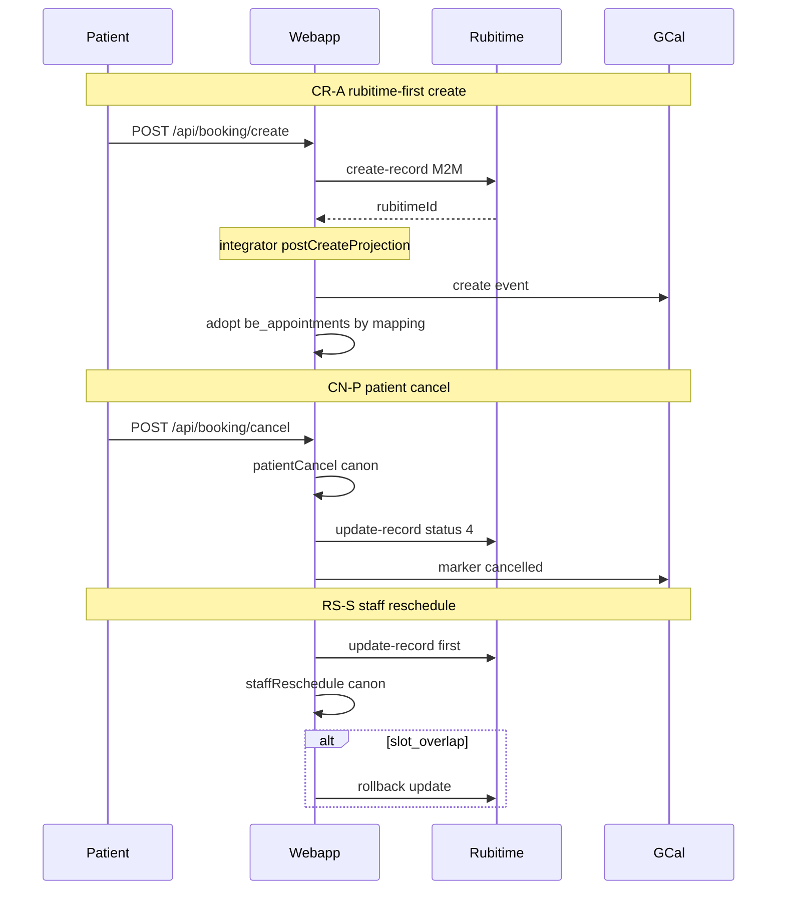

# Аудит сценариев записи, отмены и переноса (усиленный)

## Цель и границы

- **В scope:** все **write**-пути create / cancel / reschedule для записи на приём.
- **Вне scope:** read-only переключатели UI, покупка абонемента/продукта без привязки к слоту, Telegram deeplink, ops `bridge projectAll` (отдельно помечен).
- **Базовые документы:** [`BOOKING_MIRROR_INTEGRITY_CONTRACT.md`](docs/BOOKING_REWORK_INITIATIVE/BOOKING_MIRROR_INTEGRITY_CONTRACT.md), [`ACCEPTANCE_MIRROR_SYNC.md`](docs/BOOKING_REWORK_INITIATIVE/ACCEPTANCE_MIRROR_SYNC.md), [`patient-booking.md`](apps/webapp/src/modules/patient-booking/patient-booking.md), [`RUBITIME_BOOKING_PIPELINE.md`](docs/ARCHITECTURE/RUBITIME_BOOKING_PIPELINE.md).

**Prod-контекст:** `booking_slots_read_source=rubitime` (инцидент 2026-06-06). Фиксы в коде **не задеплоены**.

---

## 0. Приоритеты (что проверять первым)

| Приоритет | Сценарий | Почему |
|-----------|----------|--------|
| **P0** | CR-A rubitime-first create | Прод-режим; инцидент double insert + orphan GCal |
| **P0** | CR-A rollback `remove-record` | GCal cleanup в integrator |
| **P1** | CN-P patient cancel (canonical) | Ежедневный UX; mirror + partial outcomes |
| **P1** | RS-P patient reschedule | Canonical assert vs Rubitime slots — transitional risk |
| **P1** | Inbound status 4 cancel | Echo guard + stale mapping |
| **P2** | CR-B/C canonical create | При cutover на canonical |
| **P2** | Staff manual cancel/reschedule | Bridge gate + Rubitime-first reschedule |
| **P2** | Prepayment / package / product at create | Отдельные rollback-ветки |
| **P3** | Legacy paths, `reschedule_requested`, ops backfill | Редкие / defer |

---

## 1. Режимы и настройки

| Ключ | Значения | Write-влияние |
|------|----------|---------------|
| `booking_slots_read_source` | `rubitime` / `canonical` | Слоты + **patient/public create** |
| `booking_rubitime_bridge_enabled` | bool | **Canonical create** → best-effort Rubitime; **staff** outbound mirror |
| `booking_payment_enabled` | bool | `awaiting_payment` + отложенный `booking.created` |
| `booking_doctor_appointments_read_source` | `rubitime_legacy` / `canonical` | **Только read** |
| DB policies | `be_booking_policies`, prepayment | Cancel/reschedule eligibility, prepayment outcomes |

**Асимметрия legacy:** cancel без `canonical_appointment_id` **есть** (Rubitime + `patient_bookings`); reschedule **нет** — только `no_canonical` ([`service.ts`](apps/webapp/src/modules/patient-booking/service.ts)).

---

## 2. Полная матрица сценариев (ID → проверка)

### 2.1 CREATE

| ID | Источник | Условие | Порядок write | Rubitime M2M | Rollback / откат |
|----|----------|---------|---------------|--------------|------------------|
| **CR-A** | Patient / public | `slots=rubitime` | `create-record` → integrator projection → webapp **adopt** `be_appointments` | `create-record` | `deleteRecord` / `remove-record` + GCal delete |
| **CR-A-prepay** | Patient | CR-A + prepayment | то же; status `awaiting_payment`; **нет** `booking.created` до capture | то же | rollback как CR-A |
| **CR-A-pkg** | Patient in-person | CR-A + `patientPackageId` | + `memberships.reserveForAppointment` | то же | **`cancelRecord`** (не remove!) + cancel canon |
| **CR-A-prod** | Patient in-person | CR-A + `productPurchaseId` | + `products.consumeVisitForAppointment` | то же | **`cancelRecord`** + cancel canon |
| **CR-B** | Patient / public | `slots=canonical`, bridge on | `assertSlot` → native → best-effort `create-record` | optional | orphan native cancel |
| **CR-C** | Patient / public | `slots=canonical`, bridge off | `assertSlot` → native only | нет | — |
| **CR-S** | Doctor/admin | manual | native (`admin_manual`) → optional Rubitime + mapping | `create-record` if bridge | Rubitime rollback on staff path |
| **CR-L** | Patient | legacy DI (no engine) | `create-record` → `markConfirmed` only | `create-record` | **`cancelRecord`** (status 4) |
| **CR-IN** | Rubitime UI | inbound webhook | integrator `booking.upsert` → outbox → webapp mirror | — | inbound cancel/update |
| **CR-OPS** | Admin | `bridge projectAll` | backfill `be_appointments` from legacy | — | ops only |

**Код фикса P0:** [`canonicalCreate.ts`](apps/webapp/src/modules/patient-booking/canonicalCreate.ts) — `resolveCanonicalAppointmentAfterRubitimeCreate`, `getAppointmentIdByRubitimeExternalId`.

**Подтверждённые риски CR-A:**
1. Гонка: mapping ещё нет → fallback `createAppointment` → overlap → rollback (редко).
2. Rollback primary path: orphan **`be_appointments`** от projection (нет hard delete канона).
3. Package/product rollback: **`cancelRecord`** (GCal ❌), не `deleteRecord` — **другая семантика**, чем primary create rollback.
4. Дока [`patient-booking.md`](apps/webapp/src/modules/patient-booking/patient-booking.md) пишет `cancelRecord` для rubitime-first rollback — **неверно** для primary path (там `deleteRecord`).

### 2.2 CANCEL

| ID | Источник | Порядок | Rubitime | GCal |
|----|----------|---------|----------|------|
| **CN-P** | Patient (canonical) | lifecycle `patientCancel` → mirror → legacy → `booking.cancelled` | `cancelRecord` (status 4) | событие **остаётся**, ❌ |
| **CN-P-legacy** | Patient (no canonical) | Rubitime `cancelRecord` → `patient_bookings` | status 4 | via integrator |
| **CN-S** | Staff manual | `staffCancel` → mirror if bridge + rubitimeId | status 4 | ❌ |
| **CN-IN-4** | Rubitime UI | webhook `event-update-record` status **4** | inbound | ❌ |
| **CN-IN-R** | Rubitime UI | `event-remove-record` / `event-delete-record` | inbound hard | **delete** |
| **CN-RB** | Create rollback | `deleteRecord` / `remove-record` | hard remove | **delete** (фикс integrator) |
| **CN-DEFER** | Legacy API | `POST .../rubitime/cancel` | `remove-record` | backlog |

**Порядок outbound (контракт):** patient/staff cancel — **канон первым**, Rubitime best-effort.

### 2.3 RESCHEDULE

| ID | Источник | Порядок | Особенности |
|----|----------|---------|-------------|
| **RS-P** | Patient | `assertSlot` (всегда canonical!) → lifecycle → mirror `update-record` | Mismatch если слоты из Rubitime |
| **RS-P-blocked** | Patient | policy block → `booking.reschedule_requested` only | **нет** смены слота в БД; GCal marker |
| **RS-S** | Staff manual | **Rubitime `update-record` первым** → `staffReschedule`; rollback Rubitime on overlap | контракт outbound |
| **RS-IN-7** | Rubitime UI | status **7** `moved_awaiting` | patient `rescheduled`; GCal `reschedule_pending` |
| **RS-IN** | Rubitime UI | `event-update-record` slot change | mirror + legacy |
| **RS-L** | Legacy booking | — | **`no_canonical`** — перенос недоступен |

**Порядок outbound:** patient — канон → Rubitime; staff — **Rubitime → канон** (обратный!).



---

## 3. Entry points (быстрый индекс)

```
CREATE
  Patient:     POST /api/booking/create          → canonicalCreate.ts
  Public:      POST /api/booking/public/create   → то же (no package/product in body)
  Staff:       POST /api/{doctor|admin}/booking-engine/appointments/manual
  Rubitime M2M POST integrator /api/bersoncare/rubitime/create-record
  Inbound:     POST integrator /webhook/rubitime/:token (event-create-record)

CANCEL
  Patient:     POST /api/booking/cancel
  Staff:       POST /api/.../appointments/[id]/manual-cancel
  Rubitime M2M update-record status=4 | remove-record | booking-event cancelled
  Inbound:     event-update-record status=4 | event-remove-record

RESCHEDULE
  Patient:     POST /api/booking/reschedule (canonical only)
  Staff:       POST /api/.../manual-reschedule
  Rubitime M2M update-record | booking.rescheduled | booking.reschedule_requested
  Inbound:     event-update-record (slot / status 7)

PREPAYMENT CONFIRM
  Patient:     POST /api/booking/payments/mock-complete
  Public:      POST /api/booking/public/payments/mock-complete
```

---

## 4. Подтверждённые gaps (не «на проверку», а факты)

| # | Gap | Severity | Evidence |
|---|-----|----------|----------|
| G1 | Patient API **не пробрасывает** partial flags | **high** | [`cancel/route.ts`](apps/webapp/src/app/api/booking/cancel/route.ts) L44: только `{ ok: true }`; [`reschedule/route.ts`](apps/webapp/src/app/api/booking/reschedule/route.ts) L45: `{ ok: true, booking }`. Service возвращает `rubitimeMirrorFailed` и др. Staff manual-cancel **пробрасывает** — [`manual-cancel/route.test.ts`](apps/webapp/src/app/api/doctor/booking-engine/appointments/[id]/manual-cancel/route.test.ts). |
| G2 | Orphan `be_appointments` после CR-A rollback | **medium** | `canonicalCreate.ts` L427–435: `deleteRecord` Rubitime, **нет** cancel canon row |
| G3 | Package/product rollback = `cancelRecord`, не `remove-record` | **medium** | `canonicalCreate.ts` L497–506, L540–549 — GCal ❌ вместо delete |
| G4 | RS-P canonical assert vs Rubitime slots | **medium** (product) | Documented transitional; prod `slots=rubitime` |
| G5 | Дока rollback wording | **low** | `patient-booking.md` vs код |
| G6 | Legacy defer `doctor/.../rubitime/cancel` → remove-record | **low** | Контракт §Cancel semantics defer |
| G7 | `staffRubitimeManualBooking.ts` без unit tests | **low** | Только route mocks |

---

## 5. Верификация (Definition of Done)

### 5.1 Фаза P0 — инцидентный фикс

```bash
pnpm --dir apps/webapp exec vitest run \
  src/modules/patient-booking/canonicalCreate.test.ts

pnpm --dir apps/integrator exec vitest run \
  src/integrations/rubitime/recordM2mRoute.test.ts
```

**Критерии CR-A:**
- [ ] `getAppointmentIdByRubitimeExternalId` вызывается при rubitime-first
- [ ] `createAppointment` **не** вызывается при найденном projection id
- [ ] `remove-record` вызывает GCal cancel до Rubitime API
- [ ] На dev: 1× `be_appointments`, 1× Rubitime record, 1× GCal, `patient_bookings.confirmed`

### 5.2 Фаза P1 — полный mirror bundle

Канонический набор из [`ACCEPTANCE_MIRROR_SYNC.md`](docs/BOOKING_REWORK_INITIATIVE/ACCEPTANCE_MIRROR_SYNC.md):

```bash
pnpm --dir apps/webapp exec vitest run \
  src/modules/booking-appointment-sync \
  src/modules/patient-booking/patientMirrorOutbound.test.ts \
  src/modules/patient-booking/canonicalCreate.test.ts \
  src/modules/patient-booking/service.test.ts \
  src/app-layer/booking/staffManualCancelAfterCanonical.test.ts \
  src/infra/repos/pgBookingRubitimeBridge.test.ts \
  src/infra/repos/pgBookingAppointmentLifecycle.test.ts \
  src/infra/repos/pgPatientBookings.test.ts \
  src/modules/integrator/events.test.ts \
  src/modules/booking-rubitime-bridge/legacyProjection.test.ts \
  src/app/api/booking/create/route.test.ts \
  src/app/api/booking/cancel/route.test.ts \
  src/app/api/booking/reschedule/route.test.ts \
  src/app/api/booking/public/create/route.test.ts \
  src/app/api/doctor/booking-engine/appointments/manual/route.test.ts \
  src/app/api/admin/booking-engine/appointments/manual/route.test.ts \
  src/app/api/doctor/booking-engine/appointments/\[id\]/manual-reschedule/route.test.ts \
  src/app/api/doctor/booking-engine/appointments/\[id\]/manual-cancel/route.test.ts \
  src/app/api/admin/booking-engine/appointments/\[id\]/manual-reschedule/route.test.ts \
  src/app/api/admin/booking-engine/appointments/\[id\]/manual-cancel/route.test.ts

pnpm --dir apps/integrator exec vitest run \
  src/integrations/rubitime/rubitimePayloadHash.test.ts \
  src/integrations/rubitime/normalizeUpdateRecordPatch.test.ts \
  src/integrations/rubitime/recordM2mRoute.test.ts \
  src/kernel/eventGateway/index.test.ts
```

**Добавить тесты (gap closure):**
- [ ] `canonicalCreate.test.ts`: CR-A rollback при failed `markConfirmed` — `deleteRecord` + **proposal**: cancel orphan `be_appointments`
- [ ] `cancel/route.test.ts`: после фикса G1 — partial flags в JSON response
- [ ] `reschedule/route.test.ts`: partial flags + `no_canonical` 400

### 5.3 Фаза P1 — финальный CI

```bash
pnpm install --frozen-lockfile && pnpm run ci
```

### 5.4 Фаза P2 — ручной smoke (dev, prod dump, `booking_slots_read_source=rubitime`)

| ID | Действие | Инварианты (БД) | GCal |
|----|----------|-----------------|------|
| CR-A | Patient create свободный слот | 1 row `be_appointments`, 1 mapping, 1 `patient_bookings.confirmed` | 1 event |
| CR-A-prepay | Create с prepayment policy | `awaiting_payment`, intent exists, **нет** reminder до capture | 1 event |
| CR-A fail | Симуляция overlap (если возможно) | `failed_sync`, Rubitime cleaned | 0 orphan events |
| CN-P | Cancel confirmed booking | canon terminal, Rubitime status 4, `patient_bookings.cancelled` | ❌ not deleted |
| RS-P | Reschedule на другой Rubitime-слот | `be_appointment_reschedules`, slots updated | updated |
| RS-P-blocked | Reschedule вне policy window | `reschedule_requested` event, слот **не** меняется | pending marker |
| CN-IN-4 | Cancel в Rubitime UI | echo guard не ломает; canon synced | ❌ |
| RS-S | Staff reschedule + forced overlap | Rubitime откат, canon старый слот | — |

**SQL-шаблоны (dev):**

```bash
set -a && source apps/webapp/.env.dev && set +a

# После create
psql "$DATABASE_URL" -v ON_ERROR_STOP=1 -c "
SELECT pb.id, pb.status, pb.rubitime_id, pb.canonical_appointment_id
FROM patient_bookings pb
WHERE pb.user_id = '<user_uuid>'
ORDER BY pb.created_at DESC LIMIT 5;"

psql "$DATABASE_URL" -v ON_ERROR_STOP=1 -c "
SELECT ba.id, ba.status, ba.source, bem.external_id
FROM be_appointments ba
LEFT JOIN be_external_entity_mappings bem ON bem.appointment_id = ba.id AND bem.provider = 'rubitime'
WHERE ba.id = '<appointment_uuid>';"
```

### 5.5 Prod после деплоя

- [ ] Деплой webapp + integrator с фиксами CR-A + CN-RB
- [ ] Удалить orphan GCal (инцидент 8449506/8449507)
- [ ] `failed_sync` rows — archive/cleanup по политике
- [ ] Projection outbox #1606 → `cancelled` если stale

---

## 6. Предлагаемые доработки кода (до или сразу после деплоя)

### G1 — Patient API partial flags

В [`cancel/route.ts`](apps/webapp/src/app/api/booking/cancel/route.ts) и [`reschedule/route.ts`](apps/webapp/src/app/api/booking/reschedule/route.ts): при `result.ok` spread optional flags из service (как staff manual-cancel). Обновить route tests.

### G2 — Orphan canonical на CR-A rollback

В `canonicalCreate.ts` catch/failed branches после `deleteRecord`: `transitionAppointmentStatus` → `cancelled_by_specialist` для adopted/projected appointment id (если mapping найден). Тест на `markConfirmed` failure path.

### G3 — Package/product rollback semantics

Решение продуктовое: либо `deleteRecord` (как primary rollback), либо явно документировать «soft cancel» через status 4. Сейчас — **несогласованность** с primary path.

---

## 7. Итог

| Область | Статус |
|---------|--------|
| CR-A double insert (инцидент) | **Закрыт в коде**, не на prod |
| CN-RB GCal на remove-record | **Закрыт в integrator**, не на prod |
| Остальные сценарии | **Частично** покрыты mirror bundle; smoke обязателен |
| G1 patient API partial flags | **Подтверждённый gap** vs контракт |
| «Навсегда» | **Нет** без: P0+P1 тесты, CI, smoke, деплой, G1–G3 по приоритету |
