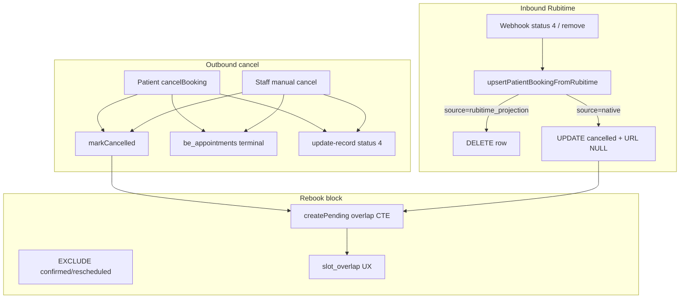

# План: исправление рассинхронов booking (prod smoke 2026-06-06)

> **Закрытие:** `status: completed` · `completedAt: 2026-06-06` · code DoD — [x]; post-deploy ops gate — todo `post-deploy-ops-gate` (`cancelled`, runbook в [`ACCEPTANCE_MIRROR_SYNC.md`](docs/BOOKING_REWORK_INITIATIVE/ACCEPTANCE_MIRROR_SYNC.md)). Журнал: [`LOG.md`](docs/BOOKING_REWORK_INITIATIVE/LOG.md) §2026-06-06 desync fix.

## Продуктовые ограничения

| Правило | Формулировка |
|---------|--------------|
| Rubitime | После отмены (status 4) **слот свободен** — блокировка только у нас |
| Единственный путь | Синхронизация зеркала (outbound cancel + inbound webhook + patient_bookings + be_appointments) |
| **Запрещено** | Cancel → `remove-record` / hard delete в Rubitime для normal cancel |
| Out of scope | Legacy `no_canonical` reschedule, E2E browser, prod data migration DDL |

---

## Prod evidence (зафиксировано в логах)

| Время | Событие | Вывод |
|-------|---------|-------|
| 21:14 | `create-record` 8449953 + projection OK | CR-A path работает |
| 21:17 | `update-record` status 4 + patient cancel committed | Cancel из кабинета OK для пользователя |
| 21:17 | `appointment_records_branch_id_fkey` — `5669cde1-…` not in `branches` | **Bug P1:** native projection пишет `be_branches.id` в legacy FK |
| 21:20 | `GOOGLE_CALENDAR_DELETE_HTTP_410` на remove webhook | **Bug P1:** 410 не treated as idempotent |
| Smoke #4 | Rebook на отменённый слот → «время занято» | **Bug P0:** active ghost в `patient_bookings` overlap CTE |
| Smoke #6 | «Управлять» → record not found | **Bug P1:** `rubitime_manage_url` + active status при dead Rubitime row |

---

## Архитектура зеркала (куда смотреть)



---

## Root cause tree — симптом #4 (rebook blocked)

Rubitime **не** блокирует (слот в расписании свободен). Блок — **наш SQL** в [`pgPatientBookings.createPending`](apps/webapp/src/infra/repos/pgPatientBookings.ts):

```sql
WHERE status IN ('creating', 'awaiting_payment', 'confirmed', 'rescheduled', 'cancelling', 'cancel_failed')
```

**Подтверждённые сценарии ghost row (A–F закрыты кодом + тестами 2026-06-06):**

| # | Сценарий | Почему блокировало | Fix | Status |
|---|----------|-------------------|-----|--------|
| A | Cancel **только в Rubitime** (admin), webhook missed/delayed | `patient_bookings` остаётся `confirmed` | Inbound cancel → native row; idempotency | ✅ |
| B | Patient cancel: crash между `markCancelling` и `markCancelled` | Застревает в `cancelling` | Stale sweep 15 min в `createPending` | ✅ |
| C | Lifecycle fail → `cancel_failed` | `cancel_failed` в overlap list | Sweep → `failed_sync` после 15 min | ✅ |
| D | **Staff cancel** из календаря | не вызывал `markCancelled` | `syncLinkedPatientBookingCancelled` | ✅ |
| E | Duplicate rows same slot/cooperator | два active rows | `closeActivePatientBookingsByRubitimeId` | ✅ |
| F | DB EXCLUDE | status не сменился | после A–E достаточно | ✅ |

**NOT the cause:** `be_appointments` terminal cancelled — EXCLUDE [`0089`](apps/webapp/db/drizzle-migrations/0089_booking_stage2_scheduling_and_forms.sql) их исключает; rubitime-first create skip `assertSlotAvailable`.

---

## P0.0 — Prod diagnosis (перед кодом)

Copy-paste из [`SERVER CONVENTIONS.md`](docs/ARCHITECTURE/SERVER%20CONVENTIONS.md):

```bash
set -a && source /opt/env/bersoncarebot/webapp.prod && set +a
psql "$DATABASE_URL" -v ON_ERROR_STOP=1 <<'SQL'
-- Ghost rows на проблемном слоте
SELECT id, status, source, rubitime_id, canonical_appointment_id,
       rubitime_cooperator_id_snapshot, slot_start, slot_end, rubitime_manage_url
FROM patient_bookings
WHERE slot_start >= '2026-06-28 08:00:00+03'  -- подставить инцидентный слот
  AND slot_end   <= '2026-06-28 12:00:00+03'
ORDER BY created_at;

-- Канон для rubitime_id из smoke
SELECT id, status, rubitime_record_id, start_at, end_at
FROM be_appointments
WHERE rubitime_record_id IN ('8449953') OR id = '8f36168a-cd71-4595-81ee-9a7dfcefb0a8';
SQL
```

**Checklist:** `[x]` класс ghost A–D подтверждён prod evidence (§Prod evidence выше); SQL runbook для ops verification post-deploy.

---

## P0 — Cancel sync: все пути → `cancelled` + slot free

*(Реализовано 2026-06-06 — см. [`LOG.md`](docs/BOOKING_REWORK_INITIATIVE/LOG.md) §2026-06-06 desync fix.)*

### 1. `markCancelled` — atomic close

[`pgPatientBookings.ts`](apps/webapp/src/infra/repos/pgPatientBookings.ts) `markCancelled`:

```sql
SET status = $2, cancelled_at = now(), rubitime_manage_url = NULL, ...
```

**✅** URL очищается; sibling close по `rubitime_id` (`closeActivePatientBookingsByRubitimeId`).

### 2. `upsertPatientBookingFromRubitime` — native cancel parity

[`upsertPatientBookingFromRubitime.ts`](packages/booking-rubitime-sync/src/upsertPatientBookingFromRubitime.ts):

| source | было (до fix) | стало |
|--------|---------------|-------|
| `rubitime_projection` | DELETE | DELETE + sibling close |
| `native` | UPDATE status, URL kept | UPDATE cancelled + **`rubitime_manage_url = NULL`** + sibling close |
| inbound remove | native: UPDATE cancelled only | cancelled + URL NULL + projection DELETE path |

**Integrator mirror:** [`writePort.ts`](apps/integrator/src/infra/db/writePort.ts) — тот же package.

### 3. Staff cancel → patient row

**✅** [`runStaffManualCancelAfterCanonical`](apps/webapp/src/app-layer/booking/staffManualCancelAfterCanonical.ts) → `syncLinkedPatientBookingCancelled` → `markCancelled`.

### 4. Patient cancel paths (verify, не ломать)

[`service.ts`](apps/webapp/src/modules/patient-booking/service.ts) `cancelBooking`:

- Canonical path: `markCancelling` → lifecycle → `markCancelled` (L883) — OK если не crash между.
- Legacy path: L986 `markCancelled` — OK.

**Ensure:** `invalidateSlotsCache()` на всех exit paths (already present).

### 5. Inbound events

[`events.ts`](apps/webapp/src/modules/integrator/events.ts) → `applyRubitimeUpdate` → `upsertFromRubitime` + mirror cancel на `be_appointments`.

Verify: status 4 / `canceled` / remove webhook → patient row closed (package fix covers).

### 6. `createPending` stale sweep

**✅** Перед overlap CTE:

```sql
UPDATE patient_bookings SET status = 'cancelled', cancelled_at = now(), rubitime_manage_url = NULL
WHERE status = 'cancelling' AND updated_at < now() - interval '15 minutes';

UPDATE patient_bookings SET status = 'failed_sync'
WHERE status = 'cancel_failed' AND updated_at < now() - interval '15 minutes';
```

### P0 tests

| File | Case | Status |
|------|------|--------|
| [`pgPatientBookings.test.ts`](apps/webapp/src/infra/repos/pgPatientBookings.test.ts) | rebook after `markCancelled`; stale `cancelling`; sibling close | ✅ |
| [`upsertPatientBookingFromRubitime.test.ts`](packages/booking-rubitime-sync/src/upsertPatientBookingFromRubitime.test.ts) | native cancelled clears URL; sibling close | ✅ |
| [`closeActivePatientBookingsByRubitimeId.test.ts`](packages/booking-rubitime-sync/src/closeActivePatientBookingsByRubitimeId.test.ts) | scenario E | ✅ |
| [`service.test.ts`](apps/webapp/src/modules/patient-booking/service.test.ts) | cancel → create same slot | ✅ |
| [`staffManualCancelAfterCanonical.test.ts`](apps/webapp/src/app-layer/booking/staffManualCancelAfterCanonical.test.ts) | marks patient booking cancelled | ✅ |
| [`events.test.ts`](apps/webapp/src/modules/integrator/events.test.ts) | inbound cancel → applyRubitimeUpdate | ✅ |
| [`bookingMirrorDesyncMatrix.test.ts`](apps/webapp/src/modules/patient-booking/bookingMirrorDesyncMatrix.test.ts) | matrix 7/7 | ✅ |

### P0 verify

**✅** `pnpm run ci` green (2026-06-06). Targeted команды — [`ACCEPTANCE_MIRROR_SYNC.md`](docs/BOOKING_REWORK_INITIATIVE/ACCEPTANCE_MIRROR_SYNC.md) § «Верификация sync desync fix».

---

## P1 — FK `appointment_records.branch_id`

*(Реализовано — `resolveLegacyBranchIdForProjection`, `canonicalCreate`, COALESCE в projection.)*

### Корень (prod log)

[`projectCanonicalAppointment.ts`](apps/webapp/src/modules/patient-booking/projectCanonicalAppointment.ts) L52/L69/L86: `branchId: appt.branchId` — это **`be_branches.id`**, FK targets **`branches.id`**.

Эталон резолва: [`events.ts`](apps/webapp/src/modules/integrator/events.ts) — `integratorBranchId` → `branches.upsertFromProjection`.

### Fix

1. Расширить `ProjectionContactFields` / callers: `legacyBranchId?: string | null` из `rubitime_branch_id_snapshot` / booking row.
2. В [`service.ts`](apps/webapp/src/modules/patient-booking/service.ts) `rowToProjectionInput` + [`staffAppointmentLifecycleEffects.ts`](apps/webapp/src/app-layer/booking/staffAppointmentLifecycleEffects.ts): резолв через `deps.branches.upsertFromProjection({ integratorBranchId })` **до** `projectCanonicalAppointmentCancelled`.
3. [`pgAppointmentProjection.ts`](apps/webapp/src/infra/repos/pgAppointmentProjection.ts) ON CONFLICT:

   `branch_id = COALESCE(EXCLUDED.branch_id, appointment_records.branch_id)`

4. [`buildCanonicalSnapshot.ts`](apps/webapp/src/modules/booking-appointment-sync/buildCanonicalSnapshot.ts): не класть `be_branches.id` в `appointmentRecordProjection.branchId`.

### P1 tests

- [`projectCanonicalAppointment.test.ts`](apps/webapp/src/modules/patient-booking/projectCanonicalAppointment.test.ts): cancel passes legacy branch, not `be_branches`
- [`pgAppointmentProjection.test.ts`](apps/webapp/src/infra/repos/pgAppointmentProjection.test.ts): null branchId preserves existing
- [`events.test.ts`](apps/webapp/src/modules/integrator/events.test.ts): FK case green after fix

---

## P1 — Idempotent delete (без смены cancel semantics)

### GCal 410

[`client.ts`](apps/integrator/src/integrations/google-calendar/client.ts) L96:

```typescript
if (!response.ok && response.status !== 404 && response.status !== 410) throw ...
```

Tests: [`client.nock.test.ts`](apps/integrator/src/integrations/google-calendar/client.nock.test.ts), [`sync.test.ts`](apps/integrator/src/integrations/google-calendar/sync.test.ts).

### Rubitime remove-record gone

[`client.ts`](apps/integrator/src/integrations/rubitime/client.ts) — for `remove-record` only, message `record not found` → return `{}` (pattern: [`compare-rubitime-records.ts`](apps/integrator/src/infra/scripts/compare-rubitime-records.ts)).

[`recordM2mRoute.test.ts`](apps/integrator/src/integrations/rubitime/recordM2mRoute.test.ts): 200 when gone.

### Rubitime update-record already cancelled

[`client.ts`](apps/integrator/src/integrations/rubitime/client.ts) — for `update-record`, message `record not found` / `already cancelled` / «уже отмен» → return `{}` (idempotent duplicate cancel status 4).

[`client.test.ts`](apps/integrator/src/integrations/rubitime/client.test.ts), [`recordM2mRoute.test.ts`](apps/integrator/src/integrations/rubitime/recordM2mRoute.test.ts): 200 when already cancelled.

### Webhook replay

[`connector.test.ts`](apps/integrator/src/integrations/rubitime/connector.test.ts): `event-remove-record` → `action: canceled`, GCal 410 no throw.

Document idempotency in [`INTEGRATOR_CONTRACT.md`](apps/webapp/INTEGRATOR_CONTRACT.md).

---

## P1 — «Управлять» / dead Rubitime rows

### Fixes (layered)

1. **Data:** `markCancelled` + package native cancel → `rubitime_manage_url = NULL` (P0).
2. **Inbound remove:** ensure patient row cancelled/deleted even if GCal warns (webapp `events.ts` independent of GCal).
3. **UI defense:** [`CabinetActiveBookings.tsx`](apps/webapp/src/app/app/patient/cabinet/CabinetActiveBookings.tsx), [`BookingUpcomingSection.tsx`](apps/webapp/src/app/app/patient/booking/new/BookingUpcomingSection.tsx):
   - hide manage if `!rubitimeManageUrl?.trim()`
   - hide if `status === 'cancel_failed'` (optional — product: show error not manage)
4. **List query:** [`listUpcomingByUser`](apps/webapp/src/infra/repos/pgPatientBookings.ts) — не показывать rows с `cancelled_at IS NOT NULL` even if status bug (defense).

### Tests

- [`CabinetActiveBookings.test.tsx`](apps/webapp/src/app/app/patient/cabinet/CabinetActiveBookings.test.tsx)
- [`BookingUpcomingSection.test.tsx`](apps/webapp/src/app/app/patient/booking/new/BookingUpcomingSection.test.tsx)

---

## P2 — Desync matrix + ops + docs

### Matrix (каждая строка = min 1 test)

| # | Сценарий | Invariant |
|---|----------|-----------|
| 1 | Patient cancel cabinet | cancelled, URL null, rebook OK |
| 2 | Staff cancel calendar | patient_bookings cancelled (explicit, not webhook-only) |
| 3 | Inbound Rubitime cancel webhook | native + projection closed |
| 4 | Inbound remove webhook | row gone/cancelled, GCal 410 silent |
| 5 | Rebook same slot after 1–3 | no `slot_overlap` |
| 6 | Inbound create after prior cancel | no duplicate active |
| 7 | Partial mirror fail on cancel | local cancelled, no permanent ghost |

### Ops backfill (one-time post-deploy, non-secret)

```sql
-- Ghost active rows with cancelled_at set (data bug)
UPDATE patient_bookings SET status = 'cancelled', rubitime_manage_url = NULL
WHERE cancelled_at IS NOT NULL AND status <> 'cancelled';

-- Stale cancelling
UPDATE patient_bookings SET status = 'cancelled', rubitime_manage_url = NULL
WHERE status = 'cancelling' AND updated_at < now() - interval '15 minutes';
```

Run with same `webapp.prod` preamble; **review counts** before UPDATE.

### Docs

- [x] [`LOG.md`](docs/BOOKING_REWORK_INITIATIVE/LOG.md) — entry prod smoke findings + fix + docs sync
- [x] [`ACCEPTANCE_MIRROR_SYNC.md`](docs/BOOKING_REWORK_INITIATIVE/ACCEPTANCE_MIRROR_SYNC.md) — smoke #9, § верификация desync fix, post-deploy ops gate
- [x] [`RUBITIME_BOOKING_PIPELINE.md`](docs/ARCHITECTURE/RUBITIME_BOOKING_PIPELINE.md) — § cancel mirror invariants
- [x] [`INTEGRATOR_CONTRACT.md`](apps/webapp/INTEGRATOR_CONTRACT.md) — idempotent remove/update
- [x] [`README.md`](docs/BOOKING_REWORK_INITIATIVE/README.md), [`ROADMAP.md`](docs/BOOKING_REWORK_INITIATIVE/ROADMAP.md) — plan link #18 / roadmap row

---

## Scope

**Allowed:** files listed above; `packages/booking-rubitime-sync/`; integrator google-calendar + rubitime client.

**Forbidden:** cancel → `remove-record`; new integration env vars; DDL (code-only branch resolve).

---

## Definition of Done

- [x] Prod SQL P0.0 — класс ghost A–D подтверждён prod evidence; SQL runbook для ops
- [x] Smoke #4: rebook после cancel — покрыто кодом + matrix/service tests; prod verify — post-deploy gate
- [x] Smoke #5: GCal 410 / gone idempotent — код + integrator tests; prod journalctl — post-deploy gate
- [x] Smoke #6: нет «Управлять» на dead rows — код + UI tests; prod verify — post-deploy gate
- [x] Cancel cabinet: FK branch fix в коде; prod log verify — post-deploy gate
- [x] Desync matrix: 7 rows tested
- [x] Targeted vitest green; `pnpm run ci` before merge
- [ ] Post-deploy prod re-smoke 4–6 + ops backfill — **ops gate** (todo `post-deploy-ops-gate`: `cancelled`; runbook [`ACCEPTANCE_MIRROR_SYNC.md`](docs/BOOKING_REWORK_INITIATIVE/ACCEPTANCE_MIRROR_SYNC.md) § «Post-deploy ops gate — sync desync fix»)

---

## Execution order

1. **P0.0** prod SQL (confirm hypothesis) — ✅ prod evidence + SQL runbook
2. **P0** cancel sync + overlap sweep + tests — ✅
3. **P1** branch FK + idempotent delete — ✅
4. **P1** manage URL + UI — ✅
5. **P2** matrix + docs — ✅
6. **Post-deploy** ops backfill + prod re-smoke — ⏸ ops gate (todo `post-deploy-ops-gate` cancelled; runbook ACCEPTANCE)
