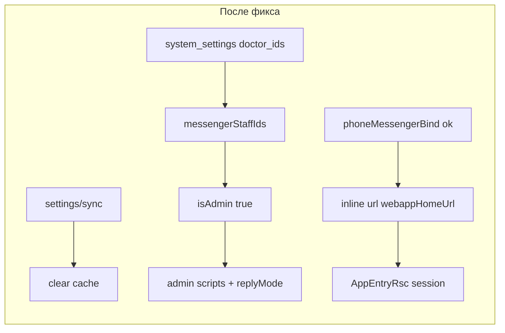

# План: фиксы ботов (Telegram + MAX) — закрыт

**Статус:** исполнен **2026-05-30**. Журнал: [`docs/BOT_FIXES/LOG.md`](../../docs/BOT_FIXES/LOG.md). Обзор: [`docs/BOT_FIXES/README.md`](../../docs/BOT_FIXES/README.md).

**Продуктовое решение:** вариант **B** — врач и админ одно лицо; `isAdmin` = env-admin **∪** `admin_*_ids` **∪** `doctor_*_ids`. Отдельный `isStaff` **не** вводим.

## Корневые причины (до фикса)

- Webhook: `isAdmin` только env (`TELEGRAM_ADMIN_ID` / MAX admin) → врач из `doctor_telegram_ids` не попадал в admin-сценарии.
- Failed `reply-begin` + `abortPlan` → не выполнялся сценарный `callback.answer` → «крутящаяся» кнопка.
- PWA poll 2.5 s при уходе в Telegram; в боте только `web_app`, не browser URL на `/app/tg?t=…`.
- Failure bind без смены reply-клавиатуры с `request_contact`.
- MAX: `max.contact.phone.link` без priority перехватывал contact в phoneauth.

## Scope (выполнено)

- `apps/integrator/src/infra/db/messengerStaffIds.ts`, `kernel/contracts/messengerStaff.ts`
- `integrations/telegram|max/webhook.ts`, `app/routes.ts`, `app/di.ts`
- `kernel/domain/executor/executeAction.ts`, `helpers.ts`
- `kernel/orchestrator/resolver.ts` (`$notStartsWith`)
- `content/max/user/scripts.json`, templates tg/max user
- `apps/webapp/.../PhoneMessengerAuthFlow.tsx`
- Docs: `docs/BOT_FIXES/`, `DOCTOR_TELEGRAM_PROGRAM_NOTE_REPLY.md`, `INTEGRATOR_CONTRACT.md`, runbook, `admin.md`

**Вне scope (backlog):** native reply по `message_id`; смена GitHub CI workflow.

---

## Фаза 1. `isAdmin` — выполнено

- `createMessengerStaffIdsResolver(db)` — `public.system_settings`, TTL 60 с на списки.
- **Инвалидация кеша:** `invalidateMessengerStaffIdsCacheForSettingKey` из `settingsSyncRoute` при sync ключей staff-списков (без ожидания TTL после правки в админке).
- `buildAdminFacts` / `buildMaxFacts` async; `resolveMessengerStaffAdmin` в routes → webhooks.
- `adminChatId` для relay — по-прежнему env-only.

### Чек-лист

- [x] `messengerStaffIds` + resolver в tg/max webhook
- [x] `messengerStaffIds.test.ts`
- [x] `webhook.test.ts` (tg/max `buildAdminFacts` / `buildMaxFacts`)
- [x] `settingsSyncRoute` сбрасывает кеш staff ids
- [x] `DOCTOR_TELEGRAM_PROGRAM_NOTE_REPLY.md` §Админ-бот

---

## Фаза 2. Reply-begin — выполнено

- Failed begin / missing port / **missing `stageItemId`**: текст (где применимо) + `callback.answer` + `abortPlan`.
- Success: сценарный `callback.answer` без дубля в executor.

### Чек-лист

- [x] failed `reply-begin` → error + `callback.answer`, `abortPlan`
- [x] missing `stageItemId` → `callback.answer`, `abortPlan`
- [x] `executeAction.test.ts`

---

## Фаза 3. Автологин PWA — выполнено

- `urlFact` в `buildReplyMarkup` → `{ url }` (отдельно от `webAppUrlFact`).
- Login success (не replay): `phoneAuthOpenAppPrompt` + inline URL на `links.webappHomeUrl`.
- PWA: `visibilitychange` → немедленный `pollBindStatus` (без дубля `focus`).

### Чек-лист

- [x] `helpers.replyMarkup.test.ts`
- [x] login + URL intent (tg + max)
- [x] `PhoneMessengerAuthFlow` visibility test

---

## Фаза 4. Contact-клавиатура — выполнено

- `appendPhoneMessengerBindFailureRecovery` на webapp failure, phone-link sync failure, **`write_port_missing`**.

### Чек-лист

- [x] `phone_mismatch`, sync failure, `write_port_missing` → menu без `request_contact`
- [x] `executeAction.test.ts`

---

## Фаза 5. MAX — выполнено

- Staff facts как Telegram.
- `max.contact.phone.link`: priority 10, `$notStartsWith: await_phoneauth: | await_contact:`.
- Relay media refusal — уже в `supportRelay.ts` (без изменений в этой инициативе).

### Чек-лист

- [x] `buildPlan.test.ts` / `routing.test.ts` — phoneauth выше phone.link в `await_phoneauth:`
- [x] `contentConfig.test.ts` — priority и match `max.contact.phone.link`

---

## Definition of Done — закрыт

- [x] Врач из `doctor_*_ids` — admin-сценарии и `program_reply` (tg + max)
- [x] Failed reply-begin — ошибка + не «висит» кнопка
- [x] Автологин: URL-кнопка + visibility refetch
- [x] Contact-клавиатура сбрасывается на failure bind
- [x] MAX в паритете
- [x] Docs + `pnpm run ci` зелёный

