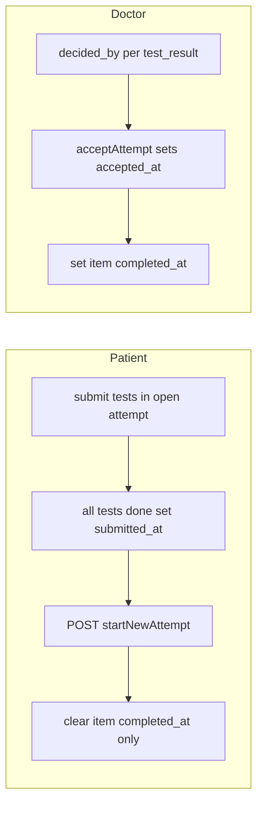

> **Обновление 2026-05-14 (prod lifecycle):** `accepted_*` **не** сбрасываются при новой попытке и при приёме другой попытки. `clearAcceptanceOnAllAttemptsForStageItemPatient` удалён. `acceptAttempt` разрешён только для актуальной хвостовой **submitted**-попытки (см. `progress-service.ts` / репозиторий). `patientStartNewTestAttempt` → атомарный `startNewAttemptAfterSubmitted`. `markAttemptSubmitted` идемпотентен; событие `clinical_test_attempt_submitted` один раз. Doctor UI: `attemptAcceptMap` в `GET .../test-results`. Patient embedded: повторный snapshot после submit/start. Доки: `DB_STRUCTURE.md`, `PATIENT_TREATMENT_PROGRAM_STAGE_SURFACES.md`, `docs/PATIENT_TREATMENT_PROGRAM_PAGE_INITIATIVE/LOG.md`.

**Канон плана:** только этот файл в репозитории (`.cursor/plans/archive/clinical_test_attempts_history.plan.md`). Дубликат вне репозитория (`~/.cursor/plans/clinical_test_attempts_history_*.plan.md`) удалён; содержимое перед удалением совпадало с этим файлом построчно.

# План: неограниченные полные попытки клинтестов + история + приём врачом

## Продуктовые инварианты (зафиксировано)

| Понятие | Смысл |
|--------|--------|
| **Открытая попытка** | Ровно одна строка `test_attempts` с **`submitted_at IS NULL`** на пару `(instance_stage_item_id, patient_user_id)`. Partial unique index **`idx_test_attempts_one_open_per_item_patient`** на эту пару с **`WHERE submitted_at IS NULL`** (миграция **0062** сняла колонку `completed_at` у попытки). |
| **Пациент отправил полный набор** | Все тесты из снимка имеют `test_results` в рамках этой попытки; попытка получает **`submitted_at`** (новое поле; смысл текущего `completed_at` у попытки). |
| **Новая полная попытка** | Пациент **в любой момент** может начать следующую попытку после того, как предыдущая **отправлена** (`submitted_at` задан), **не дожидаясь** `decided_by` по старой попытке (ответ в уточняющем вопросе). |
| **Оценка врача** | На уровне **`test_results`**: `decided_by` / PATCH override; **обязательно** действие **`acceptAttempt`** на попытке для засчёта пункта в чеклисте (`item.completed_at`, MVP-B). |
| **`completed_at` пункта `clinical_test`** | **Не** выставляется пациентом при `allDone`. Связь с чеклистом/«пункт выполнен» — только после решения врача (см. **MVP-B** ниже). |

## MVP-B (рекомендуемая одна линия реализации — без «или» в коде)

1. **`test_attempts`**: `submitted_at`, `accepted_at`, `accepted_by`; миграция **0062**: перенос значений из **`completed_at`** попытки в **`submitted_at`**, backfill **`accepted_at`** для уже зачтённых пунктов, удаление **`completed_at`** у попытки, пересоздание partial unique на **`submitted_at IS NULL`**.
2. **При `patientStartNewTestAttempt`**: атомарно **`startNewAttemptAfterSubmitted`** — **`treatment_program_instance_stage_items.completed_at := null`**, вставка новой **open** попытки; **`accepted_*` на старых строках попыток не трогаем** (аудит).
3. **`acceptAttempt`**: только если целевая попытка — **голова** упорядоченного списка попыток (`started_at` desc, `id` desc) **и** она **submitted**; иначе ошибка «неактуальная попытка». **`accepted_*` на других попытках не сбрасываются.** Повторный accept той же принятой попытки — no-op.
4. **`markAttemptSubmitted`**: идемпотентно; событие `clinical_test_attempt_submitted` — **один раз** при первом переходе в submitted.
5. **Без отдельного `acceptAttempt` в v0**: не рекомендуется — придётся выводить «пункт выполнен» из комбинации «все `decided_by` не null у последней попытки», что ломается при новой попытке до оценки старой.

## Контекст (факт репозитория)

- Схема и индекс: [`apps/webapp/db/schema/treatmentProgramTestAttempts.ts`](apps/webapp/db/schema/treatmentProgramTestAttempts.ts) — `idx_test_attempts_one_open_per_item_patient` при **`submitted_at IS NULL`**; миграция **[`0062_test_attempts_submitted_accepted.sql`](apps/webapp/db/drizzle-migrations/0062_test_attempts_submitted_accepted.sql)**.
- Репозиторий: [`pgTreatmentProgramTestAttempts.ts`](apps/webapp/src/infra/repos/pgTreatmentProgramTestAttempts.ts) — `markAttemptSubmitted`, `acceptAttempt`, `startNewAttemptAfterSubmitted`; in-memory зеркало в [`inMemoryTreatmentProgramInstance.ts`](apps/webapp/src/infra/repos/inMemoryTreatmentProgramInstance.ts).
- Прогресс: [`progress-service.ts`](apps/webapp/src/modules/treatment-program/progress-service.ts) — **`patientSubmitTestResult`** не ставит **`completed_at`** пункта при полном наборе; **`patientStartNewTestAttempt`**, **`getPatientTestSetPageServerSnapshot`** + **`submittedAttemptsDetail`**.
- Врач: [`.../test-attempts/[attemptId]/accept/route.ts`](apps/webapp/src/app/api/doctor/treatment-program-instances/[instanceId]/test-attempts/[attemptId]/accept/route.ts), **`GET .../test-results`** (результаты + **`attemptAcceptMap`**), PATCH результата — [`.../test-results/[resultId]/route.ts`](apps/webapp/src/app/api/doctor/treatment-program-instances/[instanceId]/test-results/[resultId]/route.ts), UI — [`TreatmentProgramInstanceDetailClient.tsx`](apps/webapp/src/app/app/doctor/clients/[userId]/treatment-programs/[instanceId]/TreatmentProgramInstanceDetailClient.tsx), inbox — [`ClientProfileCard.tsx`](apps/webapp/src/app/app/doctor/clients/ClientProfileCard.tsx).

## Связь с doctor-only этапами

- Закрытие **этапа** остаётся только врачом (текущий инвариант из `LOG_DOCTOR_ONLY_STAGE_COMPLETION.md` / FSM).
- Этот план затрагивает только **жизненный цикл пункта `clinical_test`** и отображение истории; не возвращать автозакрытие этапа по `completed_at` пунктов.

## Scope

**Разрешено:** `db/schema/treatmentProgramTestAttempts.ts`, новая миграция Drizzle, [`ports.ts`](apps/webapp/src/modules/treatment-program/ports.ts), [`pgTreatmentProgramTestAttempts.ts`](apps/webapp/src/infra/repos/pgTreatmentProgramTestAttempts.ts), [`inMemoryTreatmentProgramInstance.ts`](apps/webapp/src/infra/repos/inMemoryTreatmentProgramInstance.ts), [`progress-service.ts`](apps/webapp/src/modules/treatment-program/progress-service.ts), patient/doctor API routes под `treatment-program-instances`, [`PatientTestSetProgressForm.tsx`](apps/webapp/src/app/app/patient/treatment/PatientTestSetProgressForm.tsx), страницы/RSC передающие `completed`/`serverSnapshot`, [`TreatmentProgramInstanceDetailClient.tsx`](apps/webapp/src/app/app/doctor/clients/[userId]/treatment-programs/[instanceId]/TreatmentProgramInstanceDetailClient.tsx), [`types.ts`](apps/webapp/src/modules/treatment-program/types.ts), тесты модуля, `docs/ARCHITECTURE/*`, опциональный `docs/.../LOG_*.md`.

**Вне scope:** legacy-таблицы ЛФК; новые ключи в env; изменение GitHub CI workflow; массовый prod backfill без runbook (отдельно по необходимости).

## Фаза 1 — Данные и сервис

1. Drizzle + миграция **0062** (см. MVP-B); в коде — **`markAttemptSubmitted`** вместо прежнего закрытия попытки по **`completed_at`**.
2. **`rg` аудит** до правок: `completedAt`, `clinical_test`, `getPatientTestSetPageServerSnapshot`, `patientEnsureTestAttempt`, `PatientTestSetProgressForm` props `completed` — список всех веток для правки.
3. Порт: `listAttemptsForStageItem`, `acceptAttempt`, `startNewAttemptAfterSubmitted`, `markAttemptSubmitted` (возврат `didTransitionToSubmitted`); последняя отправленная попытка и полная история результатов — в `getPatientTestSetPageServerSnapshot` (`sortSubmittedAttemptsNewestFirst`, `submittedAttemptsDetail[]`, без отдельного `getLatestSubmittedAttemptId`).
4. **`patientSubmitTestResult`**: для `clinical_test` убрать безусловный throw по `item.completedAt`; если нет открытой попытки — **ошибка** «Сначала начните попытку», кроме случая первого входа (создать попытку при первом submit **или** только через `patientStartNewTestAttempt` — **зафиксировать в PR один вариант**; рекомендация: первый `submit` создаёт попытку как сейчас `createAttempt`, новая попытка **только** через явный POST, чтобы не плодить строки при случайных запросах).
5. **`patientEnsureTestAttempt`**: согласовать с новым правилом (не конфликтовать с «нет open после submit»).
6. **`getPatientTestSetPageServerSnapshot`**: варианты `none` / `open_attempt` / `readonly_submitted` + id открытой попытки (если есть); **`submittedAttemptsDetail`** для всех отправленных; **`doctorAcceptedItem`** по **`item.completed_at`**; последняя отправленная — **`sortSubmittedAttemptsNewestFirst`**, без отдельного порта **`getLatestSubmittedAttemptId`**.

## Фаза 2 — Пациентский UI

- История попыток (сортировка по `started_at` / `submitted_at`); раскрытие результатов; без лишних поясняющих абзацев ([`ui-copy-no-excess-labels`](.cursor/rules/ui-copy-no-excess-labels.mdc)).
- Кнопка «Новая попытка» → POST start; disabled при `interactionDisabled`, при уже открытой незакрытой попытке (нет `submitted_at`), при read-only этапа.
- Лимит строк в API при большой истории (например последние N попыток + «все» на отдельном запросе) — заложить в порт при нагрузочном риске.

## Фаза 3 — Врачебный UI и API

- Группировка списка результатов по `attemptId`; заголовок попытки: даты, `submitted_at`, `accepted_at`, счётчик «без оценки» (`decided_by IS NULL`).
- PATCH per-result сохранить; **`POST .../test-attempts/[attemptId]/accept`** → `acceptAttempt`.
- Карта клиента: текущий inbox без группировки по попытке (отдельная задача при необходимости).

## Фаза 4 — Тесты, доки, CI

- Юнит: две попытки подряд без `decided_by` на первой; `startNewAttempt` сбрасывает `item.completed_at`; после `acceptAttempt` пункт снова с `completed_at`.
- Регрессия: `pnpm exec vitest run apps/webapp/src/modules/treatment-program/` (или каталог из правил webapp).
- Документация: [`PATIENT_TREATMENT_PROGRAM_STAGE_SURFACES.md`](docs/ARCHITECTURE/PATIENT_TREATMENT_PROGRAM_STAGE_SURFACES.md), [`DB_STRUCTURE.md`](docs/ARCHITECTURE/DB_STRUCTURE.md) § test_attempts/test_results; короткий LOG при необходимости.
- **`pnpm run ci`** перед merge.

## Миграция существующих данных

- Попытки с заполненным `completed_at` → `submitted_at`.
- Пункты `clinical_test` с уже выставленным `item.completed_at` от старой логики: в **0062** для зачтённых пунктов проставляется **`accepted_at`** на последней отправленной попытке; при первом **`patientStartNewTestAttempt`** после релиза **`completed_at`** пункта по-прежнему обнуляется (см. release notes при необходимости).

## Риски

- Двойной POST «новая попытка» — идемпотентность или 409 при открытой попытке.
- Пациентский UI и кэш RSC после смены попытки — инвалидация `onDone` / router refresh.
- Inbox врача раздувается при многих неоценённых строках — пагинация позже.

## Definition of Done

- Неограниченные полные попытки с правилом «в любой момент после отправки предыдущей».
- История видна врачу (деталь программы) и пациенту (форма/прогресс, collapsible по попыткам).
- Засчёт пункта `clinical_test` для чеклиста — через врача (**`acceptAttempt`** только для актуальной хвостовой **submitted** попытки + **`item.completed_at`**); **`accepted_*`** на строках попыток **не очищаются** при новой попытке и при приёме (история).
- Drizzle **0062**, in-memory, тесты `progress-service.test.ts`, доки (`DB_STRUCTURE`, `PATIENT_TREATMENT_PROGRAM_STAGE_SURFACES`, `api.md`, initiative `LOG`), зелёный `pnpm run ci` перед merge.
- Dev: `pnpm --dir apps/webapp run migrate` на целевой БД — `public.test_attempts` без `completed_at`, с `submitted_at` / `accepted_at` / `accepted_by`.

---
*Синхронизация с репозиторием: 2026-05-14 — prod lifecycle (хвост accept, без `clearAcceptance*`, `attemptAcceptMap`, идемпотентный submit).*
