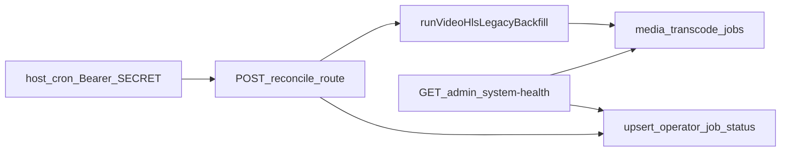

# Cron reconcile + транскод в System Health (обновление)

## Фактическое состояние (синхронизация с репозиторием)

Реализовано; план сохранён как спецификация + контрольный список.

- **Reconcile:** [reconcile/route.ts](../../apps/webapp/src/app/api/internal/media-transcode/reconcile/route.ts) — `runVideoHlsLegacyBackfill` при включённых настройках; best-effort upsert **`public.operator_job_status`** для **`job_family=media`**, **`job_key=media_transcode.reconcile`** (не превращает **200** в **500** при сбое записи). Контракт см. строку **`internal/media-transcode/reconcile`** в [api.md](../../apps/webapp/src/app/api/api.md).
- **Чтение тика:** [getOperatorJobStatus](../../apps/webapp/src/modules/operator-health/ports.ts); payload **`videoTranscode.lastReconcileTick`** собирается в [collectAdminSystemHealthData.ts](../../apps/webapp/src/app-layer/health/collectAdminSystemHealthData.ts).
- **Метрики транскода / DRY backlog:** общий предикат `legacyHlsBackfillCandidateWhereClause` — [videoHlsLegacyBackfill.ts](../../apps/webapp/src/app-layer/media/videoHlsLegacyBackfill.ts) + счётчики — [adminTranscodeHealthMetrics.ts](../../apps/webapp/src/app-layer/media/adminTranscodeHealthMetrics.ts).
- **Агрегатный статус карточки транскода:** `videoTranscode.status` — **`ok` \| `degraded` \| `error`** — [classifyVideoTranscodeSystemHealthStatus](../../apps/webapp/src/modules/operator-health/adminHealthThresholds.ts) (пороги по возрасту pending, ошибкам за 1 ч / 24 ч UTC при включённом пайплайне, тику сверки при включённой reconcile); **`error`** также при падении пробы чтения метрик. Тесты: [adminHealthThresholds.test.ts](../../apps/webapp/src/modules/operator-health/adminHealthThresholds.test.ts), [system-health/route.test.ts](../../apps/webapp/src/app/api/admin/system-health/route.test.ts).
- **UI:** [SystemHealthSection.tsx](../../apps/webapp/src/app/app/settings/SystemHealthSection.tsx); блок «Техническая диагностика» маркируется **`data-testid` = `SYSTEM_HEALTH_TECH_DIAGNOSTICS_TESTID`**; RTL-инварианты операторского слоя — [SystemHealthSection.primaryLayerInvariants.test.tsx](../../apps/webapp/src/app/app/settings/SystemHealthSection.primaryLayerInvariants.test.tsx).
- **Деплой / cron:** два режима (**`*/10`** и nightly **Europe/Moscow 04:00**) — [HOST_DEPLOY_README.md](../../deploy/HOST_DEPLOY_README.md).
- **Миграции / ключ `video_hls_reconcile_enabled`:** webapp — **[0056](../../apps/webapp/db/drizzle-migrations/0056_media_transcode_job_timestamps_reconcile.sql)**; integrator — **`core:20260513_0001_video_hls_reconcile_enabled.sql`**. Отдельная DDL под тики reconcile **не** вводилась — таблица **`operator_job_status`** уже в **[0057](../../apps/webapp/db/drizzle-migrations/0057_operator_health_mvp.sql)** (и др.).

## Контекст (исходная постановка)

- Эндпоинт reconcile вызывает `runVideoHlsLegacyBackfill` при включённом пайплайне и reconcile-флаге (**раньше** не было тиков **`operator_job_status`**; **сейчас** есть — см. «Фактическое состояние»).
- Метрики и пробы живут в [adminTranscodeHealthMetrics.ts](../../apps/webapp/src/app-layer/media/adminTranscodeHealthMetrics.ts), [collectAdminSystemHealthData.ts](../../apps/webapp/src/app-layer/health/collectAdminSystemHealthData.ts), [SystemHealthSection.tsx](../../apps/webapp/src/app/app/settings/SystemHealthSection.tsx).
- DI: `operatorHealthRead` + **`operatorHealthWrite`** в [buildAppDeps.ts](../../apps/webapp/src/app-layer/di/buildAppDeps.ts).

> **Примечание.** Ниже — **исходный** аудит проблем UX до операторской переработки (2026‑05); многие пункты закрыты в **`SystemHealthSection`** и регрессионируются RTL **`primaryLayerInvariants`**. Свежая точка сборки см. блок **«Фактическое состояние»**.

## UI-аудит (архив до переработки)

**Актуально:** карточки и сводка приведены к операторскому слою; сырое — в блоке «Техническая диагностика». Ниже сохранён **исторический** список болей до рефакторинга.

Исторически экран выглядел как дамп внутренних сигналов, а не как операторская панель. Проблемные классы текста:

- В заголовках торчат технические имена: `projection_outbox`, `media_transcode_jobs`, `preview-pipeline`, `playback / HLS`, `bersoncarebot-*`, `GET /api/...`.
- В бейджах и строках видны машинные статусы: `up`, `ok`, `idle`, `running`, `configured`, `pending`, `processing`, `ready`, `failed`, `skipped`.
- Диагностика говорит языком разработчика: `Probe status`, `Duration`, `Error code`, `runtime status`, `queue empty -> idle`, `lastSuccessAt <= 40m`, `deadCount=0`.
- Нет первого человеческого ответа на вопрос «всё ли работает и что делать?»: например блок воспроизведения сообщает `106 resolve`, но не говорит «плеер выдавал ссылку на видео 106 раз; клиентских ошибок за период нет/есть».
- Технические детали смешаны с основным смыслом: администратор видит `media_id`, `eventClass`, `job_key`, `last_success`, хотя сначала нужна короткая интерпретация и только потом сырьё для инженера.

Цель UI-доработки: **максимально полная, но максимально читаемая информация**. Первый экран каждой карточки должен отвечать человеку: «что проверяем», «состояние», «есть ли проблема», «что это значит», «что делать дальше». Сырые коды и probe-поля остаются, но как компактный блок «Техническая диагностика».

## Важная семантика «без HLS» (не упрощать)

Кандидат reconcile — это **не** «любое video/% без master». По [videoHlsLegacyBackfill.ts](apps/webapp/src/app-layer/media/videoHlsLegacyBackfill.ts):

- базовый фильтр: `mime_type ILIKE 'video/%'`, `MEDIA_READABLE_SQL_M`, непустой `s3_key`;
- исключены строки уже **ready с непустым** `hls_master_playlist_s3_key`;
- исключены строки с **активной** задачей в `media_transcode_jobs` со статусом `pending|processing`;
- для cron reconcile используется `includeFailed: false` — строки **`video_processing_status = 'failed'` в кандидатах не участвуют**; основной пул кандидатов — статус **`NULL` или `none`** и при этом master пустой;
- ограничение **3 GiB** применяется **после** выборки в цикле; для счётчика в health нужно **ту же экономику** через SQL `(size_bytes IS NULL OR size_bytes <= cap)` совместимый с BIGINT.

План: экспортировать **один переиспользуемый SQL-фрагмент / функцию сборки WHERE** из `videoHlsLegacyBackfill` (или вынести в модуль метрик рядом) и использовать и для отчётов reconcile, и для `COUNT`, чтобы оператор не видел расхождение «число в health» vs реальный batched reconcile.

## Шаги реализации

### 1) Документация: cron на проде

- [deploy/HOST_DEPLOY_README.md](deploy/HOST_DEPLOY_README.md): сохранить пример **`*/10`**, `limit: 50`, loopback + Bearer — как режим прогресса большого хвоста.
- Добавить второй блок: **раз в сутки в 04:00 по Москве** (`CRON_TZ=Europe/Moscow` + `0 4 * * *`); один абзац — nightly снижает пиковую нагрузку, но застывший каталог всё равно лечится более частым режимом.
- [docs/ARCHITECTURE/SERVER CONVENTIONS.md](docs/ARCHITECTURE/SERVER%20CONVENTIONS.md) — дополнять **только** если там уже ведётся реестр internal job/cron имён и путей к env (без секретов).

### 2) Запись `operator_job_status` после reconcile

- Канон ключей: например `job_family = media`, `job_key = media_transcode.reconcile` — вынести в константы модуля `operator-health` (одна строка на ключ, чтобы не расходиться с доками).
- **Отдельный `OperatorHealthWritePort`** с одним методом вида «завершился reconcile» (success + duration + meta / failure + усечённый error text), чтобы не смешивать read и write и не давать Drizzle-write внутри файла только read.
- Реализация: новый файл `apps/webapp/src/infra/repos/pgOperatorHealthWrite.ts`; регистрация в `buildAppDeps`; for tests — `inMemoryOperatorHealthWritePort` no-op или с сохранением последнего вызова для assert.
- **Успех (200 и report):** записать tick с `meta_json`: числовые поля отчёта (`queuedNew`, `candidatesScanned`, `alreadyQueued`, limit/фактический cap), короткий `abortedReason` без длинных stack trace.
- **Ошибка (500 / reconcile_failed):** **обязательно** записать failure (`last_failure_at`, `last_error` усечённо) — иначе «тишина по cron» неотличима от успешной пустой итерации.
- **Семантика HTTP:** ошибка записи статус-job **не должна превращать 200 в 500**, если reconcile уже прошёл: залогировать `warn`, описать это в коде-комменте (как в postgres-backup: tick failed — вторичная поломка).
- Роут остаётся тонким: импорт `@/infra/db` не добавлять; только `buildAppDeps().operatorHealthWrite` (или уже существующий паттерн internal routes).

### 3) Чтение тика reconcile в системном health

- Расширить [ports.ts](apps/webapp/src/modules/operator-health/ports.ts): метод чтения **одной** строки по `(family, key)` (возвращать `null` если нет ни одной попытки).
- Вызов: внутри **`probeVideoTranscode`** после `loadAdminTranscodeHealthMetrics()`, чтобы сохранить смысловую связку «очередь + последний reconcile» без раздувания `probeOperatorHealthData` (или, альтернативно, один второй параллельный запрос в том же пробе — главное один источник в payload).
- **Миграция БД для tick не нужна** — таблица уже есть ([0057](apps/webapp/db/drizzle-migrations/0057_operator_health_mvp.sql) и др.).

### 4) Расширить агрегаты транскода

- В [adminTranscodeHealthMetrics.ts](apps/webapp/src/app-layer/media/adminTranscodeHealthMetrics.ts) или рядом: параллельные `COUNT`/`interval '24 hours'` для `done`/`failed` с ненулевым `finished_at`; lifetime totals для терминальных `done`/`failed`.
- Поле **кандидатов reconcile**: `COUNT(*)` по `media_files`, WHERE = общий предикат `fetchLegacyBackfillBatch({ includeFailed:false, … })` + условие размера, как выше (**DRY с backfill-модулем**).
- Добавить `readableVideoReadyWithHls` = video + readable + `video_processing_status = 'ready'` + непустой master — чтобы видеть успешную долю каталога; подписать в UI, чтобы не смешали с очередью.

### 5) Ответ API и статус accordion

- Расширить `VideoTranscodeHealthPayload`: новые поля библиотеки и jobs 24h/lifetime вложением или плоским объектом по стилю соседних блоков (`videoPlayback`).
- **`status` accordion:** **`ok` \| `degraded` \| `error`**. **`error`** — при недоступности/ошибке пробы чтения метрик (как «падение probe»). **`degraded`** и часть **`error`** по очереди — компактные пороги в [adminHealthThresholds.ts](../../apps/webapp/src/modules/operator-health/adminHealthThresholds.ts) (`classifyVideoTranscodeSystemHealthStatus`); контракт в [api.md](../../apps/webapp/src/app/api/api.md) → **admin/system-health**. Исходная формулировка плана про «только ok\|error» **снята** после аудита и внедрения порогов.

### 6) UI: человекочитаемая панель

- [SystemHealthSection.tsx](apps/webapp/src/app/app/settings/SystemHealthSection.tsx): строки backlog (кандидаты reconcile), очередь 24h/lifetime, последний успех/ошибка reconcile, краткая сводка из meta.
- Одна компактная подпись: **метки «за 1 ч / за 24 ч» считаются в UTC** ([ui-copy-no-excess-labels](.cursor/rules/ui-copy-no-excess-labels.mdc)).
- Ввести словари отображения для статусов и технических ключей, чтобы в UI не попадали сырые `ok/up/idle/running/configured/pending/processing/ready/failed/skipped`. Примеры:
  - `ok/up/running` → «работает» / «в норме»;
  - `idle` → «очередь пуста»;
  - `pending` → «ожидает обработки»;
  - `processing` → «обрабатывается сейчас»;
  - `failed` → «ошибка»;
  - `skipped` → «пропущено по правилу».
- Переименовать карточки на язык оператора, оставив техническое имя в скобках или в блоке диагностики:
  - «База данных веб-приложения» вместо «База webapp (… DB)»;
  - «Сервер интеграций» вместо «API integrator (/health)»;
  - «Синхронизация событий» вместо «Проекция outbox»;
  - «Фоновая обработка интеграций» вместо «Worker runtime»;
  - «Фоновая обработка медиа» вместо «Cron задачи медиа» + «Транскод HLS»;
  - «Видеоплеер у пациентов» вместо «Воспроизведение видео (playback / HLS)».
- Перестроить содержимое каждой карточки в 3 уровня:
  1. **Итог:** короткая фраза «работает / нет задач / есть ошибки / данных нет».
  2. **Что это значит:** 1-2 строки человеческого смысла без внутренних имён.
  3. **Техническая диагностика:** `Probe status`, `Duration`, `Error code`, `job_key`, `media_id`, сырые event-коды; визуально отделить от основного смысла карточки.
- Для очередей показывать смысловые пары вместо англоязычных групп:
  - «Ждут обработки», «Обрабатываются сейчас», «Ошибок без повтора», «Самая старая задача ждёт»;
  - при нулях писать «Очередь пуста» вместо `0 / 0`.
- Для видео заменить «resolve/fallback/delivery» на операторские формулировки:
  - «Выдано ссылок на видео» вместо «Всего резолвов API»;
  - «Формат выдачи: HLS / MP4 / исходный файл» с пояснением, что HLS — основной потоковый формат, MP4 — запасной вариант;
  - «Переходов на запасной вариант» вместо `Fallback`;
  - «Уникальных пар пациент+видео» оставить как вторичный аналитический показатель с коротким пояснением.
- Для клиентских ошибок плеера перевести event-коды в причины:
  - `hls_fatal` → «плеер не смог воспроизвести HLS»;
  - `video_error` → «браузер сообщил ошибку видео»;
  - `playback_refetch_failed` → «не удалось повторно запросить ссылку»;
  - `hls_js_unsupported` → «устройство не поддержало HLS.js».
- Для блока транскода дать человеческую интерпретацию новых метрик: «видео без потоковой версии», «задач на создание HLS ждёт», «создано HLS за 24 часа», «последняя проверка старых видео».
- Для бэкапов и операторских инцидентов заменить «Строки job / job_key / last_success» на «Последний успешный бэкап», «Последняя ошибка», «Открытые инциденты», а сырой `job_key` оставить в диагностике.
- Сохранить компактность: не добавлять длинные справочные абзацы в UI; повторяющиеся пояснения вынести в маленькие helper-функции/словарь рядом с компонентом.

### 7) Контракт и тесты

- [api.md](../../apps/webapp/src/app/api/api.md): успешный reconcile обновляет `operator_job_status` (best-effort); **`admin/system-health`** описывает **`lastReconcileTick`**, расширенные поля транскода.

- Тесты в репозитории:
  - [reconcile/route.test.ts](../../apps/webapp/src/app/api/internal/media-transcode/reconcile/route.test.ts) — write-порт (success + failure path).
  - [system-health/route.test.ts](../../apps/webapp/src/app/api/admin/system-health/route.test.ts) — в т.ч. **`lastReconcileTick`** при наличии строки в БД и сценарии **`degraded` / `error`** для транскода.
  - [adminHealthThresholds.test.ts](../../apps/webapp/src/modules/operator-health/adminHealthThresholds.test.ts) — **`classifyVideoTranscodeSystemHealthStatus`**.
  - [videoHlsLegacyBackfill.test.ts](../../apps/webapp/src/app-layer/media/videoHlsLegacyBackfill.test.ts) — общий **`legacyHlsBackfillCandidateWhereClause`**.
  - RTL: [SystemHealthSection.primaryLayerInvariants.test.tsx](../../apps/webapp/src/app/app/settings/SystemHealthSection.primaryLayerInvariants.test.tsx) — текст вне веток с **`SYSTEM_HEALTH_TECH_DIAGNOSTICS_TESTID`** не содержит сырых паттернов вроде `Probe status`, `job_key`, `media_transcode.reconcile`; см. также [operatorIncidents.test.tsx](../../apps/webapp/src/app/app/settings/SystemHealthSection.operatorIncidents.test.tsx).

### 8) Вне scope

- HLS из приватного бакета: [.cursor/plans/hls_private_bucket_proxy.plan.md](.cursor/plans/hls_private_bucket_proxy.plan.md).
- Деплой миграций client-events и плеер — только после решения rollout.
- Выравнивание **всех** счётчиков `media_files` в метриках транскода на Drizzle (сейчас кандидаты / ready+HLS — raw SQL через pool) — отдельный рефакторинг по желанию, не блокер плана.

## Definition of Done

- [x] Два сценария cron описаны в [HOST_DEPLOY_README.md](../../deploy/HOST_DEPLOY_README.md); команды копируемые (loopback + Bearer + **`webapp.prod`** по канону хоста).
- [x] При успешном коде приложения каждый `POST …/reconcile` инициирует попытку upsert строки reconcile в **`operator_job_status`** (**best-effort** запись статус-job не переводит **200** в **500**; в пустой dev-БД строка появится после первого реального POST).
- [x] `GET /api/admin/system-health` и UI: backlog-кандидатов reconcile (DRY-предикат), **24h + lifetime**, **1h**, **`lastReconcileTick`** или **`null`**.
- [x] **`videoTranscode.status`**: **`ok` \| `degraded` \| `error`** с порогами в **`adminHealthThresholds.ts`** и регрессией в тестах.
- [x] Операторские тексты **`SystemHealthSection`** + техблок под **`SYSTEM_HEALTH_TECH_DIAGNOSTICS_TESTID`**; пост-аудит — **`SystemHealthSection.primaryLayerInvariants.test.tsx`**.
- [x] **`api.md`** синхронизирован (reconcile side-effect + **admin/system-health**).
- [x] Локальные lint/typecheck/тесты по области; финальный **`pnpm run ci`** по правилам репозитория перед merge/push (см. [.cursor/rules/pre-push-ci.mdc](../../.cursor/rules/pre-push-ci.mdc)).
