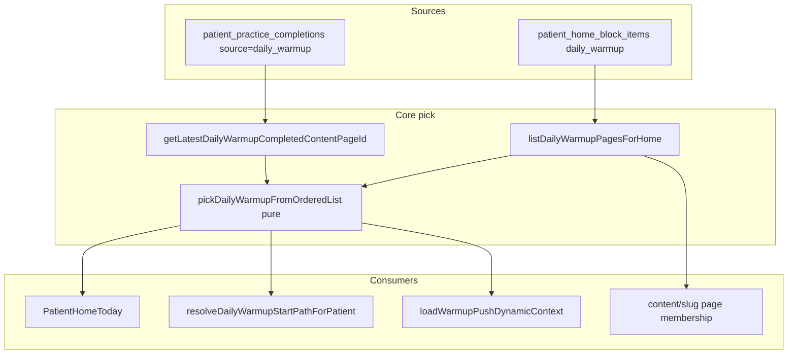

# Daily warmup: ротация, layout, quick list, feedback

## Цель и границы

**In scope**
- Ротация «разминки дня» на главной: round-robin от последней `daily_warmup` completion (не weekday).
- Warmup layout для всех `content_page` из visible items блока `daily_warmup` (membership, не query).
- Quick list всех разминок на warmup-detail.
- Feedback после star-rating 1–3 (отдельно от feeling после выполнения).
- Read-only doctor UI: агрегаты reason codes + список feedback на материале.

**Out of scope**
- Like/dislike, favorite, hide.
- Ротация по оценкам или feedback.
- «K разминок в день» (отдельный backlog).
- Изменение integrator morning ping pick (остаётся «есть ли published warmup»).

**Ключевые файлы**
- Pick/list: [`apps/webapp/src/modules/patient-home/todayConfig.ts`](apps/webapp/src/modules/patient-home/todayConfig.ts)
- Главная: [`apps/webapp/src/app/app/patient/home/PatientHomeToday.tsx`](apps/webapp/src/app/app/patient/home/PatientHomeToday.tsx), [`PatientHomeDailyWarmupCard.tsx`](apps/webapp/src/app/app/patient/home/PatientHomeDailyWarmupCard.tsx)
- Content page: [`apps/webapp/src/app/app/patient/content/[slug]/page.tsx`](apps/webapp/src/app/app/patient/content/[slug]/page.tsx), [`PatientContentSlugArticle.tsx`](apps/webapp/src/app/app/patient/content/[slug]/PatientContentSlugArticle.tsx)
- Deeplink/push: [`resolvePatientReminderGoTargets.ts`](apps/webapp/src/app/app/patient/go/resolvePatientReminderGoTargets.ts), [`loadWarmupPushDynamicContext.ts`](apps/webapp/src/modules/web-push/loadWarmupPushDynamicContext.ts)
- Completions: [`patient-practice/ports.ts`](apps/webapp/src/modules/patient-practice/ports.ts), [`pgPatientPracticeCompletions.ts`](apps/webapp/src/infra/repos/pgPatientPracticeCompletions.ts)
- Rating: [`MaterialRatingBlock.tsx`](apps/webapp/src/shared/ui/material-rating/MaterialRatingBlock.tsx), [`material-rating/service.ts`](apps/webapp/src/modules/material-rating/service.ts)

---

## Архитектура (целевое состояние)



### Правила pick (зафиксировать в коде и docs)

- Guest / no patient tier: первая страница по `sortOrder`; `patientPractice` не вызывается.
- Patient tier: `next` после последней global `daily_warmup` completion в текущем ordered list; wrap; fallback — первая.
- Last completed вне list: первая доступная.
- При `n === 1`: всегда та же страница; hero-cooldown «Разминка выполнена» остаётся.
- При `n >= 2`: после выполнения главная показывает следующую; cooldown не участвует в pick.

### Back-навигация (membership vs query)

- Membership = да, `?from=daily_warmup` = да: back на `/app/patient` («Меню»).
- Membership = да, `?from=daily_warmup` = нет: back на `/app/patient/sections/<sectionSlug>`.
- Membership = нет, любое query: текущая логика section material без warmup-исключений.

`practiceSource`, warmup UI, pager, quick list, rating feedback scope — **только от membership**.

---

## Этап 0 — Design freeze (read-only)

**Прочитать**
- Все файлы из scope выше + [`dailyWarmupHeroCooldown.ts`](apps/webapp/src/modules/patient-home/dailyWarmupHeroCooldown.ts), [`patientHomeRepeatCooldownSettings.ts`](apps/webapp/src/modules/patient-home/patientHomeRepeatCooldownSettings.ts), [`PatientContentPracticeComplete.tsx`](apps/webapp/src/app/app/patient/content/[slug]/PatientContentPracticeComplete.tsx), [`PatientStageCompositionList.tsx`](apps/webapp/src/app/app/patient/treatment/PatientStageCompositionList.tsx) (UX-референс списка).

**Зафиксировать enum reason codes** (server + client):
- `worse_wellbeing`, `too_hard`, `unclear_explanation`, `disliked_movement`, `video_quality`, `other`

**Checklist**
- [x] Edge cases: 0 warmups, 1 warmup, broken targetRef, removed page после completion
- [x] Cooldown keys в `system_settings` не удаляем; для `n>=2` pick их игнорирует
- [x] Feeling modal и star feedback — разные триггеры, не смешивать

**DoD:** таблицы pick/back/reason codes согласованы; код не меняется.

**Проверки этапа**
- [x] `rg "weekdayMonday0|start = \\(\\(warmupWeekdayMonday0"` по [`apps/webapp/src/modules/patient-home`](apps/webapp/src/modules/patient-home) для фикса удаления weekday-зависимости.
- [x] `rg "from=daily_warmup"` по [`apps/webapp/src/app/app/patient/content/[slug]`](apps/webapp/src/app/app/patient/content/[slug]) и фиксация точек, где query допускается только как nav hint.

---

## Этап 1 — Pure pick + read-port (ротация)

### Новые файлы
- [`apps/webapp/src/modules/patient-home/pickDailyWarmupFromOrderedList.ts`](apps/webapp/src/modules/patient-home/pickDailyWarmupFromOrderedList.ts) — pure:
  ```ts
  pickDailyWarmupFromOrderedList(
    pages: ReadonlyArray<{ contentPageId: string }>,
    lastCompletedContentPageId: string | null,
  ): number // index, 0 if empty handled by caller
  ```
- [`pickDailyWarmupFromOrderedList.test.ts`](apps/webapp/src/modules/patient-home/pickDailyWarmupFromOrderedList.test.ts)

### Изменения
- [`todayConfig.ts`](apps/webapp/src/modules/patient-home/todayConfig.ts):
  - Убрать параметр `warmupWeekdayMonday0` и weekday-логику `start = weekday % n`.
  - Удалить/упростить `PatientHomeWarmupPickContext` (`skipCooldownPages`, цикл skip по cooldown).
  - Новая сигнатура: `getPatientHomeTodayConfig(deps, pickContext?)` где `pickContext = { tier: 'guest'|'no_tier'|'patient', userId?, getLatestCompletedPageId }`.
  - Внутри: `listDailyWarmupPagesForHome` → pick index → вернуть `dailyWarmupItem`.
  - Поля `allDailyWarmupsInCooldown` / `allDailyWarmupsCooldownMinutesRemaining` — оставить только для `n===1` + cooldown UI (см. этап 5).
- [`patient-practice/ports.ts`](apps/webapp/src/modules/patient-practice/ports.ts): добавить
  `getLatestDailyWarmupCompletedContentPageId(userId: string): Promise<string | null>`
- [`service.ts`](apps/webapp/src/modules/patient-practice/service.ts): делегирование в port.
- [`pgPatientPracticeCompletions.ts`](apps/webapp/src/infra/repos/pgPatientPracticeCompletions.ts): query `WHERE user_id AND source='daily_warmup' ORDER BY completed_at DESC LIMIT 1` → `contentPageId`.
- [`inMemoryPatientPracticeCompletions.ts`](apps/webapp/src/infra/repos/inMemoryPatientPracticeCompletions.ts): аналог.

### Синхронизация consumers
- [`PatientHomeToday.tsx`](apps/webapp/src/app/app/patient/home/PatientHomeToday.tsx): убрать `weekdayMonday0`; для tier — last completed; cooldown meta только при `n===1`.
- [`resolvePatientReminderGoTargets.ts`](apps/webapp/src/app/app/patient/go/resolvePatientReminderGoTargets.ts): тот же pick, без weekday/warmupPick skip.
- [`loadWarmupPushDynamicContext.ts`](apps/webapp/src/modules/web-push/loadWarmupPushDynamicContext.ts): `dailyWarmupTitle` из pick per-user (передать `getLatestDailyWarmupCompletedContentPageId` в deps).

### Тесты (обновить/добавить)
- [`todayConfig.test.ts`](apps/webapp/src/modules/patient-home/todayConfig.test.ts): заменить weekday-тесты на round-robin кейсы:
  - guest → первая, `patientPractice` не вызывается
  - no tier → первая
  - patient без completions → первая
  - после 1-й → 2-я; после последней → 1-я
  - last completed удалена из list → первая
  - sortOrder определяет порядок; битые items пропускаются
- [`PatientHomeToday.test.tsx`](apps/webapp/src/app/app/patient/home/PatientHomeToday.test.tsx): убрать ожидания weekday/cooldown-skip; добавить pick mock.
- Тест sync: slug из `resolveDailyWarmupStartPathForPatient` === slug на главной для того же user mock.

### Риски
- Дублирование `listDailyWarmupPagesForHome` в нескольких RSC — acceptable; не N+1 сверх текущего.

**DoD этапа:** unit-тесты pick + todayConfig зелёные; deeplink/push используют ту же pure-функцию.

**Проверки этапа**
- [x] `rg "getLatestDailyWarmupCompletedContentPageId"` по [`apps/webapp/src`](apps/webapp/src) — метод подключён в `ports/service/pg/inMemory`.
- [x] Точечные тесты: `todayConfig.test.ts`, `PatientHomeToday.test.tsx`, тесты для `resolvePatientReminderGoTargets` и `loadWarmupPushDynamicContext`.

---

## Этап 2 — Warmup layout по membership

### Изменения
- [`content/[slug]/page.tsx`](apps/webapp/src/app/app/patient/content/[slug]/page.tsx):
  - Один вызов `orderedDailyWarmupPages = await listDailyWarmupPagesForHome(deps)`.
  - `isDailyWarmup = orderedDailyWarmupPages.some(p => p.slug === slug)`.
  - `practiceSource = isDailyWarmup ? 'daily_warmup' : 'section_page'`.
  - `warmupNav = isDailyWarmup ? buildPatientDailyWarmupNav(slug, orderedDailyWarmupPages) : null`.
  - Back matrix (см. таблицу выше); `from=daily_warmup` влияет **только** на back.
  - Пробросить `orderedDailyWarmupPages` в `PatientContentSlugArticle`.
- [`PatientContentSlugArticle.tsx`](apps/webapp/src/app/app/patient/content/[slug]/PatientContentSlugArticle.tsx): принять `isDailyWarmup` / pages; warmup-specific chrome от membership.

### Новые тесты
- [`content/[slug]/page.warmupMembership.test.ts`](apps/webapp/src/app/app/patient/content/[slug]/page.warmupMembership.test.ts) (contract/route-level с моками deps):
  - slug in block, без query → warmup layout + `practiceSource=daily_warmup`
  - slug not in block, с `?from=daily_warmup` → section layout
  - `warmupNav` порядок = sortOrder блока

### Риски
- Ссылки из `/app/patient/sections/warmups` откроют warmup layout — **ожидаемо** по ТЗ.

**DoD:** membership определяет layout/practiceSource; query не может «подделать» warmup.

**Проверки этапа**
- [x] `rg "isDailyWarmup = "` и `rg "practiceSource ="` в [`apps/webapp/src/app/app/patient/content/[slug]`](apps/webapp/src/app/app/patient/content/[slug]) — membership, не query.
- [x] Точечные тесты `content/[slug]/page` (новый файл + существующие smoke по маршруту).

---

## Этап 3 — Quick list всех разминок

### Новый файл
- [`PatientDailyWarmupQuickList.tsx`](apps/webapp/src/app/app/patient/content/[slug]/PatientDailyWarmupQuickList.tsx)

**UI-модель**
```ts
type PatientDailyWarmupListItem = {
  slug: string;
  title: string;
  summary: string;
  imageUrl: string | null;
  href: string; // /app/patient/content/<slug>?from=daily_warmup
  isCurrent: boolean;
};
```

**Правила**
- Источник — prop `orderedDailyWarmupPages` с page (без повторного fetch).
- Показывать только при warmup layout и `pages.length > 1`.
- Текущий slug — highlight (паттерн [`PatientStageCompositionList.tsx`](apps/webapp/src/app/app/patient/treatment/PatientStageCompositionList.tsx): `patientCompositionCurrentRowChromeClass`, [`PatientCatalogMediaStaticThumb`](apps/webapp/src/shared/ui/patient/PatientCatalogMediaStaticThumb.tsx)).
- Размещение в [`PatientContentSlugArticle.tsx`](apps/webapp/src/app/app/patient/content/[slug]/PatientContentSlugArticle.tsx): **после** video + `PatientContentPracticeComplete` + star rating; **не** заменять [`PatientDailyWarmupPager.tsx`](apps/webapp/src/app/app/patient/content/[slug]/PatientDailyWarmupPager.tsx).

### Тесты
- [`PatientDailyWarmupQuickList.test.tsx`](apps/webapp/src/app/app/patient/content/[slug]/PatientDailyWarmupQuickList.test.tsx):
  - не рендерится на section page / при 0–1 разминке
  - current highlighted; hrefs с `?from=daily_warmup`; порядок sortOrder

**DoD:** quick list + pager coexist; без лишних CMS-запросов.

**Проверки этапа**
- [x] `rg "PatientDailyWarmupQuickList"` по [`apps/webapp/src/app/app/patient/content/[slug]`](apps/webapp/src/app/app/patient/content/[slug]) — подключение только в warmup layout.
- [x] RTL тесты quick list + pager (`PatientDailyWarmupPager.test.tsx`) зелёные.

---

## Этап 4 — Feedback после оценки 1–3 (patient)

### Миграция БД (Drizzle)
Новая таблица `patient_content_rating_feedback`:
- `id` uuid PK
- `user_id` uuid FK → platform_users
- `content_page_id` uuid FK → content_pages
- `rating_value` smallint 1–5 (snapshot на момент feedback)
- `reason_codes` jsonb string[] (validated enum)
- `comment` text null
- `created_at` timestamptz
- index `(content_page_id, created_at desc)`, index `(user_id, created_at desc)`

**Без FK на `material_ratings`** — проще upsert flow; дублировать `rating_value` в строке feedback.

### Новый модуль
- [`apps/webapp/src/modules/material-rating-feedback/`](apps/webapp/src/modules/material-rating-feedback/) — `ports.ts`, `service.ts`, `reasonCodes.ts`
- [`pgMaterialRatingFeedback.ts`](apps/webapp/src/infra/repos/pgMaterialRatingFeedback.ts), in-memory twin
- Wire в [`buildAppDeps.ts`](apps/webapp/src/app-layer/di/buildAppDeps.ts)

### API
- `POST /api/patient/material-ratings/feedback/route.ts`
  - Auth: patient business tier
  - Body: `{ contentPageId, ratingValue, reasonCodes?, comment? }`
  - Validate: page exists; **page must be in daily_warmup membership** (reuse list or narrow query)
  - `ratingValue` must be 1–3 (server guard)
  - At least one of reasonCodes non-empty or comment trimmed — иначе 400

### UI
- [`PatientWarmupRatingFeedbackDialog.tsx`](apps/webapp/src/app/app/patient/content/[slug]/PatientWarmupRatingFeedbackDialog.tsx)
  - Title: «Расскажите, что было не так — это поможет точнее подбирать разминки.»
  - Reason chips (6 штук из enum)
  - Textarea; «Отправить» disabled если нет reasons и пустой comment
  - «Пропустить»; крестик и click-outside = Пропустить (оценка сохранена, feedback не пишется)
  - Draft при закрытии без «Отправить» — discard
- [`MaterialRatingBlock.tsx`](apps/webapp/src/shared/ui/material-rating/MaterialRatingBlock.tsx): добавить prop `onLowRatingSaved?: (stars: number) => void` — вызывать **после успешного PUT**, только если `stars <= 3`
- [`PatientContentMaterialRating.tsx`](apps/webapp/src/app/app/patient/content/[slug]/PatientContentMaterialRating.tsx): при `practiceSource === 'daily_warmup'` — wiring dialog

**Не менять** flow feeling modal в [`PatientContentPracticeComplete.tsx`](apps/webapp/src/app/app/patient/content/[slug]/PatientContentPracticeComplete.tsx).

### Тесты
- API route tests (auth, validation, membership guard)
- RTL: rating 4/5 → no modal; 1/2/3 → modal; skip/close/send behaviors
- Feedback не вызывает pick/rotation (no deps on todayConfig)

**DoD:** patient может оставить необязательный feedback после 1–3; 4/5 без modal.

**Проверки этапа**
- [x] `rg "worse_wellbeing|too_hard|unclear_explanation|disliked_movement|video_quality|other"` по [`apps/webapp/src`](apps/webapp/src) — единый enum на client/server.
- [x] Route tests `api/patient/material-ratings/feedback` + RTL модалки (send/skip/close/outside/disabled submit).

---

## Этап 5 — Doctor read-only feedback stats

### Backend
- Extend material-rating-feedback port: `getDoctorFeedbackSummary(contentPageId)` → `{ total, byReasonCode, recent[] }`
- `listDoctorFeedbackForPage(contentPageId, limit, offset)` с пагинацией для списка комментариев.

### UI
- На [`/app/doctor/material-ratings/[kind]/[id]/page.tsx`](apps/webapp/src/app/app/doctor/material-ratings/[kind]/[id]/page.tsx) для `kind=content_page`:
  - Блок «Обратная связь (1–3)»: counts по reason codes + таблица последних comment (user display label, date)
  - Только read-only; без reply flow

### Тесты
- Service/repo aggregate tests
- Smoke doctor page render with mock feedback rows

**DoD:** доктор видит агрегаты и комментарии по материалу-разминке.

**Проверки этапа**
- [x] Service/repo tests для summary + list (reason counts, order by created_at desc).
- [x] Render/smoke test для [`/app/doctor/material-ratings/[kind]/[id]/page.tsx`](apps/webapp/src/app/app/doctor/material-ratings/[kind]/[id]/page.tsx) с feedback-блоком.

---

## Этап 6 — Cooldown cleanup, refresh, docs

### Cooldown simplification
- [`PatientHomeToday.tsx`](apps/webapp/src/app/app/patient/home/PatientHomeToday.tsx) + [`PatientHomeDailyWarmupCard.tsx`](apps/webapp/src/app/app/patient/home/PatientHomeDailyWarmupCard.tsx):
  - Hero «Разминка выполнена» + caption — **только** `n===1` и active cooldown
  - При `n>=2` — всегда CTA «Начать разминку» на следующей pick
- Admin panel [`PatientHomeRepeatCooldownPanel.tsx`](apps/webapp/src/app/app/settings/patient-home/PatientHomeRepeatCooldownPanel.tsx): подпись «действует только при одной разминке в блоке»; `skip_to_next` — deprecate label или скрыть (ключ в DB оставить, pick игнорирует)
- Обновить/сократить тесты [`dailyWarmupHeroCooldown.test.ts`](apps/webapp/src/modules/patient-home/dailyWarmupHeroCooldown.test.ts), [`PatientHomeToday.test.tsx`](apps/webapp/src/app/app/patient/home/PatientHomeToday.test.tsx)

### Post-completion refresh
- [`PatientContentPracticeComplete.tsx`](apps/webapp/src/app/app/patient/content/[slug]/PatientContentPracticeComplete.tsx): после успешного POST completion → `router.refresh()` чтобы главная подхватила next pick

### Документация
- [`apps/webapp/src/modules/patient-home/patient-home.md`](apps/webapp/src/modules/patient-home/patient-home.md)
- [`docs/PATIENT_DAILY_WARMUP_UX/LOG.md`](docs/PATIENT_DAILY_WARMUP_UX/LOG.md)

Зафиксировать:
- weekday rotation removed
- pick = round-robin от last `daily_warmup` completion
- guest/no tier → first by sortOrder
- warmup layout = membership in `daily_warmup` block
- quick list на detail
- feedback 1–3 необязателен для пациента, отдельно от feeling
- rotation не зависит от ratings/feedback
- cooldown UI only for single warmup

### Финальная проверка
- Targeted: все новые/обновлённые test files
- Перед merge: один `pnpm run ci` на финальном дереве

**DoD релиза:** все пункты Definition of Done ниже закрыты.

**Проверки этапа**
- [x] `rg "weekdayMonday0"` по [`apps/webapp/src`](apps/webapp/src) — не используется в daily_warmup pick.
- [x] `rg "from=daily_warmup"` по [`apps/webapp/src/app/app/patient/content/[slug]`](apps/webapp/src/app/app/patient/content/[slug]) — только навигационные ветки.
- [x] Полный финальный прогон: `pnpm run ci`.

---

## Definition of Done

1. Patient tier видит на главной **следующую** разминку после выполнения предыдущей (при `n>=2`).
2. Guest/no tier видят первую по sortOrder; без вызовов `patientPractice` для pick.
3. Любой slug из блока `daily_warmup` открывается в warmup layout **без** обязательного `?from=`.
4. Query `?from=daily_warmup` не может включить warmup layout для non-member slug.
5. Quick list показывает все разминки блока (если >1), текущая выделена.
6. Star rating 1–3 открывает feedback modal; 4/5 — нет; feeling flow не затронут.
7. Feedback сохраняется в новой таблице; doctor видит агрегаты на detail material-ratings.
8. Deeplink `/app/patient/go/daily-warmup` и push title используют тот же pick что главная.
9. Docs/LOG обновлены; `pnpm run ci` зелёный.

---

## Риски и mitigations

- Главная stale после completion: `router.refresh()` в practice complete.
- Расхождение pick между экранами: единая pure `pickDailyWarmupFromOrderedList` + shared list fn.
- Feedback spam: server принимает feedback только для 1–3 после валидного rating flow; submit не обязателен.
- Admin cooldown confusion: подпись «только 1 разминка»; pick игнорирует cooldown при `n>=2`.
- Performance `listDailyWarmupPagesForHome`: один fetch per RSC page, без повторного fetch в quick list.
