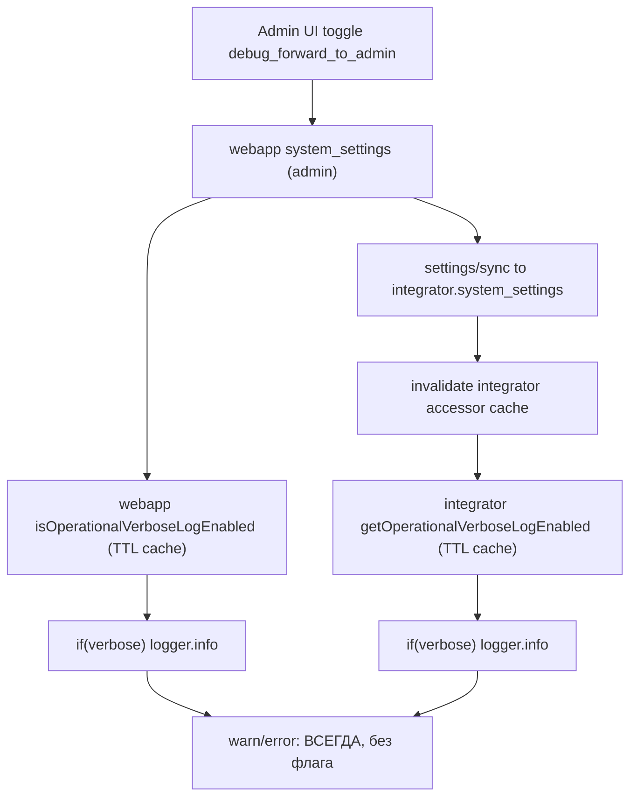

# План: управление полнотой логов через `debug_forward_to_admin`

## Цель
Существующий admin-флаг `debug_forward_to_admin` (кабинет врача → «Технические режимы») управляет полнотой серверных логов в `webapp` и `integrator`:
- `false` (по умолчанию, production): в логах только значимое — ошибки, деградации, DLQ, исчерпанные retry, нарушения constraint/fk, security/validation reject.
- `true`: дополнительно включаются подробные operational `info`-логи для диагностики.

## Самое важное правило (нарушение = переделка)
1. Флаг включает логи через **`if (verbose) logger.info(...)`**, а НЕ через `logger.debug(...)`.
   Причина: в production `LOG_LEVEL=info`, поэтому `logger.debug` НЕ попадёт в journalctl без env/restart, и флаг будет «мёртвым».
2. `logger.warn` и `logger.error` НЕ трогаем вообще: они должны писаться всегда, независимо от флага.
3. В verbose-логах ЗАПРЕЩЕНО писать сырые `params` / `payload` / `mutation.params` / `initData` / телефоны / email / токены / cookies.
   Разрешено: короткие id, `eventId`, `correlationId`, `intentType`, `channel`, `status`, `attempt`, counters, `reason` (строка-причина без PII).
4. Это изменение ТОЛЬКО про логирование. НЕ менять бизнес-логику доставки, idempotency, очередей, БД.
5. Менять только логирующие ветки. Если для доступа к флагу пришлось бы менять сигнатуры многих сервисов — такой callsite уходит в backlog, а не «протаскивается» через весь стек.

## Scope boundaries
- В scope:
  - `webapp`: helper чтения флага + точечные правки логирующих веток в перечисленных файлах Batch 1.
  - `integrator`: кэшируемый accessor + точечные правки логирующих веток в перечисленных файлах Batch 1 + invalidation в sync route.
  - UI-текст переключателя `debug_forward_to_admin` и комментарий ключа в `ALLOWED_KEYS`.
  - Тесты на accessor/gate/invalidation.
- Вне scope:
  - Новые `system_settings` ключи (используем существующий `debug_forward_to_admin`).
  - Изменение формата/структуры/уровня `warn`/`error`.
  - Изменение деплоя и env `LOG_LEVEL`.
  - Полная ревизия всех логов монорепо. Закрываем Batch 1 (P0/P1), остальное — backlog (см. Этап 8).
  - Любая правка бизнес-логики, idempotency, DLQ, retry, БД-запросов.

## Точки интеграции (подтверждено в коде)
- Whitelist ключа: [apps/webapp/src/modules/system-settings/types.ts](apps/webapp/src/modules/system-settings/types.ts) (`ALLOWED_KEYS`, строка с `debug_forward_to_admin`).
- Batch-форма «Режимы»: [apps/webapp/src/modules/system-settings/modesFormKeys.ts](apps/webapp/src/modules/system-settings/modesFormKeys.ts) (`debug_forward_to_admin` уже в `MODES_FORM_KEYS` — НЕ менять).
- UI и сохранение: [apps/webapp/src/app/app/settings/AdminSettingsSection.tsx](apps/webapp/src/app/app/settings/AdminSettingsSection.tsx), [apps/webapp/src/modules/system-settings/service.ts](apps/webapp/src/modules/system-settings/service.ts).
- Mirror в integrator: [apps/integrator/src/integrations/bersoncare/settingsSyncRoute.ts](apps/integrator/src/integrations/bersoncare/settingsSyncRoute.ts).
- Образец webapp-флага: [apps/webapp/src/modules/auth/miniappAuthVerboseServerLog.ts](apps/webapp/src/modules/auth/miniappAuthVerboseServerLog.ts).
- Образец integrator TTL-accessor: [apps/integrator/src/infra/db/repos/linkedPhoneSource.ts](apps/integrator/src/infra/db/repos/linkedPhoneSource.ts).

## Рабочий поток

## Этап 1 — Канон «значимое vs verbose»

### 1.1 Значимое (НЕ трогать, остаётся всегда)
- `warn`/`error` по security/validation reject (invalid signature, bad webhook token, invalid body).
- `projection event moved to DLQ`, `outgoing_delivery_worker_row_failed`.
- Emit failures (`integrator_emit_body_reject`), `status:500` цепочки.
- DB ошибки и нарушения: `23503`, `23514`, `23505`, constraint/fk.
- Health degradation, provider error при фактическом провале доставки.
- Одноразовые startup-логи (`worker started`, `scheduler lock acquired`) — оставить `info` всегда.

### 1.2 Verbose-only (под `if (verbose) logger.info`)
- per-event delivery/notify success-логи.
- webhook `received` / `mapped to event` (Max, Rubitime).
- routine success ticks / retention success / health OK.
- auth success timing.
- provider success (web-push delivered, успешная подписка).

### 1.3 Спорные случаи (зафиксировать решение)
- web-push `410/404` (dead subscription): остаётся `warn` ТОЛЬКО если cleanup/disable не удался; успешный cleanup → verbose.
- `console.info` в server-side коде: НЕ оставлять как обход gate. Заменить на `logger` + gate или удалить (см. Этап 6).

Проверки шага:
- `rg "logger\.info\(|console\.info\(" apps/webapp/src apps/integrator/src` — каждый hit размечен: keep-always / verbose / warn-error / backlog.

## Этап 2 — Смысл и текст флага

### 2.1 UI
- В [apps/webapp/src/app/app/settings/AdminSettingsSection.tsx](apps/webapp/src/app/app/settings/AdminSettingsSection.tsx):
  - label: было «Debug: пересылать входящие админу» → стало «Debug: подробные серверные логи».
  - hint (кратко, в стиле экрана): «Включает подробные operational-логи webapp и integrator (journalctl). Не меняет доставку сообщений. На проде держать выключенным.»
- Не добавлять лишних абзацев/пояснений сверх одного hint (правило проектного UI-copy).

### 2.2 Комментарий ключа
- В [apps/webapp/src/modules/system-settings/types.ts](apps/webapp/src/modules/system-settings/types.ts) обновить комментарий над `debug_forward_to_admin`: теперь это переключатель полноты серверных логов, а не пересылка входящих.
- `MODES_FORM_KEYS` НЕ менять (ключ уже там).

Проверки шага:
- `rg "пересылать входящие|debug_forward_to_admin" apps/webapp/src` — старая семантика в тексте не осталась.

## Этап 3 — Webapp accessor

### 3.1 Создать helper
- Файл: `apps/webapp/src/modules/observability/operationalVerboseLog.ts` (или рядом с logging). НЕ в доменных `modules/*`-бизнес-папках.
- API:
  - `isOperationalVerboseLogEnabled(deps: { systemSettings: { getSetting(key, scope): Promise<SystemSetting|null> } }): Promise<boolean>`
  - чтение `debug_forward_to_admin` scope `admin`, парсинг `{ value: true|"true" }` (как `miniappAuthVerboseServerLog.ts`).
- TTL-кэш внутри helper (30–60 c), fail-safe default `false`, и `resetOperationalVerboseLogCacheForTests()`.

### 3.2 Clean Architecture (обязательно)
- НЕ читать `@/infra/db/*` или repo-реализации из `apps/webapp/src/modules/**`.
- Флаг получать через уже доступные deps/route/app-layer; если callsite в `modules/*` не имеет доступа без раздувания сигнатур — в backlog.

Проверки шага:
- `rg "isOperationalVerboseLogEnabled" apps/webapp/src`
- ESLint webapp без новых `no-restricted-imports` нарушений.

## Этап 4 — Integrator accessor

### 4.1 Создать accessor
- Файл: `apps/integrator/src/infra/db/repos/operationalVerboseLog.ts` по образцу [apps/integrator/src/infra/db/repos/linkedPhoneSource.ts](apps/integrator/src/infra/db/repos/linkedPhoneSource.ts).
- API:
  - `getOperationalVerboseLogEnabled(db: DbPort): Promise<boolean>` — SELECT `value_json` WHERE key=`debug_forward_to_admin` AND scope=`admin`, TTL 60 c, default `false`.
  - `resetOperationalVerboseLogCacheForTests()`.
  - `invalidateOperationalVerboseLogCache()` — для sync route.

### 4.2 Парсинг
- Принимать `{ value: true }` и `{ value: "true" }`; иначе `false`. На ошибке запроса — `warn` + default `false` (как в образце).

Проверки шага:
- `rg "getOperationalVerboseLogEnabled" apps/integrator/src`

## Этап 5 — Cache invalidation при sync

- В [apps/integrator/src/integrations/bersoncare/settingsSyncRoute.ts](apps/integrator/src/integrations/bersoncare/settingsSyncRoute.ts) после успешного upsert добавить:
  - `if (key === 'debug_forward_to_admin') invalidateOperationalVerboseLogCache();`
  - по аналогии с существующими invalidations (`app_base_url`, `app_display_timezone`, `smtp_outbound`).
- Цель: смена флага в кабинете применяется в integrator без ожидания TTL.

Проверки шага:
- `rg "invalidateOperationalVerboseLogCache" apps/integrator/src`

## Этап 6 — Batch 1: правка шумных логов

Правило для каждого callsite: `warn/error` не трогаем; noisy `info`/`console.info` оборачиваем в `if (verbose) logger.info({ safeFields }, "msg")`; raw `params`/`payload` НЕ логируем.

### 6.1 Integrator (P0)
- [apps/integrator/src/infra/db/writePort.ts](apps/integrator/src/infra/db/writePort.ts), `case 'delivery.attempt.log'` (~строка 1154):
  - `logger.info({ params: mutation.params }, 'delivery attempt log')` → `if (verbose) logger.info({ intentType, intentEventId, correlationId, channel, status, attempt, reason }, 'delivery attempt log')`.
  - НЕ логировать `payload`/`payloadJson`.
- [apps/integrator/src/infra/db/repos/messageLogs.ts](apps/integrator/src/infra/db/repos/messageLogs.ts) (~строка 66 `append message/delivery log`): verbose-gate; `warn`/`error` ниже (skip-строки, insert failed) оставить.
- [apps/integrator/src/integrations/max/webhook.ts](apps/integrator/src/integrations/max/webhook.ts) (`max webhook received` / `skipped`): verbose-gate.
- [apps/integrator/src/integrations/rubitime/webhook.ts](apps/integrator/src/integrations/rubitime/webhook.ts) (`webhook received` / `mapped to event`): verbose-gate.

### 6.2 Webapp (P1)
- [apps/webapp/src/modules/patient-reminders/integratorNotifyChannels.ts](apps/webapp/src/modules/patient-reminders/integratorNotifyChannels.ts): success-резолв/notify result/web-push result → verbose.
- [apps/webapp/src/modules/patient-notifications/notificationChannelContract.ts](apps/webapp/src/modules/patient-notifications/notificationChannelContract.ts): `notification channels resolved` → verbose.
- [apps/webapp/src/modules/web-push/sendWebPushToSubscriptions.ts](apps/webapp/src/modules/web-push/sendWebPushToSubscriptions.ts): success per-subscription → verbose; provider error → оставить `warn`.
- [apps/webapp/src/modules/auth/authRouteObservability.ts](apps/webapp/src/modules/auth/authRouteObservability.ts): success timing → verbose; в auth-routes `warn` при denied оставить.

### 6.3 Если callsite в modules без доступа к флагу
- Не тащить deps через весь стек. Пометить как backlog (Этап 8), в Batch 1 не трогать.

Проверки шага:
- `rg "logger\.info\(\{ params|mutation\.params" apps/integrator/src` — не осталось raw-params info.
- `rg "console\.info\(" apps/webapp/src apps/integrator/src` — в затронутых файлах не осталось обхода gate.

## Этап 7 — Тесты

### 7.1 Webapp
- Unit на helper: `false` по умолчанию; `true` при `{value:true}`/`{value:"true"}`; TTL-cache; reset.
- Для 1 callsite: при `flag=false` verbose `logger.info` не вызывается, при `true` вызывается (мок logger).

### 7.2 Integrator
- Unit на accessor: parse, TTL-cache, fallback `false` при ошибке запроса, reset.
- Тест invalidation: после `invalidateOperationalVerboseLogCache()` следующее чтение идёт в БД.
- Для 1 high-volume callsite (например `delivery.attempt.log`): gate работает и raw `params` не логируется.

### 7.3 Лёгкость тестов
- Не создавать тяжёлый RTL-файл ради label; UI-текст проверять только если уже есть близкий тест `AdminSettingsSection`.

Проверки шага:
- `pnpm --dir apps/webapp exec vitest run <targeted>`
- `pnpm --dir apps/integrator exec vitest run <targeted>`

## Этап 8 — Backlog (P2/P3) и runbook

### 8.1 Backlog (НЕ делать в Batch 1, зафиксировать списком)
- retention success ticks, system health probe OK, pwa_launch, playback_resolved, identity resolution `console.info`, rubitime post-create steps, media preview per-item, scheduler/web-push tick success, auth/service `console.info` массив.
- Зафиксировать в `docs` (например `docs/BACKLOG_TAILS.md`) одним пунктом со ссылкой на этот план.

### 8.2 Runbook после деплоя
- Снять baseline шума за 10 мин при `flag=false`.
- Включить флаг в кабинете → проверить, что подробные `info` появились в integrator и webapp без рестарта.
- Выключить → убедиться, что поток снова тихий, а `warn/error` на месте.
- Команды:
  - `journalctl -u bersoncarebot-webapp-prod.service -u bersoncarebot-worker-prod.service --since "10 min ago" --no-pager | rg -i "delivery attempt log|webhook received|notify"`

## Этап 9 — Финальная верификация
- `pnpm --dir apps/webapp run typecheck && pnpm --dir apps/webapp run lint`
- `pnpm --dir apps/integrator run typecheck && pnpm --dir apps/integrator run lint`
- Проверить: нет raw `params`/PII в verbose; `warn/error` не изменены; `console.info` в затронутых файлах закрыты; флаг включает именно `info`.

## Definition of Done
- `debug_forward_to_admin` переключает полноту серверных логов в webapp и integrator на уровне `info` (без env/restart).
- UI-текст и комментарий ключа отражают новый смысл (не «пересылка входящих»).
- Normal-режим заметно тише; все `warn/error`/DLQ/retry-fail/constraint/security видны всегда.
- Integrator применяет смену флага после sync без ожидания TTL (invalidation есть).
- В verbose-логах нет raw `params`/`payload`/PII.
- Тесты на accessor/gate/invalidation добавлены и проходят; targeted typecheck+lint зелёные.
- P2/P3 хвост вынесен в backlog-док; подготовлен runbook проверки после деплоя.
