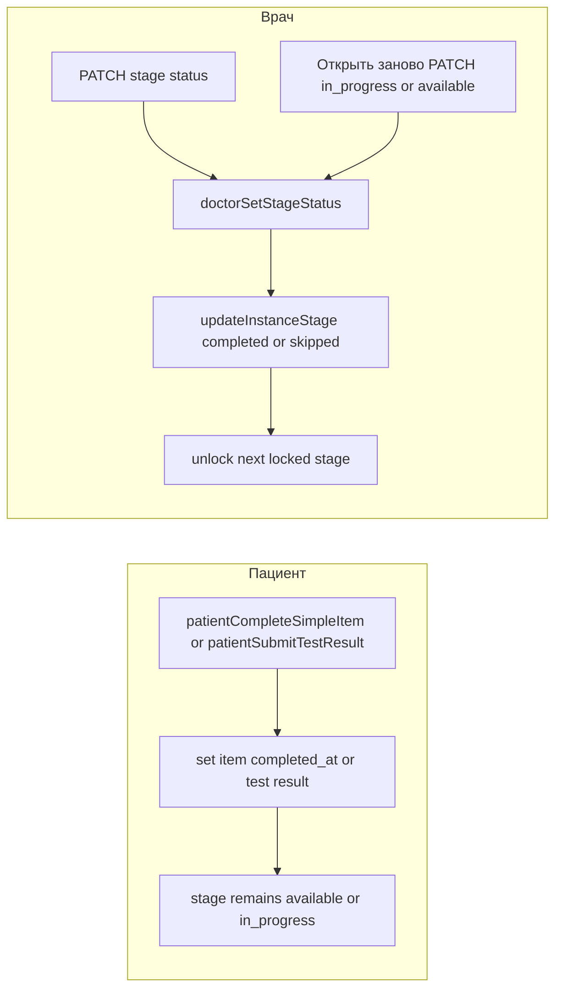

# План: doctor-only завершение этапа (максимально усиленный)

## 1) Цель и продуктовый инвариант

До явного действия врача (`completed`/`skipped` этапа) система **не имеет права** автоматически закрывать этап на основании пациентских отметок или результатов тестов. Пациент может:

- писать `completed_at` по пунктам,
- отправлять результаты тестов,
- переводить этап `available -> in_progress` при первом действии.

Пациент **не может** переводить этап в `completed`.

Врачу нужен **штатный откат** по программе: для этапов в `completed` или `skipped` — действие **«Открыть заново»** (возврат этапа в работу без ops-only обходов).

## 2) Подтвержденная корневая причина

- Автозакрытие живет в [`apps/webapp/src/modules/treatment-program/progress-service.ts`](apps/webapp/src/modules/treatment-program/progress-service.ts): `maybeCompleteStageFromItems`.
- Вызывается из пациентских сценариев:
  - `patientCompleteSimpleItem`,
  - `patientSubmitTestResult` (ветка `allDone`).
- При `completed`/`skipped` [`apps/webapp/src/infra/repos/pgTreatmentProgramInstance.ts`](apps/webapp/src/infra/repos/pgTreatmentProgramInstance.ts) делает unlock следующего этапа (`locked -> available`), что усиливает побочный эффект.
- На пациентской стороне `completed`-этап выбывает из pipeline (`splitPatientProgramStagesForDetailUi` / `selectCurrentWorkingStageForPatientDetail`), из-за чего в ряде сценариев «программа исчезает из Плана».

## 3) Scope boundaries (жестко)

### Разрешено менять

- [`apps/webapp/src/modules/treatment-program/progress-service.ts`](apps/webapp/src/modules/treatment-program/progress-service.ts)
- [`apps/webapp/src/modules/treatment-program/progress-service.test.ts`](apps/webapp/src/modules/treatment-program/progress-service.test.ts)
- связанные тесты в [`apps/webapp/src/modules/treatment-program/`](apps/webapp/src/modules/treatment-program/)
- канонические docs в [`docs/ARCHITECTURE/PATIENT_TREATMENT_PROGRAM_STAGE_SURFACES.md`](docs/ARCHITECTURE/PATIENT_TREATMENT_PROGRAM_STAGE_SURFACES.md) и/или [`docs/ARCHITECTURE/DB_STRUCTURE.md`](docs/ARCHITECTURE/DB_STRUCTURE.md)
- execution log в `docs` (см. шаг 5)
- [`apps/webapp/src/app/app/doctor/clients/[userId]/treatment-programs/[instanceId]/TreatmentProgramInstanceDetailClient.tsx`](apps/webapp/src/app/app/doctor/clients/[userId]/treatment-programs/[instanceId]/TreatmentProgramInstanceDetailClient.tsx) — кнопка **«Открыть заново»** для `completed` / `skipped`
- при выборе политики re-lock следующего этапа в коде — только затронутые участки [`apps/webapp/src/infra/repos/pgTreatmentProgramInstance.ts`](apps/webapp/src/infra/repos/pgTreatmentProgramInstance.ts) и зеркало in-memory порта (без изменения контракта API пациента)

### Явно вне scope

- схемы БД/миграции;
- массовый автоматический backfill по прод-данным;
- изменения CI workflow.

Любое расширение scope — только после согласования.

## 4) Целевая архитектура (после фикса)

## 5) Пошаговый план с локальными чек-листами

### Шаг 0. Preflight и защита от scope creep

- Прочитать и зафиксировать релевантные правила/доки.
- Подтвердить `rg`-поиском, что `maybeCompleteStageFromItems` используется только в ожидаемых местах runtime.
- Проверить, что врачебный путь `doctorSetStageStatus` уже покрывает `completed/skipped`.

Чек-лист верификации:
- `rg "maybeCompleteStageFromItems" apps/webapp/src`
- `rg "doctorSetStageStatus|updateInstanceStage\\(" apps/webapp/src/modules/treatment-program apps/webapp/src/app/api/doctor`
- Зафиксировать результат в execution log.

### Шаг 1. Удалить автозавершение этапа из пациентских путей

- Удалить функцию `maybeCompleteStageFromItems`.
- Удалить оба вызова из:
  - `patientCompleteSimpleItem`,
  - `patientSubmitTestResult` (ветка `allDone`).
- Удалить неиспользуемые импорты в файле.
- Не трогать `doctorSetStageStatus`.

Чек-лист верификации:
- `rg "maybeCompleteStageFromItems" apps/webapp/src` => 0 runtime совпадений.
- `rg "patientTouchStageItemInner" apps/webapp/src/modules/treatment-program/progress-service.ts` => переход `available -> in_progress` сохранен.

### Шаг 2. Переписать тесты под doctor-only completion

- Обновить `progress-service.test.ts`:
  - сценарий «все пункты выполнены»:
    - после пациента этап НЕ `completed`, следующий этап остается `locked`;
    - после `doctorSetStageStatus(completed)` этап `completed`, следующий `available`.
  - сценарии `clinical_test` (numeric/qualitative/multi-test):
    - убрать ожидание автозакрытия этапа пациентом;
    - убрать ожидание `stage_completed` как следствия пациентского действия;
    - при необходимости добавить врачебный завершающий шаг.
  - сценарии A2 с actionable/persistent рекомендациями:
    - оставить доменные ограничения;
    - исключить автозакрытие этапа пациентом.

Чек-лист верификации:
- `pnpm vitest run apps/webapp/src/modules/treatment-program/progress-service.test.ts`
- `rg "stage_completed|status\\)\\.toBe\\(\"completed\"\\)" apps/webapp/src/modules/treatment-program/progress-service.test.ts` и ручная проверка, что новые ожидания корректны.

### Шаг 3. Регрессия по модулю treatment-program

- Поиск неявных ожиданий старой семантики в соседних тестах/модулях.
- Прогон всего тестового поддерева `treatment-program`.

Чек-лист верификации:
- `rg "patientCompleteSimpleItem|patientSubmitTestResult|stage_completed|status.*completed" apps/webapp/src/modules/treatment-program`
- `pnpm vitest run "apps/webapp/src/modules/treatment-program/**/*.test.ts"`
- при необходимости целевой `pnpm --filter webapp lint` / `pnpm --filter webapp typecheck` на затронутой области.

### Шаг 4. Обновить каноническую документацию

- В [`docs/ARCHITECTURE/PATIENT_TREATMENT_PROGRAM_STAGE_SURFACES.md`](docs/ARCHITECTURE/PATIENT_TREATMENT_PROGRAM_STAGE_SURFACES.md) добавить раздел FSM этапа:
  - пациент не закрывает этап;
  - `available -> in_progress` при пациентском действии сохраняется;
  - `completed/skipped` — только врачебное действие.
- В [`docs/ARCHITECTURE/DB_STRUCTURE.md`](docs/ARCHITECTURE/DB_STRUCTURE.md) (2.9, экземпляры программ) кратко закрепить ту же семантику.

Чек-лист верификации:
- `rg "completed.*patient|doctor.*completed|in_progress" docs/ARCHITECTURE/PATIENT_TREATMENT_PROGRAM_STAGE_SURFACES.md docs/ARCHITECTURE/DB_STRUCTURE.md`
- Проверить, что не правятся immutable/archive docs.

### Шаг 5. Execution log (обязательный)

- Создать/обновить профильный лог в docs:
  - предпочтительно [`docs/ARCHITECTURE/LOG_DOCTOR_ONLY_STAGE_COMPLETION.md`](docs/ARCHITECTURE/LOG_DOCTOR_ONLY_STAGE_COMPLETION.md)
  - либо существующий релевантный LOG.md (если есть явный owner этой инициативы).
- Для каждого шага зафиксировать:
  - что сделано,
  - какие проверки выполнены,
  - какие решения приняты,
  - что намеренно не делали.

Чек-лист верификации:
- файл лога существует и содержит timestamped записи;
- ссылки на команды/результаты проверок присутствуют.

### Шаг 6. Repair-runbook для уже затронутых данных

- Зафиксировать в docs/PR runbook:
  - стандартный doctor UI блокирует действия на `completed/skipped` (`stageActionsLocked`);
  - откат ошибочно закрытого этапа выполняется только согласованным ops-способом:
    1) прямой PATCH API врача (под контролем),
    2) SQL-операция с учетом возможного unlock следующего этапа.
- Добавить явные критерии, когда использовать PATCH vs SQL.

Чек-лист верификации:
- runbook содержит preconditions, steps, post-check SQL/API, rollback пункт.
- после шага 7: основной сценарий отката — через UI «Открыть заново»; PATCH/SQL остаются fallback.

### Шаг 7. Врачебный UI: кнопка «Открыть заново» (откат закрытого этапа)

**Контекст:** сейчас `stageActionsLocked` при `completed`/`skipped` отключает «Завершить этап» и «Пропустить этап», но **не оставляет** врачу штатного способа вернуть этап в работу из того же блока действий ([`TreatmentProgramInstanceDetailClient.tsx`](apps/webapp/src/app/app/doctor/clients/[userId]/treatment-programs/[instanceId]/TreatmentProgramInstanceDetailClient.tsx) около `stageActionsLocked` и кнопок этапа).

**Поведение кнопки (зафиксировать в реализации):**

- Видимость: `status === "completed"` **или** `status === "skipped"`, программа не в read-only (`editLocked` / завершённый инстанс — те же правила, что у остальных кнопок этапа).
- Подпись UI: **«Открыть заново»** (без лишних поясняющих абзацев в UI; при необходимости одна строка статуса/тоста после успеха — по паттерну экрана).
- Действие: `PATCH` на существующий маршрут стадии с телом **`{ "status": "<целевой>" }`**. Целевой статус выбрать явно в PR (типовой вариант — **`in_progress`**, чтобы этап снова попал в рабочий pipeline пациента; альтернатива **`available`** — если продукт хочет снова явный «Старт этапа»).
- Для `skipped`: при переходе в не-`skipped` сервер в [`updateInstanceStage`](apps/webapp/src/infra/repos/pgTreatmentProgramInstance.ts) обнуляет `skipReason` (`nextSkip` для не-`skipped` → `null`) — **проверить** на интеграционном/ручном сценарии, что причина пропуска не «залипает».
- **Кнопка не должна** зависеть от `stageActionsLocked` в `disabled` (иначе она никогда не активируется). Использовать те же ограничения, что у «Изменить» / `editLocked` + `saving`, либо отдельный флаг — но не `stageActionsLocked`.

**Политика по следующему этапу (обязательно решить до merge, даже если v1 = «только документация»):**

- При закрытии этапа следующий `locked` уже мог стать `available`. При «Открыть заново» текущий этап возвращается в работу, **но репозиторий сегодня не re-lock’ит** следующий этап автоматически (unlock делался только при `completed`/`skipped`).
- Зафиксировать одно из решений в PR + в `docs/ARCHITECTURE`:
  - **v1-док:** врач при необходимости вручную возвращает следующий этап в `locked` (если появится отдельная кнопка/действие) или оставляет как есть;
  - **v1-код (предпочтительно при низком риске):** при `completed|skipped -> in_progress|available` если «следующий» этап в `available`, **не** `in_progress`, без пациентской активности — перевести обратно в `locked` (критерии «без активности» описать: например нет `started_at` и нет `completed_at` у пунктов следующего этапа — **уточнить по продукту**);
  - любой гибрид — только с явным согласованием, чтобы не сломать честный прогресс пациента.

Чек-лист верификации:

- Ручной smoke: `completed` → «Открыть заново» → этап снова в pipeline на пациенте; при наличии второго этапа — проверить ожидаемое состояние следующего этапа согласно выбранной политике.
- `pnpm vitest run` по добавленным/изменённым тестам врачебского UI (если тестов нет — зафиксировать в execution log «ручной smoke only»).
- Убедиться, что кнопка не дублирует семантику «Открыть этап» для `locked` (разные состояния FSM).

## 6) Риски и меры

- Риск: скрытые тестовые ожидания старой семантики -> закрываем шагом 3 (full module regression).
- Риск: неочевидный процесс восстановления данных -> закрываем шагом 6 (runbook) + шаг 7 (UI).
- Риск: случайно сломать `available -> in_progress` -> отдельный чек в шаге 1 и тесты в шаге 2.
- Риск: «Открыть заново» оставляет следующий этап ошибочно открытым -> закрываем политикой из шага 7 + документацией.
- Риск: врач открыл этап, пациент уже выполнил пункты — дубликаты/повторные отметки -> не лечим автоматически в этом PR; зафиксировать в docs как известное ограничение или отдельный backlog.

## 7) Acceptance matrix

- Пациент отметил все пункты этапа без врача -> этап не `completed`.
- Пациент завершил все тесты этапа -> этап не `completed`.
- Врач нажал «Завершить этап» -> этап `completed`, следующий `locked` этап стал `available`.
- Пациентская вкладка План не теряет активную программу из-за автозакрытия этапа.
- Врач на этапе в `completed` или `skipped` видит **«Открыть заново»**, нажимает — этап переходит в согласованный рабочий статус (`in_progress` или `available`), пациентский pipeline снова содержит этот этап при прочих равных.
- Поведение следующего этапа после отката соответствует выбранной политике из шага 7 (и описано в docs).

## 8) Definition of Done

- Удалена runtime-логика автозавершения этапа пациентом.
- Все обновленные тесты по `progress-service` и модулю `treatment-program` зелёные.
- Канонические docs в `docs/ARCHITECTURE` синхронизированы с новой FSM и сценарием отката этапа.
- Execution log в docs заполнен по шагам.
- Есть согласованный repair-runbook (UI как основной путь, PATCH/SQL как fallback).
- В кабинете врача доступна кнопка **«Открыть заново»** для `completed`/`skipped` с корректными `disabled`-правилами.
- Финальный барьер перед merge: один прогон `pnpm run ci` успешен.
