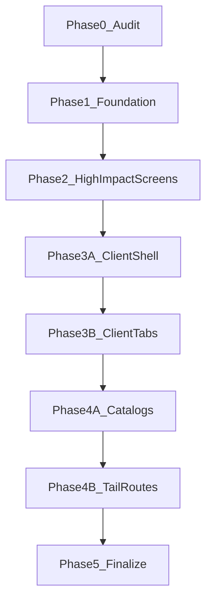

# План: унификация UI кабинета врача по фазам

## Закрытие (2026-06-04)

- **Статус:** выполнен, план в архиве репозитория — [`.cursor/plans/archive/doctor-ui-unification-phases_1146e22e.plan.md`](.cursor/plans/archive/doctor-ui-unification-phases_1146e22e.plan.md). Не использовать как активный Build-tracker.
- **Журнал:** [`docs/archive/2026-06-initiatives/DOCTOR_UI_UNIFICATION_INITIATIVE/`](docs/archive/2026-06-initiatives/DOCTOR_UI_UNIFICATION_INITIATIVE/).
- **Ручная проходка:** частично; code-level DoD закрыт; полная постраничная отработка (§ Manual visual checklist ниже) — вне этого плана, отдельные задачи при глобальной UI-работе.
- **Дальше:** `DOCTOR_APP_UI_STYLE_GUIDE.md` + `.cursor/rules/doctor-ui-shared-primitives.mdc`.

## Ответы на открытые вопросы перед исполнением

1. **Где хранить audit и LOG:** создать папку `docs/archive/2026-06-initiatives/DOCTOR_UI_UNIFICATION_INITIATIVE/` с файлами `README.md`, `LOG.md`, `AUDIT.md`. `AUDIT.md` — рабочая таблица отклонений, `LOG.md` — решения и проверки по фазам.
2. **Что делать со старым density-контекстом:** перед фазой 0 прочитать `docs/APP_RESTRUCTURE_INITIATIVE/done/DOCTOR_UI_DENSITY_PLAN.md` и `docs/APP_RESTRUCTURE_INITIATIVE/done/DOCTOR_UI_DENSITY_EXECUTION_AUDIT.md`; не откатывать прежнее уплотнение, а строить поверх него визуальную согласованность.
3. **Shared-решение:** обязательный минимум — `doctorVisual.ts` с class constants. Тонкие wrapper-компоненты разрешены только если они реально уменьшают повторяемость в фазе 2: `DoctorSection`, `DoctorSectionHeader`, `DoctorEmptyState`, `DoctorMetricList`. Не создавать крупную новую UI-библиотеку.
4. **Фаза 3 не одним проходом:** разделить карточку клиента на shell (3a) и вкладки/панели (3b), иначе слишком большой blast radius.
5. **Хвостовые маршруты:** `calendar`, `messages`, `broadcasts`, `references`, `subscribers`, `courses`, `material-ratings`, `system-health`, `audit-log`, `admin/booking/**` не теряются; они идут в audit и закрываются в фазе 4b либо явно получают `status: cancelled` в `AUDIT.md` с причиной вне scope.
6. **Критерий “красиво”:** помимо `rg`/tests нужен manual visual checklist по desktop и mobile для каждой фазы, с записью в `LOG.md`.
7. **Док-видимость:** в фазе 5 добавить ссылку на `DOCTOR_APP_UI_STYLE_GUIDE.md` в `docs/README.md` рядом с patient guide.

## Scope и границы

- Разрешено менять только фронтенд-слой в `apps/webapp/src/app/app/doctor/**` и `apps/webapp/src/shared/ui/**`.
- Разрешено обновлять архитектурную документацию по теме UI в `docs/ARCHITECTURE/**`, `docs/README.md` и initiative docs в `docs/archive/2026-06-initiatives/DOCTOR_UI_UNIFICATION_INITIATIVE/**`.
- Запрещено менять бизнес-логику сервисов, API-контракты, схемы БД, миграции, интеграционные сценарии, CI workflow.
- Запрещено расширять проект новыми визуальными паттернами вне текущего гайда без явной фиксации в docs.
- Запрещено менять пациентский UI (`apps/webapp/src/app/app/patient/**`, `patientVisual.ts`, `#app-shell-patient`), глобальный shadcn/base UI и общие стили ради doctor-only задачи.
- Запрещено менять route structure, auth/role checks, data loading, query semantics, form actions, API endpoints.
- Не добавлять новые зависимости.

## Общая стратегия

- Каждая фаза должна завершаться локальными проверками и записью в `LOG.md`.
- Не запускать полный `pnpm run ci` после каждой фазы; полный CI — один раз в фазе 5 или перед push.
- Если в фазе обнаружен новый класс проблем, не исправлять весь репозиторий сразу: добавить строку в `AUDIT.md`, назначить фазу или `cancelled` с причиной.

## Фаза 0 — Baseline и карта отклонений

Цель: зафиксировать, где текущие экраны расходятся с гайдом, чтобы делать изменения не вслепую.

- Создать `docs/archive/2026-06-initiatives/DOCTOR_UI_UNIFICATION_INITIATIVE/README.md`, `LOG.md`, `AUDIT.md`.
- Прочитать и сослаться в `AUDIT.md` на:
  - `docs/ARCHITECTURE/DOCTOR_APP_UI_STYLE_GUIDE.md`
  - `docs/APP_RESTRUCTURE_INITIATIVE/done/DOCTOR_UI_DENSITY_PLAN.md`
  - `docs/APP_RESTRUCTURE_INITIATIVE/done/DOCTOR_UI_DENSITY_EXECUTION_AUDIT.md`
- Составить список всех экранов `page.tsx` и всех `Doctor*Client.tsx`/`*Panel.tsx` в `doctor`-сегменте и сгруппировать по типам: dashboard, list, entity-card, catalog split, CMS, analytics, admin/ops, booking-admin.
- Для каждого типа зафиксировать текущее использование: `rounded-*`, `p-*`, `shadow-*`, заголовки `h2/h3`, паттерн пустого состояния, кнопки primary/secondary, Dialog/inline-detail.
- Заполнить audit-таблицу:

| Route / component | Type | Current issue | Target pattern | Severity | Phase | Status | Notes |
|---|---|---|---|---|---|---|---|
| `/app/doctor/appointments` | page-section list | `rounded-2xl`, bare `h2` | `doctorSectionCardClass`, styled heading | high | 2 | pending | example |

- Severity:
  - `high`: голые заголовки, page-level `rounded-2xl`, page-level `shadow-sm`, ломанная плотность KPI/list, inconsistent primary action.
  - `medium`: локальный duplicate chrome вместо shared constants, разные empty states, ad-hoc dialog width.
  - `low`: косметическое отличие без пользовательского шума.
- Для хвостовых маршрутов в audit обязательно указать `Phase 4b` или `cancelled` с причиной вне scope.

Проверки фазы:

- `rg "rounded-2xl|rounded-lg border border-border bg-card p-4|<h2|<h3|shadow-sm|DialogContent|useState\\(" apps/webapp/src/app/app/doctor`
- `rg "DoctorCatalogFiltersToolbar|DoctorCatalogMasterListRow|CatalogSplitLayout|doctorClientOverviewPrimaryCardClass" apps/webapp/src/app/app/doctor apps/webapp/src/shared/ui`
- Проверить, что `AUDIT.md` содержит не меньше следующих групп: high-impact pages, client card, catalogs, CMS/media, tail routes, admin/booking.

## Фаза 1 — Foundation: shared primitives и токены

Цель: сделать единый источник визуальных классов, чтобы последующие фазы были механически применимы.

- Создать `doctorVisual.ts` по структуре гайда и вынести туда page-level классы:
  - `doctorSectionCardClass`, `doctorSectionItemClass`, `doctorHistoryRowClass`, `doctorSectionTitleClass`, `doctorEmptyStateClass`, сетки KPI/media.
- Не дублировать `doctorClientCardChrome.ts`; сохранить его как отдельный слой для entity-card.
- Подготовить минимальные helper-экспорты для повторного использования в экранах типа dashboard/list/analytics.
- Принять и зафиксировать в `LOG.md` решение по wrapper-компонентам:
  - если в фазе 2 нужно применить один и тот же section shell в 3+ местах, создать `DoctorSection` и `DoctorSectionHeader`;
  - если повторяются empty states в 3+ местах, создать `DoctorEmptyState`;
  - если repeated summary metrics встречаются в 2+ high-impact экранах, создать `DoctorMetricList`;
  - иначе ограничиться class constants.
- Проверить совместимость с уже существующими shared компонентами:
  - `DoctorCatalogFiltersToolbar`, `DoctorCatalogMasterListRow`, `DoctorStatCard`, `DoctorCatalogPageLayout`.

Ключевые файлы:

- [apps/webapp/src/shared/ui/doctorWorkspaceLayout.ts](apps/webapp/src/shared/ui/doctorWorkspaceLayout.ts)
- [apps/webapp/src/app/app/doctor/clients/doctorClientCardChrome.ts](apps/webapp/src/app/app/doctor/clients/doctorClientCardChrome.ts)
- [apps/webapp/src/shared/ui/doctor/DoctorCatalogFiltersToolbar.tsx](apps/webapp/src/shared/ui/doctor/DoctorCatalogFiltersToolbar.tsx)
- [apps/webapp/src/app/app/doctor/analytics/clients/DoctorStatCard.tsx](apps/webapp/src/app/app/doctor/analytics/clients/DoctorStatCard.tsx)

Проверки фазы:

- `rg "doctorSectionCardClass|doctorEmptyStateClass|doctorStatCardGridClass" apps/webapp/src`
- `pnpm --dir apps/webapp exec tsc --noEmit` или существующий webapp typecheck-скрипт из `package.json`.
- ReadLints по новым/изменённым shared файлам.

## Фаза 2 — High-impact экраны (первый пользовательский эффект)

Цель: выровнять самые заметные зоны хаоса, чтобы кабинет сразу стал визуально цельным.

- Привести к канону page-level секций (`rounded-xl border border-border bg-card p-3 flex flex-col gap-3`):
  - `/app/doctor` (Today dashboard)
  - `/app/doctor/appointments`
  - `/app/doctor/analytics/clients`
  - `/app/doctor/online-intake`
- Убрать анти-паттерны:
  - `rounded-2xl` в секциях,
  - лишний `shadow-sm` в page-level контейнерах,
  - голые `h2`/`h3` без классов.
- Выровнять пустые состояния и link CTA по одному паттерну.
- Нормализовать плотность: KPI-сетка отдельно от компактных списков, добавить Summary Row там, где сейчас резкий скачок масштаба.
- Не менять copy, данные, условия рендера и ссылки; только классы/обёртки/мелкую структуру, если она нужна для shared-компонента.

Ключевые файлы:

- [apps/webapp/src/app/app/doctor/DoctorTodayDashboard.tsx](apps/webapp/src/app/app/doctor/DoctorTodayDashboard.tsx)
- [apps/webapp/src/app/app/doctor/appointments/page.tsx](apps/webapp/src/app/app/doctor/appointments/page.tsx)
- [apps/webapp/src/app/app/doctor/analytics/clients/page.tsx](apps/webapp/src/app/app/doctor/analytics/clients/page.tsx)
- [apps/webapp/src/app/app/doctor/online-intake/DoctorOnlineIntakeClient.tsx](apps/webapp/src/app/app/doctor/online-intake/DoctorOnlineIntakeClient.tsx)

Проверки фазы:

- `rg` отсутствие `rounded-2xl` в этих экранах.
- `rg` отсутствие голых `<h2>`/`<h3>` в этих файлах.
- Тесты:
  - `DoctorTodayDashboard.test.tsx`
  - `DoctorOnlineIntakeClient.test.tsx`
  - при изменениях route/page без тестов — targeted lint/typecheck.
- Manual visual checklist (записать в `LOG.md`):
  - desktop 1366px: KPI не спорят по масштабу со списками;
  - mobile 390px: карточки не стали тесными, CTA доступны;
  - заголовки секций выглядят одинаково;
  - empty states и inline links одного типа;
  - page-level карточки без лишней тени.

## Фаза 3A — Карточка клиента: shell

Цель: закрепить внешний каркас карточки клиента как эталон entity-паттерна без глубокого прохода по всем табам.

- Синхронизировать `ClientProfileCard`, `PatientCareBar`, `PatientActionStrip`, вкладки и back-link с гайдом.
- Не менять состав табов, anchors, deep-link behavior и `useDoctorClientAnchorTab`.
- Проверить счётчики, статус-пилюли, action chips, sticky header, overflow tabs.
- Проверить mobile/desktop адаптации (`md:hidden`/`md:block`, overflow вкладок) на соответствие гайду.

Ключевые файлы:

- [apps/webapp/src/app/app/doctor/clients/ClientProfileCard.tsx](apps/webapp/src/app/app/doctor/clients/ClientProfileCard.tsx)
- [apps/webapp/src/app/app/doctor/clients/PatientCareBar.tsx](apps/webapp/src/app/app/doctor/clients/PatientCareBar.tsx)
- [apps/webapp/src/app/app/doctor/clients/PatientActionStrip.tsx](apps/webapp/src/app/app/doctor/clients/PatientActionStrip.tsx)
- [apps/webapp/src/app/app/doctor/clients/doctorClientCardChrome.ts](apps/webapp/src/app/app/doctor/clients/doctorClientCardChrome.ts)

Проверки фазы:

- `ClientProfileCard.anchorTab.test.tsx`
- `ClientProfileCard.backLink.test.tsx`
- manual: desktop и mobile, вкладки прокручиваются, sticky header не перекрывает контент.

## Фаза 3B — Карточка клиента: вкладки и панели

Цель: унифицировать внутренние панели клиента без переписывания логики программ, коммуникаций и истории.

- Свести overview/tab секции к двум уровням карточек из `doctorClientCardChrome.ts`.
- Убрать ad-hoc классы в дочерних компонентах overview, если они дублируют shared chrome.
- Проверить и при необходимости унифицировать:
  - overview care plan / recent changes / wellbeing / proactive signals;
  - tasks (`PatientSpecialistTasksSection`, `SpecialistTaskRow`);
  - program tab panels (`DoctorClientProgramTab`, `DoctorClientActiveProgramPanel`);
  - communications and records tabs только в части shell/classes, без смены API calls.
- `SubscriberProfileCard` и subscriber-specific panels включить в audit; исправлять в этой фазе только если используют тот же entity-card chrome и правка не тащит отдельный UX-рефактор.

Ключевые файлы:

- [apps/webapp/src/app/app/doctor/clients/DoctorClientOverviewTab.tsx](apps/webapp/src/app/app/doctor/clients/DoctorClientOverviewTab.tsx)
- [apps/webapp/src/app/app/doctor/clients/DoctorClientOverviewCarePlan.tsx](apps/webapp/src/app/app/doctor/clients/DoctorClientOverviewCarePlan.tsx)
- [apps/webapp/src/app/app/doctor/clients/DoctorClientOverviewRecentProgramChanges.tsx](apps/webapp/src/app/app/doctor/clients/DoctorClientOverviewRecentProgramChanges.tsx)
- [apps/webapp/src/app/app/doctor/clients/DoctorClientOverviewWellbeing.tsx](apps/webapp/src/app/app/doctor/clients/DoctorClientOverviewWellbeing.tsx)
- [apps/webapp/src/app/app/doctor/clients/PatientSpecialistTasksSection.tsx](apps/webapp/src/app/app/doctor/clients/PatientSpecialistTasksSection.tsx)
- [apps/webapp/src/app/app/doctor/clients/SpecialistTaskRow.tsx](apps/webapp/src/app/app/doctor/clients/SpecialistTaskRow.tsx)
- [apps/webapp/src/app/app/doctor/clients/DoctorClientProgramTab.tsx](apps/webapp/src/app/app/doctor/clients/DoctorClientProgramTab.tsx)
- [apps/webapp/src/app/app/doctor/clients/DoctorClientRecordsTab.tsx](apps/webapp/src/app/app/doctor/clients/DoctorClientRecordsTab.tsx)

Проверки фазы:

- `rg "rounded-xl border border-border bg-card p-4 shadow-sm|rounded-lg border border-border/80 bg-muted/15" apps/webapp/src/app/app/doctor/clients`
- Точечные tests из `clients/**/*.test.tsx`, выбирать только затронутые.
- manual: обзор клиента не стал тяжелее/крупнее density-уровня, tabs читаемы на mobile.

## Фаза 4A — Каталоги

Цель: довести до единого split-layout и toolbar/action pattern все doctor-каталоги.

- Проверить parity catalog pattern для:
  - exercises, recommendations, lfk-templates, treatment-program-templates, test-sets, clinical-tests.
- Нормализовать primary action в toolbar на `doctorCatalogToolbarPrimaryActionClassName` / `Button size="sm"`.
- Убедиться, что list/tile active states, empty states, sticky toolbar и mobile back одинаковы.
- Не менять формовые поля, validation, save/archive/publish semantics.

Ключевые файлы:

- [apps/webapp/src/app/app/doctor/exercises/ExercisesPageClient.tsx](apps/webapp/src/app/app/doctor/exercises/ExercisesPageClient.tsx)
- [apps/webapp/src/app/app/doctor/recommendations/RecommendationsPageClient.tsx](apps/webapp/src/app/app/doctor/recommendations/RecommendationsPageClient.tsx)
- [apps/webapp/src/app/app/doctor/lfk-templates/LfkTemplatesPageClient.tsx](apps/webapp/src/app/app/doctor/lfk-templates/LfkTemplatesPageClient.tsx)
- [apps/webapp/src/app/app/doctor/treatment-program-templates/TreatmentProgramTemplatesPageClient.tsx](apps/webapp/src/app/app/doctor/treatment-program-templates/TreatmentProgramTemplatesPageClient.tsx)
- [apps/webapp/src/app/app/doctor/test-sets/TestSetsPageClient.tsx](apps/webapp/src/app/app/doctor/test-sets/TestSetsPageClient.tsx)
- [apps/webapp/src/app/app/doctor/clinical-tests/ClinicalTestsPageClient.tsx](apps/webapp/src/app/app/doctor/clinical-tests/ClinicalTestsPageClient.tsx)

Проверки фазы:

- `rg "DoctorCatalogFiltersToolbar|doctorCatalogToolbarPrimaryActionClassName|CatalogSplitLayout|DoctorCatalogMasterListRow" apps/webapp/src/app/app/doctor/{exercises,recommendations,lfk-templates,treatment-program-templates,test-sets,clinical-tests}`
- Затронутые form/component tests: `ExerciseForm`, `RecommendationForm`, `TemplateEditor`, `TestSetForm`, `ClinicalTestForm`.
- manual: desktop split, mobile detail/back, toolbar wrapping.

## Фаза 4B — CMS, media и хвостовые маршруты

Цель: довести до единообразия зоны, которые пользователь видит после базовых экранов.

- В CMS/library и content-страницах зафиксировать допустимое использование `shadow-sm` только в media-grid карточках.
- Привести модальные паттерны к единому `Dialog`-формату (header/body/footer + width правила из гайда).
- Пройти хвостовые маршруты из `AUDIT.md`:
  - `calendar`, `messages`, `broadcasts`, `references`, `subscribers`, `courses`, `material-ratings`, `patient-home`, `system-health`, `audit-log`, `booking-merge`, `admin/booking/**`.
- Для каждого хвостового маршрута выполнить одно из:
  - привести к гайду в этой фазе;
  - оставить `cancelled` в `AUDIT.md` с причиной: отдельная инициатива, высокий риск, нет пользовательского шума, booking rework owns this surface.
- Для `admin/booking/**` свериться с `docs/BOOKING_REWORK_INITIATIVE/ROADMAP.md`; не конфликтовать с активной booking rework.

Ключевые файлы (репрезентативно):

- [apps/webapp/src/app/app/doctor/content/page.tsx](apps/webapp/src/app/app/doctor/content/page.tsx)
- [apps/webapp/src/app/app/doctor/content/library/MediaCard.tsx](apps/webapp/src/app/app/doctor/content/library/MediaCard.tsx)
- [apps/webapp/src/app/app/doctor/content/MediaLibraryPickerDialog.tsx](apps/webapp/src/app/app/doctor/content/MediaLibraryPickerDialog.tsx)
- [apps/webapp/src/app/app/doctor/calendar/DoctorBookingCalendarClient.tsx](apps/webapp/src/app/app/doctor/calendar/DoctorBookingCalendarClient.tsx)
- [apps/webapp/src/app/app/doctor/messages/DoctorSupportInbox.tsx](apps/webapp/src/app/app/doctor/messages/DoctorSupportInbox.tsx)
- [apps/webapp/src/app/app/doctor/broadcasts/BroadcastForm.tsx](apps/webapp/src/app/app/doctor/broadcasts/BroadcastForm.tsx)
- [apps/webapp/src/app/app/doctor/references/measure-kinds/MeasureKindsTableClient.tsx](apps/webapp/src/app/app/doctor/references/measure-kinds/MeasureKindsTableClient.tsx)

Проверки фазы:

- `rg` на отклонения по toolbar primary action и ad-hoc dialog layout.
- Точечные тесты каталогов и CMS-компонентов.
- Затронутые tests: `Broadcast*.test.tsx`, `MediaLibraryPickerDialog.test.tsx`, `ContentPagesSidebar.test.tsx`, `DoctorSupportInbox.test.tsx`, references tests.
- manual: все хвостовые маршруты из `AUDIT.md` имеют финальный status.

## Фаза 5 — Финализация, QA и документация

Цель: зафиксировать и стабилизировать новую визуальную систему.

- Обновить [docs/ARCHITECTURE/DOCTOR_APP_UI_STYLE_GUIDE.md](docs/ARCHITECTURE/DOCTOR_APP_UI_STYLE_GUIDE.md) по фактической реализации (если были уточнения).
- Добавить ссылку на [docs/ARCHITECTURE/DOCTOR_APP_UI_STYLE_GUIDE.md](docs/ARCHITECTURE/DOCTOR_APP_UI_STYLE_GUIDE.md) в [docs/README.md](docs/README.md) рядом с patient UI guide.
- Обновить `LOG.md` профильной инициативы с перечнем решений, принятых исключений и manual visual checklist.
- Проверить, что все строки `AUDIT.md` имеют `completed` или `cancelled`.
- Прогнать целевые проверки по затронутым зонам: lint/typecheck + relevant tests.
- Один финальный полный `pnpm run ci` перед merge/push (не после каждой фазы).

Проверки фазы:

- Нет новых lint/type errors в затронутых файлах.
- Нет новых визуальных регрессий на целевых doctor-экранах.
- `pnpm run ci` успешно перед push/merge.
- `rg "DOCTOR_APP_UI_STYLE_GUIDE" docs/README.md docs/ARCHITECTURE docs/archive/2026-06-initiatives/DOCTOR_UI_UNIFICATION_INITIATIVE`

## Manual visual checklist

Заполнять в `LOG.md` после фаз 2, 3A/3B и 4B.

| Screen | Desktop 1366 | Mobile 390 | Density | Headers | Cards | Actions | Notes |
|---|---|---|---|---|---|---|---|
| `/app/doctor` | pass/fail | pass/fail | pass/fail | pass/fail | pass/fail | pass/fail | |

Критерии:

- **Desktop 1366:** секции не выглядят как разные дизайн-системы; KPI, списки и CTA имеют понятную иерархию.
- **Mobile 390:** нет сломанного wrapping, CTA не становятся слишком мелкими, sticky/toolbar не перекрывает контент.
- **Density:** не откатили старый `DOCTOR_UI_DENSITY_PLAN`; интерфейс плотный, но читаемый.
- **Headers:** нет голых `h2/h3`, уровни заголовков совпадают с гайдом.
- **Cards:** page-level секции без лишнего `shadow-sm`, card-internal панели с нужным chrome.
- **Actions:** primary/secondary/ghost используются по гайду, нет ghost как primary action.

## Definition of Done

- Есть единый shared слой (`doctorVisual.ts`) и он реально используется на page-level экранах.
- Для high-impact экранов устранены ключевые расхождения: `rounded-2xl`, голые `h2/h3`, несогласованные page-level `shadow-sm`, хаотичные пустые состояния.
- Клиентская карточка приведена к единому chrome-паттерну (`doctorClientCardChrome.ts`) без ad-hoc дублей.
- Каталоги, CMS и хвостовые doctor-маршруты имеют `completed` или `cancelled` статус в `AUDIT.md`.
- Каталоги и CMS используют согласованный toolbar/action/dialog pattern.
- Гайд синхронизирован с кодом, а не расходится с ним.
- `docs/README.md` ссылается на doctor UI guide.
- `LOG.md` содержит решения, исключения и visual checklist.
- Целевые проверки зелёные; финальный `ci` успешен.