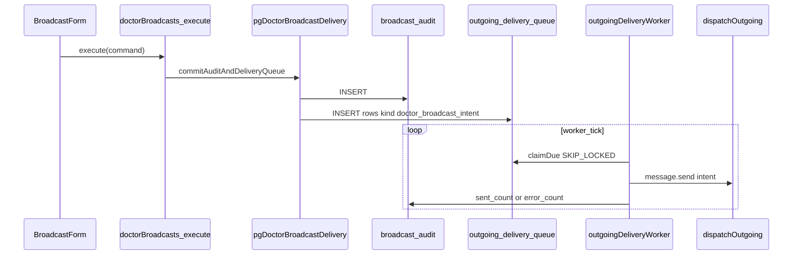

# План: доставка врачебных рассылок (`doctor_broadcast_delivery`)

Исходный файл `~/.cursor/plans/doctor_broadcast_delivery_336bbbc0.plan.md` **отсутствует на диске**; каноническая копия ведётся здесь: [`.cursor/plans/archive/doctor_broadcast_delivery_336bbbc0.plan.md`](doctor_broadcast_delivery_336bbbc0.plan.md). Продуктовая и техническая правда по уже сделанному — в [docs/ARCHITECTURE/DOCTOR_BROADCASTS.md](../../docs/ARCHITECTURE/DOCTOR_BROADCASTS.md).

## Цель и результат

Сделать кнопку «Отправить» на `/app/doctor/broadcasts` **реальной доставкой**: не только запись намерения, а постановка заданий в **`public.outgoing_delivery_queue`** и обработка **существующим** циклом integrator **`runOutgoingDeliveryWorkerTick`** (ретраи, backoff, `SKIP LOCKED`), без N× HTTP **`relay-outbound`** из server action.

**Состояние на момент синхронизации плана с репозиторием:** основной контур **реализован** (см. grep по `doctor_broadcast_intent`, `pgDoctorBroadcastDelivery`, `DOCTOR_BROADCAST_INTENT_QUEUE_KIND`).

## Архитектура (факт)

## Реализованные артефакты (ориентиры по коду)

| Слой | Файлы |
|------|--------|
| Webapp сервис | [`apps/webapp/src/modules/doctor-broadcasts/service.ts`](../../apps/webapp/src/modules/doctor-broadcasts/service.ts), [`deliveryJobs.ts`](../../apps/webapp/src/modules/doctor-broadcasts/deliveryJobs.ts), [`deliveryQueueKind.ts`](../../apps/webapp/src/modules/doctor-broadcasts/deliveryQueueKind.ts) |
| Транзакция аудит + очередь | [`apps/webapp/src/infra/repos/pgDoctorBroadcastDelivery.ts`](../../apps/webapp/src/infra/repos/pgDoctorBroadcastDelivery.ts) |
| Схема аудита | [`apps/webapp/db/schema/schema.ts`](../../apps/webapp/db/schema/schema.ts) (`message_body`, `delivery_jobs_total`, …) |
| Integrator | [`apps/integrator/src/infra/delivery/deliveryContract.ts`](../../apps/integrator/src/infra/delivery/deliveryContract.ts), [`outgoingDeliveryWorker.ts`](../../apps/integrator/src/infra/runtime/worker/outgoingDeliveryWorker.ts) |
| Health | [`pgOperatorHealthRead.ts`](../../apps/webapp/src/infra/repos/pgOperatorHealthRead.ts) (`dueByKind` / `deadByKind`), [`SystemHealthSection.tsx`](../../apps/webapp/src/app/app/settings/SystemHealthSection.tsx) (`doctor_broadcast_intent` → «Рассылки от специалистов») |
| Документация | [`docs/ARCHITECTURE/DOCTOR_BROADCASTS.md`](../../docs/ARCHITECTURE/DOCTOR_BROADCASTS.md) |

Постаудит и замечания по тестам/сырому SQL: [`docs/INTEGRATOR_DRIZZLE_MIGRATION/LOG.md`](../../docs/INTEGRATOR_DRIZZLE_MIGRATION/LOG.md), [`RAW_SQL_INVENTORY.md`](../../docs/INTEGRATOR_DRIZZLE_MIGRATION/RAW_SQL_INVENTORY.md).

## Инварианты (не ломать при доработках)

1. **dev_mode:** список заданий в очереди = тот же **`effectiveClients`**, что в превью; SMS в dev не ставить в очередь (см. DOCTOR_BROADCASTS.md).
2. **Транзакция:** при любой ошибке вставки строки очереди — **полный откат** (включая `broadcast_audit`), один `ROLLBACK` в `catch` без дубля.
3. **Глобальные TG/MAX setup из webhook** ([`setupMenuButton.ts`](../../apps/integrator/src/integrations/telegram/setupMenuButton.ts), [`setupCommands.ts`](../../apps/integrator/src/integrations/max/setupCommands.ts)) — **не** вызывать из воркера рассылок; для будущей галочки «меню» — только per-user payload / per-chat Bot API (см. хвост ниже).

## Хвост продукта: «Прикрепить / обновить меню»

**Статус:** в коде **нет** (`attach_menu`, `attachMenu`, UI-галочки не найдены) — отдельная мини-фаза.

| Шаг | Действие |
|-----|----------|
| Данные | Колонка `broadcast_audit.attach_menu_after_send boolean NOT NULL DEFAULT false`; в `payload_json` очереди флаг `attachMenu` (копия на момент отправки). |
| Webapp | `BroadcastCommand` + форма: [`LabeledSwitch`](../../apps/webapp/src/components/common/form/LabeledSwitch.tsx), по умолчанию **выкл.**; короткая подпись без простыни ([`.cursor/rules/ui-copy-no-excess-labels.mdc`](../../.cursor/rules/ui-copy-no-excess-labels.mdc)). |
| Integrator | Перед `dispatchOutgoing`: если `attachMenu`, обогатить `message.send` тем же путём, что [`delivery.ts`](../../apps/integrator/src/kernel/domain/executor/handlers/delivery.ts) + [`buildMainReplyKeyboardMarkup`](../../apps/integrator/src/kernel/domain/executor/helpers.ts) / [`buildMaxMainInlineKeyboardMarkup`](../../apps/integrator/src/kernel/domain/executor/helpers.ts); минимальный `DomainContext` из `clientUserId` + `linkedPhone`; slash в Telegram — **только per-chat**, не трогать `all_private_chats`. |
| UI журнал | В деталях рассылки одна фраза «Меню в чате обновлялось», если флаг был включён. |
| Тесты | Unit воркера (mock dispatch + payload с/без attachMenu); при необходимости снимок сервиса. |

Закрыть todo **`broadcast-attach-menu`** в frontmatter после merge хвоста.

## Definition of Done (основной контур — выполнено)

- [x] Подтверждение рассылки создаёт `broadcast_audit` с телом и `delivery_jobs_total`, строки в `outgoing_delivery_queue` с `kind = doctor_broadcast_intent`.
- [x] Воркер integrator доставляет через `dispatchOutgoing`, обновляет `sent_count` / `error_count`.
- [x] Документация и контракты обновлены; health показывает разбивку по `kind` с понятными подписями.
- [ ] Опция «Прикрепить / обновить меню» — см. хвост выше.

## Проверки при закрытии хвоста меню

- [ ] `pnpm --filter webapp test` — затронутые unit; integrator worker tests.
- [ ] `pnpm --filter integrator test` (или сузить до файла воркера) по политике репозитория.
- [ ] Обновить [`DOCTOR_BROADCASTS.md`](../../docs/ARCHITECTURE/DOCTOR_BROADCASTS.md) §наблюдаемость / каналы, если поведение меню отличается от текста.

## Вне scope

- Polling прогресса в реальном времени на странице рассылок.
- Маркетинговые opt-out; VK.
- Изменение GitHub Actions workflow без решения команды.

## Заметка по дрейфу доков

В [`docs/ARCHITECTURE/SPECIALIST_CABINET_STRUCTURE.md`](../../docs/ARCHITECTURE/SPECIALIST_CABINET_STRUCTURE.md) в таблице по-прежнему может фигурировать устаревшая формулировка «массовая доставка не в этом модуле» — привести в соответствие с `DOCTOR_BROADCASTS.md` **отдельным** мелким PR, не смешивая с логикой меню.
