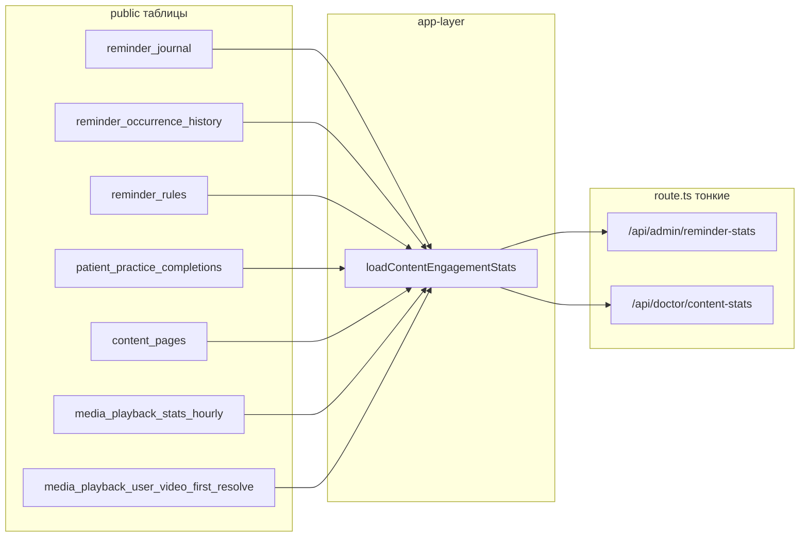

# Статистика материалов для врача (reuse метрик)

## 1. Цели и non-goals

**Цели**

- Сместить восприятие с «оценки звёздами» на **сводную статистику по контенту и вовлечённости**: оценки остаются, но страница читается как **дашборд**.
- **Один источник правды по SQL:** админская вкладка «Статистика» и врачебная страница используют **одну и ту же** функцию загрузки агрегатов — без копипаста запросов.
- Врач получает данные **без admin mode** и **без дублирования** логики из [`requireAdminModeSession`](apps/webapp/src/modules/auth/requireAdminMode.ts).

**Non-goals (явно не делать в этом PR)**

- Новые таблицы, миграции, env, ключи `system_settings`, изменения GitHub CI workflow.
- Per-user списки пациентов в этом блоке (только уже существующие агрегаты; `raters` на деталке оценок — отдельный существующий контракт, не трогать).
- Watch-time / heatmap по **конкретному материалу** по часам суток — в БД нет rollup; отдельная инициатива (метрики/бакеты).
- Смена URL `/app/doctor/material-ratings` и путей `/api/doctor/material-ratings/*` (закладки, smoke [`smoke-app-router-rsc-pages-inprocess.test.ts`](apps/webapp/e2e/smoke-app-router-rsc-pages-inprocess.test.ts)).

## 2. Границы scope (код)

**Разрешено**

- [`apps/webapp/src/app-layer/stats/`](apps/webapp/src/app-layer/stats/) — рефакторинг loader, типы.
- [`apps/webapp/src/app/api/admin/reminder-stats/`](apps/webapp/src/app/api/admin/reminder-stats/) — тонкая правка вызова.
- [`apps/webapp/src/app/api/doctor/content-stats/`](apps/webapp/src/app/api/doctor/) — новый route + test.
- [`apps/webapp/src/app/app/doctor/material-ratings/`](apps/webapp/src/app/app/doctor/material-ratings/) — страницы + новый `*Client*.tsx` для графиков.
- [`apps/webapp/src/shared/ui/doctorNavLinks.ts`](apps/webapp/src/shared/ui/doctorNavLinks.ts).
- [`docs/ARCHITECTURE/MATERIAL_RATINGS.md`](docs/ARCHITECTURE/MATERIAL_RATINGS.md), [`apps/webapp/src/app/api/api.md`](apps/webapp/src/app/api/api.md).

**Вне scope**

- Пациентский UI, integrator, media-worker.
- Рефакторинг [`pgMaterialRating.ts`](apps/webapp/src/infra/repos/pgMaterialRating.ts) / перенос raw SQL в Drizzle (отдельная задача из RAW_SQL_INVENTORY).

## 3. Семантика метрик (честные подписи в UI)

| Блок | Источник | Что показываем врачу | Подпись в UI (обязательно) |
|------|----------|----------------------|----------------------------|
| Оценки 1–5 | `material_ratings` | Как сейчас, по материалу | Локально по материалу |
| Отправки напоминаний | `reminder_occurrence_history` | `sent` / `failed` по дням и часам | **Ось времени UTC** (как сейчас в loader: `date_trunc` от `occurred_at`) |
| Реакции | `reminder_journal` | `done` / `skipped` / `snoozed` за окно | За выбранное окно, вся платформа |
| Завершения практики | `patient_practice_completions` + join `content_pages` | Топ страниц | Не «открытия», а **завершения/фиксации практики** |
| Видео | `media_playback_stats_hourly` + `media_playback_user_video_first_resolve` | Суммы как в [`loadAdminPlaybackHealthMetrics`](apps/webapp/src/app-layer/media/adminPlaybackHealthMetrics.ts) | **Глобально по приложению**; при `video_playback_api_enabled === false` числа могут быть нулевыми — не выдавать за «отсутствие интереса» (см. [`SystemHealthSection`](apps/webapp/src/app/app/settings/SystemHealthSection.tsx) copy) |
| Ошибки плеера | `loadAdminPlaybackClientHealthMetrics` | Поле уже в payload | Опционально компактная строка «ошибки клиента за окно» с тем же предупреждением про выключенный API |

**Продуктовое решение (зафиксировать в docs):** врач видит **те же платформенные** агрегаты, что оператор в админке по вкладке «Статистика» — не фильтр «только мои пациенты». Если позже понадобится сужение — отдельный порт с фильтром по `doctor_id`.

## 4. Архитектура

## 5. Шаги с локальными чеклистами

### 5.1 Loader (`loadContentEngagementStats`)

- [x] Переименовать основной экспорт; оставить **`export type AdminReminderStatsResponse = ContentEngagementStatsResponse`** (или `export { loadAdminReminderStats as loadContentEngagementStats }` + алиас функции обратно — выбрать один вариант, чтобы не сломать внешние импорты grep’ом).
- [x] Расширить тип ответа полем **`reminderRulesEnabledCount: number`**: `count(*)` из `reminder_rules` где `is_enabled = true`. Документировать в JSDoc: *«число включённых правил в webapp-таблице»* (без дедупа по пациенту на этом шаге).
- [x] `Promise.all` не распухать вторыми тяжёлыми проходами по тем же таблицам; один count-запрос.
- [x] Проверка: `rg loadAdminReminderStats` в `apps/webapp` — все импорты обновлены или алиас покрывает.

### 5.2 Admin route

- [x] [`route.ts`](apps/webapp/src/app/api/admin/reminder-stats/route.ts): только вызов нового имени loader.
- [x] Обновить [`route.test.ts`](apps/webapp/src/app/api/admin/reminder-stats/route.test.ts) мок имя функции, если меняется импорт.

### 5.3 Doctor `GET /api/doctor/content-stats`

- [x] `getCurrentSession()` + [`canAccessDoctor`](apps/webapp/src/modules/roles/service.ts) (JSON 401/403, без redirect); роли `doctor` и `admin`.
- [x] Тот же `parseReminderStatsWindowHours`, те же границы 1…720 ч.
- [x] **Не** вызывать `requireAdminModeSession`.
- [x] Тест: 401 без сессии, 403 клиент; 200 врач + `windowHours`; админ без admin mode — 200; тело с `reminderRulesEnabledCount`.

### 5.4 UI врача

- [x] Новый client-компонент в [`material-ratings/`](apps/webapp/src/app/app/doctor/material-ratings/) (например `MaterialContentStatsClient.tsx`): **прогрев recharts** — импорт на верхнем уровне модуля допустим для одного компонента; если появятся lazy-вкладки — вынести в `dynamic` с осторожностью (см. [`webapp-tests-lean-no-bloat`](.cursor/rules/webapp-tests-lean-no-bloat.mdc)).
- [x] Селект окна: использовать [`SelectTrigger` + `displayLabel`](apps/webapp/src/components/ui/select.tsx) для пресетов «7 дн.» / «30 дн.».
- [x] Графики минимум: **daily** stacked bar (`sent`/`failed` из `occurrenceHistoryDaily` — учесть что [`mergeOccurrenceHourly`](apps/webapp/src/app-layer/stats/loadAdminReminderStats.ts) возвращает `{sent, failed}` без статусов failed внутри sent); **hourly** line/bar по `occurrenceHistoryHourly`; **journal** три числа; **practiceTopPages** горизонтальный bar (ограничить длину подписи slug/title).
- [x] [`page.tsx`](apps/webapp/src/app/app/doctor/material-ratings/page.tsx): title «Статистика материалов»; блок графиков **после** краткого пояснения или перед таблицами — выбрать единый порядок: рекомендуется **сначала дашборд статистики**, ниже таблицы оценок (чтобы новый смысл страницы читался сверху).
- [x] Деталка [`[kind]/[id]/page.tsx`](apps/webapp/src/app/app/doctor/material-ratings/[kind]/[id]/page.tsx): «Статистика · …», back «К сводке».

### 5.5 Admin UI паритет

- [x] [`ReminderStatsSection.tsx`](apps/webapp/src/app/app/settings/ReminderStatsSection.tsx): вывести `reminderRulesEnabledCount` одной строкой (без лишних поясняющих абзацев — см. [`ui-copy-no-excess-labels`](.cursor/rules/ui-copy-no-excess-labels.mdc)).

### 5.6 Документация

- [x] `MATERIAL_RATINGS.md`: раздел «UI врача» — новое имя страницы, ссылка на `/api/doctor/content-stats`, что агрегаты платформенные.
- [x] `api.md`: строка doctor `content-stats`; указать паритет с admin `reminder-stats`.

## 6. Риски и смягчение

| Риск | Смягчение |
|------|-----------|
| Врач интерпретирует глобальные цифры как «мои пациенты» | Короткая подпись под блоком дашборда + фиксация в `MATERIAL_RATINGS.md` |
| Нулевые `videoPlayback` при выключенном API | Текст как в System Health: не путать с отсутствием данных |
| Рост JS на странице | Один client-остров; не тянуть тяжёлые зависимости кроме recharts |

## 7. Definition of Done

1. Один loader, два HTTP-маршрута; дублирования SQL нет.
2. `reminderRulesEnabledCount` в JSON админа и врача; админ UI показывает поле.
3. Врач без admin mode получает 200 на `GET /api/doctor/content-stats`.
4. Страница врача переименована в UI; графики за 7/30 дн. отображают серии из существующих полей ответа.
5. Документация (`MATERIAL_RATINGS.md`, `api.md`) синхронна с контрактом.
6. Проверки: `pnpm exec vitest run` для затронутых `*.test.ts`; `pnpm run lint` и `pnpm run typecheck` в `apps/webapp` (полный корневой `ci` — по политике merge/пуша, не обязателен после каждого микрошага плана).

## 8. Вне этого PR (backlog)

- Rollup по `media_id` / `content_page_id` для **повторных** просмотров и watch-time по суткам в **IANA** `app_display_timezone` — отдельная схема метрик.
- Событие «открытие статьи» (RSC view или client beacon) — новая телеметрия.
- Фильтр статистики по специалисту — новый порт и политика доступа.

## 9. Лог исполнения

Отдельный `docs/.../LOG.md` не требуется, если инициатива не заведена как долгоживущий трекер. Достаточно **краткого описания в PR** + обновление `MATERIAL_RATINGS.md`.
