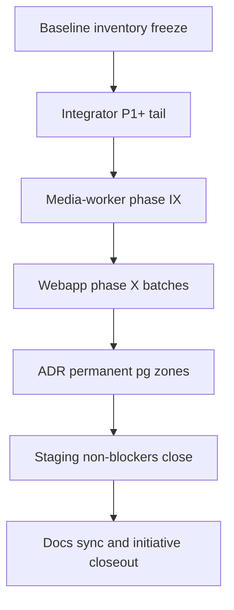

# Финальный план закрытия Drizzle-инициативы

## Цель

Закрыть инициативу «раз и навсегда» по практическому принципу:
- всё, что реально и безопасно, переводим с прямого `pool.query`/`client.query`/`db.query` на Drizzle-слой;
- всё, где `pg` остаётся архитектурно оправданным, фиксируем как постоянное исключение с явным обоснованием, тестами и guardrails.

Канон источников:
- [`docs/INTEGRATOR_DRIZZLE_MIGRATION/DRIZZLE_TRANSITION_PLAN.md`](docs/INTEGRATOR_DRIZZLE_MIGRATION/DRIZZLE_TRANSITION_PLAN.md)
- [`docs/INTEGRATOR_DRIZZLE_MIGRATION/RAW_SQL_INVENTORY.md`](docs/INTEGRATOR_DRIZZLE_MIGRATION/RAW_SQL_INVENTORY.md)
- [`docs/INTEGRATOR_DRIZZLE_MIGRATION/LOG.md`](docs/INTEGRATOR_DRIZZLE_MIGRATION/LOG.md)
- [`docs/INTEGRATOR_DRIZZLE_MIGRATION/plans/README.md`](docs/INTEGRATOR_DRIZZLE_MIGRATION/plans/README.md)

## Принцип классификации (обязательный)

Зафиксировать 3 класса и дальше не смешивать их:
- **Class A (переводим):** прямой `pg` API в прикладном коде (`pool.query`, `client.query`, `DbPort.query`) там, где нет lock/claim-паттернов.
- **Class B (оставляем SQL, но через Drizzle-обёртку):** сложные SQL-path (`SKIP LOCKED`, крупные CTE, динамика) через `runIntegratorSql`/`runWebappSql`/`execute(sql)`.
- **Class C (permanent pg):** мигратор, one-off/backfill/repair scripts, низкоуровневый tx transport, отдельные критичные merge/queue ядра по ADR.

## Поток закрытия

## Этап 0. Baseline и freeze инвентаризации

- Снять финальный baseline по коду и синхронизировать его с [`RAW_SQL_INVENTORY.md`](docs/INTEGRATOR_DRIZZLE_MIGRATION/RAW_SQL_INVENTORY.md).
- Зафиксировать per-file owner/класс (A/B/C) прямо в инвентаризации (без «серых зон»).
- Явно пометить, что Wave 2 уже закрыт, а этот план — закрытие фаз IX–X и backlog P1+.

Проверки этапа:
- `rg` по `apps/integrator/src`, `apps/webapp/src`, `apps/media-worker/src`, `packages/*` на raw pg-вызовы.
- Сверка фактов с [`DRIZZLE_TRANSITION_PLAN.md`](docs/INTEGRATOR_DRIZZLE_MIGRATION/DRIZZLE_TRANSITION_PLAN.md) и [`LOG.md`](docs/INTEGRATOR_DRIZZLE_MIGRATION/LOG.md).

## Этап 1. Integrator backlog P1+ (Class A -> B/A)

Закрыть хвосты из P1+ (убрать прямой `DbPort.query`):
- [`apps/integrator/src/infra/db/repos/platformUserDeliveryPhone.ts`](apps/integrator/src/infra/db/repos/platformUserDeliveryPhone.ts)
- [`apps/integrator/src/infra/db/repos/patientHomeMorningPing.ts`](apps/integrator/src/infra/db/repos/patientHomeMorningPing.ts)
- [`apps/integrator/src/infra/db/repos/idempotencyKeys.ts`](apps/integrator/src/infra/db/repos/idempotencyKeys.ts)
- [`apps/integrator/src/infra/db/repos/adminStats.ts`](apps/integrator/src/infra/db/repos/adminStats.ts)
- [`apps/integrator/src/infra/db/repos/linkedPhoneSource.ts`](apps/integrator/src/infra/db/repos/linkedPhoneSource.ts)
- [`apps/integrator/src/infra/db/repos/resolvePlatformUserIdForRubitimeBooking.ts`](apps/integrator/src/infra/db/repos/resolvePlatformUserIdForRubitimeBooking.ts)
- [`apps/integrator/src/infra/db/repos/canonicalUserId.ts`](apps/integrator/src/infra/db/repos/canonicalUserId.ts)
- [`apps/integrator/src/infra/db/repos/integrationDataQualityIncidents.ts`](apps/integrator/src/infra/db/repos/integrationDataQualityIncidents.ts)
- [`apps/integrator/src/infra/db/repos/operationalVerboseLog.ts`](apps/integrator/src/infra/db/repos/operationalVerboseLog.ts)
- [`apps/integrator/src/infra/db/branchTimezone.ts`](apps/integrator/src/infra/db/branchTimezone.ts)
- [`apps/integrator/src/infra/db/messengerStaffIds.ts`](apps/integrator/src/infra/db/messengerStaffIds.ts)
- [`apps/integrator/src/infra/db/adminIncidentAlertRelay.ts`](apps/integrator/src/infra/db/adminIncidentAlertRelay.ts)
- [`apps/integrator/src/config/smtpOutbound.ts`](apps/integrator/src/config/smtpOutbound.ts)
- [`apps/integrator/src/config/appBaseUrl.ts`](apps/integrator/src/config/appBaseUrl.ts)
- [`apps/integrator/src/config/appTimezone.ts`](apps/integrator/src/config/appTimezone.ts)

Отдельно обработать:
- [`apps/integrator/src/integrations/rubitime/rubitimeApiThrottle.ts`](apps/integrator/src/integrations/rubitime/rubitimeApiThrottle.ts): lock-семантика из P3 сохраняется; переводим только row-read/update путь на единый SQL executor.
- [`apps/integrator/src/infra/db/repos/projectionHealthCore.ts`](apps/integrator/src/infra/db/repos/projectionHealthCore.ts): либо перевод в builder, либо формальное закрепление как Class B (единый SQL core) с явной записью в ADR.

Проверки этапа:
- `pnpm --dir apps/integrator run typecheck`
- `pnpm --dir apps/integrator run test`
- targeted unit на каждую мигрированную repo/config зону.

## Этап 2. Media-worker phase IX (Class A -> B)

Закрыть phase IX из transition plan:
- [`apps/media-worker/src/processTranscodeJob.ts`](apps/media-worker/src/processTranscodeJob.ts)
- [`apps/media-worker/src/processProgramSubmissionTranscode.ts`](apps/media-worker/src/processProgramSubmissionTranscode.ts)
- [`apps/media-worker/src/watermarkEnabled.ts`](apps/media-worker/src/watermarkEnabled.ts)
- [`apps/media-worker/src/pipelineEnabled.ts`](apps/media-worker/src/pipelineEnabled.ts)

Сохранить как осознанный Class C/B:
- [`apps/media-worker/src/jobs/claim.ts`](apps/media-worker/src/jobs/claim.ts) с `FOR UPDATE SKIP LOCKED` и текущими тестами.

Проверки этапа:
- `pnpm --dir apps/media-worker run typecheck`
- `pnpm --dir apps/media-worker run test`
- дополнительные tests на статусные переходы transcode job и race-cases.

## Этап 3. Webapp phase X (batch-миграция)

Выполнять батчами, чтобы не раздувать риск:

- **X1 (health/media app-layer):**
  - [`apps/webapp/src/app-layer/health/collectAdminSystemHealthData.ts`](apps/webapp/src/app-layer/health/collectAdminSystemHealthData.ts)
  - [`apps/webapp/src/app-layer/media/adminTranscodeHealthMetrics.ts`](apps/webapp/src/app-layer/media/adminTranscodeHealthMetrics.ts)

- **X2 (auth legacy allowlist closeout):**
  - [`apps/webapp/src/modules/auth/channelLink.ts`](apps/webapp/src/modules/auth/channelLink.ts)
  - [`apps/webapp/src/modules/auth/service.ts`](apps/webapp/src/modules/auth/service.ts)
  - [`apps/webapp/src/modules/auth/oauthWebSession.ts`](apps/webapp/src/modules/auth/oauthWebSession.ts)
  - [`apps/webapp/src/modules/auth/yandexOAuthCallbackHandler.ts`](apps/webapp/src/modules/auth/yandexOAuthCallbackHandler.ts)
  - Сократить allowlist в [`apps/webapp/eslint.config.mjs`](apps/webapp/eslint.config.mjs).

- **X3 (identity/intake/purge):**
  - [`apps/webapp/src/infra/repos/pgOnlineIntake.ts`](apps/webapp/src/infra/repos/pgOnlineIntake.ts)
  - [`apps/webapp/src/infra/strictPlatformUserPurge.ts`](apps/webapp/src/infra/strictPlatformUserPurge.ts)
  - [`apps/webapp/src/infra/platformUserFullPurge.ts`](apps/webapp/src/infra/platformUserFullPurge.ts)
  - [`apps/webapp/src/infra/repos/pgUserProjection.ts`](apps/webapp/src/infra/repos/pgUserProjection.ts)

- **X4 (booking/doctor/catalog):**
  - [`apps/webapp/src/infra/repos/pgDoctorAppointments.ts`](apps/webapp/src/infra/repos/pgDoctorAppointments.ts)
  - [`apps/webapp/src/infra/repos/pgBookingCatalog.ts`](apps/webapp/src/infra/repos/pgBookingCatalog.ts)
  - [`apps/webapp/src/infra/repos/pgDoctorClients.ts`](apps/webapp/src/infra/repos/pgDoctorClients.ts)
  - [`apps/webapp/src/infra/repos/pgPatientBookings.ts`](apps/webapp/src/infra/repos/pgPatientBookings.ts)

- **X5 (comms/tests/recommendations/materials):**
  - [`apps/webapp/src/infra/repos/pgSupportCommunication.ts`](apps/webapp/src/infra/repos/pgSupportCommunication.ts)
  - [`apps/webapp/src/infra/repos/pgClinicalTests.ts`](apps/webapp/src/infra/repos/pgClinicalTests.ts)
  - [`apps/webapp/src/infra/repos/pgTestSets.ts`](apps/webapp/src/infra/repos/pgTestSets.ts)
  - [`apps/webapp/src/infra/repos/pgRecommendations.ts`](apps/webapp/src/infra/repos/pgRecommendations.ts)
  - [`apps/webapp/src/infra/repos/pgMaterialRating.ts`](apps/webapp/src/infra/repos/pgMaterialRating.ts)

Проверки каждого батча:
- `pnpm --dir apps/webapp run typecheck`
- targeted vitest по зоне
- `rg` по батчу на остатки `pool.query|client.query`.

## Этап 4. Permanent pg/SQL (осознанная фиксация)

Формально зафиксировать как постоянные исключения:
- **platform-merge (permanent):**
  - [`packages/platform-merge/src/pgPlatformUserMerge.ts`](packages/platform-merge/src/pgPlatformUserMerge.ts)
  - [`packages/platform-merge/src/messengerPhonePublicBind.ts`](packages/platform-merge/src/messengerPhonePublicBind.ts)
  - [`packages/platform-merge/src/mergeContactFallback.ts`](packages/platform-merge/src/mergeContactFallback.ts)
- **booking-rubitime-sync (permanent pg executor):**
  - [`packages/booking-rubitime-sync/src/upsertPatientBookingFromRubitime.ts`](packages/booking-rubitime-sync/src/upsertPatientBookingFromRubitime.ts)
  - [`packages/booking-rubitime-sync/src/lookupBranchServiceByRubitimeIds.ts`](packages/booking-rubitime-sync/src/lookupBranchServiceByRubitimeIds.ts)
- **infra/ops permanent pg:**
  - [`apps/integrator/src/infra/db/migrate.ts`](apps/integrator/src/infra/db/migrate.ts)
  - классифицированные scripts из [`docs/INTEGRATOR_DRIZZLE_MIGRATION/LOG.md`](docs/INTEGRATOR_DRIZZLE_MIGRATION/LOG.md) §P8-D.

Сделать ADR-блок в [`docs/INTEGRATOR_DRIZZLE_MIGRATION/LOG.md`](docs/INTEGRATOR_DRIZZLE_MIGRATION/LOG.md) и синхронизировать с [`docs/INTEGRATOR_DRIZZLE_MIGRATION/RAW_SQL_INVENTORY.md`](docs/INTEGRATOR_DRIZZLE_MIGRATION/RAW_SQL_INVENTORY.md): `permanent pg` или `permanent execute(sql)`.

## Этап 5. Неблокеры и операционное закрытие

Закрыть явный non-blocker:
- staging smoke из [`docs/INTEGRATOR_DRIZZLE_MIGRATION/LOG.md`](docs/INTEGRATOR_DRIZZLE_MIGRATION/LOG.md): multipart upload -> transcode claim (с реальным S3/ffmpeg).

Если staging недоступен, фиксировать `cancelled` с причиной и отдельным ops ticket в логе.

## Этап 6. Финальная синхронизация документации и архив

- Обновить статусы/описания в:
  - [`docs/INTEGRATOR_DRIZZLE_MIGRATION/DRIZZLE_TRANSITION_PLAN.md`](docs/INTEGRATOR_DRIZZLE_MIGRATION/DRIZZLE_TRANSITION_PLAN.md)
  - [`docs/INTEGRATOR_DRIZZLE_MIGRATION/RAW_SQL_INVENTORY.md`](docs/INTEGRATOR_DRIZZLE_MIGRATION/RAW_SQL_INVENTORY.md)
  - [`docs/INTEGRATOR_DRIZZLE_MIGRATION/LOG.md`](docs/INTEGRATOR_DRIZZLE_MIGRATION/LOG.md)
  - [`docs/INTEGRATOR_DRIZZLE_MIGRATION/plans/README.md`](docs/INTEGRATOR_DRIZZLE_MIGRATION/plans/README.md)
  - [`docs/README.md`](docs/README.md)
- Создать/закрыть phase-планы Wave 3 для IX/X и closeout.
- Перевести инициативу в «closed + maintenance guardrails».

## Финальный Definition of Done

- Для прикладных зон нет необъяснённого прямого `pg` API.
- Все остатки имеют явный класс: `permanent pg` или `permanent execute(sql)`.
- Wave 3 планы закрыты, чеклисты синхронизированы с фактическим кодом.
- По каждой фазе пройдены targeted тесты; перед финальным merge выполнен один полный `pnpm run ci`.

## Ограничения scope

- Не трогать `.github/workflows/*`.
- Не смешивать этот план с cutover-дедупом `integrator.rubitime_*` -> `public.booking_*`.
- Не делать full rewrite `platform-merge` на builder в рамках закрытия инициативы.