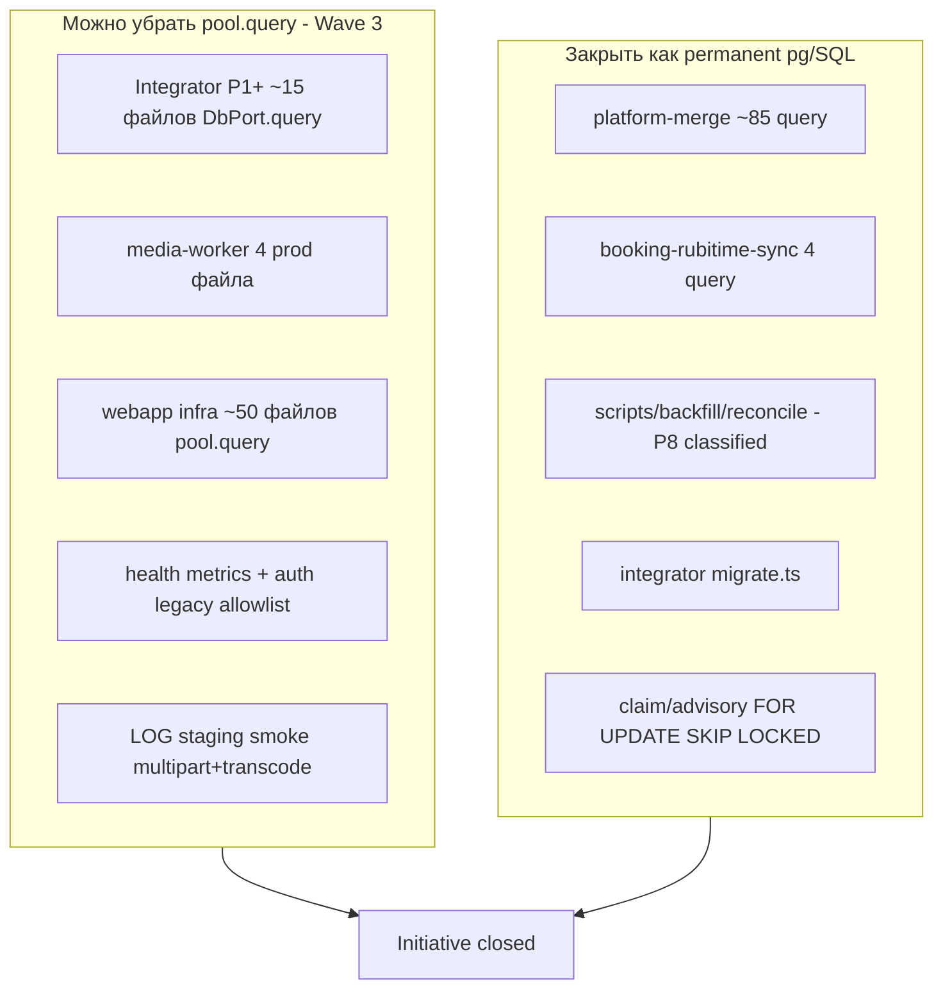

# Wave 3 — закрытие всех хвостов Drizzle-инициативы

## Ключевой вывод: «избавиться от pg» — два разных смысла

Инициатива ([`RAW_SQL_INVENTORY.md`](docs/INTEGRATOR_DRIZZLE_MIGRATION/RAW_SQL_INVENTORY.md)) различает **категории A–E**:

| Категория | Что это | Можно убрать? |
|-----------|---------|---------------|
| **A/B/C** | `pool.query` / `client.query` / `DbPort.query` | **Да** — цель Wave 3 для прикладного кода |
| **E** | SQL-текст через `runIntegratorSql` / `runWebappSql` / `execute(sql)` | SQL **остаётся**, меняется только канал выполнения |
| **D** | Чистый Drizzle builder | Желательно для простого CRUD |
| **— (infra)** | `migrate.ts`, ops/backfill scripts, BEGIN/COMMIT transport | **Нет** — навсегда pg по charter инициативы |

**Практическая цель закрытия инициативы:** не «ноль SQL в репозитории», а **ноль необъяснённого прямого node-pg в domain-коде** + каждая оставшаяся SQL-строка имеет ADR/комментарий + тест.

---

## Ответ по `platform-merge` (~85 `query()`)

Файл [`packages/platform-merge/src/pgPlatformUserMerge.ts`](packages/platform-merge/src/pgPlatformUserMerge.ts): полиморфная merge-TX, десятки таблиц, CTE (`WITH`), динамические `CASE`, guard-запросы, dedupe singleton trackings.

| Подход | Убрать pg API? | Убрать SQL-текст? | Риск | Рекомендация |
|--------|----------------|-------------------|------|--------------|
| **A. Оставить как есть** (`PlatformMergeDbClient.query`) | Нет | Нет | Минимальный | Допустимо для **закрытия инициативы** при ADR |
| **B. Bridge → `execute(sql)`** (как `runWebappPgText`) | Да (косметика) | Нет | Низкий | Имеет смысл только если унифицируем executor |
| **C. Drizzle builder по таблицам** | Частично | ~5–10% простых UPDATE | **Очень высокий** | **Не включать** в Wave 3 |
| **D. Stored procedure / SQL migration** | Да | Перенос в БД | Высокий (ops) | Отдельная продуктовая инициатива |

**Вывод по platform-merge:** от **Drizzle builder** избавиться **практически нельзя** без многомесячного rewrite и регрессионного риска на клинические данные. Для **закрытия инициативы** — **формально закрыть как permanent Category E**: pg-compatible executor + 44 consumer-тестов ([`LOG.md`](docs/INTEGRATOR_DRIZZLE_MIGRATION/LOG.md) §P8) + ADR в [`LOG.md`](docs/INTEGRATOR_DRIZZLE_MIGRATION/LOG.md) §Wave 3.

---

## Карта оставшихся хвостов (факт на коде)

### 1. Integrator P1+ (лёгкие, **~100% убираем pg API**)

Остаются `await db.query` в:
- [`platformUserDeliveryPhone.ts`](apps/integrator/src/infra/db/repos/platformUserDeliveryPhone.ts), [`canonicalUserId.ts`](apps/integrator/src/infra/db/repos/canonicalUserId.ts), [`linkedPhoneSource.ts`](apps/integrator/src/infra/db/repos/linkedPhoneSource.ts), [`resolvePlatformUserIdForRubitimeBooking.ts`](apps/integrator/src/infra/db/repos/resolvePlatformUserIdForRubitimeBooking.ts), [`patientHomeMorningPing.ts`](apps/integrator/src/infra/db/repos/patientHomeMorningPing.ts), [`idempotencyKeys.ts`](apps/integrator/src/infra/db/repos/idempotencyKeys.ts), [`adminStats.ts`](apps/integrator/src/infra/db/repos/adminStats.ts), [`integrationDataQualityIncidents.ts`](apps/integrator/src/infra/db/repos/integrationDataQualityIncidents.ts), [`operationalVerboseLog.ts`](apps/integrator/src/infra/db/repos/operationalVerboseLog.ts)
- [`branchTimezone.ts`](apps/integrator/src/infra/db/branchTimezone.ts), [`messengerStaffIds.ts`](apps/integrator/src/infra/db/messengerStaffIds.ts), [`adminIncidentAlertRelay.ts`](apps/integrator/src/infra/db/adminIncidentAlertRelay.ts)
- config: [`smtpOutbound.ts`](apps/integrator/src/config/smtpOutbound.ts), [`appBaseUrl.ts`](apps/integrator/src/config/appBaseUrl.ts), [`appTimezone.ts`](apps/integrator/src/config/appTimezone.ts)
- [`rubitimeApiThrottle.ts`](apps/integrator/src/integrations/rubitime/rubitimeApiThrottle.ts) — throttle row `client.query` (lock уже P3)

**Подход:** `runIntegratorSql` + Drizzle builder для простых SELECT/UPDATE; dynamic SQL — `execute(sql)`.

**Опционально (низкий приоритет):** [`projectionHealthCore.ts`](apps/integrator/src/infra/db/repos/projectionHealthCore.ts) — builder `groupBy` вместо 5 параллельных `db.query` (метрики уже каноничны).

### 2. Media-worker (**~90% убираем pg API**, SQL частично остаётся)

Prod-файлы с `pool.query`:
- [`processTranscodeJob.ts`](apps/media-worker/src/processTranscodeJob.ts), [`processProgramSubmissionTranscode.ts`](apps/media-worker/src/processProgramSubmissionTranscode.ts), [`watermarkEnabled.ts`](apps/media-worker/src/watermarkEnabled.ts), [`pipelineEnabled.ts`](apps/media-worker/src/pipelineEnabled.ts)
- [`claim.ts`](apps/media-worker/src/jobs/claim.ts) — **можно оставить pg** (SKIP LOCKED + unit tests P8 done)

**Блокер:** нет shared schema package ([P8 decision](docs/INTEGRATOR_DRIZZLE_MIGRATION/plans/wave2_phase_08_packages_worker_scripts.plan.md)).

**Подход Wave 3:**
- Минимальный shared executor (`SqlExecutor` / thin `runMediaWorkerPgText`) без полного schema package — только для `media_transcode_jobs` + `media_files` + `system_settings` reads.
- `claim.ts` — **не трогать** (Category E permanent).
- Статус-апдейты в `processTranscodeJob` — перевести на executor; SQL-текст сохранить.

### 3. Webapp Phase X (**~85–95% убираем pool.query**)

Топ по объёму `pool.query` (infra):
- [`pgSupportCommunication.ts`](apps/webapp/src/infra/repos/pgSupportCommunication.ts) (46), [`pgUserProjection.ts`](apps/webapp/src/infra/repos/pgUserProjection.ts) (43), [`pgBookingCatalog.ts`](apps/webapp/src/infra/repos/pgBookingCatalog.ts) (37), [`pgOnlineIntake.ts`](apps/webapp/src/infra/repos/pgOnlineIntake.ts) (33), [`pgDoctorAnalyticsMetricAccounts.ts`](apps/webapp/src/infra/repos/pgDoctorAnalyticsMetricAccounts.ts) (25), [`platformUserFullPurge.ts`](apps/webapp/src/infra/platformUserFullPurge.ts) (40), …

**Подход:** тот же паттерн P5–P6 — `runWebappPgText` / `runWebappTransaction`; list/dynamic — `execute(sql)` без смены shape.

**Исключения (Category E permanent после миграции тела):**
- `BEGIN/COMMIT/ROLLBACK` на dedicated `PoolClient` (media workers, channel link merge)
- Advisory locks (P3 done)

**Под-бatches (порядок):**

| Batch | Файлы / зона | Размер |
|-------|--------------|--------|
| X1 | Health: [`collectAdminSystemHealthData.ts`](apps/webapp/src/app-layer/health/collectAdminSystemHealthData.ts), [`adminTranscodeHealthMetrics.ts`](apps/webapp/src/app-layer/media/adminTranscodeHealthMetrics.ts) | S |
| X2 | Auth CA tail: [`channelLink.ts`](apps/webapp/src/modules/auth/channelLink.ts), [`service.ts`](apps/webapp/src/modules/auth/service.ts), [`oauthWebSession.ts`](apps/webapp/src/modules/auth/oauthWebSession.ts), [`yandexOAuthCallbackHandler.ts`](apps/webapp/src/modules/auth/yandexOAuthCallbackHandler.ts) — снять ESLint allowlist | M |
| X3 | Intake + purge bodies: [`pgOnlineIntake.ts`](apps/webapp/src/infra/repos/pgOnlineIntake.ts), [`strictPlatformUserPurge.ts`](apps/webapp/src/infra/strictPlatformUserPurge.ts), [`platformUserFullPurge.ts`](apps/webapp/src/infra/platformUserFullPurge.ts) | L |
| X4 | Booking/doctor: [`pgPatientBookings.ts`](apps/webapp/src/infra/repos/pgPatientBookings.ts) (non-Rubitime), [`pgDoctorAppointments.ts`](apps/webapp/src/infra/repos/pgDoctorAppointments.ts), [`pgBookingCatalog.ts`](apps/webapp/src/infra/repos/pgBookingCatalog.ts), [`pgDoctorClients.ts`](apps/webapp/src/infra/repos/pgDoctorClients.ts) | L |
| X5 | Identity/comms: [`pgUserProjection.ts`](apps/webapp/src/infra/repos/pgUserProjection.ts), [`pgSupportCommunication.ts`](apps/webapp/src/infra/repos/pgSupportCommunication.ts), [`pgPhoneMessengerBind.ts`](apps/webapp/src/infra/repos/pgPhoneMessengerBind.ts) | L |
| X6 | Long tail ~30 мелких `pg*` (1–12 query each) | M |

### 4. Packages

| Пакет | pg сегодня | Wave 3 решение |
|-------|------------|----------------|
| **platform-merge** | ~85 | **Permanent Category E** + ADR (см. выше) |
| **booking-rubitime-sync** | 4 | **Permanent pg** (`SqlExecutor`) — Drizzle deferred; SQL 1:1, тесты 27 green |

### 5. Неблокеры из LOG

- [ ] staging smoke: multipart upload → transcode claim на media-worker ([`LOG.md`](docs/INTEGRATOR_DRIZZLE_MIGRATION/LOG.md) L182) — ops runbook + checkbox в LOG после прогона на staging/dev с реальным S3/ffmpeg.

### 6. Scripts (P8-D)

Уже классифицированы в [`LOG.md`](docs/INTEGRATOR_DRIZZLE_MIGRATION/LOG.md) §P8-D. **Закрытие:** не мигрировать; добавить в [`RAW_SQL_INVENTORY.md`](docs/INTEGRATOR_DRIZZLE_MIGRATION/RAW_SQL_INVENTORY.md) статус **`permanent pg — ops`** для каждой строки; вынести краткий ADR «scripts outside Drizzle scope».

---

## Документы и plan-файлы Wave 3

Создать в [`docs/INTEGRATOR_DRIZZLE_MIGRATION/plans/`](docs/INTEGRATOR_DRIZZLE_MIGRATION/plans/):

- `wave3_phase_09_integrator_p1plus.plan.md` — integrator tail + config reads
- `wave3_phase_10_media_worker_transcode.plan.md` — processTranscodeJob + executor
- `wave3_phase_11_webapp_pg_repos.plan.md` — batches X1–X6
- `wave3_phase_12_initiative_closeout.plan.md` — ADR permanent zones, staging smoke, archive

Обновить: [`DRIZZLE_TRANSITION_PLAN.md`](docs/INTEGRATOR_DRIZZLE_MIGRATION/DRIZZLE_TRANSITION_PLAN.md) (фазы IX–X → Done), [`plans/README.md`](docs/INTEGRATOR_DRIZZLE_MIGRATION/plans/README.md), [`LOG.md`](docs/INTEGRATOR_DRIZZLE_MIGRATION/LOG.md) (§ «Инициатива закрыта»), [`docs/README.md`](docs/README.md) (перенос в archive).

---

## Definition of Done — полное закрытие инициативы

- [ ] `rg 'pool\.query|client\.query' apps/webapp/src/infra apps/media-worker/src` — только TX transport / documented Category E
- [ ] `rg 'await db\.query' apps/integrator/src/infra/db/repos apps/integrator/src/config` — 0 (кроме `migrate.ts` / scripts)
- [ ] [`RAW_SQL_INVENTORY.md`](docs/INTEGRATOR_DRIZZLE_MIGRATION/RAW_SQL_INVENTORY.md): каждая строка — `done` | `permanent pg` | `permanent execute(sql)` с ссылкой на ADR
- [ ] LOG: staging smoke checkbox `[x]` или `cancelled` с датой/причиной
- [ ] platform-merge + booking-rubitime-sync: ADR «permanent pg executor»
- [ ] Wave 3 plan-файлы: frontmatter `status: completed`, todos закрыты
- [ ] Targeted tests по каждой фазе + один финальный `pnpm run ci` перед archive

**Scope boundaries (не трогать):**
- `.github/workflows/*`
- Rubitime dedup / cutover v1→v2
- Shared schema package — только если нужен для media-worker executor (минимальный subset, не full webapp schema)
- Рефактор platform-merge на Drizzle builder

---

## Оценка трудозатрат (грубо)

| Фаза | Размер | Убирание pg API |
|------|--------|-----------------|
| P9 integrator P1+ | S–M | ~100% зоны |
| P10 media-worker | M | ~90% (claim остаётся) |
| P11 webapp X1–X6 | L (6 batches) | ~85–95% |
| P12 closeout + ADR | S | N/A |
| platform-merge Drizzle builder | — | **Out of scope** |
