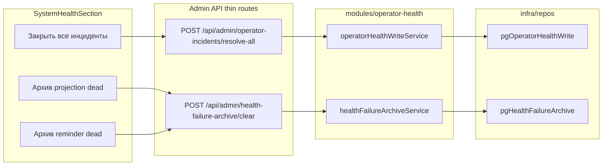

# План: сброс инцидентов и dead-очередей из UI

**Статус:** `completed` (2026-06-07). Исполнение и проверки — [`docs/OPERATOR_HEALTH_ALERTING_INITIATIVE/LOG.md`](docs/OPERATOR_HEALTH_ALERTING_INITIATIVE/LOG.md) § 2026-06-07.

## Цель

Убрать ручной `psql` для трёх операций:

1. **Закрыть все открытые инциденты** — `UPDATE operator_incidents SET resolved_at = now() WHERE resolved_at IS NULL`
2. **Архив + удаление всех dead** в `projection_outbox` (карточка «Синхронизация событий»)
3. **Архив + удаление dead только `reminder_dispatch`** (карточка «Напоминания»)

**Уже есть (не ломаем):** кнопки «Заархивировать и сбросить dead» в «Очередь доставки уведомлений» и «Очередь синка в integrator» — сервис уже крутит батчи по 500 до `deleted === 0` ([`healthFailureArchiveService.ts`](apps/webapp/src/modules/operator-health/healthFailureArchiveService.ts)).

## Фиксированные решения

| Вопрос | Решение |
|--------|---------|
| Projection dead | **Архив + delete**, не requeue (requeue — только ops-скрипт [`requeue-projection-outbox-dead.ts`](apps/webapp/scripts/requeue-projection-outbox-dead.ts)) |
| Ручной resolve инцидентов | Без recovery TG/email (оператор осознанно закрывает) |
| Reminder dead vs общая outgoing | Отдельный probe `outgoing_reminder_dispatch` — кнопка в «Напоминания» не трогает прочие dead в outgoing |
| `source_id` в архиве | `projection_outbox.id` (bigint) → `String(row.id)`; reminder — uuid строки очереди |
| Фильтр dead reminder | Тот же критерий, что `countAsOperatorOutgoingDeliveryDead` + `kind = reminder_dispatch` ([`REMINDER_OUTGOING_KIND`](apps/webapp/src/app-layer/health/adminReminderPipelineMetrics.ts)) |
| Идемпотентность | `resolve-all` при 0 открытых → `{ ok: true, resolved: 0 }`; clear dead при 0 → `{ ok: true, inserted: 0, deleted: 0 }` |

## Архитектура (clean architecture)



**Обязательно соблюдать** ([`clean-architecture-module-isolation.mdc`](.cursor/rules/clean-architecture-module-isolation.mdc)):

- `route.ts` — только guard, Zod, `buildAppDeps()`, audit, JSON
- Порты типов — в `modules/operator-health/*Port.ts`, не в `infra/repos`
- `modules/*` **не** импортирует `@/infra/db/*` и `@/infra/repos/*`
- Запись в БД — только через `pg*` в `infra/repos`, подключение в [`buildAppDeps.ts`](apps/webapp/src/app-layer/di/buildAppDeps.ts)
- **Не** добавлять файлы в ESLint allowlist `apps/webapp/eslint.config.mjs`

## Scope boundaries

### Разрешено трогать

| Область | Пути |
|---------|------|
| Модуль | [`apps/webapp/src/modules/operator-health/`](apps/webapp/src/modules/operator-health/) |
| Infra | [`apps/webapp/src/infra/repos/pgOperatorHealthWrite.ts`](apps/webapp/src/infra/repos/) (новый), `pgHealthFailureArchive.ts`, `inMemory*` |
| DI | [`apps/webapp/src/app-layer/di/buildAppDeps.ts`](apps/webapp/src/app-layer/di/buildAppDeps.ts) |
| API | [`apps/webapp/src/app/api/admin/operator-incidents/`](apps/webapp/src/app/api/admin/) (новый), `health-failure-archive/**` |
| UI | [`SystemHealthSection.tsx`](apps/webapp/src/app/app/settings/SystemHealthSection.tsx), `HealthFailureArchiveSection.tsx`, `AdminAuditLogSection.tsx`, `adminSettingsData.ts` |
| Тесты | Расширение существующих `*.test.ts(x)` в тех же папках |
| Docs | [`docs/OPERATOR_HEALTH_ALERTING_INITIATIVE/LOG.md`](docs/OPERATOR_HEALTH_ALERTING_INITIATIVE/LOG.md), [`apps/webapp/src/app/api/api.md`](apps/webapp/src/app/api/api.md) |

### Вне scope (не делать)

- Integrator-пакет, миграции DDL, env-переменные, recovery-нотификации
- degraded-карточки без dead-строк (бэкапы, cron, медиа, HLS, доставка за 24 ч)
- `GET /api/doctor/health-failure-archive` — без изменений (врачу только outgoing рассылки)
- Отдельный resolve по одному `incident.id` — только bulk `resolve-all` в этом плане

---

## Шаг 0 — Подготовка (перед кодом)

Прочитать и применить:

- [`.cursor/rules/clean-architecture-module-isolation.mdc`](.cursor/rules/clean-architecture-module-isolation.mdc)
- [`.cursor/rules/webapp-tests-lean-no-bloat.mdc`](.cursor/rules/webapp-tests-lean-no-bloat.mdc)
- [`.cursor/rules/ui-copy-no-excess-labels.mdc`](.cursor/rules/ui-copy-no-excess-labels.mdc)
- [`.cursor/rules/plan-authoring-execution-standard.mdc`](.cursor/rules/plan-authoring-execution-standard.mdc)

**Checklist:** правила просмотрены; scope не расширяем без согласования. — [x]

---

## Шаг 1 — Write-порт и resolve-all для инцидентов

### Действия

1. [`operatorHealthWritePort.ts`](apps/webapp/src/modules/operator-health/operatorHealthWritePort.ts) — `resolveAllOpenIncidents(): Promise<{ resolved: number }>`
2. [`operatorHealthWriteService.ts`](apps/webapp/src/modules/operator-health/operatorHealthWriteService.ts) — тонкая обёртка над портом
3. [`pgOperatorHealthWrite.ts`](apps/webapp/src/infra/repos/pgOperatorHealthWrite.ts) — Drizzle update + `returning`; таблица [`operatorIncidents`](apps/webapp/db/schema/operatorHealth.ts)
4. [`inMemoryOperatorHealthWrite.ts`](apps/webapp/src/infra/repos/inMemoryOperatorHealthWrite.ts) — `{ resolved: 0 }` для Vitest
5. `buildAppDeps`: `operatorHealthWrite`
6. [`POST .../operator-incidents/resolve-all/route.ts`](apps/webapp/src/app/api/admin/operator-incidents/resolve-all/route.ts) — `requireAdminModeSession`, `writeAuditLog` с `action: operator_incidents_resolve_all`

### Checklist шага

- [x] `rg "from \"@/infra/repos" apps/webapp/src/modules/operator-health` — пусто (новые module-файлы)
- [x] `pnpm --dir apps/webapp exec vitest run src/app/api/admin/operator-incidents/resolve-all/route.test.ts`
- [x] `pnpm --dir apps/webapp typecheck` (затронутые импорты)

---

## Шаг 2 — Расширить health-failure-archive

### Константы — [`healthFailureArchiveConstants.ts`](apps/webapp/src/modules/operator-health/healthFailureArchiveConstants.ts)

```ts
HEALTH_FAILURE_ARCHIVE_PROJECTION_PROBE = "projection_outbox"
HEALTH_FAILURE_ARCHIVE_OUTGOING_REMINDER_PROBE = "outgoing_reminder_dispatch"
PROJECTION_ARCHIVE_SOURCE_KIND = "projection_outbox_row"
OUTGOING_REMINDER_ARCHIVE_SOURCE_KIND = "outgoing_delivery_queue_row" // тот же kind, другой health_probe
```

Union `HealthFailureArchiveProbe` — **4** значения (2 старых + 2 новых).

### Repo — [`pgHealthFailureArchive.ts`](apps/webapp/src/infra/repos/pgHealthFailureArchive.ts)

| Метод | FROM | WHERE | summary_json (минимум) |
|-------|------|-------|--------------------------|
| `archiveProjectionDeadBatch` | `projection_outbox` | `status = 'dead'` | `event_type`, `idempotency_key`, `attempts_done` |
| `archiveOutgoingReminderDeadBatch` | `outgoing_delivery_queue` | dead + `kind = REMINDER_OUTGOING_KIND` + не `recipient_blocked_bot` | `queue_kind`, `channel` |

Транзакция: `insert operator_health_failure_archive` → `delete` исходных строк (как существующие batch-методы).

### Сервис + API

- [`healthFailureArchiveService.ts`](apps/webapp/src/modules/operator-health/healthFailureArchiveService.ts) — ветки в `clearDeadForProbe`, цикл до `deleted === 0`
- Расширить Zod enum в [`clear/route.ts`](apps/webapp/src/app/api/admin/health-failure-archive/clear/route.ts) и [`route.ts`](apps/webapp/src/app/api/admin/health-failure-archive/route.ts) (GET)
- [`adminSettingsData.ts`](apps/webapp/src/app/app/settings/adminSettingsData.ts) — parse новых probe для `?adminTab=health-archive&probe=`

### Checklist шага

- [x] `rg "HEALTH_FAILURE_ARCHIVE_" apps/webapp` — все 4 probe согласованы (constants, clear, GET, UI)
- [x] Расширить [`clear/route.test.ts`](apps/webapp/src/app/api/admin/health-failure-archive/clear/route.test.ts) — кейсы `projection_outbox` и `outgoing_reminder_dispatch` + audit
- [x] Расширить [`route.test.ts`](apps/webapp/src/app/api/admin/health-failure-archive/route.test.ts) — GET filter по новому probe
- [x] `inMemoryHealthFailureArchive.ts` — заглушки двух новых методов
- [x] `pnpm --dir apps/webapp typecheck`

---

## Шаг 3 — UI SystemHealthSection

### Состояние

Заменить `clearProbe` на union:

```ts
type HealthOperatorAction =
  | { kind: "archive"; probe: HealthFailureArchiveProbe }
  | { kind: "resolve_incidents" };
```

### Кнопки (`Button` `size="sm"` `variant="destructive"`, как сейчас)

| Секция | Показать если | Текст кнопки | Endpoint |
|--------|---------------|--------------|----------|
| Открытые инциденты | `openOperatorIncidents.length > 0` | Закрыть все открытые | `POST .../operator-incidents/resolve-all` |
| Синхронизация событий | `queueDead > 0` | Заархивировать и сбросить dead | clear `projection_outbox` |
| Напоминания | `remindersPipeline.outgoingReminderDispatch.dead > 0` | Заархивировать и сбросить dead | clear `outgoing_reminder_dispatch` |

### Dialog (лаконичные тексты, [`ui-copy-no-excess-labels`](.cursor/rules/ui-copy-no-excess-labels.mdc))

- **Инциденты:** «Закроет все открытые инциденты. Повторные алерты не отправляются.»
- **Projection:** «Удалит dead из очереди синхронизации; копия в архиве. Это не повторная постановка в очередь.»
- **Reminder / остальные dead:** переиспользовать формулировку существующего Dialog (TTL {N} дней)

После успеха: `load()` health, закрыть dialog.

### Тесты ([`webapp-tests-lean`](.cursor/rules/webapp-tests-lean-no-bloat.mdc))

- **Не** создавать новый тяжёлый RTL-файл с дублем shell-фикстур
- Расширить [`SystemHealthSection.healthFailureArchive.test.tsx`](apps/webapp/src/app/app/settings/SystemHealthSection.healthFailureArchive.test.tsx) — кнопки projection + reminders + dialog confirm
- Расширить [`SystemHealthSection.operatorIncidents.test.tsx`](apps/webapp/src/app/app/settings/SystemHealthSection.operatorIncidents.test.tsx) — кнопка resolve + mock fetch resolve-all

### Checklist шага

- [x] `rg "Заархивировать и сбросить dead" apps/webapp/src/app/app/settings/SystemHealthSection.tsx` — 4 места (2 старых + 2 новых)
- [x] `pnpm --dir apps/webapp exec vitest run src/app/app/settings/SystemHealthSection.healthFailureArchive.test.tsx src/app/app/settings/SystemHealthSection.operatorIncidents.test.tsx`

---

## Шаг 4 — Архив UI, audit, документация

1. [`HealthFailureArchiveSection.tsx`](apps/webapp/src/app/app/settings/HealthFailureArchiveSection.tsx) — опции селекта для 2 новых probe; `archiveRowTypeLabel` / `archiveRowReasonLabel` для projection
2. [`SystemHealthSection.tsx`](apps/webapp/src/app/app/settings/SystemHealthSection.tsx) — ссылки «Архив сбоев» (блок ~стр. 1606) на новые probe
3. [`AdminAuditLogSection.tsx`](apps/webapp/src/app/app/settings/AdminAuditLogSection.tsx) — фильтр `operator_incidents_resolve_all`
4. [`adminAuditListQuery.ts`](apps/webapp/src/modules/admin/adminAuditListQuery.ts) + [`adminAuditLog.ts`](apps/webapp/src/infra/adminAuditLog.ts) — пресет «Системные снимки» (`systemHealthOnly=1`) включает `health_failure_archive_clear_dead` и `operator_incidents_resolve_all` (не только префикс `system_health_`)
5. [`LOG.md`](docs/OPERATOR_HEALTH_ALERTING_INITIATIVE/LOG.md) — запись: что сделано, проверки, что не делали (recovery, requeue)
6. [`api.md`](apps/webapp/src/app/api/api.md) — `POST resolve-all`, расширенный enum `clear.probe`, уточнение `systemHealthOnly`

### Checklist шага

- [x] `rg "projection_outbox|outgoing_reminder_dispatch|operator_incidents_resolve_all" apps/webapp docs`
- [x] LOG.md обновлён

---

## Definition of Done

- [x] Оператор (admin + admin mode) закрывает все открытые инциденты; счётчик «Открытые инциденты (N)» → 0 после refresh
- [x] Оператор архивирует и сбрасывает все dead в `projection_outbox` и `reminder_dispatch` без SQL
- [x] Старые кнопки outgoing / integrator outbox без регрессии
- [x] Каждое действие → `admin_audit_log`; archive-строки видны в «Архив сбоев очередей» с фильтром по probe
- [x] Целевые тесты + typecheck webapp зелёные
- [x] `LOG.md` и `api.md` синхронизированы
- [x] План перенесён: `git mv ~/.cursor/plans/health_ui_operator_actions_ea8c7fff.plan.md .cursor/plans/archive/`; todos → `completed`

### Проверки (локально, после всех шагов)

```bash
pnpm --dir apps/webapp exec vitest run \
  src/app/api/admin/operator-incidents/resolve-all/route.test.ts \
  src/app/api/admin/health-failure-archive/clear/route.test.ts \
  src/app/api/admin/health-failure-archive/route.test.ts \
  src/app/api/admin/audit-log/route.test.ts \
  src/modules/admin/adminAuditListQuery.test.ts \
  src/infra/adminAuditLog.test.ts \
  src/app/app/settings/SystemHealthSection.healthFailureArchive.test.tsx \
  src/app/app/settings/SystemHealthSection.operatorIncidents.test.tsx \
  src/app/app/settings/HealthFailureArchiveSection.test.tsx
pnpm --dir apps/webapp typecheck
pnpm --dir apps/webapp lint
```

**Факт (2026-06-07):** 30+ targeted tests green; webapp shard 2/3 — 1824 passed; unit `clearDeadForProbe` — в `clear/route.test.ts` (отдельный service test убран из‑за OOM от бесконечного батч-цикла на некорректных моках).

**Полный `pnpm run ci`** — один раз перед merge/push ([`pre-push-ci.mdc`](.cursor/rules/pre-push-ci.mdc)), не после каждого шага.

## Закрытие

- [x] Все шаги 0–4 и DoD выполнены
- [x] План в `.cursor/plans/archive/`; frontmatter `status: completed`, todos — `completed`
- [x] Журнал [`LOG.md`](docs/OPERATOR_HEALTH_ALERTING_INITIATIVE/LOG.md) § 2026-06-07
- [x] Карточка в [`.cursor/plans/archive/README.md`](README.md)

## Оценка

**1–2 рабочих дня** — шаблоны уже в кодовой базе; основной риск — согласованность 4 probe по всем слоям (constants → repo → API → UI → archive filter).

## Execution log (вести при исполнении)

[x] Секция в [`docs/OPERATOR_HEALTH_ALERTING_INITIATIVE/LOG.md`](docs/OPERATOR_HEALTH_ALERTING_INITIATIVE/LOG.md) § 2026-06-07:

- реализованные endpoints и probe
- результаты целевых тестов
- явный отказ: recovery notifications, projection requeue, per-incident resolve
- audit preset `systemHealthOnly` + operator actions
