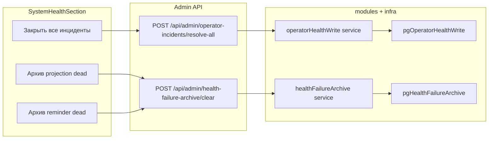

# План: сброс инцидентов и dead-очередей из UI

**Статус:** `completed`. Развёрнутый канон с чеклистами шагов — [`health_ui_operator_actions.plan.md`](health_ui_operator_actions.plan.md).

## Цель

Убрать ручной `psql` для трёх операций, которые сейчас делаются вручную:

1. **Закрыть все открытые инциденты** (`operator_incidents.resolved_at`)
2. **Архив + удаление всех dead** в `projection_outbox` (карточка «Синхронизация событий»)
3. **Архив + удаление dead только `reminder_dispatch`** (карточка «Напоминания»)

Уже есть и **не трогаем**: кнопки в «Очередь доставки уведомлений» и «Очередь синка в integrator» — они уже сбрасывают **все** dead батчами до нуля ([`healthFailureArchiveService.ts`](apps/webapp/src/modules/operator-health/healthFailureArchiveService.ts)).

## Архитектура



## Scope

**In scope (только webapp):**

- [`apps/webapp/src/modules/operator-health/`](apps/webapp/src/modules/operator-health/)
- [`apps/webapp/src/infra/repos/`](apps/webapp/src/infra/repos/) — `pg*` + `inMemory*`
- [`apps/webapp/src/app/api/admin/`](apps/webapp/src/app/api/admin/) — новый route + расширение clear
- [`apps/webapp/src/app/app/settings/SystemHealthSection.tsx`](apps/webapp/src/app/app/settings/SystemHealthSection.tsx) + тесты
- [`apps/webapp/src/app/app/settings/HealthFailureArchiveSection.tsx`](apps/webapp/src/app/app/settings/HealthFailureArchiveSection.tsx) — новые probe в селекте
- [`docs/OPERATOR_HEALTH_ALERTING_INITIATIVE/LOG.md`](docs/OPERATOR_HEALTH_ALERTING_INITIATIVE/LOG.md) — запись о фиче

**Out of scope:**

- degraded-карточки без dead-строк (бэкапы, cron, медиа, HLS, доставка за 24 ч)
- requeue dead projection (скрипт [`requeue-projection-outbox-dead.ts`](apps/webapp/scripts/requeue-projection-outbox-dead.ts) — отдельная ops-операция, не замена архива)
- recovery-уведомления при ручном resolve инцидентов (оператор сознательно закрывает; без TG/email)
- миграции БД (таблица [`operator_health_failure_archive`](apps/webapp/db/schema/operatorHealthFailureArchive.ts) уже универсальна)

---

## Шаг 1 — Write-порт и сервис для инцидентов

**Файлы:**

- Новый [`apps/webapp/src/modules/operator-health/operatorHealthWritePort.ts`](apps/webapp/src/modules/operator-health/operatorHealthWritePort.ts) — `resolveAllOpenIncidents(): Promise<{ resolved: number }>`
- Новый [`apps/webapp/src/modules/operator-health/operatorHealthWriteService.ts`](apps/webapp/src/modules/operator-health/operatorHealthWriteService.ts)
- Новый [`apps/webapp/src/infra/repos/pgOperatorHealthWrite.ts`](apps/webapp/src/infra/repos/pgOperatorHealthWrite.ts) — Drizzle `UPDATE operator_incidents SET resolved_at = now() WHERE resolved_at IS NULL RETURNING id` (таблица из [`packages/operator-db-schema`](packages/operator-db-schema/src/operatorHealth.ts) / [`apps/webapp/db/schema/operatorHealth.ts`](apps/webapp/db/schema/operatorHealth.ts))
- [`apps/webapp/src/infra/repos/inMemoryOperatorHealthRead.ts`](apps/webapp/src/infra/repos/inMemoryOperatorHealthRead.ts) или отдельный `inMemoryOperatorHealthWrite.ts`
- Подключение в [`buildAppDeps.ts`](apps/webapp/src/app-layer/di/buildAppDeps.ts): `operatorHealthWrite`

**API:**

- Новый [`apps/webapp/src/app/api/admin/operator-incidents/resolve-all/route.ts`](apps/webapp/src/app/api/admin/operator-incidents/resolve-all/route.ts)
  - guard: `requireAdminModeSession`
  - body: пустой или `{}`
  - audit: `admin_audit_log` с `action: operator_incidents_resolve_all`, `details: { resolved }`
  - ответ: `{ ok: true, resolved: number }`

**Тесты:** `route.test.ts` (403 без admin mode, 200 с mock write).

**Checklist:**

- `rg "resolveAllOpen" apps/webapp` — один канонический путь
- unit/route tests зелёные

---

## Шаг 2 — Расширить health-failure-archive на projection и reminders

**Константы** — [`healthFailureArchiveConstants.ts`](apps/webapp/src/modules/operator-health/healthFailureArchiveConstants.ts):

```ts
HEALTH_FAILURE_ARCHIVE_PROJECTION_PROBE = "projection_outbox"
HEALTH_FAILURE_ARCHIVE_OUTGOING_REMINDER_PROBE = "outgoing_reminder_dispatch"
PROJECTION_ARCHIVE_SOURCE_KIND = "projection_outbox_row"
```

Расширить union `HealthFailureArchiveProbe` (4 значения).

**Port + repo** — [`healthFailureArchivePort.ts`](apps/webapp/src/modules/operator-health/healthFailureArchivePort.ts), [`pgHealthFailureArchive.ts`](apps/webapp/src/infra/repos/pgHealthFailureArchive.ts):

| Метод | Источник | WHERE | summary_json |
|-------|----------|-------|--------------|
| `archiveProjectionDeadBatch` | `projection_outbox` | `status = 'dead'` | `event_type`, `idempotency_key`, `attempts_done` |
| `archiveOutgoingReminderDeadBatch` | `outgoing_delivery_queue` | `status = 'dead'` + `kind = reminder_dispatch` + не `recipient_blocked_bot` | как outgoing, без broadcast enrichment |

Паттерн транзакции — копия существующего `archiveOutgoingDeadBatch` / `archiveIntegratorPushOutboxDeadBatch`: insert в `operator_health_failure_archive` → delete исходных строк.

**Сервис** — [`healthFailureArchiveService.ts`](apps/webapp/src/modules/operator-health/healthFailureArchiveService.ts): в `clearDeadForProbe` добавить ветки с тем же `for(;;)` до `deleted === 0`.

**API** — расширить enum в:

- [`health-failure-archive/clear/route.ts`](apps/webapp/src/app/api/admin/health-failure-archive/clear/route.ts)
- [`health-failure-archive/route.ts`](apps/webapp/src/app/api/admin/health-failure-archive/route.ts) (GET list filter)
- [`adminSettingsData.ts`](apps/webapp/src/app/app/settings/adminSettingsData.ts) (query param probe)

**In-memory:** [`inMemoryHealthFailureArchive.ts`](apps/webapp/src/infra/repos/inMemoryHealthFailureArchive.ts) — заглушки новых методов.

**Тесты:** расширить `clear/route.test.ts`; при необходимости узкий unit на repo (mock drizzle или integration-lite).

**Важно для UX copy:** projection clear **удаляет** dead (с архивом), **не** requeue в pending — явно в Dialog.

---

## Шаг 3 — UI в SystemHealthSection

**Состояние диалога** — обобщить текущий `clearProbe` в union:

```ts
type HealthClearAction =
  | { kind: "archive"; probe: HealthFailureArchiveProbe }
  | { kind: "resolve_incidents" };
```

**Кнопки (destructive `Button size="sm"`, как сейчас):**

| Секция | Условие показа | Действие |
|--------|----------------|----------|
| «Открытые инциденты» | `openOperatorIncidents.length > 0` | «Закрыть все открытые» → `resolve-all` |
| «Синхронизация событий» | `queueDead > 0` | «Заархивировать и сбросить dead» → probe `projection_outbox` |
| «Напоминания» | `outgoingReminderDispatch.dead > 0` | «Заархивировать и сбросить dead» → probe `outgoing_reminder_dispatch` |

**Dialog:**

- Заголовок/описание зависят от `action.kind` / probe
- Общий flow: confirm → fetch → `load()` health → закрыть dialog
- Ошибки — как сейчас (`clearError`)

**Тесты:**

- Расширить [`SystemHealthSection.healthFailureArchive.test.tsx`](apps/webapp/src/app/app/settings/SystemHealthSection.healthFailureArchive.test.tsx) — projection + reminders кнопки
- Новый [`SystemHealthSection.operatorIncidentsResolve.test.tsx`](apps/webapp/src/app/app/settings/SystemHealthSection.operatorIncidentsResolve.test.tsx) — кнопка resolve + dialog

---

## Шаг 4 — Архив-секция и audit

- [`HealthFailureArchiveSection.tsx`](apps/webapp/src/app/app/settings/HealthFailureArchiveSection.tsx): опции «Синхронизация событий» и «Напоминания (reminder_dispatch)»
- [`AdminAuditLogSection.tsx`](apps/webapp/src/app/app/settings/AdminAuditLogSection.tsx): добавить фильтр `operator_incidents_resolve_all` (по аналогии с `health_failure_archive_clear_dead`)

---

## Проверки (Definition of Done)

- [x] Оператор в admin mode закрывает все открытые инциденты без SQL; счётчик «Открытые инциденты (N)» → 0 после refresh
- [x] Оператор архивирует и сбрасывает все dead в `projection_outbox` и `reminder_dispatch` без SQL
- [x] Существующие две кнопки outgoing/integrator outbox работают как раньше
- [x] Каждое действие пишет `admin_audit_log`; archive-строки видны в «Архив сбоев очередей»
- [x] Тесты: новые/расширенные route + RTL для UI
- [x] Локально: `pnpm --dir apps/webapp test -- SystemHealthSection.healthFailureArchive SystemHealthSection.operatorIncidentsResolve health-failure-archive/clear operator-incidents/resolve-all` + `pnpm --dir apps/webapp typecheck`

Полный `pnpm run ci` — перед merge/push, не после каждого шага.

## Оценка

**1–2 рабочих дня** при следовании существующим шаблонам (`health-failure-archive/clear`, Dialog в [`SystemHealthSection.tsx`](apps/webapp/src/app/app/settings/SystemHealthSection.tsx) ~стр. 1627–1654).
