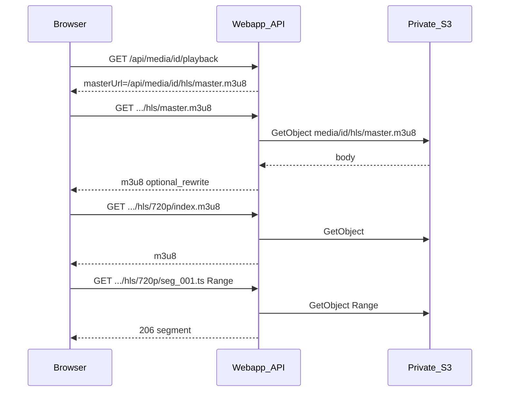

# План: HLS delivery proxy (private MinIO) — проверенная и расширенная версия

## 0. Исправления относительно черновика

- В черновике была **ошибочная двойная ссылка** на `loadAdminPlaybackClientHealthMetrics` для клиентских метрик; клиентские события грузятся из [`playbackClientEvents.ts`](apps/webapp/src/app-layer/media/playbackClientEvents.ts), серверные hourly resolution — из [`adminPlaybackHealthMetrics.ts`](apps/webapp/src/app-layer/media/adminPlaybackHealthMetrics.ts). Новый блок HLS delivery — **третий** источник, отдельная функция загрузки.
- План перенесён в репозиторий [`.cursor/plans/archive/hls_private_bucket_proxy.plan.md`](.cursor/plans/archive/hls_private_bucket_proxy.plan.md) как канон для команды (`isProject: true`).

## 1. Корневая причина (не угадывание)

| Факт | Где в коде |
|------|------------|
| `hls.masterUrl` = presigned GET | [`resolveMediaPlaybackPayload.ts`](apps/webapp/src/app-layer/media/resolveMediaPlaybackPayload.ts) |
| В master — **относительные** URI вариантов (`720p/index.m3u8`) | [`hlsMasterPlaylist.ts`](apps/media-worker/src/hlsMasterPlaylist.ts) (синхрон с webapp через `pnpm run check:hls-helpers-sync`) |
| Разрешение URI относительно **base URL мастера**; query presigned **не** наследуется дочерними относительными путями → запросы к MinIO без подписи → `403` | Поведение URL в браузере + [`PatientMediaPlaybackVideo.tsx`](apps/webapp/src/shared/ui/media/PatientMediaPlaybackVideo.tsx) (hls.js / native) |

**Вывод:** достаточно отдавать `masterUrl` как same-origin **`/api/media/{id}/hls/master.m3u8`**, чтобы относительные ссылки в плейлистах сами стали запросами к прокси. Rewrite абсолютных URL — страховка для старых/ручных артефактов и будущих тегов с URI.

## 2. Цели, non-goals, границы scope

**Цели**

- Вся HLS-цепочка (master → variant → сегменты) идёт через **авторизованный** webapp, без прямых обращений браузера к private MinIO для этих объектов.
- Та же модель доступа, что у [`GET /api/media/[id]`](apps/webapp/src/app/api/media/[id]/route.ts) / [`assertMediaPlaybackAccess`](apps/webapp/src/modules/media/assertMediaPlaybackAccess.ts) + читаемая строка `media_files` (`MEDIA_READABLE_STATUS_SQL` через существующие репозиторные функции).
- Телеметрия **ошибок** прокси с `reason_code` + связка `media_id` для System Health; MP4 fallback остаётся fallback.

**Non-goals**

- Публичный bucket, «включить ACL», MP4-override как основной путь.
- Менять модель ACL «любая сессия + UUID» ([`MEDIA_HTTP_ACCESS_AUTHORIZATION.md`](docs/ARCHITECTURE/MEDIA_HTTP_ACCESS_AUTHORIZATION.md)) в этом PR.
- Менять legacy-таблицы ЛФК / пайплайн ffmpeg в media-worker (layout уже совместим).

**Scope кода**

- [`apps/webapp/src/infra/s3/client.ts`](apps/webapp/src/infra/s3/client.ts) — новые примитивы чтения.
- [`apps/webapp/src/app/api/media/[id]/hls/`](apps/webapp/src/app/api/media/) — новый route.
- [`apps/webapp/src/app-layer/media/`](apps/webapp/src/app-layer/media/) — оркестрация, rewrite, запись ошибок.
- [`apps/webapp/db/schema`](apps/webapp/db/schema) + `drizzle-kit` миграция.
- [`system-health`](apps/webapp/src/app/api/admin/system-health/route.ts), [`SystemHealthSection.tsx`](apps/webapp/src/app/app/settings/SystemHealthSection.tsx).
- Документы из §10.

## 3. Архитектура потока

## 4. Контракт маршрута `GET /api/media/[id]/hls/[[...path]]`

**Файл:** например [`apps/webapp/src/app/api/media/[id]/hls/[[...path]]/route.ts`](apps/webapp/src/app/api/media/[id]/hls/[[...path]]/route.ts) (optional catch-all).

| Проверка | Поведение |
|----------|-----------|
| Нет сессии | **401** `unauthorized`, reason `session_unauthorized` в логах/метриках при записи ошибки (не дублировать лишние записи — см. §7) |
| `video_playback_api_enabled=false` | **503** `feature_disabled`, как [`/playback`](apps/webapp/src/app/api/media/[id]/playback/route.ts) |
| Невалидный UUID `id` | **404** |
| Нет `path` или пустой массив (запрос ровно `.../hls` без хвоста) | **404** (явное правило; не редиректить молча, чтобы не плодить варианты кэша) |
| Медиа не найдено / не читаемо по SQL | **404** `not found` — без утечки «есть файл, но нет прав» |
| Собранный S3 key не проходит [`isTrustedHlsArtifactS3Key`](apps/webapp/src/shared/lib/hlsStorageLayout.ts) | **400** или **404** (зафиксировать один код в коде и доке; предпочтительно **404** для единообразия с «не найдено») |
| Объект отсутствует в S3 | **404**, reason `missing_object` |
| S3 403 с серверными кредами | **502** или **404** по продуктовой политике; reason `upstream_403`; залогировать |

**Методы:** реализовать **GET**; при необходимости **HEAD** для плейлистов (некоторые стеки делают probe) — ответ без тела, те же проверки, `Content-Length` из HeadObject если дёшево, иначе пропустить HEAD в MVP и добавить по метрикам 405.

**Нормализация path:** декодировать сегменты URL, запретить `..` и пустые компоненты после split; использовать `posix.join("media", mediaId, "hls", ...segments)`.

**Query string** на запросах сегментов (hls.js иногда добавляет): **игнорировать** для маппинга на S3 key (ключ задаётся только path); не логировать query.

**Заголовки ответа**

- Плейлисты: `Content-Type: application/vnd.apple.mpegurl`, `Cache-Control: private, max-age=0, must-revalidate`, `X-Content-Type-Options: nosniff`.
- Сегменты: проброс `Content-Type` из S3 Head/Get или по расширению (`.ts` → `video/mp2t`); **`Accept-Ranges: bytes`**; **206** при валидном `Range`; при невалидном Range — **416** + reason `range_not_satisfiable`.
- **Cache-Control для сегментов:** имена вида `seg_%03d.ts` при перекодировании меняются; безопасный дефолт — `private, max-age=3600` или короче, пока нет content-hash в имени; не включать `public` без отдельного аудита утечки UUID в URL.

## 5. S3-слой (infra)

- Не использовать [`s3GetObjectBody`](apps/webapp/src/infra/s3/client.ts) для сегментов (полный Buffer в памяти).
- Новая функция: потоковое тело + опциональный `Range` из `request.headers.get("Range")`, возврат Web `ReadableStream` совместимый с `NextResponse` / `Response`.
- Таймауты: задокументировать использование SDK default; при явном таймауте — reason `upstream_timeout`.
- Классификация: `NoSuchKey` → `missing_object`; `AccessDenied` → `upstream_403`; сеть → `s3_read_failed` / `upstream_timeout`.

## 6. Rewrite плейлистов (defense in depth)

Happy path текущего пайплайна — только относительные строки; rewrite всё равно нужен по постановке.

**Обязательно покрыть юнит-тестами**

- Абсолютный URL на `S3_ENDPOINT` + `S3_PRIVATE_BUCKET` (и вариант path-style) → путь вида `/api/media/{mediaId}/hls/...` (лучше **path-only**, без origin — стабильность за nginx).
- Строки `#EXTM3U`, `#EXTINF`, пустые и комментарии `# ...` без изменений.
- `#EXT-X-MAP:URI="https://..."` при наличии — переписать URI внутри тега.
- `#EXT-X-KEY:URI=...` — если в проекте нет шифрования, тест «строка остаётся или переписывается только если host совпал»; не ломать относительные ключи.

**Запрет:** не подставлять произвольные внешние домены как доверенные; whitelist = конфигурируемый host bucket из [`env`](apps/webapp/src/config/env.ts) (уже есть `S3_ENDPOINT`, private bucket), без новых env для секретов.

## 7. Изменение playback JSON

- В [`resolveMediaPlaybackPayload.ts`](apps/webapp/src/app-layer/media/resolveMediaPlaybackPayload.ts): при `delivery === "hls"` задавать `masterUrl` = **`/api/media/${id}/hls/master.m3u8`** (как уже сделано для MP4 с `progressivePath`).
- Удалить ветку presign для master при успешном HLS (presign ошибка master больше не должна переводить в MP4 fallback из-за «подписи»).
- [`playbackPayloadTypes.ts`](apps/webapp/src/modules/media/playbackPayloadTypes.ts) + [`api.md`](apps/webapp/src/app/api/api.md): явно описать, что **`expiresInSeconds`** относится к **poster** и косвенно к presigned редиректу MP4 (`/api/media/id`), а **master HLS** идёт через cookie-сессию, без TTL в query.

## 8. Клиент ([`PatientMediaPlaybackVideo.tsx`](apps/webapp/src/shared/ui/media/PatientMediaPlaybackVideo.tsx))

- Не добавлять `xhrSetup`/кастомные loader обходы: same-origin `masterUrl` достаточно.
- Убедиться, что **относительный** `masterUrl` корректен и для RSC initial payload, и для клиентского refetch JSON (база — текущий origin страницы).
- WebView: тот же origin webapp — обычно ок; если когда-то появится другой origin для API — отдельная задача (absolute URL из env public app URL — только тогда).

## 9. Телеметрия и объём записей

**Проблема:** сотни segment GET на просмотр → нельзя писать строку в БД на каждый сегмент.

**Политика**

| Событие | БД | Лог |
|---------|-----|-----|
| Ошибка ответа прокси (4xx/5xx после всех проверок) | Да: `media_hls_proxy_error_events` | `warn`/`error` с `mediaId`, `reason_code`, `artifactKind`, без URL |
| Успешный сегмент | Нет | Не логировать per-request в prod (шум) |
| Успешный master/variant (опционально) | Нет в MVP | Только `debug` при флаге или выключено |

**Таблица `media_hls_proxy_error_events` (предложение колонок)**

- `id` uuid PK, `media_id` uuid FK, `user_id` uuid FK (как client events), `reason_code` text + **check constraint** списка, `http_status` smallint nullable, `artifact_kind` text check (`master` \| `variant` \| `segment`), `object_suffix` text обрезанный (например последние 128 символов ключа), `created_at` timestamptz.
- Индексы: `(created_at desc)`, `(reason_code, created_at)`.

**Коды причин (расширяемый список в одном TS-union + check):**  
`session_unauthorized`, `feature_disabled`, `media_not_readable`, `forbidden_path`, `missing_object`, `upstream_403`, `s3_read_failed`, `upstream_timeout`, `range_not_satisfiable`, `playlist_read_failed`, `playlist_rewrite_failed`, `internal_error`.

Примечание: **`expired_signature`** в прокси не использовать для сегментов; для истёкшей **сессии** — `session_unauthorized`.

## 10. System Health

- Новый ключ в JSON **рядом** с `videoPlayback` / `videoPlaybackClient`, например `videoHlsProxy` или `videoHlsDelivery`, чтобы UI мог показать отдельный accordion «HLS delivery (proxy)».
- Поля: `errorsTotal24h`, `errorsTotal1h`, `byReason: Record<string, number>`, `recent: Array<{ createdAt, mediaId, reasonCode, artifactKind }>` (лимит N), `degraded: boolean`, `windowHours`.
- **Деградация:** порог по `errorsTotal1h` (например ≥ 20) **или** доля `upstream_403`/`missing_object` за 1h — зафиксировать константы в одном файле рядом с probe.
- Реализация загрузки: новый модуль рядом с [`playbackClientEvents.ts`](apps/webapp/src/app-layer/media/playbackClientEvents.ts) (Drizzle `COUNT` + `recent` через `orderBy desc limit`).
- Тесты: [`system-health/route.test.ts`](apps/webapp/src/app/api/admin/system-health/route.test.ts).

## 11. Retention

- По образцу internal [`media-playback-stats/retention`](apps/webapp/src/app/api/api.md): отдельный маршрут или расширение существующего job family с `INTERNAL_JOB_SECRET`, удаление строк старше N дней (предложение **90**), `dryRun` — в DoD и `api.md`.

## 12. Документация (чеклист файлов)

- [`docs/ARCHITECTURE/MEDIA_HTTP_ACCESS_AUTHORIZATION.md`](docs/ARCHITECTURE/MEDIA_HTTP_ACCESS_AUTHORIZATION.md) — таблица маршрутов + одна строка «почему presigned master ломает относительные URI».
- [`docs/ARCHITECTURE/PATIENT_MEDIA_PLAYBACK_VIDEO.md`](docs/ARCHITECTURE/PATIENT_MEDIA_PLAYBACK_VIDEO.md) — master через прокси; presigned poster + MP4 redirect.
- [`apps/webapp/src/app/api/api.md`](apps/webapp/src/app/api/api.md) — полный контракт `GET .../hls/...`, коды, флаги, retention.
- Опционально одна строка в архивной инициативе VIDEO_HLS_DELIVERY со ссылкой на этот план.

## 13. Тест-план (измеримый)

| Слой | Обязательные кейсы |
|------|---------------------|
| Unit | `path → key` + `isTrustedHlsArtifactS3Key`; rewrite m3u8; mapAwsError → reason |
| Integration (webapp) | 401 без сессии; 503 feature off; 404 нет медиа; 200 master body; variant; segment; 416 bad Range; traversal `../` отклонён |
| Regression | [`playback/route.test.ts`](apps/webapp/src/app/api/media/[id]/playback/route.test.ts): `masterUrl` совпадает с `/api/media/{id}/hls/master.m3u8` при HLS delivery |
| Ручной smoke | DevTools: нет запросов к host MinIO для `.m3u8`/`.ts` в цепочке; воспроизведение >30 с |

В репозитории **нет** webapp Playwright в корневом `package.json` (e2e сейчас у integrator); полноценный browser E2E вынести в follow-up или короткий скрипт smoke вне CI — не блокер MVP при сильных integration тестах.

## 14. Чистая архитектура и ESLint

- Роут: только парсинг, guards, вызов одной функции из `app-layer/media`.
- `app-layer` не импортирует напрямую `getPool` из модулей — повторно использовать уже существующие обёртки (`getMediaS3KeyForRedirect` / `getMediaRowForPlayback` через [`s3MediaStorage` re-export](apps/webapp/src/app-layer/media/s3MediaStorage.ts)).
- Новый route попадает под `eslint` `no-restricted-imports` для `app/api/**/route.ts` — не добавлять запрещённые импорты из `@/infra/db/*` / `@/infra/repos/*` в обход DI, если правило распространяется (сверить с [`eslint.config.mjs`](apps/webapp/eslint.config.mjs)).

## 15. Риски и смягчение

| Риск | Митигация |
|------|-----------|
| Трафик сегментов через Node | Мониторинг CPU/ingress; в плане роста — CDN с коротким token (вне scope) |
| Большие сегменты в памяти | Только streaming + Range |
| Перегруз БД ошибками при массовом сбое | Индексы + retention; при шторме — rate-limit записи (опционально debounce по `(mediaId, reason)` в памяти процесса — только если увидите шторм) |
| Регрессия Safari | Явные тесты Range + ручной smoke iOS/WebKit |

## 16. Порядок выполнения (фазы)

**Фаза A — Инфра и ключ без HTTP**

- [x] Реализовать S3 GetObject streaming + Range + типизированные ошибки.
- [x] Unit-тесты маппинга ошибок (мок SDK или обёртка).
- Локальная проверка: `pnpm --dir apps/webapp test` для затронутых файлов.

**Фаза B — Прокси-роут**

- [x] `hlsDeliveryProxy` + route GET (и опционально HEAD).
- [x] Интеграционные тесты роута с моком S3 / существующим паттерном из playback tests.
- [x] Плейлисты: чтение буфером + rewrite.

**Фаза C — Контракт playback**

- [x] Изменить `resolveMediaPlaybackPayload`; обновить типы и `playback` tests.
- [x] Smoke: один медиа-файл с ready HLS в dev.

**Фаза D — Наблюдаемость**

- [x] Миграция + `recordHlsProxyError` только на error path.
- [x] System health probe + UI accordion.
- [x] Retention route + строка в `api.md`.

**Фаза E — Документация и CI**

- [x] Обновить все docs из §12.
- [x] `pnpm install --frozen-lockfile && pnpm run ci` перед merge (политика репозитория).

## 17. Definition of Done

1. Браузер не запрашивает HLS-артефакты по прямому MinIO URL; цепочка — только `/api/media/{id}/hls/...`.
2. `GET .../playback` для ready HLS отдаёт `masterUrl` на прокси, не presigned.
3. Прокси: сессия + `video_playback_api_enabled` + trusted key + корректные статусы.
4. Range для сегментов работает (покрыто тестом или ручным протоколом с `curl -H Range`).
5. Ошибки прокси пишутся в `media_hls_proxy_error_events`; в админке System Health виден блок с 1h/24h и `degraded`.
6. Документация и `api.md` синхронизированы; retention описан/реализован.
7. `pnpm run ci` зелёный на ветке.

## 18. Execution log (инициатива)

По [`plan-authoring-execution-standard.mdc`](.cursor/rules/plan-authoring-execution-standard.mdc): вести краткий `LOG.md` в одной папке с доками инициативы (например `docs/archive/2026-05-initiatives/VIDEO_HLS_DELIVERY/HLS_PROXY_DELIVERY_LOG.md`) — решения, что не делали, ссылки на PR.
