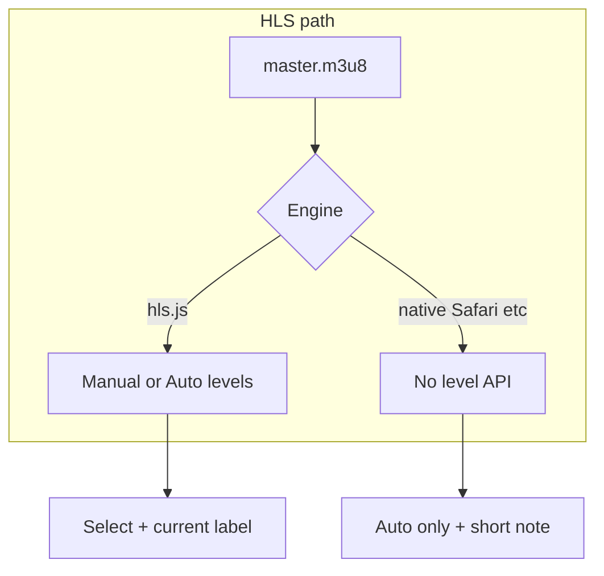

# План: выбор разрешения HLS и индикация текущего качества

Каноническая копия: [`.cursor/plans/archive/hls_quality_selector_ui_c281dac4.plan.md`](.cursor/plans/archive/hls_quality_selector_ui_c281dac4.plan.md) (перенесена из `~/.cursor/plans/`).

## Контекст

- Плеер: [`PatientMediaPlaybackVideo.tsx`](apps/webapp/src/shared/ui/media/PatientMediaPlaybackVideo.tsx) (`PlaybackEngine` + `NoContextMenuVideo` с `controls`).
- Список вариантов уже есть в контракте: `payload.hls?.qualities` типа [`MediaAvailableQuality`](apps/webapp/src/modules/media/types.ts) (см. также [`playbackPayloadTypes.ts`](apps/webapp/src/modules/media/playbackPayloadTypes.ts)); воркер пишет **720p** и **480p** в [`processTranscodeJob.ts`](apps/media-worker/src/processTranscodeJob.ts) — менять пайплайн **не требуется**.
- Формат (HLS vs MP4) пользователю **не** открываем — только качество внутри HLS при фактической ветке HLS через `hls.js`.

## Поведение по средам

- **hls.js** (ветка без `shouldUseNativeHls()`): **«Авто»** + пункты по `qualities` (сортировка по `height` desc). Текущее качество: **`Hls.Events.LEVEL_SWITCHED`**, начальная подпись после **`MANIFEST_PARSED`** и выставления уровня.
  - **Авто:** `hls.loadLevel = -1`.
  - **Фикс:** `hls.currentLevel = idx` после сопоставления строк JSON с `hls.levels` (см. [`patientHlsQuality.ts`](apps/webapp/src/shared/ui/media/patientHlsQuality.ts)).
  - Сброс выбора в **Авто** при смене `mediaId` или `payload.hls.masterUrl`.

- **Нативный HLS** (`shouldUseNativeHls()`): только подпись **«Качество: авто»**, без селектора ([`ui-copy-no-excess-labels`](.cursor/rules/ui-copy-no-excess-labels.mdc)).

- **Доставка MP4** (`sourceKind === "mp4"` или переход на progressive при недоступности `hls.js`): блок качества **не** показывается.

## UI / код

- Оверлей в правом нижнем углу (`bottom-12 right-2`, `z-20`), полупрозрачный фон.
- [`Select`](apps/webapp/src/components/ui/select.tsx) с **`displayLabel`** ([`ui-select-trigger-display-label`](.cursor/rules/ui-select-trigger-display-label.mdc)); значение авто: **`__auto__`** (`PATIENT_HLS_QUALITY_AUTO_VALUE`), остальное — стабильные ключи из [`patientHlsQuality.ts`](apps/webapp/src/shared/ui/media/patientHlsQuality.ts).

## Документация и правила

- [`PATIENT_MEDIA_PLAYBACK_VIDEO.md`](docs/ARCHITECTURE/PATIENT_MEDIA_PLAYBACK_VIDEO.md)
- [`patient-media-playback-video.mdc`](.cursor/rules/patient-media-playback-video.mdc)

## Пост-аудит (закрыто)

1. При **`!Hls.isSupported()`**: после перехода на progressive выставляется **`sourceKind === "mp4"`**, чтобы не показывать селектор HLS-качества при воспроизведении MP4.
2. Эффект инициализации источника видео зависит от **`payload.hls?.masterUrl`**, **`payload.mp4?.url`**, **`payload.posterUrl`** (и прочих перечисленных в коде deps), а **не** от целого объекта `payload`, чтобы фоновый refresh playback JSON без смены URL не пересоздавал сессию `hls.js`.

## Definition of Done

- [x] Модуль [`patientHlsQuality.ts`](apps/webapp/src/shared/ui/media/patientHlsQuality.ts) + [`patientHlsQuality.test.ts`](apps/webapp/src/shared/ui/media/patientHlsQuality.test.ts).
- [x] Оверлей качества и интеграция в [`PatientMediaPlaybackVideo.tsx`](apps/webapp/src/shared/ui/media/PatientMediaPlaybackVideo.tsx).
- [x] Обновлены архитектурный док и Cursor-rule.
- [x] `pnpm exec vitest run …/patientHlsQuality.test.ts` и eslint по затронутым файлам — зелёные.
- [x] Исправления пост-аудита (ветка unsupported `hls.js`, узкие deps эффекта).

## Scope

- **В scope:** [`PatientMediaPlaybackVideo.tsx`](apps/webapp/src/shared/ui/media/PatientMediaPlaybackVideo.tsx), [`patientHlsQuality.ts`](apps/webapp/src/shared/ui/media/patientHlsQuality.ts), тесты, doc/rule, пост-аудит плеера.
- **Вне scope:** лестница транскода (1080p и т.д.), API playback, media-worker, UI выбора HLS/MP4.
