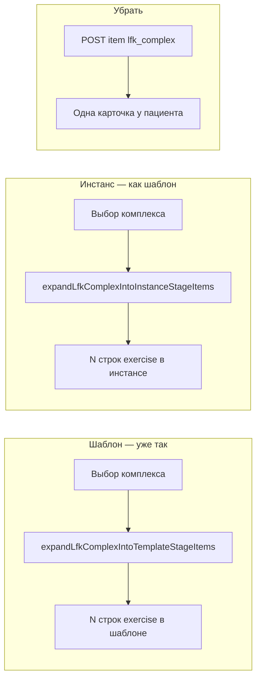

# ЛФК-комплекс: разворот в инстансе + очистка legacy у пациента

## Ключевое решение

Врач продолжает добавлять «Комплекс ЛФК» в инстанс, но под капотом это всегда разворот в набор `exercise`-элементов. Запись `instance_stage_item.item_type='lfk_complex'` больше не создается новым кодом.

Аналог в коде: [`doctorExpandTestSetIntoStage`](apps/webapp/src/modules/treatment-program/instance-service.ts) + [`from-test-set/route.ts`](apps/webapp/src/app/api/doctor/treatment-program-instances/[instanceId]/stages/[stageId]/items/from-test-set/route.ts).

---

## Порядок выполнения и гейты

1. Внедрить разворот комплекса в инстансе (врач) и закрыть прямую вставку `lfk_complex`.
2. Выполнить миграцию legacy-данных (`lfk_complex` в template/instance items -> `exercise`).
3. Удалить patient legacy-код (`lfk-session` и ветки `lfk_complex`) только после пункта 2.
4. Добавить doctor comment notify + promo-ограничения.
5. Финализировать документацию/типы/схемные хвосты.

Каждый следующий пункт выполняется только после прохождения проверок предыдущего.

---

## Этап 1 — разворот комплекса при добавлении в инстанс (врач)

### 1.1 Порт и реализация БД

- Типы в [`types.ts`](apps/webapp/src/modules/treatment-program/types.ts): `ExpandLfkComplexIntoInstanceStageItemsPortInput` / `Result` (по образцу test-set: `instanceId`, `stageId`, `complexTemplateId`, `existingGroupId` или `ungrouped`, `expectedExerciseIds`).
- Метод в [`TreatmentProgramInstancePort`](apps/webapp/src/modules/treatment-program/ports.ts): `expandLfkComplexIntoInstanceStageItems`.
- Реализация в [`pgTreatmentProgramInstance.ts`](apps/webapp/src/infra/repos/pgTreatmentProgramInstance.ts) + in-memory port для тестов:
  - этап не `sort_order = 0`;
  - превью упражнений через существующий `getLfkComplexExpandPreview` (из template port / общий вызов);
  - вставка N строк `item_type = exercise`, `buildSnapshot("exercise", exerciseId)`, `groupId` из `custom_group`;
  - события `item_added` с `source: "expand_lfk_complex_into_exercises"` (в сервисе, как у test-set).

### 1.2 Сервис и API

- [`instance-service.ts`](apps/webapp/src/modules/treatment-program/instance-service.ts): `doctorExpandLfkComplexIntoStage({ instanceId, stageId, complexTemplateId, groupId, actorId })` — валидация, preview, вызов порта, `appendEvent` на каждую строку.
- Новый route: `POST /api/doctor/treatment-program-instances/[instanceId]/stages/[stageId]/items/from-lfk-complex` (body как у шаблона, без `templateId`).
- **Защита:** в `doctorAddStageItem` при `itemType === "lfk_complex"` → `400` с текстом «используйте разворот комплекса» (чтобы случайный POST не создал legacy-строку).

### 1.3 UI врача

- [`InstanceAddLibraryItemDialog.tsx`](apps/webapp/src/app/app/doctor/treatment-program-shared/InstanceAddLibraryItemDialog.tsx): в `submitPick`, если `resolvedItemType === "lfk_complex"`, вызывать новый `from-lfk-complex` (режим `existing_group` + `spec.customGroupId`), **не** `POST .../items` с `lfk_complex`.
- Конструктор шаблона **не менять** (уже разворачивает).

### 1.4 Проверки

- Unit: `instance-service` / port — разворот в N exercise, отказ на stage 0, отказ `doctorAddStageItem(lfk_complex)`.
- UI тест: `InstanceAddLibraryItemDialog` вызывает route `from-lfk-complex`, а не `POST .../items` для `lfk_complex`.
- Smoke через `rg` после изменений: не осталось прямого создания `lfk_complex` в инстансе из doctor UI.

---

## Этап 2 — миграция legacy-данных

Пока в БД есть `item_type = 'lfk_complex'` в шаблоне или инстансе, пациентский код не выкинуть без поломки.

1. SQL/Drizzle-скрипт (одноразово): для каждой строки `lfk_complex` в `treatment_program_template_stage_items` и `treatment_program_instance_stage_items` — развернуть в `exercise` по `item_ref_id` → каталог `lfk_complex_template_exercises` (политика: сохранить `sort_order`, `group_id`, `comment` с линии шаблона где есть).
2. Проверка: `count(*) WHERE item_type = 'lfk_complex'` → 0 на активных шаблонах/инстансах (или явный хвост в LOG).
3. Обновить [`docs/TREATMENT_PROGRAM_LFK_TEMPLATE_LEGACY_TODO.md`](docs/TREATMENT_PROGRAM_LFK_TEMPLATE_LEGACY_TODO.md) — статус «миграция выполнена».

**Исторический** `program_action_log` с `lfk_exercise_done` не трогать.

---

## Этап 3 — убрать legacy у пациента (только после этапа 2)

Удалить/упростить всё, что обслуживает **пункт программы** `lfk_complex` у пациента:

| Удалить / упростить | Файлы |
|---------------------|--------|
| `lfk-session`, `patientSubmitLfkPostSession` | route, [`patient-program-actions.ts`](apps/webapp/src/modules/treatment-program/patient-program-actions.ts) |
| `PatientLfkChecklistRow`, ветки в `PatientInstanceStageItemCard` | program-detail |
| Модалки «Как прошло?» + ветка lfk в комментарии | [`PatientTreatmentProgramStagePageProgramSection.tsx`](apps/webapp/src/app/app/patient/treatment/PatientTreatmentProgramStagePageProgramSection.tsx), [`PatientProgramStageItemPageClient.tsx`](apps/webapp/src/app/app/patient/treatment/PatientProgramStageItemPageClient.tsx) |
| Скрытое «Выполнено» только для lfk | те же — включить simple complete для всех типов как `exercise` |
| `listLfkSnapshotExerciseLines` в composition/tiles | [`PatientStageCompositionList.tsx`](apps/webapp/src/app/app/patient/treatment/PatientStageCompositionList.tsx), [`stageItemSnapshot.ts`](apps/webapp/src/app/app/patient/treatment/stageItemSnapshot.ts) — убрать ветки `lfk_complex` |
| Integrator `listActiveLfkBlocks` по instance `lfk_complex` | [`instance-service.ts`](apps/webapp/src/modules/treatment-program/instance-service.ts) — удалить или перевести на exercise-only |
| `buildSnapshot(case "lfk_complex")` | [`pgTreatmentProgramItemSnapshot.ts`](apps/webapp/src/infra/repos/pgTreatmentProgramItemSnapshot.ts) — после миграции не нужен для новых строк |

Единый поток пациента: **«Добавить комментарий»** → `observation-note`; **«Отметить выполнение»** → `progress/complete`.

### 3.1 Уведомления врачу + promo (из исходной задачи)

- Новый [`notifyDoctorPatientProgramNote.ts`](apps/webapp/src/modules/messaging/notifyDoctorPatientProgramNote.ts) (по образцу [`notifyDoctorPatientMessage.ts`](apps/webapp/src/modules/messaging/notifyDoctorPatientMessage.ts)).
- Вызов после `patientAppendObservationNote` только при `assignment_source === "doctor"`.
- UI: скрыть «Добавить комментарий» при `promo`; API: отклонять observation-note для promo.

**Вне scope:** напоминания `linked_object_type = lfk_complex` (каталог), дневник ЛФК, каталог `lfk_complex_templates`, разворот в **шаблоне**.

---

## Этап 4 — схема и контракты (после нулевого count)

- Убрать `lfk_complex` из `TREATMENT_PROGRAM_ITEM_TYPES` и CHECK в [`treatmentProgramTemplates.ts`](apps/webapp/db/schema/treatmentProgramTemplates.ts) / [`treatmentProgramInstances.ts`](apps/webapp/db/schema/treatmentProgramInstances.ts) — отдельная миграция Drizzle, только когда данных нет.
- [`api.md`](apps/webapp/src/app/api/api.md), program-detail README.

---

## Scope boundaries

Разрешено менять:
- `apps/webapp/src/modules/treatment-program/**`
- `apps/webapp/src/infra/repos/pgTreatmentProgramInstance.ts`
- `apps/webapp/src/app/api/doctor/treatment-program-instances/**`
- `apps/webapp/src/app/app/doctor/treatment-program-shared/InstanceAddLibraryItemDialog.tsx`
- `apps/webapp/src/app/app/patient/treatment/**`
- `apps/webapp/src/modules/messaging/**` (только новый notify по комментариям)
- точечные docs (`api.md`, `docs/TREATMENT_PROGRAM_LFK_TEMPLATE_LEGACY_TODO.md`)

Вне scope:
- reminder subsystem (`linked_object_type=lfk_complex`)
- patient diary LFK
- каталог `lfk_complex_templates` и existing template expand UX
- массовый integrator fan-out по всем типам сообщений/заявок

---

## Definition of Done

- [x] Врач добавляет комплекс в **инстанс** → сразу N упражнений (`exercise`), без строки `lfk_complex`.
- [x] `doctorAddStageItem` не принимает `lfk_complex`.
- [x] В БД нет новых и (после миграции) нет старых `lfk_complex` в template/instance items.
- [x] Пациент: только комментарий + выполнено на карточках `exercise`; нет `lfk-session`.
- [x] Врач в боте получает уведомление о комментарии только для программ `doctor`; на промо нет кнопки комментария.
- [x] Тесты по затронутым модулям зелёные; `pnpm run ci` перед merge.

## Execution log (2026-05-27)

- Код и миграции `0081` → `0082` в репозитории; журнал — `docs/archive/2026-05-initiatives/TREATMENT_PROGRAM_LFK_TEMPLATE_EXPAND/LOG.md`, post-prod — `docs/TREATMENT_PROGRAM_LFK_TEMPLATE_LEGACY_TODO.md`.
- Тесты: `instance-service`, `patient-program-actions`, `InstanceAddLibraryItemDialog`, `notifyDoctorPatientProgramNote`, patient treatment UI.
- `pnpm run ci` — зелёный на дереве коммита.
