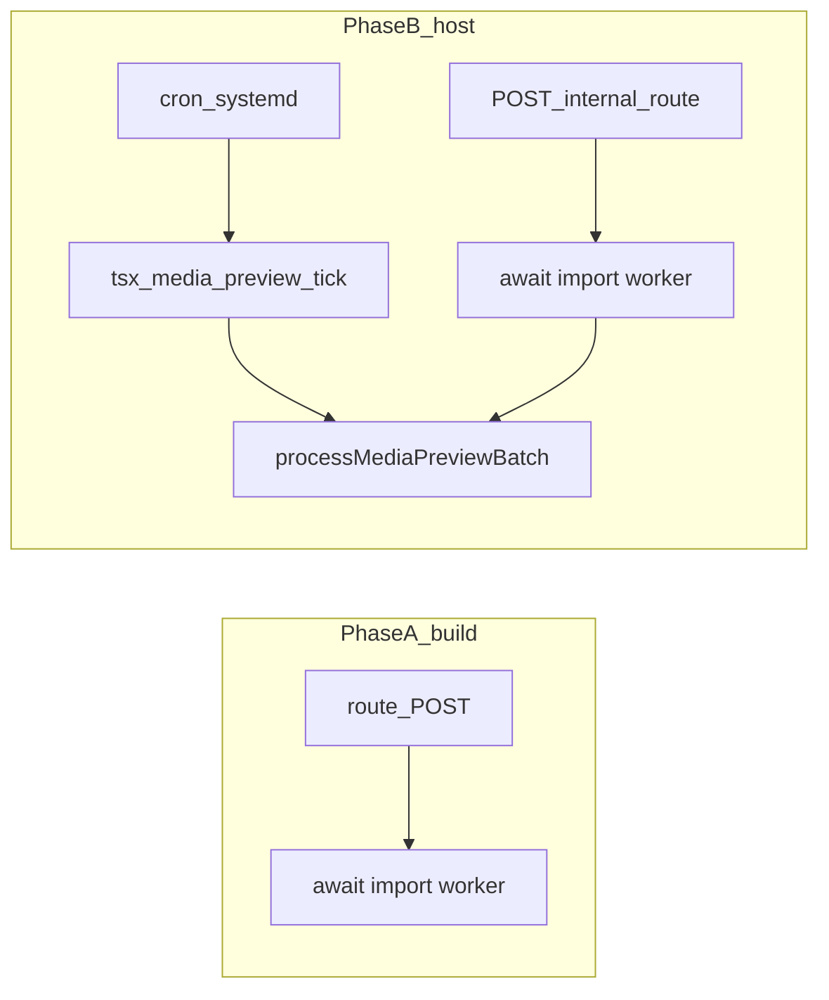

# План: media preview — ленивый импорт + вынесенный tick

## Контекст (исходная проблема — закрыта)

- **Было:** top-level импорт воркера в [`apps/webapp/src/app/api/internal/media-preview/process/route.ts`](apps/webapp/src/app/api/internal/media-preview/process/route.ts) тянул при сборке Next граф с [`apps/webapp/src/infra/repos/mediaPreviewWorker.ts`](apps/webapp/src/infra/repos/mediaPreviewWorker.ts) (`sharp`, `fluent-ffmpeg`, `@ffmpeg-installer/*`, side-effect `ffmpeg.setFfmpegPath` + лог).
- **Стало:** в route — **ленивый** `await import("@/app-layer/media/mediaPreviewWorker")` внутри `POST`; для prod cron — **`pnpm run media-preview:tick`** из каталога webapp после `source webapp.prod` (см. [`deploy/HOST_DEPLOY_README.md`](deploy/HOST_DEPLOY_README.md)); HTTP `POST …/media-preview/process` + Bearer оставлен для совместимости.
- Прецедент отдельного процесса: [`apps/webapp/scripts/integrator-push-outbox-tick.ts`](apps/webapp/scripts/integrator-push-outbox-tick.ts); новый tick: [`apps/webapp/scripts/media-preview-process-tick.ts`](apps/webapp/scripts/media-preview-process-tick.ts).

## Phase A — короткий фикс (обязательный первый шаг)

**Цель:** при `next build` / collect page data не выполнять top-level загрузку воркера (нет раннего `ffmpeg.setFfmpegPath` и связанных логов из модуля при импорте route-модуля).

**Действия:**

1. В [`apps/webapp/src/app/api/internal/media-preview/process/route.ts`](apps/webapp/src/app/api/internal/media-preview/process/route.ts):
   - удалить статический `import { processMediaPreviewBatch } from "@/app-layer/media/mediaPreviewWorker"`;
   - внутри `POST`, перед вызовом: `const { processMediaPreviewBatch } = await import("@/app-layer/media/mediaPreviewWorker");`
   - остальная логика (Bearer, `limit`, JSON-ответ) без изменений.

**Проверки (локально):**

- `pnpm --dir apps/webapp vitest --run src/infra/repos/mediaPreviewWorker.test.ts` (существующие тесты воркера).
- `pnpm run build:webapp` из корня (убедиться, что предупреждение Turbopack/NFT при необходимости сравнить до/после; полное исчезновение не гарантировать, но side-effect при сборке должен уменьшиться).

## Phase B — «чистый» runtime: tick вне Next

**Цель:** тяжёлый CPU-путь (`ffmpeg`/`sharp`/temp dirs) выполняется **в отдельном процессе** `node`/`tsx`, как уже задумано для HLS pipeline (см. комментарии в [`apps/webapp/src/app/api/api.md`](apps/webapp/src/app/api/api.md) про transcode vs Next).

**Действия:**

1. Добавить entrypoint по образцу [`apps/webapp/scripts/integrator-push-outbox-tick.ts`](apps/webapp/scripts/integrator-push-outbox-tick.ts), например [`apps/webapp/scripts/media-preview-process-tick.ts`](apps/webapp/scripts/media-preview-process-tick.ts):
   - `import { processMediaPreviewBatch } from "../src/infra/repos/mediaPreviewWorker"` (или через [`apps/webapp/src/app-layer/media/mediaPreviewWorker.ts`](apps/webapp/src/app-layer/media/mediaPreviewWorker.ts) — выбрать один канонический импорт и не плодить дубли логики);
   - аргумент CLI `--limit` (и/или env), дефолт согласовать с route (`10`);
   - `main().catch(() => process.exit(1))`, stdout с `{ processed, errors }` для cron-логов.

2. В [`apps/webapp/package.json`](apps/webapp/package.json) добавить удобный script, например `"media-preview:tick": "tsx scripts/media-preview-process-tick.ts"` (имя согласовать с существующими `tsx` скриптами в пакете).

3. **Совместимость:** HTTP route из Phase A **оставить** (curl/systemd health, откат на хосте без смены только бинарника webapp). Опционально в комментарии route указать, что для prod cron предпочтителен tick-скрипт.

4. **Документация и операционка** (обязательная синхронизация):
   - [`deploy/HOST_DEPLOY_README.md`](deploy/HOST_DEPLOY_README.md): пример cron заменить/дополнить вызовом `pnpm --dir <deploy_webapp_dir> run media-preview:tick` (или `pnpm exec tsx ...`) после `source webapp.prod` — тот же набор env (`DATABASE_URL`, S3-*, `FFMPEG_PATH`, при необходимости `MAGICK_PATH`), **без** `INTERNAL_JOB_SECRET` для скрипта, если скрипт не делает HTTP (секрет остаётся только для маршрутов, которые реально его проверяют).
   - [`docs/MEDIA_PREVIEW_PIPELINE.md`](docs/MEDIA_PREVIEW_PIPELINE.md): раздел «HTTP» дополнить подсекцией «Host tick (рекомендуется)».
   - [`apps/webapp/src/app/api/api.md`](apps/webapp/src/app/api/api.md): кратко отметить, что internal POST остаётся, но для prod предпочтителен tick-скрипт.
   - [`docs/ARCHITECTURE/SERVER_CONVENTIONS.md`](docs/ARCHITECTURE/SERVER_CONVENTIONS.md): уточнить `INTERNAL_JOB_SECRET` и блок S3 / внутренние джобы (tick vs HTTP).

**Проверки:**

- Локально: `pnpm --dir apps/webapp run media-preview:tick -- --limit 1` при поднятом `.env` (или dry expectation: если нет БД — задокументировать, что smoke на CI не обязателен без `USE_REAL_DATABASE`).
- `pnpm run build:webapp` после добавления скрипта (убедиться, что новый файл не ломает сборку).

## Definition of Done

- [x] Route без top-level импорта воркера; батч через `await import(...)`.
- [x] Рабочий `tsx` entrypoint + script `media-preview:tick` в `apps/webapp/package.json`; в `deploy/HOST_DEPLOY_README.md` — предпочтительный cron и альтернатива HTTP.
- [x] Обновлены `docs/MEDIA_PREVIEW_PIPELINE.md`, `apps/webapp/src/app/api/api.md`, `docs/ARCHITECTURE/SERVER CONVENTIONS.md` (уточнение по Bearer vs tick).
- [x] Проверки: `vitest` `mediaPreviewWorker.test.ts`, `pnpm run build:webapp`.

### Итог выполнения (2026-05-15)

Реализация в репозитории BersonCareBot закрыта; план больше не активен. Детали кода — в перечисленных файлах выше.

## Вне scope (явно не делаем в этом плане)

- Перенос логики в [`apps/media-worker`](apps/media-worker) (другая очередь/модель деплоя) без отдельного решения.
- Удаление HTTP internal route (ломает обратную совместимость без миграции всех окружений).
- Новые ключи `system_settings` / env для «интеграций» (не требуется: тот же `webapp.prod` bootstrap).
