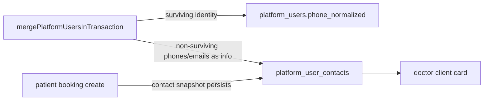

# План: Merge + дополнительные контакты (пункты 1–4)

## Scope
- Делаем только пункты 1–4:
  - усиление механизма merge для сохранения данных;
  - универсальная таблица дополнительных контактов пациента для врача;
  - fallback из merge: непобеждающие/неidentity контакты сохранять в contacts;
  - сохранение контактного телефона/почты из booking create в contacts.
- Основные зоны изменений:
  - [packages/platform-merge/src/pgPlatformUserMerge.ts](packages/platform-merge/src/pgPlatformUserMerge.ts)
  - [apps/webapp/db/schema/](apps/webapp/db/schema/)
  - [apps/webapp/src/modules/patient-booking/](apps/webapp/src/modules/patient-booking/)
  - [apps/webapp/src/infra/](apps/webapp/src/infra/)
  - [apps/webapp/src/app/api/doctor/clients/](apps/webapp/src/app/api/doctor/clients/)
  - [apps/webapp/src/app/app/doctor/clients/](apps/webapp/src/app/app/doctor/clients/)
  - [docs/ARCHITECTURE/PLATFORM_USER_MERGE.md](docs/ARCHITECTURE/PLATFORM_USER_MERGE.md)
  - [docs/OWN_BOOKING_ENGINE_INITIATIVE/DATA_MODEL_REFERENCE.md](docs/OWN_BOOKING_ENGINE_INITIATIVE/DATA_MODEL_REFERENCE.md)
- Вне scope:
  - multi-phone identity/login модель (ваш пункт 5);
  - изменение trusted-phone семантики login/tier;
  - перенос integrator legacy `contacts` в источник истины webapp.

## Целевая модель (без ломки identity)

## Этап 1. Merge Core Hardening (сохранение данных)

### Пакет задачи для Composer
- **Цель:** расширить merge-движок так, чтобы после merge канон видел максимум пользовательских данных.
- **Основные файлы:**
  - [packages/platform-merge/src/pgPlatformUserMerge.ts](packages/platform-merge/src/pgPlatformUserMerge.ts)
  - [apps/webapp/src/infra/platformUserMergePreview.ts](apps/webapp/src/infra/platformUserMergePreview.ts)
  - [apps/webapp/src/infra/repos/pgPlatformUserMerge.test.ts](apps/webapp/src/infra/repos/pgPlatformUserMerge.test.ts)
- **Чек-лист реализации:**
  - [x] Добавить перенос user-owned таблиц, которые сейчас не репойнтятся (ratings/feedback/practice/warmup/program/booking-engine/analytics из scope этапа).
  - [x] Для конфликтных таблиц добавить безопасные правила merge: dedupe/UPSERT/guard (не делать «слепой UPDATE» там, где есть unique-инварианты).
  - [x] Исправить порядок email-операций (избежать `uq_platform_users_email_normalized_active` в сценарии «email только у duplicate» и «рассинхрон нормализации»).
  - [x] Добавить/расширить blockers для новых конфликтов (например one-active-per-patient/open-attempt).
  - [x] Синхронизировать `dependentCounts`/`hardBlockers` preview под новую логику merge-core.
- **Чек-лист проверки:**
  - [x] Тесты merge покрывают новые переносы и конфликты.
  - [x] Preview возвращает согласованные blockers/counters.
  - [x] Нет регресса существующих guard’ов (`shared_phone_both_have_meaningful_data`, overlap bookings, active lfk assignment conflict).
- **Критерий выхода этапа:** merge-core готов к работе независимо от contacts-фичи.

## Этап 2. Contacts Foundation (схема + модуль)

### Пакет задачи для Composer
- **Цель:** добавить отдельную таблицу `platform_user_contacts` как врачебную информацию (не identity).
- **Основные файлы:**
  - [apps/webapp/db/schema/](apps/webapp/db/schema/)
  - [apps/webapp/db/schema/relations.ts](apps/webapp/db/schema/relations.ts)
  - [apps/webapp/src/app-layer/di/buildAppDeps.ts](apps/webapp/src/app-layer/di/buildAppDeps.ts)
- **Чек-лист реализации:**
  - [x] Создать schema + migration `platform_user_contacts`.
  - [x] Добавить индексы и ограничения: уникальность в пределах пользователя `(platform_user_id, contact_type, value_normalized)`, без глобального unique на телефон/email.
  - [x] Добавить модуль `platform-user-contacts` (ports/service/repo) по clean architecture.
  - [x] Пробросить зависимости через DI.
  - [x] Явно не связывать таблицу с login/tier/trusted-phone правилами.
- **Чек-лист проверки:**
  - [x] Миграция применима и схема читается Drizzle без конфликтов.
  - [x] Сервис/репо покрыты unit-тестами.
  - [x] Нет новых импортов identity-infra в модуль contacts.
- **Критерий выхода этапа:** contacts API-ready foundation готова, но ещё не встроена в merge/booking.

## Этап 3. Merge Fallback to Contacts

### Пакет задачи для Composer
- **Цель:** при merge сохранять непобеждающие контактные телефоны/почты в `platform_user_contacts`, не влияя на identity.
- **Основные файлы:**
  - [packages/platform-merge/src/pgPlatformUserMerge.ts](packages/platform-merge/src/pgPlatformUserMerge.ts)
  - [apps/webapp/src/infra/manualPlatformUserMerge.ts](apps/webapp/src/infra/manualPlatformUserMerge.ts)
  - [apps/webapp/src/infra/repos/pgPlatformUserMerge.test.ts](apps/webapp/src/infra/repos/pgPlatformUserMerge.test.ts)
- **Чек-лист реализации:**
  - [x] Добавить fallback-сохранение «проигравших» телефонов/почт в `platform_user_contacts` с `source='merge'`.
  - [x] Сохранить жёсткое правило: identity phone/email остаются только в `platform_users` по winner-логике.
  - [x] Не трогать `patient_phone_trust_at` и login semantics.
  - [x] Добавить audit details о сохранённых дополнительных контактах.
- **Чек-лист проверки:**
  - [x] Повторный merge не создаёт дублей в contacts.
  - [x] Кейс с разными телефонами/почтами сохраняет данные в contacts и не ломает identity.
  - [x] Error-path fallback не откатывает основной merge без причины (если стратегия best-effort выбрана явно).
- **Критерий выхода этапа:** merge больше не теряет «неidentity» контакты.

## Этап 4. Booking Upsert + Doctor Surfaces

### Пакет задачи для Composer
- **Цель:** сохранять контакты из booking формы в `platform_user_contacts` и показывать их врачу.
- **Основные файлы:**
  - [apps/webapp/src/modules/patient-booking/canonicalCreate.ts](apps/webapp/src/modules/patient-booking/canonicalCreate.ts)
  - [apps/webapp/src/modules/patient-booking/service.ts](apps/webapp/src/modules/patient-booking/service.ts)
  - [apps/webapp/src/app/api/doctor/clients/](apps/webapp/src/app/api/doctor/clients/)
  - [apps/webapp/src/app/app/doctor/clients/ClientProfileCard.tsx](apps/webapp/src/app/app/doctor/clients/ClientProfileCard.tsx)
- **Чек-лист реализации:**
  - [x] В canonical booking flow добавить post-success best-effort upsert контакта в `platform_user_contacts` (`source='booking'`).
  - [x] В legacy booking path добавить тот же best-effort hook (поведение parity).
  - [x] Вынести/использовать единый helper нормализации/дедупа контактов.
  - [x] Расширить doctor clients API/DTO для выдачи доп.контактов.
  - [x] Показать доп.контакты в `ClientProfileCard` отдельно от identity телефона.
- **Чек-лист проверки:**
  - [x] Booking create не падает при ошибке contacts-upsert.
  - [x] Booking create добавляет/обновляет контакт в contacts при валидном вводе.
  - [x] В doctor UI видны доп.контакты и не подменяется identity phone.
  - [x] Regression: существующие booking и doctor flows проходят.
- **Критерий выхода этапа:** контакты из записи сохраняются и видны врачу, login не затронут.

## Post-audit (2026-05-30)

- [x] Booking upsert пропускает phone/email, совпадающие с identity (`getPlatformUserIdentityContacts` + `identityContactMatch`).
- [x] Doctor UI/API: `DoctorSupplementaryContactsPanel`, `GET|POST .../supplementary-contacts`, `DELETE .../:contactId` (только `source=doctor|admin`).
- [x] Единая нормализация: `packages/platform-merge/src/supplementaryContactNormalize.ts` (merge + webapp).
- [x] Merge preview: `dependentCounts.platformUserContacts`.
- [x] Документация: матрица `mergeExtendedUserOwnedData`, `DB_STRUCTURE`, `DATA_MODEL_REFERENCE`, `LOG.md`.

## Документация и критерии закрытия
- [x] [docs/ARCHITECTURE/PLATFORM_USER_MERGE.md](docs/ARCHITECTURE/PLATFORM_USER_MERGE.md) — матрица переносов и supplementary contacts.
- [x] [docs/OWN_BOOKING_ENGINE_INITIATIVE/DATA_MODEL_REFERENCE.md](docs/OWN_BOOKING_ENGINE_INITIATIVE/DATA_MODEL_REFERENCE.md) — `patient_contact` / API.
- [x] [docs/ARCHITECTURE/DB_STRUCTURE.md](docs/ARCHITECTURE/DB_STRUCTURE.md) — таблица `platform_user_contacts`.
- [x] [docs/OWN_BOOKING_ENGINE_INITIATIVE/LOG.md](docs/OWN_BOOKING_ENGINE_INITIATIVE/LOG.md) — журнал волны.
- [x] План архивирован: `.cursor/plans/archive/merge+contacts_wave1-4.plan.md`.

Definition of Done:
- [x] Merge не теряет данные по целевым таблицам этапа 1.
- [x] Непобеждающие телефоны/почты сохраняются как доп. контакты и видимы врачу.
- [x] Booking create сохраняет контакт как информацию, не меняя identity/login.
- [x] Пункт 5 (multi-phone identity) не затронут архитектурно и поведенчески.