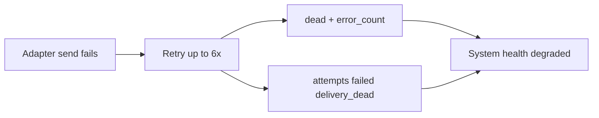
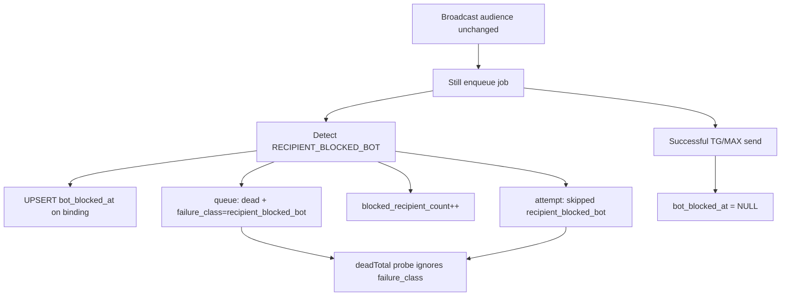

# Блокировка бота TG/MAX: маркер, health, метрики

## Сверка с постановкой (4 пункта)

| # | Задача | Критерий приёмки | Где в плане |
|---|--------|------------------|-------------|
| **1** | Не считать блокировку бота деградацией | Карточки «Очередь доставки» и «Доставка уведомлений» = `ok` при только blocked; в health нет `failed`/`dead` по blocked | §4, §3 |
| **1b** | Достаточно info в статусе рассылки | `broadcast_audit.blocked_recipient_count`, колонка «Бот заблокирован», не `error_count` | §5 |
| **2** | Маркер в БД + метрики использования | `user_channel_bindings.bot_blocked_at/reason`; KPI `messengerBotBlocked`; новые metric keys в analytics | §1, §6 |
| **3** | TG/MAX не «активен» в метриках и фильтрах каталога | Pie/segment SQL + tri-state фильтры каталога = binding **и** `bot_blocked_at IS NULL` | §6 |
| **4** | Не исключать из рассылок; снять маркер при разблокировке | **`listClients({ hasTelegram/hasMax })` semantics = binding only**; worker clear on success | §6 (критично), §3 |

### Критичное уточнение (исправление пробела v1 плана)

[`listClientsForBroadcastAudience`](apps/webapp/src/modules/doctor-broadcasts/broadcastAudienceMetrics.ts) вызывает `listClients({ hasTelegram: true })` / `hasMax: true`.

**Нельзя** менять семантику `hasTelegram`/`hasMax` на «active only» — это **исключит** blocked из сегментов `with_telegram`/`with_max` и нарушит п.4.

**Разделение:**
- **Рассылки / audience / eligible** → binding exists (как сейчас)
- **Каталог (client-side фильтры) + analytics SQL** → active binding (`bot_blocked_at IS NULL`)

---

## Контекст (текущая проблема)

Блокировка бота сейчас = обычная ошибка провайдера:
- 6 ретраев → `outgoing_delivery_queue.dead` → degraded «Очередь доставки уведомлений»
- `notification_delivery_attempts.failed` + `delivery_dead` → degraded «Доставка уведомлений»
- `broadcast_audit.error_count++` → «Не удалось доставить»

Prod-кейс (2026-06-06): рассылка «Приемы в СПб и Москве» — 8 получателей (TG 403 blocked, MAX_SEND_FAILED) → обе health-карточки degraded.



## Целевое поведение



---

## 1. Схема БД (Drizzle migration)

**[`user_channel_bindings`](apps/webapp/db/schema/schema.ts)** — per `(user_id, channel_code)`:
- `bot_blocked_at timestamptz NULL`
- `bot_blocked_reason text NULL` — канон: `recipient_blocked_bot`

**[`outgoing_delivery_queue`](apps/webapp/db/schema/outgoingDeliveryQueue.ts)**:
- `failure_class text NULL` — `'recipient_blocked_bot'` для blocked-финала

**[`broadcast_audit`](apps/webapp/db/schema/schema.ts)**:
- `blocked_recipient_count integer NOT NULL DEFAULT 0`

**Integrator SQL:** расширить [`markOutgoingDeliveryDead`](apps/integrator/src/infra/db/repos/outgoingDeliveryQueue.ts) параметром `failureClass?: string | null`.

**Reason в attempts:** `recipient_blocked_bot` (text, без DDL).

---

## 2. Детекция (integrator)

Модуль [`apps/integrator/src/infra/delivery/recipientBotBlocked.ts`](apps/integrator/src/infra/delivery/recipientBotBlocked.ts):
- `RECIPIENT_BLOCKED_BOT` — normalized message prefix
- `classifyRecipientBlockedBotError(err, channel)`
- `isRecipientBlockedBotMessage(message: string): boolean` — для backfill legacy `last_error`

**Telegram** ([`telegram/deliveryAdapter.ts`](apps/integrator/src/integrations/telegram/deliveryAdapter.ts)):
- grammy/API: 403 + (`bot was blocked by the user` | `user is deactivated` | …) → throw normalized error
- **Не** включать `PEER_ID_INVALID` без подтверждения из prod — только задокументированные паттерны + fixtures

**MAX** (выбрано: propagate + pattern):
- [`max/client.ts`](apps/integrator/src/integrations/max/client.ts): throw `MaxSendError` с `apiMessage`/`apiCode` вместо `return null`
- [`max/deliveryAdapter.ts`](apps/integrator/src/integrations/max/deliveryAdapter.ts): classify по whitelist паттернов
- **Исключить** `dialog.notfound` fallback path

**[`deliveryContract.ts`](apps/integrator/src/infra/delivery/deliveryContract.ts):** `RECIPIENT_BLOCKED_BOT` → **non-retryable** (1 попытка, без backoff 6×).

**V1 scope доставки:** очередь worker (`outgoing_delivery_worker`) — покрывает рассылки, напоминания, operator alerts. Immediate `dispatchPort` (OTP, relay без queue) **не** пишет в `notification_delivery_attempts` и не ломает health — marker там **не** ставим в v1 (backlog: hook в dispatchPort при необходимости).

---

## 3. Worker ([`outgoingDeliveryWorker.ts`](apps/integrator/src/infra/runtime/worker/outgoingDeliveryWorker.ts))

**Blocked branch** (до generic `handleDispatchFailure`):
1. `markUserChannelBotBlocked(db, userId, channel)` — UPSERT binding row
2. `recordMessengerQueueDeliveryAttempt` → **`status: 'skipped'`, `reason: 'recipient_blocked_bot'`** (не `failed`)
3. `markOutgoingDeliveryDead(..., failureClass: 'recipient_blocked_bot')` — строка остаётся для audit очереди, но **не** operator-dead
4. `incrementBroadcastAuditBlockedIfDoctorBroadcast` — **не** `error_count`
5. **`reminder_dispatch`:** не вызывать `reminders.occurrence.markFailed` / `DELIVERY_DEAD`; occurrence → `skipped` с кодом вроде `RECIPIENT_BLOCKED_BOT` (согласовать с существующими skip-кодами reminder domain)

**Success branch** (telegram/max, kinds `reminder_dispatch`, `doctor_broadcast_intent`, **`operator_alert`**):
- `clearUserChannelBotBlocked(db, userId, channel)` — `bot_blocked_at = NULL`

Repo: [`apps/integrator/src/infra/db/repos/userChannelBotBlocked.ts`](apps/integrator/src/infra/db/repos/userChannelBotBlocked.ts).

**Negative test (п.4):** eligible client с `bot_blocked_at` set → job всё равно создаётся в `buildDoctorBroadcastDeliveryJobs`; worker при повторной блокировке не increment `error_count`.

---

## 4. Health — zero degradation по blocked

**«Доставка уведомлений»:** worker пишет **skipped**, не failed → [`classifyNotificationDeliverySystemHealthStatus`](apps/webapp/src/app-layer/health/adminNotificationDeliveryHealthMetrics.ts) остаётся `ok`. `recipient_blocked_bot` **не** добавлять в `OPERATOR_DEGRADED_SKIP_REASONS`.

**«Очередь доставки»:** [`pgOperatorHealthRead.getOutgoingDeliveryQueueHealth`](apps/webapp/src/infra/repos/pgOperatorHealthRead.ts):
- `deadTotal`, `deadByKind` — **исключить** `failure_class = 'recipient_blocked_bot'`
- добавить **`blockedRecipientTotal`** (info-only) для UI accordion

**Banner врача:** [`adminDoctorTodayHealthBannerFromSystemHealth`](apps/webapp/src/app-layer/health/adminDoctorTodayHealthBanner.ts) использует `outgoingDelivery.deadTotal` из response → автоматически ok после фильтрации в read layer.

**UI:** [`SystemHealthSection.tsx`](apps/webapp/src/app/app/settings/SystemHealthSection.tsx) — показать `blockedRecipientTotal` отдельной строкой (info), кнопка «Заархивировать dead» — только при operator-dead > 0.

**Archive:** [`pgHealthFailureArchive`](apps/webapp/src/infra/repos/pgHealthFailureArchive.ts) — при clear архивировать **все** `dead`, включая blocked (ops cleanup), либо фильтровать только operator-dead — **решение: archive только operator-dead**, blocked dead можно TTL-архивировать тем же job или отдельным batch (не блокер).

---

## 5. Broadcast status — info, не error

**Audit counters** ([`DOCTOR_BROADCASTS.md`](docs/ARCHITECTURE/DOCTOR_BROADCASTS.md) § semantics):

| Колонка | Смысл после изменения |
|---------|----------------------|
| `sent_count` | успешная доставка |
| `error_count` | только **реальные** ошибки (не blocked) |
| `blocked_recipient_count` | получатель заблокировал бота / unreachable-by-block |

**[`BroadcastAuditLog.tsx`](apps/webapp/src/app/app/doctor/broadcasts/BroadcastAuditLog.tsx):**
- колонка **«Бот заблокирован»** (muted), если `blockedRecipientCount > 0`
- «Не удалось доставить» — только `errorCount > 0`
- `deliveryIncomplete`: `sent + error + blocked < planned` (blocked = завершённый исход, не «ещё в очереди»)
- раскрытие строки: «N — бот заблокирован» (info, не destructive)

Read path: broadcast audit repo + [`BroadcastAuditEntry`](apps/webapp/src/modules/doctor-broadcasts/ports.ts).

---

## 6. Метрики и фильтры — active vs binding

### Shared SQL helper (webapp)

Файл [`apps/webapp/src/modules/doctor-clients/activeMessengerBindingSql.ts`](apps/webapp/src/modules/doctor-clients/activeMessengerBindingSql.ts) (новый):
```sql
-- active telegram: binding AND bot_blocked_at IS NULL
EXISTS (SELECT 1 FROM user_channel_bindings ucb
  WHERE ucb.user_id = pu.id AND ucb.channel_code = 'telegram'
  AND ucb.bot_blocked_at IS NULL)
```

Использовать в:
- [`getClientContactBreakdown`](apps/webapp/src/infra/repos/pgDoctorClients.ts) — pie segments
- [`pgDoctorAnalyticsMetricAccounts.ts`](apps/webapp/src/infra/repos/pgDoctorAnalyticsMetricAccounts.ts) — **все** metric keys с `channel_code IN ('telegram','max')` (26-key parity test обязателен)
- [`countRecentClientsWithoutMessagingChannels`](apps/webapp/src/infra/repos/pgDoctorClients.ts) — трактовать blocked как «нет активного мессенджера» (optional product alignment с п.3)

### Каталог клиентов

- [`ChannelBindings`](apps/webapp/src/shared/types/session.ts): `telegramBotBlocked?`, `maxBotBlocked?`
- [`pgDoctorClients.listClients`](apps/webapp/src/infra/repos/pgDoctorClients.ts): отдавать flags; **`hasTelegram`/`hasMax` server filters = binding only (не менять)**
- [`DoctorClientsPanel.tsx`](apps/webapp/src/app/app/doctor/clients/DoctorClientsPanel.tsx): tri-state **yes** = `telegramId && !telegramBotBlocked`

### Analytics KPI (п.2 «метрики использования»)

[`doctor-stats/service.ts`](apps/webapp/src/modules/doctor-stats/service.ts) + analytics clients page:
- `messengerBotBlocked: { telegram: number, max: number }`
- новые drill-down keys (ports): `clients_messenger_bot_blocked_telegram`, `clients_messenger_bot_blocked_max` в [`doctor-analytics-metric-accounts/ports.ts`](apps/webapp/src/modules/doctor-analytics-metric-accounts/ports.ts)

### Явно не менять (п.4)

- [`broadcastEligible.ts`](apps/webapp/src/modules/doctor-broadcasts/broadcastEligible.ts)
- [`listClientsForBroadcastAudience`](apps/webapp/src/modules/doctor-broadcasts/broadcastAudienceMetrics.ts) — binding-only через `hasTelegram`/`hasMax`

---

## 7. Reason codes

[`notificationChannelContract.ts`](apps/webapp/src/modules/patient-notifications/notificationChannelContract.ts): `recipient_blocked_bot` в `SkippedNotificationChannelReason`.

---

## 8. Prod cleanup (обязательный rollout step, не optional)

После деплоя кода — **одноразово на prod**:

1. **Backfill markers:** `UPDATE user_channel_bindings SET bot_blocked_at = now(), bot_blocked_reason = 'recipient_blocked_bot'` по join с `outgoing_delivery_queue` / `notification_delivery_attempts` где текст ошибки matches `isRecipientBlockedBotMessage`
2. **Reclassify queue:** `UPDATE outgoing_delivery_queue SET failure_class = 'recipient_blocked_bot' WHERE status = 'dead' AND last_error ~* 'blocked by the user|…'`
3. **Fix audit row** рассылки `7ff9db3a…` (если ещё актуально): перенести 8 из `error_count` в `blocked_recipient_count` (data fix SQL)
4. Проверка: `deadTotal` operator probe = 0; health cards ok

Copy-paste блок — в ops note в [`DOCTOR_BROADCASTS.md`](docs/ARCHITECTURE/DOCTOR_BROADCASTS.md) или [`OUTGOING_DELIVERY_QUEUE.md`](docs/ARCHITECTURE/OUTGOING_DELIVERY_QUEUE.md) (non-secret patterns only).

---

## 9. Definition of Done

- [x] Migration `0107_messenger_bot_blocked.sql` + Drizzle schema
- [x] `recipientBotBlocked.ts` — TG + MAX fixtures; module переименован (ESLint `*db*` в telegram imports)
- [x] Health: skipped blocked → `ok`; filtered `deadTotal`; `blockedRecipientTotal` UI
- [x] `clientContactSegments` / active binding — blocked не в `telegram_only`
- [x] `pgDoctorAnalyticsMetricAccounts.parity.test.ts` — SQL fragments с `bot_blocked_at IS NULL`
- [x] Integrator worker: blocked counters + marker + clear on success (incl. `operator_alert`)
- [x] `deliveryJobs`: blocked client still gets queue row
- [x] `pnpm run ci` зелёный (2026-06-06)
- [x] Документация + LOG: [`docs/archive/2026-06-initiatives/MESSENGER_BOT_BLOCK_HANDLING_INITIATIVE/LOG.md`](docs/archive/2026-06-initiatives/MESSENGER_BOT_BLOCK_HANDLING_INITIATIVE/LOG.md)
- [ ] **Post-deploy prod:** backfill SQL из §8 (ops gate, не блокер merge)

**Targeted run:**
```bash
pnpm run ci
pnpm --dir apps/webapp exec vitest run --project fast \
  adminNotificationDeliveryHealthMetrics pgDoctorAnalyticsMetricAccounts.parity \
  clientContactSegments activeMessengerBindingSql pgOperatorHealthRead \
  deliveryJobs BroadcastAuditLog
pnpm --dir apps/integrator exec vitest run \
  outgoingDeliveryWorker recipientBotBlocked userChannelBotBlocked max/client max/deliveryAdapter
```

**Manual prod (после §8):** health ok; broadcast journal info column; operator `deadTotal` = 0 при только blocked.

---

## Execution log (2026-06-06)

| Шаг | Результат |
|-----|-----------|
| Schema + integrator detection/worker | Done — см. LOG |
| Health + broadcast UI | Done |
| Webapp metrics (`activeMessengerBindingSql`, KPI, catalog tri-state) | Done |
| Typecheck fixes (`DoctorTodayDashboard.test`, `exactOptionalPropertyTypes`) | Done |
| Lint (`recipientBotBlocked` rename, no-secrets) | Done |
| Full CI | Green |
| Prod backfill | **Pending ops** — SQL в `DOCTOR_BROADCASTS.md` |

Журнал: [`docs/archive/2026-06-initiatives/MESSENGER_BOT_BLOCK_HANDLING_INITIATIVE/LOG.md`](docs/archive/2026-06-initiatives/MESSENGER_BOT_BLOCK_HANDLING_INITIATIVE/LOG.md).

---

## Порядок реализации

1. Migration + integrator `markOutgoingDeliveryDead(failureClass)`
2. Detection module + MAX propagate + worker blocked/success paths
3. Health read layer + tests
4. Broadcast audit counter + UI + docs
5. Webapp bindings flags + analytics SQL + catalog filters + new KPI keys
6. Prod cleanup SQL + verify
