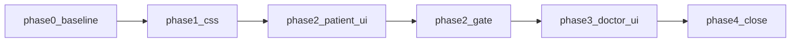

# Split patient / doctor UI (CSS + components)

**Архив:** `.cursor/plans/archive/patient_doctor_ui_split_9a04ff8e.plan.md` · журнал [`docs/archive/2026-06-initiatives/PATIENT_DOCTOR_UI_SPLIT_INITIATIVE/LOG.md`](../../docs/archive/2026-06-initiatives/PATIENT_DOCTOR_UI_SPLIT_INITIATIVE/LOG.md)

## Статус плана

**Закрыт (2026-06-04).** Gate фазы 2 зафиксирован в LOG до старта фазы 3; финальные автоматические проверки — audit-fix 2026-06-04 (`typecheck`, `pnpm test:webapp:fast`).

## Цель

Развести patient, doctor и landing на **независимые** CSS-файлы и деревья `shared/ui/patient/**` vs `shared/ui/doctor/**` без визуального редизайна.

**Критерий приёмки №1:** пациент (`/app/patient/**`, entry `/app` `/app/tg` `/app/max`, `/book/**`) визуально **не регрессирует** (операторский visual checklist в LOG; mechanical split — автоматические gate).

**Критерий приёмки №2:** doctor/settings после split **компилируются**; pixel-perfect doctor **не** входит в этот план.

## Scope

| В scope | Вне scope |
|---------|-----------|
| Split CSS + перенос/копия UI | Редизайн doctor (плотность, KPI, entity rows) |
| ESLint isolation | PWA «Berson Admin», subdomain |
| `PatientAppShell` / `DoctorAppShell` | API, БД, бизнес-логика |
| Копия `DoctorCatalogMediaStaticThumb` в doctor | Удаление папки `components/ui/` (остаётся источником для копирования) |

## Порядок фаз (строго последовательно)



**Фаза 3 не начинается**, пока не закрыт gate фазы 2.

---

## Решения без двусмысленностей

### CSS

1. **`tailwind-engine.css`** — единственный файл с `@import tailwindcss`, `shadcn/tailwind.css`, `@theme inline`, блоком **`:root` + `.dark` (shadcn tokens)** и техническим `@layer base` (`html`/`body`/`#app-root` overflow, `font-sans`, `border-border` на `*`). Подключается **только** в [`apps/webapp/src/app/layout.tsx`](apps/webapp/src/app/layout.tsx). Это не «продуктовый patient/doctor слой», а движок сборки + минимум для `bg-background` на [`legal/`](apps/webapp/src/app/legal/layout.tsx) и любых stray utilities.

2. **`patient.css`** — **только** patient-scoped правила: `#app-shell-patient`, `@custom-variant patient-*`, `.safe-padding-patient*`, `.material-rating-stars*`, `.lfk-diary-range`, patient shimmer, `.markdown-preview`. **Не** дублировать `:root` shadcn tokens (они уже в `tailwind-engine.css`). Dialog/sheet 430px и iOS 16px input — **переписать селекторы** на `#app-shell-patient …` (сейчас глобально ломают doctor).

3. **`doctor.css`** — `.doctor-difficulty-1to10-range`, **копия** `.markdown-preview` (CMS doctor в фазе 1), пустой якорь `#app-shell-doctor {}` для будущих doctor tokens. **Не** дублировать `:root` shadcn tokens на этой фазе.

4. **`landing.css`** — только landing-анимации. Подключение **только** в [`apps/webapp/src/app/page.tsx`](apps/webapp/src/app/page.tsx).

5. **`globals.css`** — **удалить** после split. Импортов `globals.css` в runtime **0** (допустимы только комментарии в docs).

### Подключение CSS (единственные точки)

| Файл layout/page | CSS |
|------------------|-----|
| [`app/layout.tsx`](apps/webapp/src/app/layout.tsx) | `styles/tailwind-engine.css` |
| **Новый** [`app/app/layout.tsx`](apps/webapp/src/app/app/layout.tsx) | `styles/patient.css` |
| [`app/book/layout.tsx`](apps/webapp/src/app/book/layout.tsx) | `styles/patient.css` |
| [`app/app/doctor/layout.tsx`](apps/webapp/src/app/app/doctor/layout.tsx) | `styles/doctor.css` |
| [`app/app/settings/layout.tsx`](apps/webapp/src/app/app/settings/layout.tsx) | `styles/doctor.css` (подтверждено: settings = doctor product zone) |
| [`app/page.tsx`](apps/webapp/src/app/page.tsx) | `styles/landing.css` |

**Запрещено:** второй import `patient.css` в [`app/app/patient/layout.tsx`](apps/webapp/src/app/app/patient/layout.tsx) — patient.css подключается **один раз** в `app/app/layout.tsx`.

**Запрещено:** stub-файл `globals.css` с re-export.

### UI components

1. **Перенос** — `git mv` + массовая замена импортов. **Запрещены** re-export stub в старых путях (`export * from "./patient/..."`).

2. **`AppShell.tsx`** — **удалить** после выноса веток. Все call sites только `PatientAppShell` или `DoctorAppShell`. Ветка `variant="default"` **не используется** в репозитории — не сохранять.

3. **Primitives** — физическая **копия** файлов из [`components/ui/`](apps/webapp/src/components/ui/) в `patient/primitives/` и `doctor/primitives/`. Внутри копий заменить импорты `@/components/ui/foo` на относительные `./foo` внутри той же папки primitives.

4. **Root [`app/layout.tsx`](apps/webapp/src/app/layout.tsx):** `TooltipProvider` импортировать из `@/shared/ui/patient/primitives/tooltip` (единственное исключение root до полного split doctor provider; doctor-страницы используют tooltip из `doctor/primitives` внутри своего дерева).

5. **`shared/ui/markdown/` и `shared/ui/media/`** — после фазы 3: **0** импортов из product trees; каталоги **удалить** (проверка `rg`).

---

## Фаза 0 — Baseline (до любых правок)

Создать [`docs/archive/2026-06-initiatives/PATIENT_DOCTOR_UI_SPLIT_INITIATIVE/`](docs/archive/2026-06-initiatives/PATIENT_DOCTOR_UI_SPLIT_INITIATIVE/) — `README.md`, `LOG.md`.

**Ручной smoke patient** (записать дату/результат в LOG):

- `/app/patient`, `/app/patient/booking/new`, `/app/patient/treatment` + один item
- `/app/patient/diary`, `/app/patient/reminders`, `/app/patient/profile`
- `/book/new` (один шаг)
- viewport 390px и 1180px

**Авто baseline (пути после split):**

```bash
pnpm --dir apps/webapp exec vitest run \
  src/shared/ui/patient/PatientAppShell.test.tsx \
  src/shared/ui/patient/shell/PatientTopNav.test.tsx \
  src/shared/ui/patient/shell/PatientBottomNav.test.tsx \
  src/app/app/patient/about/about-page.test.ts
```

---

## Фаза 1 — Split CSS (без правок TSX)

### Шаги

1. Создать [`apps/webapp/src/app/styles/tailwind-engine.css`](apps/webapp/src/app/styles/tailwind-engine.css) — содержимое см. «Решения без двусмысленностей».
2. Создать [`patient.css`](apps/webapp/src/app/styles/patient.css) — вырезать из бывшего `globals.css` все patient-блоки; применить scoping для dialog/sheet/input (см. выше).
3. Создать [`doctor.css`](apps/webapp/src/app/styles/doctor.css) — `.doctor-difficulty-1to10-range`, `.markdown-preview`, `#app-shell-doctor {}`.
4. Создать [`landing.css`](apps/webapp/src/app/styles/landing.css).
5. Создать [`app/app/layout.tsx`](apps/webapp/src/app/app/layout.tsx) с `import "../styles/patient.css"`.
6. Подключить `doctor.css` в doctor + settings layouts; `patient.css` в `book/layout.tsx`.
7. Заменить import в `app/layout.tsx` на `tailwind-engine.css`.
8. **Удалить** `globals.css`.
9. Обновить комментарии в коде: `globals.css` → `patient.css` / `tailwind-engine.css` (grep по `globals.css` в `apps/webapp/src`).

### Gate фазы 1

- Patient smoke (фаза 0) — **без регрессий**.
- `rg 'import.*globals\.css' apps/webapp/src` → 0 runtime imports.
- `pnpm --dir apps/webapp run typecheck`.

---

## Фаза 2 — Patient UI (полный split)

### 2.1 Перенос файлов (`git mv`)

| Откуда | Куда |
|--------|------|
| `shared/ui/patientVisual.ts` | `shared/ui/patient/patientVisual.ts` |
| `shared/lib/pwaLayoutClasses.ts` | `shared/ui/patient/pwaLayoutClasses.ts` |
| `PatientTopNav`, `PatientBottomNav`, `PatientHeader`, `PatientShellTopChrome`, `PatientBottomShellFrame`, `PatientShellPageTitleStrip`, `PatientGatedHeader` | `shared/ui/patient/shell/` |
| `shared/ui/patient/*` (существующие) | оставить в `shared/ui/patient/`, убрать дубли имён |
| `shared/ui/pwa/PwaAppAccessGate.tsx` | `shared/ui/patient/pwa/` |
| `shared/ui/marketing/PwaInstallSection.tsx` | `shared/ui/patient/marketing/` |
| `shared/ui/auth/*` (файлы, используемые patient entry) | `shared/ui/patient/auth/` |
| `LegalFooterLinks`, `ConnectMessengersBlock`, `FeatureCard`, `SegmentRouteError`, `PatientModalDialogContent`, `PatientLoadingShimmer`, `PatientBackToSectionShellRow`, `PatientCatalogMediaStaticThumb`, `material-rating/*` | `shared/ui/patient/` (подпапки по смыслу) |
| `PatientMediaPlaybackVideo`, `patientHlsQuality.ts`, `patientPlaybackSourceKind.ts` | `shared/ui/patient/media/` |
| `markdown/MarkdownContent`, `MarkdownPreview`, `MarkdownEmbeddedLink` | `shared/ui/patient/markdown/` (**копия** на фазе 2 — patient routes перестают зависеть от `shared/ui/markdown`) |

### 2.2 AppShell → PatientAppShell

- Создать [`shared/ui/patient/PatientAppShell.tsx`](apps/webapp/src/shared/ui/patient/PatientAppShell.tsx) — код веток `patient` / `patient-wide` из бывшего `AppShell.tsx`.
- Заменить импорты `@/shared/ui/AppShell` → `@/shared/ui/patient/PatientAppShell` в patient entry routes.
- Перенести/переименовать тест: `AppShell.test.tsx` → `shared/ui/patient/PatientAppShell.test.tsx`.
- **Удалить** `shared/ui/AppShell.tsx`.

### 2.3 Fork `shared/ui/patient/primitives/`

Скопировать из `components/ui/` (полный список — все используются в patient zone):

`button.tsx`, `button-variants.ts`, `dialog.tsx`, `card.tsx`, `input.tsx`, `textarea.tsx`, `label.tsx`, `select.tsx`, `badge.tsx`, `switch.tsx`, `collapsible.tsx`, `popover.tsx`, `dropdown-menu.tsx`, `radio-group.tsx`, `tabs.tsx`, `sheet.tsx`, `tooltip.tsx`.

Заменить импорты `@/components/ui/*` → `@/shared/ui/patient/primitives/*` в **patient zone** (см. ESLint ниже).

### 2.5 Убрать cross-import doctor → patient (в этой же фазе)

Скопировать `PatientCatalogMediaStaticThumb.tsx` → `shared/ui/doctor/media/DoctorCatalogMediaStaticThumb.tsx`.

### 2.6 ESLint — patient zone

См. [`apps/webapp/eslint.config.mjs`](apps/webapp/eslint.config.mjs) — patient routes/modules **и** `shared/ui/patient/**`.

### Gate фазы 2 (блокер перед фазой 3)

- Patient smoke повтор (операторский checklist в LOG).
- `rg "@/components/ui/" apps/webapp/src/app/app/patient apps/webapp/src/app/book src/modules/reminders src/modules/patient-diary src/modules/messaging/components/ChatView.tsx` → **0**.
- `rg "@/shared/ui/patient" apps/webapp/src/app/app/doctor` → **0**.
- `rg "@/shared/ui/AppShell" apps/webapp/src` → **0**.
- **`pnpm test:webapp:fast`** (корень монорепо) или **`pnpm --dir apps/webapp run test:fast`** — зелёный.
- **`pnpm --dir apps/webapp run typecheck`** — зелёный.

Записать gate в `LOG.md`.

---

## Фаза 3 — Doctor / settings UI

Старт **только после** закрытого gate фазы 2.

### Gate фазы 3

- `rg "@/components/ui/" apps/webapp/src/app/app/doctor apps/webapp/src/app/app/settings` → **0**.
- `rg "@/shared/ui/patient" apps/webapp/src/app/app/doctor apps/webapp/src/app/app/settings` → **0**.
- Doctor smoke: `/app/doctor`, `/app/doctor/exercises`, карточка клиента, `/app/settings` — без падений.
- `pnpm --dir apps/webapp run typecheck`.

---

## Фаза 4 — Документация и закрытие

- Обновить [`shared/ui/ui.md`](apps/webapp/src/shared/ui/ui.md).
- Создать [`.cursor/rules/patient-doctor-ui-isolation.mdc`](.cursor/rules/patient-doctor-ui-isolation.mdc).
- Ссылка в [`docs/README.md`](docs/README.md).
- `pnpm run ci` — **один раз** в конце инициативы.
- Заполнить `LOG.md`, закрыть todos плана.

---

## Definition of Done

- [x] Patient mechanical acceptance: автоматические gate (rg, ESLint, `test:webapp:fast`, typecheck); операторский visual checklist — в LOG § Manual patient smoke.
- [x] `globals.css` удалён; подключения CSS только по таблице «Подключение CSS».
- [x] Patient zone: 0× `@/components/ui/*`, 0× `@/shared/ui/doctor/*`, 0× `AppShell`.
- [x] Doctor/settings zone: 0× `@/components/ui/*`, 0× `@/shared/ui/patient/*`; `doctor.css` на settings layout.
- [x] `PatientAppShell` и `DoctorAppShell` единственные shell; `AppShell.tsx` удалён.
- [x] `DoctorCatalogMediaStaticThumb` в doctor; нет импорта `PatientCatalogMediaStaticThumb` из doctor routes.
- [x] `shared/ui/markdown` и `shared/ui/media` удалены; `rg` = 0.
- [x] ESLint rules активны; `pnpm test:webapp:fast` + typecheck зелёные; `pnpm run ci` при закрытии инициативы; `LOG.md` полный.
