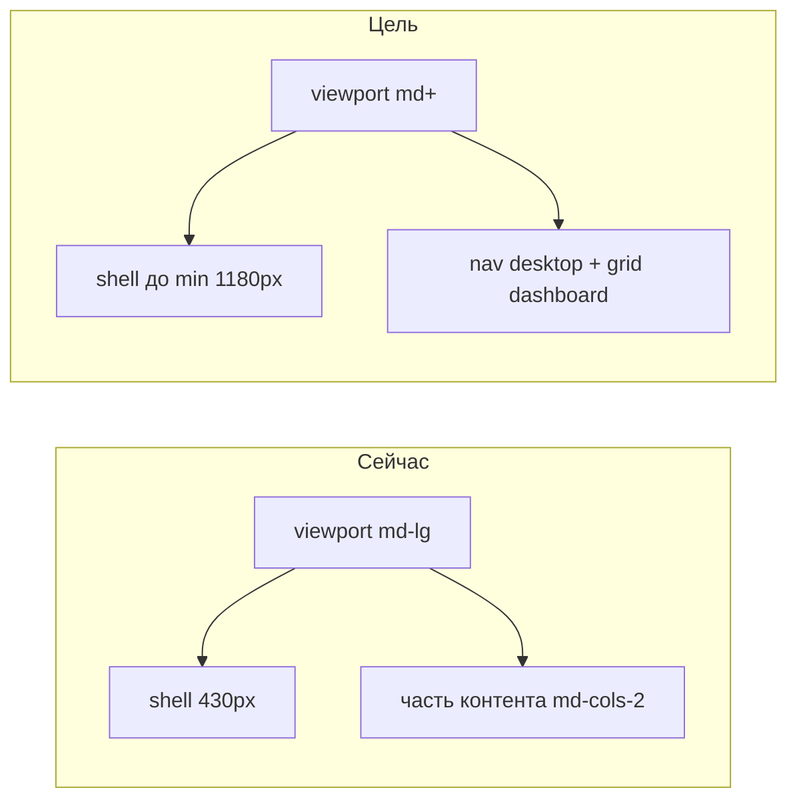

## Статус исполнения

**Закрыто в репозитории** (порог `md` для shell, `PatientTopNav`, `PatientHomeTodayLayout`, home-карточки, тесты). Во фронтматтере: `status: completed`, все todos — `completed`.

**Единственный актуальный план:** этот файл в репозитории ([`.cursor/plans/patient_shell_md_breakpoint.plan.md`](patient_shell_md_breakpoint.plan.md)). Ранее тот же текст дублировался в Cursor Plan Store как `patient_tablet_breakpoint_md_7f8cbf88.plan.md` / `patient_tablet_breakpoint_md_19732437.plan.md` — дубликаты на диске профиля удалите или закройте вручную, если IDE всё ещё предлагает для них «Выполнить».

# Patient UI: планшетный режим с `md` вместо `lg`

## Контекст

Сейчас [`AppShell`](apps/webapp/src/shared/ui/AppShell.tsx) для `variant="patient"` держит колонку **`max-w-[430px]`** до **`lg`**, а [`PatientTopNav`](apps/webapp/src/shared/ui/PatientTopNav.tsx) переключает fixed/mobile-полоску и desktop-ветку тоже на **`lg`**. Контент и сетки частично уже живут с **`md`** ([`patientInnerCardGridClass`](apps/webapp/src/shared/ui/patientVisual.ts)), из‑за чего между **768–1023px** получается рассинхрон.

Цель: **один порог** — с **`md`** и ширина оболочки, и навигация, и главная dashboard-сетка ведут себя как на «планшете».

## Абсолютное ограничение: не трогать мобильную версию

Под **«мобильной»** здесь понимается **весь диапазон viewport строго ниже Tailwind `md`** (то есть **&lt; 768px**), включая **`sm`** и базовые классы **без префикса**.

**Разрешено менять только «широкую» ветку:** замены вида **`lg:…` → `md:…`** и **`max-lg:…` → `max-md:…`** (и согласованные правки тестов/комментариев). После правок поведение и внешний вид **ниже `md`** должны совпасть с тем, что было **до задачи** на этом диапазоне (те же классы на базовом слое, те же `sm:*`, те же отступы для узкой колонки).

**Запрещено без отдельного решения:**

- менять базовые (без префикса) классы patient shell / home-карточек ради этой задачи;
- переносить пороги **`sm`** или вводить новые брейкпоинты «между мобильным и md»;
- «упрощать» правку через удаление `max-lg`, если это меняет картину на узком экране.

Практическая проверка: ручной smoke на **~390px** и **~430px** ширины — сравнить с эталоном (скрин или до/после в PR).

## Scope (разрешённые изменения)

- [`apps/webapp/src/shared/ui/AppShell.tsx`](apps/webapp/src/shared/ui/AppShell.tsx) — ветка `#app-shell-patient`: классы **`lg:max-w-[min(1180px,...)]` → `md:max-w-[...]`** (оба места: обычный режим и `patientHideBottomNav`). Комментарий в JSDoc props: **`lg+` → `md+`**.
- [`apps/webapp/src/shared/ui/PatientTopNav.tsx`](apps/webapp/src/shared/ui/PatientTopNav.tsx) — только пары **`max-lg:` / `lg:`**, которые задают fixed vs sticky, видимость mobile/desktop nav, спейсер высоты, фон/тень: **`max-md:` / `md:`**; комментарии обновить.
- [`apps/webapp/src/shared/ui/patient/PatientLoadingShimmer.tsx`](apps/webapp/src/shared/ui/patient/PatientLoadingShimmer.tsx) — **`lg:max-w-*` → `md:max-w-*`** в синхроне с `AppShell`.
- **Главная «Сегодня»:** [`PatientHomeTodayLayout.tsx`](apps/webapp/src/app/app/patient/home/PatientHomeTodayLayout.tsx) — **`lg:grid-cols-12`**, **`lg:gap-*`**, **`lg:col-span-*` / `lg:col-start-*` / `lg:order-*`** → **`md:`** (без изменения мобильной одноколоночной разметки ниже порога).
- **Home-карточки и стили:** только там, где **`max-lg:` + `lg:`** явно кодировали старый порог shell → **`max-md` / `md:`**:
  - [`patientHomeCardStyles.ts`](apps/webapp/src/app/app/patient/home/patientHomeCardStyles.ts) — осмысленный проход; **не** трогать чисто **`xl:`** и базовый слой без префикса.
  - [`PatientHomeNextReminderCard.tsx`](apps/webapp/src/app/app/patient/home/PatientHomeNextReminderCard.tsx) + тест.
  - [`PatientHomeMoodCheckin.tsx`](apps/webapp/src/app/app/patient/home/PatientHomeMoodCheckin.tsx).
  - Остальное — финальный `rg` по [`apps/webapp/src/app/app/patient/home`](apps/webapp/src/app/app/patient/home) на **`max-lg`** / связки **`lg:hidden` / `max-lg:hidden`**, с фильтром «это порог shell, не отдельная типографика только для xl».

**Вне scope без отдельного запроса:** кабинет врача; глобальный `tailwind` theme; правки архивного [`VISUAL_SYSTEM_SPEC.md`](docs/archive/2026-05-initiatives/PATIENT_HOME_REDESIGN_INITIATIVE/VISUAL_SYSTEM_SPEC.md) (исторический документ; актуальное — см. ниже).

## Документация и лог исполнения

1. **[`docs/ARCHITECTURE/PATIENT_APP_UI_STYLE_GUIDE.md`](docs/ARCHITECTURE/PATIENT_APP_UI_STYLE_GUIDE.md)** — добавить краткий подраздел (например **«Responsive: patient shell»**): порог **`md`** для расширения колонки `#app-shell-patient` до `min(1180px, …)`, переключение веток **`PatientTopNav`**, согласование dashboard-сетки главной; явная формулировка **«ниже `md` — мобильный режим, менять только по отдельной задаче»**.
2. **JSDoc** в [`AppShell.tsx`](apps/webapp/src/shared/ui/AppShell.tsx) (variant `patient`) — синхронизировать формулировку с фактическим порогом **`md`**.
3. **Лог:** новая папка инициативы под задачу, например **`docs/PATIENT_SHELL_MD_BREAKPOINT/`** с файлами:
   - **`LOG.md`** — по ходу работ: дата, что сделано, какие файлы, результаты `vitest`/ручных проверок, сознательные отступления, открытые риски (формат как в `.cursor/rules/plan-authoring-execution-standard.mdc`: execution log).
   - опционально короткий **`README.md`** — одна ссылка на этот план и цель (если нужна точка входа).

Записи в **`LOG.md`** обновлять **инкрементально** (после каждого логического шага или перед коммитом), чтобы потом быстро отлавливать регрессии по симптомам.

## Тесты и проверки кода

- Обновить ожидания классов в затронутых тестах (**`lg:` → `md:`**, **`data-lg-*` → `data-md-*`** или единое нейтральное имя атрибута).
- Прогон: `pnpm exec vitest run` по затронутым файлам → при необходимости полный **`pnpm run ci`** перед merge.

## Чек-лист регрессий (ручной)

Выполнить на **реальном браузере** (или devtools device mode с корректным DPR):

| Ширина | Ожидание |
|--------|----------|
| **360–430px** | Как до изменений: узкая колонка `max-w-[430px]`, mobile top nav, одноколоночная главная, те же отступы карточек home |
| **768px** (`md`) | Широкий shell до лимита, desktop top nav, 12-col dashboard на главной, нет «полоски на всю ширину экрана + узкая колонка контента» |
| **1024px** (`lg`) | Нет второго «скачка» shell/nav (поведение уже как у широкого режима с `md`) |
| **≥1280px** | Контент ограничен `min(1180px, 100vw-2rem)`, без горизонтального переполнения |

Дополнительно: экраны с **`patientHideBottomNav`** / **`patientEmbedMain`** — отдельная проверка ширины shell на **`md`**.

## Definition of Done

- Ниже **`md`** поведение и ключевые классы базового слоя **не изменились** относительно baseline (проверка чек-листом + при необходимости дифф только `lg/max-lg` → `md/max-md` в затронутых файлах).
- На **`md+`** shell, nav и **`PatientHomeTodayLayout`** согласованы по порогу.
- **`docs/ARCHITECTURE/PATIENT_APP_UI_STYLE_GUIDE.md`** и JSDoc обновлены.
- **`docs/PATIENT_SHELL_MD_BREAKPOINT/LOG.md`** ведётся и отражает проверки.
- Unit-тесты зелёные; CI по правилам репозитория перед merge.
