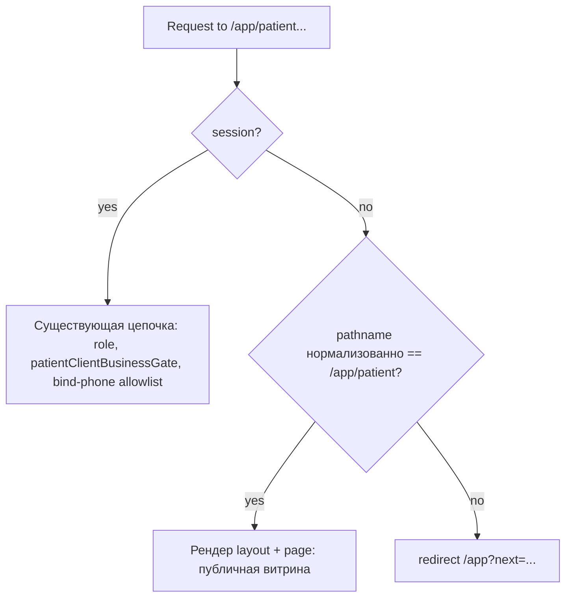

# Phase 4.5 — публичная главная и auth-on-drilldown

## Контекст (текущее состояние)

- [`apps/webapp/src/app/app/patient/layout.tsx`](apps/webapp/src/app/app/patient/layout.tsx): при `!session` всегда `redirect` на [`routePaths.root`](apps/webapp/src/app-layer/routes/paths.ts) с `next` — публичная главная сейчас **невозможна**.
- [`apps/webapp/src/app/app/patient/page.tsx`](apps/webapp/src/app/app/patient/page.tsx): дублирует редирект при отсутствии сессии.
- [`PatientHomeToday.tsx`](apps/webapp/src/app/app/patient/home/PatientHomeToday.tsx): тип `session: AppSession`; персональные запросы уже за `if (personalTierOk)` — для anonymous достаточно `personalTierOk === false` и не вызывать `resolvePatientCanViewAuthOnlyContent` без сессии.
- [`patientRouteApiPolicy.ts`](apps/webapp/src/modules/platform-access/patientRouteApiPolicy.ts): `isPatientHomePath` / `patientPageAllowsGuestOptionalSession` уже знают про `/app/patient`, но **layout этим не пользуется** для обхода редиректа; после фазы имеет смысл вынести **одну** каноническую функцию «разрешён ли layout без сессии» и вызывать её из layout + тестировать.

## Целевая политика маршрутов

- **Разрешить без сессии:** только канонический «дом» пациента: после [`normalizeAppPatientPath`](apps/webapp/src/modules/platform-access/patientRouteApiPolicy.ts) значение строго `"/app/patient"`. Query **не** входит в сравнение pathname из заголовка `x-bc-pathname` (как сейчас для `returnTo`). Trailing slash обрабатывается существующей нормализацией (уже покрыта в тестах `patientPathRequiresBoundPhone`).
- **Пустой pathname** (нет `x-bc-pathname` и referer не `/app/patient*`): **не** считать это публичной главной — редирект на логин с безопасным `next` (например `routePaths.patient`), чтобы не открывать shell при неизвестном контексте (согласуется с комментарием в policy про пустой pathname).

## Файлы и изменения по слоям

| Область | Файлы |
|--------|--------|
| Policy | [`patientRouteApiPolicy.ts`](apps/webapp/src/modules/platform-access/patientRouteApiPolicy.ts) — добавить экспорт, например `patientLayoutAllowsUnauthenticatedAccess(pathname: string): boolean` (или `patientHomePathAllowsAnonymousLayout`), реализованную через `normalizeAppPatientPath` + строгое равенство `"/app/patient"`. Обновить JSDoc: отличие от `patientPageAllowsGuestOptionalSession` (опциональная сессия **при наличии** пользователя / RSC) vs **полное отсутствие сессии** только на главной. |
| Экспорт | [`modules/platform-access/index.ts`](apps/webapp/src/modules/platform-access/index.ts) — re-export новой функции. |
| Layout | [`apps/webapp/src/app/app/patient/layout.tsx`](apps/webapp/src/app/app/patient/layout.tsx) — в ветке `!session`: если `patientLayoutAllowsUnauthenticatedAccess(pathname)` → не `redirect`, а рендер `<PatientClientLayout>{children}</PatientClientLayout>`; иначе текущий `redirect` с `next`. Остальная логика для `session` без изменений смысла. |
| Page | [`apps/webapp/src/app/app/patient/page.tsx`](apps/webapp/src/app/app/patient/page.tsx) — убрать `redirect` при `!session`; `getOptionalPatientSession()`; при `session === null`: `personalTierOk = false`, `canViewAuthOnlyContent = false`, не вызывать `patientRscPersonalDataGate` / `resolvePatientCanViewAuthOnlyContent`; `AppShell` с `user={null}`. Опционально: `patientHideRightIcons` (и при необходимости другие флаги шапки), чтобы не дергать [`useReminderUnreadCount`](apps/webapp/src/modules/reminders/hooks/useReminderUnreadCount.ts) через [`PatientHeader`](apps/webapp/src/shared/ui/PatientHeader.tsx) без сессии (соответствие требованию «без персональных запросов»). |
| Главный экран | [`PatientHomeToday.tsx`](apps/webapp/src/app/app/patient/home/PatientHomeToday.tsx) — `session: AppSession \| null`; при `null` не менять набор блоков относительно «non-personal» (уже обеспечивает [`filterAndSortPatientHomeBlocks`](apps/webapp/src/modules/patient-home/patientHomeBlockPolicy.ts) при `personalTierOk === false`). Убедиться, что нет скрытых обращений к `session.user` без guard. |
| Auth-on-drilldown UX | Карточки со ссылками на `/app/patient/*`: для **явного** guest-режима (`session === null`) использовать единый helper вида `withLoginNext(targetPath)` → `` `${routePaths.root}?next=${encodeURIComponent(targetPath)}` `` (путь из [`routePaths`](apps/webapp/src/app-layer/routes/paths.ts) или из данных CMS — **slug не хардкодить**, только динамические `encodeURIComponent` из resolver). Затронуть минимум: [`PatientHomeDailyWarmupCard.tsx`](apps/webapp/src/app/app/patient/home/PatientHomeDailyWarmupCard.tsx) («Начать разминку»), [`PatientHomeBookingCard.tsx`](apps/webapp/src/app/app/patient/home/PatientHomeBookingCard.tsx) (копия: «Войти, чтобы записаться» / разделение anonymous vs onboarding без tier — сейчас везде «Активировать профиль» через bind-phone), при необходимости [`PatientHomeSubscriptionCarousel`](apps/webapp/src/app/app/patient/home/PatientHomeSubscriptionCarousel.tsx) / courses row / SOS — если ведут на внутренние URL. [`PatientHomeSituationsRow`](apps/webapp/src/app/app/patient/home/PatientHomeSituationsRow.tsx): либо прокинуть флаг и менять `href` чипов на login+next, либо оставить прямые ссылки и полагаться на layout-редирект (ТЗ допускает оба; для единообразия копий «Войти, чтобы открыть…» предпочтительно явный login href). |
| Media caveat | **Не** менять [`/api/media/:id`](apps/webapp/src/app/api/media) и связанную политику. Деградация UI: при `session === null` не полагаться на загрузку защищённых превью — например в resolvers ([`patientHomeResolvers.ts`](apps/webapp/src/modules/patient-home/patientHomeResolvers.ts)) или узко в карточках: если `imageUrl` / hero — это префикс `/api/media/`, для анонима подставлять `null`/placeholder, чтобы использовались уже существующие fallback (инициалы в [`PatientHomeSituationsRow`](apps/webapp/src/app/app/patient/home/PatientHomeSituationsRow.tsx), отсутствие hero-картинки в разминке). Без эвристик по slug из CONTENT_PLAN. |
| Документация модуля | [`apps/webapp/src/modules/patient-home/patient-home.md`](apps/webapp/src/modules/patient-home/patient-home.md) — коротко: публичная главная, `session === null`, drilldown. |
| Журнал инициативы | [`docs/PATIENT_HOME_REDESIGN_INITIATIVE/LOG.md`](docs/PATIENT_HOME_REDESIGN_INITIATIVE/LOG.md) — запись Phase 4.5 по шаблону фаз (после реализации агентом). |

## Порядок реализации

1. **Policy + тесты** — новая функция + расширение [`patientRouteApiPolicy.test.ts`](apps/webapp/src/modules/platform-access/patientRouteApiPolicy.test.ts) (exact home, `/app/patient?foo`, trailing slash, отрицательные префиксы: `sections`, `content`, `reminders`, `messages`, пустой pathname).
2. **Layout** — условный bypass редиректа для anonymous только при положительной проверке pathname; экспорт из `platform-access`.
3. **page.tsx** — optional session, пропсы в `PatientHomeToday` и `AppShell`.
4. **PatientHomeToday + карточки** — тип `session | null`, login+next где нужно, media fallback для anonymous.
5. **RTL / интеграционные тесты главной** — три режима: `session === null`, авторизован без tier (`personalTierOk === false`), полный patient; проверки: нет персональных текстов/блоков для guest, нет вызова портов reminders/program (через mock `buildAppDeps` или существующий паттерн в webapp tests).
6. **Регрессия политики** — в тестах явно: внутренние пути не попадают в `patientLayoutAllowsUnauthenticatedAccess`; при желании отдельный тест на «документированный» список из README (messages, reminders, intake) через ту же функцию inverse.

## Тесты (конкретика)

| Тест | Назначение |
|------|------------|
| [`patientRouteApiPolicy.test.ts`](apps/webapp/src/modules/platform-access/patientRouteApiPolicy.test.ts) | Новая функция: разрешение только exact `/app/patient`; отказ для `/app/patient/foo`, `/app/patient/sections/...`, `/app/patient/content/...`, `""`. |
| Новый или расширенный [`PatientHomeToday.test.tsx`](apps/webapp/src/app/app/patient/home/PatientHomeToday.test.tsx) (если отсутствует — создать по аналогии Phase 3 README) | Whole-home: три сценария; для anonymous — отсутствие персональных узлов (имя, plan, reminder), при моках deps — что `listRulesByUser` / `listForPatient` не вызываются (assert на моках). Использовать **синтетические** slug/id в фикстурах, не строки из [`CONTENT_PLAN.md`](docs/PATIENT_HOME_REDESIGN_INITIATIVE/CONTENT_PLAN.md). |
| При необходимости узкий тест `page.tsx` | Только если удобно вынести логику выбора пропсов в тестируемую функцию; иначе покрыть через `PatientHomeToday` + policy. |
| Карточки (точечно) | Минимальные тесты на href при `session === null` для DailyWarmup/Booking (если логика нетривиальна). |

Phase-level gate по [`test-execution-policy.md`](.cursor/rules/test-execution-policy.md): targeted vitest + `pnpm --dir apps/webapp exec tsc --noEmit` + lint; full `pnpm run ci` — по политике инициативы не обязателен для этой фазы, если нет repo-level изменений.

## Риски

| Риск | Митигация |
|------|-----------|
| **Пустой `x-bc-pathname`** в редких контекстах | Не считать публичной главной; редирект на логин с `next=/app/patient`. |
| **OAuth `need_activation`**: в policy главная **запрещена** в [`PATH_PREFIXES_ALLOWED_DURING_PHONE_ACTIVATION`](apps/webapp/src/modules/platform-access/patientRouteApiPolicy.ts) — пользователь с сессией, но без телефона, по-прежнему не увидит `/app/patient` до bind-phone; аноним увидит. Это осознанное расхождение, не менять без продуктового решения. |
| **PatientHeader / polling** | Отключить правые иконки или напоминания-poll без сессии, чтобы не было лишних запросов к `/api/patient/...`. |
| **Слишком агрессивная очистка `/api/media/` для anonymous** | Ограничить только anonymous layout-bypass; авторизованный без tier сохраняет картинки, если API разрешает. |
| **Расхождение «guest optional session» в policy vs layout** | Явная документация в JSDoc + одна функция для «no session layout bypass». |

## Явные запреты (из ТЗ)

- Не открывать без сессии вложенные маршруты; не ослаблять `/api/media/:id`.
- Не хардкодить редакционные slug из [`CONTENT_PLAN.md`](docs/PATIENT_HOME_REDESIGN_INITIATIVE/CONTENT_PLAN.md); в тестах — произвольные placeholder-slug.
- Не менять CI workflow, cookies, модель сессии глобально.
