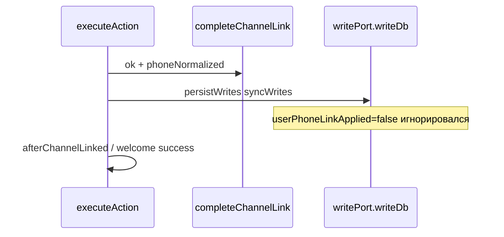
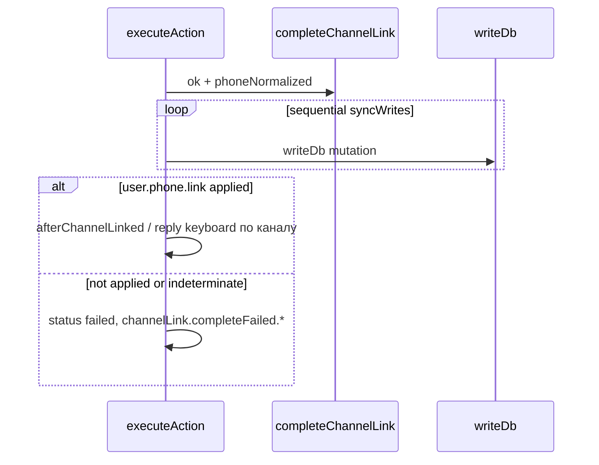

# План: integrator_id_mismatch + ложный успех после channel-link (закрыт)

**Канон в репозитории:** этот файл. Исходный черновик Cursor: `phone_bind_mismatch_ux_b62847ed.plan.md` (перенос в archive по правилам планов).

## Контекст

### Было (дефект)



- **(1)** [`packages/platform-merge/src/messengerPhonePublicBind.ts`](packages/platform-merge/src/messengerPhonePublicBind.ts): при `existingInt !== canonical` без второго `platform_users` под канон сразу `integrator_id_mismatch`, хотя канал уже у нужной строки — достаточно выровнять `public.platform_users.integrator_user_id` при отсутствии конфликта по уникальному ключу.

- **(2)** [`apps/integrator/src/kernel/domain/executor/executeAction.ts`](apps/integrator/src/kernel/domain/executor/executeAction.ts): после успешного `completeChannelLink` вызывался [`persistWrites`](apps/integrator/src/kernel/domain/executor/helpers.ts), который не учитывал возврат `writeDb` → при `userPhoneLinkApplied: false` всё равно отправлялись success-шаблоны.

### Стало (целевое поведение)



## Реализация (сводка по коду)

| Область   | Файл                                                      | Суть                                                                                                                                                                                                 |
| --------- | --------------------------------------------------------- | ---------------------------------------------------------------------------------------------------------------------------------------------------------------------------------------------------- |
| Self-heal | `packages/platform-merge/src/messengerPhonePublicBind.ts` | `UPDATE … integrator_user_id = canonical` с `NOT EXISTS` чужой строки с тем же id, `WHERE integrator_user_id::text = existingInt`; лог `phone_bind_realign_integrator_user_id`; `continue`           |
| Синк + UX | `apps/integrator/.../executeAction.ts`                    | Цикл `writeDb`; на `user.phone.link` разбор meta как в case `user.phone.link`; ранний `failed` + `message.send` через `channelLinkCompleteFailureTemplateKey`; `integrator_id_mismatch` → `…generic` |
| Результат | `values.channelLink`                                      | `ok: false`, `webappComplete: true`, `phoneLinkSync: { ok: false, reason? }` при сбое синка после HTTP success                                                                                       |
| Тесты     | `executeAction.test.ts`                                   | Фильтр `-t webapp.channelLink.complete` (9 кейсов): happy Telegram/Max, fail Max, fail Telegram                                                                                                      |

## Документация (синхрон с кодом)

| Документ                                                                       | Что отражено                                                                                                                                                 |
| ------------------------------------------------------------------------------ | ------------------------------------------------------------------------------------------------------------------------------------------------------------ |
| [`apps/webapp/INTEGRATOR_CONTRACT.md`](apps/webapp/INTEGRATOR_CONTRACT.md)     | После **200 ok** с `phoneNormalized` integrator всё ещё может завершить шаг **`failed`** и шаблоны `channelLink.completeFailed.*`; поля `values.channelLink` |
| [`apps/webapp/src/modules/auth/auth.md`](apps/webapp/src/modules/auth/auth.md) | §Channel link: сценарий «webapp complete ок, `user.phone.link` не применился»                                                                                |
| [`docs/TODO.md`](docs/TODO.md)                                                 | §Channel-link: закрыт TODO про рассинхрон успеха                                                                                                             |

## Проверки

```bash
pnpm --dir apps/integrator exec vitest run src/kernel/domain/executor/executeAction.test.ts -t "webapp.channelLink.complete"
pnpm --dir packages/platform-merge run typecheck
pnpm --dir apps/integrator run typecheck
```

Перед merge в remote: **`pnpm run ci`** (политика репозитория).

## Definition of Done (факт)

- [x] Self-heal `integrator_user_id` в `applyMessengerPhonePublicBind` при отсутствии merge-партнёра и конфликта по уникальности.
- [x] Нет success-intents при неуспешном `user.phone.link` внутри `webapp.channelLink.complete`.
- [x] Тесты и typecheck по затронутым пакетам; документация и контракт обновлены.
