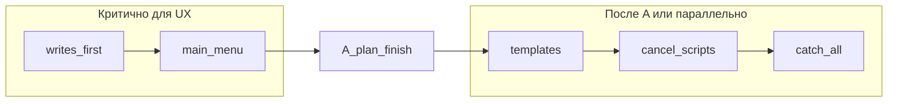

# План B: UX бота после привязки контакта (Telegram + Max)

**Связанный план:** [phone_messenger_bind_pwa_autologin.plan.md](phone_messenger_bind_pwa_autologin.plan.md).

## Порядок merge (канон)

| Приоритет | Todo / фаза | Зачем |
|-----------|-------------|--------|
| 1 | `phase-0-repro-baseline` | Baseline до/после |
| 2 | `execute-action-writes-first` + `login-main-menu-keyboard` | Снимает «успех + снова контакт» **до** или **вместе с** PWA finish |
| 3 | План A (finish + UI) | Автовход PWA |
| 4 | `bot-templates-no-otp-copy`, cancel, catch-all | Тексты и «Дмитрий» |
| 5 | `orchestrator-regressions` + verify | Gates и CI |

**Не полагаться на `$notIn: await_phoneauth:*`** — resolver поддерживает только точные state ([resolver.ts](apps/integrator/src/kernel/orchestrator/resolver.ts)); закрываем cancel scripts (priority 57) + excludeTexts.



## Контекст

| Симптом | Причина |
|---------|---------|
| «Аккаунт создан» + снова контакт | success до `user.phone.link`; login без reply menu; `oneTimeKeyboard` |
| Повторный гейт | `linkedPhone === false` после failed link |
| «Отмена» → Дмитрий | `menu.default` / `max.default` / `draft.replace` на текст в `await_phoneauth:*` |
| «Вернуться в меню» бесполезно | `contact.link.cancel` только `await_contact:subscription` |

Баг порядка: [executeAction.ts](apps/integrator/src/kernel/domain/executor/executeAction.ts) ~324–430 — intents до `writeDb`, без проверки результата.

## Scope

### Разрешено

| Область | Файлы |
|---------|--------|
| Executor | [executeAction.ts](apps/integrator/src/kernel/domain/executor/executeAction.ts), [executeAction.test.ts](apps/integrator/src/kernel/domain/executor/executeAction.test.ts) |
| Scripts | [telegram/.../scripts.json](apps/integrator/src/content/telegram/user/scripts.json), [max/.../scripts.json](apps/integrator/src/content/max/user/scripts.json) |
| Templates | [telegram/.../templates.json](apps/integrator/src/content/telegram/user/templates.json), [max/.../templates.json](apps/integrator/src/content/max/user/templates.json) |
| Orchestrator | [buildPlan.test.ts](apps/integrator/src/kernel/orchestrator/buildPlan.test.ts) |
| Docs | [PHONE_MESSENGER_AUTH_RUNBOOK.md](docs/OPERATIONS/PHONE_MESSENGER_AUTH_RUNBOOK.md), [auth.md](apps/webapp/src/modules/auth/auth.md), [INTEGRATOR_CONTRACT.md](apps/webapp/INTEGRATOR_CONTRACT.md), [LOG.md](docs/LOGIN_REGISTER_NEW_LOGIC/LOG.md) |

### Вне scope

- `messenger-bind/finish` (план A).
- Рефакторинг всего support/draft.
- `$notStartsWith` в resolver (если хватает cancel 57 + exclude).
- GitHub CI workflow.
- Backfill integrator/public.
- Удаление OTP challenge (нужен для finish в A).

## Шаг 0. Фаза 0 — воспроизведение

Записать в [LOG.md](docs/LOGIN_REGISTER_NEW_LOGIC/LOG.md) **до** правок и повторить **после** merge:

| # | Кейс | Ожидание после фикса |
|---|------|----------------------|
| 1 | PWA login → TG → контакт | PWA: автовход (A); бот: меню, не контакт (B) |
| 2 | После сообщения об успехе | Нет залипшей «Предоставить контакт» |
| 3 | «Отмена» (нативная) / «Вернуться в меню» в phoneauth | Нет `confirmQuestion` |
| 4 | `profile_bind` с сессией | consumed, без OTP; меню в TG |

## Шаг 1. `executeAction`: writes first + guard

1. M2M `completePhoneMessengerBind` ok.
2. **Сначала** sequential `writeDb`: `user.phone.link`, `user.state.set` → `idle` (как [channelLink.complete](phone_bind_mismatch_ux.plan.md)).
3. Результат:
   - `userPhoneLinkApplied === true` → success path (шаг 2–3).
   - `false` + `phoneLinkReason` → `phoneAuthFailed` / mismatch / conflict templates, **без** success и меню.
   - `phoneLinkIndeterminate === true` (transient) → failure «повторите позже», **без** success (не вводить в заблуждение).

**Проверка:** `executeAction.test.ts` — `userPhoneLinkApplied: false` и indeterminate → нет success/menu intents.

## Шаг 2. Главное меню после `login`

- **Telegram:** `replyKeyboard` — `menu.book` + `menu.app` (как `profile_bind` ~355–369).
- **Max:** `phoneAuthReturnToApp` + inline `menu.main` (`buildPhoneMessengerBindMainMenuIntents`; `expandContentMenuParam` в executor — раскрытие `menu` как в `buildPlan`).
- Локальный helper в executor (DRY login/profile_bind).

**Проверка:** login test — reply keyboard / max send intent с `inline_keyboard`.

## Шаг 3. Шаблоны без кода в TG

- `phoneAuthReturnToApp` (TG/Max): вход в приложение продолжится автоматически.
- Login branch: не `phoneAuthLoginCode` / `phoneAuthAccountCreated` с `{{code}}` (код остаётся в challenge для finish A).
- Fallback в шаблоне: если PWA закрыта — «откройте приложение снова из браузера».

**Проверка:** `rg phoneAuthLoginCode executeAction` — login branch не использует код в message.send.

## Шаг 4. Cancel phoneauth (priority 57)

Новые скрипты **TG + Max**, priority **57** (> `contact.phoneauth` 54):

- Match: `conversationState.$startsWith: "await_phoneauth:"` AND (`text` «Отмена» OR `action: phone.request.cancel`).
- Steps: `idle`; если `linkedPhone` — главное меню; иначе короткая отмена без re-gate contact (нужен новый `/start auth_*`).
- **Не** `draft.upsertFromMessage`.

**Проверка:** `buildPlan.test.ts` — «Отмена» в `await_phoneauth:auth_x` ≠ `telegram.menu.default`.

## Шаг 5. Catch-all

В `telegram.menu.default`, `max.default`, `telegram.draft.replace`:

- `excludeActions`: `phone.request.cancel`, `start.phoneauth`
- `excludeTexts`: `Отмена`, `Вернуться в меню`

`telegram.contact.link.cancel`: только `await_contact:subscription` (phoneauth — отдельные `*.phoneauth.cancel.*`).

**Max:** отдельный `max.contact.link.cancel` **не** добавляли — cancel через `max.phoneauth.cancel.*` + `mapIn` («Отмена» / «Вернуться в меню» → `phone.request.cancel`).

## Шаг 6. Orchestrator-регрессии

- `buildLinkedPhoneMessageMenuGatePlan`: после bind `linkedPhone: true` → `booking.open` не показывает contact ([resolver.ts](apps/integrator/src/kernel/orchestrator/resolver.ts) ~347).
- `buildLinkedPhoneCallbackGatePlan`: inline/callback «Запись» при `linkedPhone: true` — не contact gate (~430).
- `telegram.contact.link.remind` — только `await_contact:subscription`, не `idle`.
- `profile_bind` complete — меню + consumed без изменений.

**Проверка:** новые/расширенные кейсы в `buildPlan.test.ts`.

## Шаг 7. Edge: replay контакта

Повторный контакт при уже `otp_ready`: webapp replay — ok. Integrator не слать второй success с кодом; меню один раз. Зафиксировать в `executeAction.test` replay path если ещё нет.

## Definition of Done

- [x] После контакта TG/Max — главное меню, нет залипшего «Предоставить контакт».
- [x] Failed / indeterminate `user.phone.link` — нет «Аккаунт создан».
- [x] «Отмена» / «Вернуться в меню» в phoneauth — не `confirmQuestion`.
- [x] Max = TG по cancel, menu, failure.
- [x] `executeAction` + `buildPlan` тесты зелёные.
- [x] Runbook, auth.md, INTEGRATOR_CONTRACT, LOG обновлены.
- [x] Фаза 0 в LOG до и после (после — чеклист §Приёмка A+B).
- [x] **Полный E2E** с планом A: PWA автовход + бот + отмена — **cancelled** в рамках этой сессии: требует отдельного staging/prod smoke (чеклист в LOG).

## Проверки

```bash
pnpm --dir apps/integrator exec vitest run src/kernel/domain/executor/executeAction.test.ts -t phoneMessengerBind
pnpm --dir apps/integrator exec vitest run src/kernel/orchestrator/buildPlan.test.ts
```

Перед merge: `pnpm run ci`.

## Риски

| Риск | Митигация |
|------|-----------|
| Старый draft + «Отмена» | excludeTexts + cancel 57 |
| cancel vs menu.default score | priority 57, узкий match |
| PWA закрыта | шаблон phoneAuthReturnToApp |
| A без B (промежуточный релиз) | документировать в LOG |

## Milestone PR (рекомендация)

1. **PR1 (критичный UX):** `execute-action-writes-first` + `login-main-menu-keyboard` + тесты.  
2. **PR2:** план A (finish).  
3. **PR3:** cancel + catch-all + templates + orchestrator-regressions.

Допустим один PR, если все todos закрыты и полный smoke пройден.
