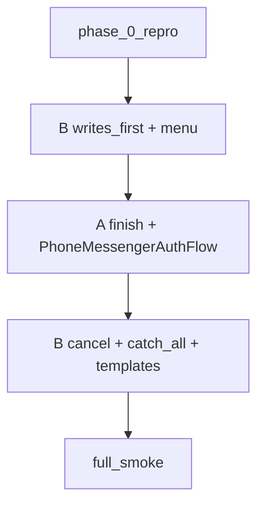
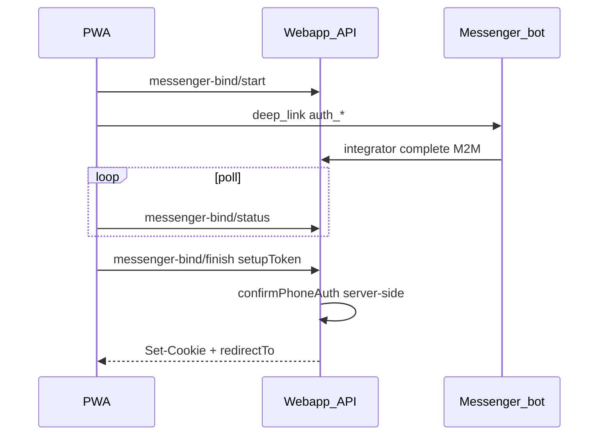

# План A: PWA автовход после контакта в мессенджере

**Связанный план:** [phone_messenger_bind_bot_ux.plan.md](phone_messenger_bind_bot_ux.plan.md).

## Порядок merge (канон)

Два допустимых режима — зафиксировать в PR, какой выбран:

| Режим | Последовательность | Когда |
|-------|-------------------|--------|
| **Оптимальный UX** | B: `execute-action-writes-first` + `login-main-menu-keyboard` → **A целиком** → хвост B (cancel, catch-all, шаблоны) | Один релиз / два PR подряд без паузы |
| **Быстрый webapp** | **A целиком** → B | PWA автовход раньше; бот может ещё показывать «успех» + залипший контакт до B |

**Полный приёмочный smoke** (PWA + меню в боте + отмена без Дмитрия) — чеклист в [LOG.md](docs/LOGIN_REGISTER_NEW_LOGIC/LOG.md) §«Приёмка A+B» (ручной, вне CI).



## Контекст

Сейчас (`purpose: login`):

1. PWA → `messenger-bind/start` → deep link `auth_*`.
2. Контакт → M2M `phone-messenger-bind/complete` → `otp_ready`.
3. Poll → **OtpCodeForm** → `phone/confirm`.

Контакт в мессенджере доказывает номер; браузер с `setupToken` — доверенная сторона для finish без OTP в UI.



## Scope

### Разрешено

| Область | Файлы |
|---------|--------|
| Bind | [phoneMessengerBind.ts](apps/webapp/src/modules/auth/phoneMessengerBind.ts), [phoneMessengerBind.test.ts](apps/webapp/src/modules/auth/phoneMessengerBind.test.ts) |
| API | [messenger-bind/finish/route.ts](apps/webapp/src/app/api/auth/phone/messenger-bind/finish/route.ts) (+ test) |
| DI | [buildAppDeps.ts](apps/webapp/src/app-layer/di/buildAppDeps.ts) |
| UI | [PhoneMessengerAuthFlow.tsx](apps/webapp/src/shared/ui/auth/PhoneMessengerAuthFlow.tsx), [.test.tsx](apps/webapp/src/shared/ui/auth/PhoneMessengerAuthFlow.test.tsx) |
| Docs | [PHONE_MESSENGER_AUTH_RUNBOOK.md](docs/OPERATIONS/PHONE_MESSENGER_AUTH_RUNBOOK.md), [auth.md](apps/webapp/src/modules/auth/auth.md), [INTEGRATOR_CONTRACT.md](apps/webapp/INTEGRATOR_CONTRACT.md), [LOG.md](docs/LOGIN_REGISTER_NEW_LOGIC/LOG.md) |

### Вне scope

- Integrator `executeAction` / scripts (план B).
- Тексты бота без кода (план B).
- `profile_bind` (poll `consumed` → `onProfileComplete`).
- «Уже привязан TG» → `phone/start` + ручной OTP.

## Шаги

### 0. Фаза 0 (общая с планом B)

Чеклист в [LOG.md](docs/LOGIN_REGISTER_NEW_LOGIC/LOG.md) **до** правок:

1. PWA login → TG → контакт — нет автовхода, висит ожидание/OTP.
2. После «Аккаунт создан» — снова «Предоставить контакт».
3. «Отмена» / «Вернуться в меню» → «Отправить ваш вопрос Дмитрию?».
4. `profile_bind` (сессия есть) — привязка без лишнего OTP.

### 1. `resolvePhoneMessengerBindLoginChallenge`

- `setupToken` (`auth_*`), `purpose === login`, `status === otp_ready`, `challenge_id`.
- Код только из `challengeStore` (не в JSON клиенту).
- Коды ошибок: `invalid_token`, `not_found`, `not_ready`, `challenge_expired`, `wrong_purpose`, `used_token` / `already_consumed`.

**Проверка:** `rg resolvePhoneMessengerBindLoginChallenge apps/webapp`.

### 2. `POST /api/auth/phone/messenger-bind/finish`

- Body: `setupToken`, опционально `browserCalendarIana` (как [phone/confirm](apps/webapp/src/app/api/auth/phone/confirm/route.ts)).
- Pipeline: `resolveLoginChallenge` → `confirmPhoneAuth` → `setSessionFromUser` → TZ.
- **Идемпотентность:**
  - secret `consumed` + `getCurrentSession()` ok → `200` + `redirectTo`;
  - `consumed` без сессии → `409` (`already_consumed` / «начните снова»);
  - двойной параллельный finish → один успех, второй идемпотентен или 409.
- Код OTP в body **не** принимать.

**Проверка:** route test; единственный route `messenger-bind/finish`.

### 3. `PhoneMessengerAuthFlow`

- `purpose === login` + `otp_ready` → `POST finish`, текст «Завершаем вход…».
- `finishingRef` — один finish на попытку bind.
- Успех: `markFreshLoginAfterAuth` + redirect.
- Ошибка: toast + `resetBindAttempt`.
- **`profile_bind`:** без изменений; при `otp_ready` для profile_bind по-прежнему `onProfileComplete` (не finish).

**Проверка:** тест без поля «Код подтверждения» для login messenger-bind.

### 4. Документация

- Runbook: login = poll → **finish**; smoke — LOG §Приёмка A+B.
- INTEGRATOR_CONTRACT: контракт finish + bot UX (план B).
- LOG: baseline, планы A/B, приёмка.

### 5. Ограничение приёмки только плана A

После merge **только A** допустимо:

- [x] PWA автовход (TG и Max, если bind через Max).
- [x] Меню в боте / нет залипшего контакта — **план B закрыт** (автотесты); ручной smoke — LOG §Приёмка A+B.

## Definition of Done

- [x] PWA login: контакт в TG/Max → cookie + редирект **без** OTP в браузере.
- [x] `profile_bind` и `phone/confirm` для других потоков без регрессии.
- [x] Тесты webapp по затронутым файлам зелёные.
- [x] Runbook, auth.md, INTEGRATOR_CONTRACT, LOG обновлены.
- [x] Фаза 0 задокументирована в LOG.
- [x] **Полный E2E** (с меню и отменой в боте) — **cancelled** в рамках этой сессии: требует отдельного staging/prod smoke (чеклист в LOG §Приёмка A+B).

## Проверки

```bash
pnpm --dir apps/webapp exec vitest run src/modules/auth/phoneMessengerBind.test.ts
pnpm --dir apps/webapp exec vitest run src/shared/ui/auth/PhoneMessengerAuthFlow.test.tsx
pnpm --dir apps/webapp exec vitest run src/app/api/auth/phone/messenger-bind/finish
```

Перед merge в main: `pnpm run ci` (см. `.cursor/rules/pre-push-ci.mdc`).

## Риски

| Риск | Митигация |
|------|-----------|
| Украденный `setupToken` | TTL 15 мин, consume, HTTPS |
| Двойной poll | `finishingRef` + server idempotent |
| PWA в фоне | poll до finish |
| A без B: вход в PWA, бот «кривой» | релиз-нота; B следом |
| Replay контакта до finish | webapp replay `otp_ready`; finish идемпотентен |

## Связанные доработки (2026-05-30)

Расширение bind/autologin и staff `isAdmin`: [`docs/BOT_FIXES/README.md`](../../docs/BOT_FIXES/README.md) · план [`.cursor/plans/archive/bot_fixes_staff_auth.plan.md`](archive/bot_fixes_staff_auth.plan.md).
