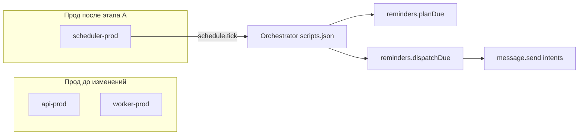

# План: напоминания в проде (scheduler) + хвосты из разбора

> Дубликат канона: `~/.cursor/plans/prod_reminder_scheduler_829b7cd4.plan.md` — держи содержимое синхронным при правках.

## Контекст

- Пациентские напоминания из `integrator.user_reminder_*` исполняются по [`apps/integrator/src/content/scheduler/scripts.json`](apps/integrator/src/content/scheduler/scripts.json) на **`schedule.tick`**: **`reminders.planDue`** → **`reminders.dispatchDue`** (далее intents `message.send`, в логах доставки — `intentEventId` с **`:reminder:`**).
- Точка входа: [`apps/integrator/src/infra/runtime/scheduler/main.ts`](apps/integrator/src/infra/runtime/scheduler/main.ts) → артефакт **`dist/infra/runtime/scheduler/main.js`** (собирается общим `tsc` integrator, [`tsconfig.build.json`](apps/integrator/tsconfig.build.json) включает весь `src/`).
- Лидерство: [`tryAcquireSchedulerLock`](apps/integrator/src/infra/db/repos/schedulerLocks.ts) с ключом `42001001`; при отказе — лог *«Scheduler lock not acquired…»* и **`process.exit(0)`** (важно для systemd — см. ниже).
- **Worker** ([`worker/main.ts`](apps/integrator/src/infra/runtime/worker/main.ts)) — очередь jobs + projection; логи **`booking-reminder:*`** относятся к **Rubitime**, не к пациентским `:reminder:`.
- На проде не было юнита scheduler — совпадает с [`ARCHITECTURE.md`](ARCHITECTURE.md) §«Отклонение 3».

## Границы scope

### В scope (этап A)

- integrator runtime/deploy/docs для запуска scheduler в production.
- Unit + bootstrap/deploy + sudoers + канонические docs + package scripts.
- Наблюдаемость и rollback-инструкции для оператора.

### Вне scope (этап A)

- Изменение бизнес-логики контента/категорий напоминаний.
- Рефактор `user_reminder_*`/`delivery-targets`/канальных правил.
- Изменения GitHub CI workflow.
- Любые новые env-переменные для интеграционных ключей/URI.

---

## Этап A — systemd + deploy + доки (обязательный)

## Execution log (обязателен)

- Вести журнал выполнения в `docs/OPERATIONS/REMINDER_SCHEDULER_ROLLOUT_LOG.md`.
- Для каждого шага фиксировать: дата/время, что изменено, проверки, результат, откат.

### A1. Unit-файл

- Новый файл: **`deploy/systemd/bersoncarebot-scheduler-prod.service`**, по образцу [`bersoncarebot-worker-prod.service`](deploy/systemd/bersoncarebot-worker-prod.service).
- Поля: `WorkingDirectory=/opt/projects/bersoncarebot/apps/integrator`, `EnvironmentFile=/opt/env/bersoncarebot/api.prod`, `ExecStart=/usr/bin/node dist/infra/runtime/scheduler/main.js`, `Restart=always` (или итог после пункта **«systemd и lock»**).
- Чеклист:
  - [ ] Unit использует `api.prod` и не вводит новый env-файл.
  - [ ] `ExecStart` совпадает с build-артефактом `dist/infra/runtime/scheduler/main.js`.
  - [ ] Restart-политика согласована с разделом «systemd и lock».

### A2. `bootstrap-systemd-prod.sh`

- Установка unit в `/etc/systemd/system/`, `daemon-reload`.
- Ветка `enable --now`: расширить условие наличия артефактов — **`dist/infra/runtime/worker/main.js` И `dist/infra/runtime/scheduler/main.js`** (и как сейчас `api.prod`, `dist/main.js`).
- В ветке «только enable» — `systemctl enable` для scheduler.
- Чеклист:
  - [ ] Scheduler unit ставится в той же точке, что API/worker.
  - [ ] Проверка артефактов не ломает первый bootstrap.
  - [ ] Нет регрессии веток webapp/media-worker.

### A3. `deploy-prod.sh`

- Константа **`SCHEDULER_SERVICE=bersoncarebot-scheduler-prod.service`**.
- Блок **`sudo install`** unit-файла из репозитория — **рядом** с API/worker (до `require_unit_file`), затем `require_sudo_rule` для install scheduler (по образцу worker).
- **`require_unit_file "${SCHEDULER_SERVICE}"`** после того как unit гарантированно лежит в `/etc/systemd/system/`.
- После **`pnpm migrate`** (когда уже есть свежий `pnpm build`): **`systemctl restart`** scheduler **вместе** с API и worker ([сейчас](deploy/host/deploy-prod.sh) `restart` API+worker сразу после migrate — вставить scheduler в тот же блок или сразу после worker).
- **`is-active`** + при ошибке вывод **`journalctl -u ${SCHEDULER_SERVICE} -n 40`** — зеркально worker/API.
- Пройтись **`rg`** по репо на списки сервисов для stop/restart (например [`HOST_DEPLOY_README.md`](deploy/HOST_DEPLOY_README.md) около остановки сервисов / `deploy-prod`) и **добавить scheduler**, чтобы ручные runbook не расходились с деплоем.
- Чеклист:
  - [ ] Scheduler включён в install/restart/is-active/fail diagnostics.
  - [ ] Порядок деплоя не ломает текущие health-check API/webapp.
  - [ ] При падении scheduler причина видна в последних 40 строках journal.

### A4. `deploy/sudoers-deploy.example`

- Строки NOPASSWD: `install …-scheduler-prod.service`, `enable`, `enable --now`, `restart`, `is-active`, `journalctl -u …-scheduler-prod.service` — зеркально worker/media-worker.
- Чеклист:
  - [ ] Перечень команд строго соответствует deploy/bootstrap.
  - [ ] Нет расширения прав beyond необходимых команд.

### A5. Документация

| Файл | Что добавить |
|------|----------------|
| [`docs/ARCHITECTURE/SERVER CONVENTIONS.md`](docs/ARCHITECTURE/SERVER%20CONVENTIONS.md) | Строка в таблице units; подпункт **Scheduler**: нет публичного порта, `api.prod`, имя unit, связь с `schedule.tick` и напоминаниями + **короткий операторский journalctl** (отдельный `-u` только scheduler). |
| [`deploy/HOST_DEPLOY_README.md`](deploy/HOST_DEPLOY_README.md) | Scheduler в списке units, restart/stop где перечислены сервисы, явное **различие** scheduler vs worker vs media-worker. |
| [`ARCHITECTURE.md`](ARCHITECTURE.md) | Убрать/переписать **«Отклонение 3»**; зафиксировать тройку процессов: API / worker / scheduler. |
| [`deploy/env/README.md`](deploy/env/README.md) | Если там перечислены prod services — добавить scheduler. |
| [`apps/webapp/INTEGRATOR_CONTRACT.md`](apps/webapp/INTEGRATOR_CONTRACT.md) и при необходимости [`apps/webapp/src/app/api/api.md`](apps/webapp/src/app/api/api.md) | Однозначно: **пациентские напоминания по правилам** в проде идут через **integrator scheduler + dispatchDue**, а не через обязательный вызов **`POST /api/integrator/reminders/dispatch`** ([заглушка](apps/webapp/src/modules/integrator/reminderDispatch.ts)), чтобы контракт не вводил в заблуждение. |

### A6. Скрипты `package.json` (рекомендуется, не «опционально мимо CI»)

- [`apps/integrator/package.json`](apps/integrator/package.json): `scheduler:dev` (`tsx watch src/infra/runtime/scheduler/main.ts`), `scheduler:start` (`node dist/infra/runtime/scheduler/main.js`).
- Корневой [`package.json`](package.json): алиасы `scheduler:dev`, `scheduler:start:host` по образцу `worker:*`.
- Чеклист:
  - [ ] Имена консистентны с `worker:*`.
  - [ ] Скрипты не конфликтуют с текущим CI.

---

## systemd и lock (важно улучшить в рамках того же PR)

Сейчас при **не**получении lock процесс делает **`process.exit(0)`** ([`main.ts`](apps/integrator/src/infra/runtime/scheduler/main.ts)). При **`Restart=always`** второй инстанс на той же БД (ошибочно второй хост или дубликат unit) будет **в цикле**: старт → lock fail → exit 0 → немедленный рестарт.

**Варианты (выбрать один и зафиксировать в PR):**

1. **Операционный минимум:** в доке явно: «ровно один scheduler на кластер БД»; не поднимать второй unit.
2. **Код + unit (предпочтительно):** при неполучении lock — **`process.exit(1)`** (или иной non-zero) **и** в unit для scheduler — **`Restart=on-failure`** + разумный **`RestartSec=`**, чтобы не DOS’ить БД; на единственном лидере lock всегда берётся — поведение не меняется.

В плане заложить явную задачу todo **`lock-restart-hardening`**: согласовать поведение с DevOps, обновить unit/код и кратко описать в SERVER CONVENTIONS.

Рекомендуемый default для PR:

- Unit scheduler: `Restart=on-failure`, `RestartSec=5`.
- Для lock-fail в коде выбрать и зафиксировать один из вариантов (`exit 0` или `exit 1`) строго в связке с unit-политикой, чтобы исключить spin-loop.

---

## Частота тиков и нагрузка

- Интервал задаётся **`appSettings.runtime.scheduler.pollIntervalMs`** ([`appSettings.ts`](apps/integrator/src/config/appSettings.ts)), сейчас **5000 ms** (жёстко в коде, не из env). Это ~**17k** тиков/сутки на инстанс — для прода обычно приемлемо, но при росте числа правил/occurrence стоит мониторить CPU и время одного тика.
- В плане приёмки: после включения — **нет** постоянного `Runtime scheduler tick failed` в journal scheduler unit.

---

## Проверки (чеклист)

**Локально после PR**

- `pnpm --dir apps/integrator build` → существует `apps/integrator/dist/infra/runtime/scheduler/main.js`.
- `pnpm run ci` в корне перед merge (барьер репозитория; **не** менять GitHub workflow без отдельного решения команды).

**На хосте после деплоя**

- `systemctl is-active bersoncarebot-scheduler-prod.service` → `active`.
- `journalctl -u bersoncarebot-scheduler-prod.service -n 80 --no-pager` → есть **`Scheduler lock acquired, starting scheduler loop`** (лидер); при намеренном втором инстансе — осмысленное поведение по выбранной политике lock/restart (без busy-loop).
- Следы диспатча пациентских напоминаний: **`delivery attempt log`** с `intentEventId`, содержащим **`:reminder:`** — смотреть journal **того процесса, который выполнил тик** (после внедрения unit — прежде всего **`bersoncarebot-scheduler-prod`**; при вынесении async-доставки в очередь — также worker).
- Rollback:
  - [ ] `systemctl stop bersoncarebot-scheduler-prod.service` не влияет на API/worker.
  - [ ] Возврат deploy/systemd-правок к предыдущей ревизии + `daemon-reload` описан в execution log.

**Definition of Done (этап A)**

- Репозиторий: unit + обновлённые `bootstrap` / `deploy-prod` / `sudoers` example + обновлённые канонические доки + (при согласовании) правка exit/restart для lock.
- Прод: unit enabled/active; scheduler стартует; при тестовом пользователе с правилом и каналом — цепочка диспатча воспроизводима по логам.

---

## Этап B — отдельный PR (продукт + безопасность + контракт)

1. **MAX без Telegram** — [`getDueReminderOccurrences`](apps/integrator/src/infra/db/repos/reminders.ts): `JOIN identities … telegram` отсекает пользователей; перепроектировать выборку + тесты (`readPort` / executor).
2. **Пустой `channelBindings`** при успешном GET delivery-targets — в [`reminders.dispatchDue`](apps/integrator/src/kernel/domain/executor/handlers/reminders.ts) все каналы отрезаются; при необходимости политика «null bindings = не фильтровать» vs явный fail — отдельное продуктовое решение + тест.
3. **Логи БД** — убрать логирование полного **`connectionString`** с паролем (поиск по `[db][pool]` / `connectionString` в integrator).
4. **`POST /api/integrator/reminders/dispatch`** — после `rg` на потребителей: либо реализация под контракт, либо явный **410/503 + док**, либо узкий deprecation; не ломать тесты [`route.test.ts`](apps/webapp/src/app/api/integrator/reminders/dispatch/route.test.ts) без осознанного изменения контракта.

---

## Вне репозитория (ops)

- Обновить **реальный** `/etc/sudoers.d/` для пользователя `deploy` по обновлённому example — иначе `deploy-prod.sh` упадёт на `sudo -n`.
- Если пароль БД светился в journal — **ротация** (вне scope кода).

## Риски (сжато)

- **Два лидера на одной БД** — lock + restart policy (см. выше).
- **Один хост деплоя** — scheduler и API делят `api.prod`; секреты не дублировать в новых env-файлах (тот же `api.prod`).
