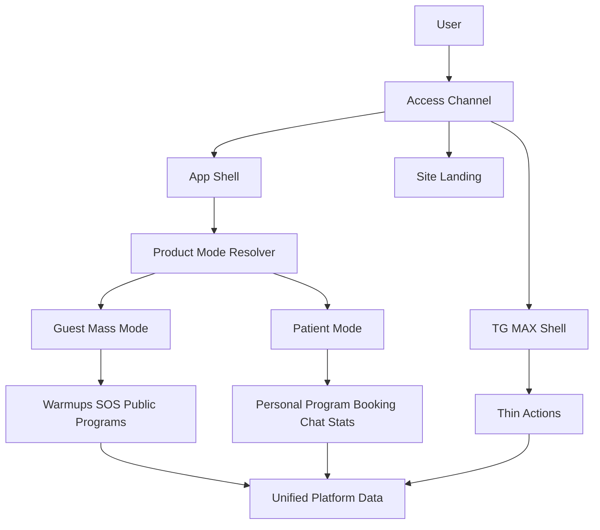

# Roadmap Платформы: Режимы, Каналы, Массовый Вход

## Цель
Построить одну платформу с единым пользователем, единым контентом и несколькими каналами доступа: приложение как основной интерфейс, Telegram/MAX как тонкие каналы, сайт как витрина, админка как центр управления.

Текущий клинический patient mode не переписываем: он становится Patient Mode. Новый слой добавляется вокруг него: Guest/Mass Mode, канальные оболочки и product-status поверх существующего access-tier.

## Scope Boundaries

Разрешено трогать в рамках roadmap:
- `apps/webapp/src/app/app/tg/**`, `apps/webapp/src/app/app/max/**`, `apps/webapp/src/app/app/AppEntryRsc.tsx` — entry/channel shell.
- `apps/webapp/src/app/app/patient/**` — только для разделения shell/mode и переиспользования booking/home blocks.
- `apps/webapp/src/app-layer/routes/**`, `apps/webapp/src/shared/lib/platform*`, `apps/webapp/src/shared/ui/**` — routing, shell, shared UI.
- `apps/webapp/src/modules/platform-access/**`, `apps/webapp/db/schema/**`, migrations — только когда вводим product-status отдельно от access-tier.
- `apps/webapp/src/modules/patient-home/**`, CMS/content modules — mass home, warmups, SOS.
- `apps/webapp/src/modules/patient-notifications/**`, `apps/webapp/src/modules/reminders/**`, integrator dispatch — настройки каналов уведомлений.
- Booking hub: `apps/webapp/src/app/app/patient/booking/**`, `apps/webapp/src/modules/patient-booking/**`, memberships.

Вне scope без отдельного решения:
- Не делать отдельный кабинет в Telegram/MAX.
- Не дублировать CMS-контент, рассылки, SOS и разминки под каждый канал.
- Не менять клиническое ядро программ лечения без явной необходимости.
- Не вводить оплату/подписки до появления стабильного guest/mass mode и access rules.
- Не смешивать `access-tier patient` с продуктовым статусом `patient`.

## Целевая Схема

## Этап 0. Зафиксировать каноны и названия

Цель: снять будущую путаницу между текущим `tier=patient` и новым продуктовым `patient`.

Сделать:
- Ввести терминологию в docs: `accessTier` (`guest/onboarding/patient`) отдельно от `productStatus` (`guest/lead/customer/patient/archived_patient`).
- Зафиксировать, что текущий `/app/patient` после разделения станет Patient Mode shell, а не единственным приложением.
- Зафиксировать, что Telegram/MAX — channel shell + delivery channel, не кабинет.

Проверки:
- `rg "tier.*patient|productStatus|archived_patient|lead|customer" docs apps/webapp/src/modules/platform-access`.
- Документ должен явно говорить: бот-привязка максимум `lead`, specialist/admin включает `patient`.

Критерий закрытия:
- Есть один roadmap/ADR-документ, который можно использовать как источник правды перед кодом.

## Этап 1. Channel Shell для `/app/tg` и `/app/max`

Цель: отделить канальные особенности от общего patient/app render.

Сделать:
- Оставить `/app/tg` и `/app/max` отдельными entry routes.
- Вынести общий miniapp shell: platform cookies, compact chrome, auth bootstrap, safe redirects.
- Подключать общий контент через shared components, а не копировать страницы.
- Для авторизованного пользователя вести в app target/deep link; для неавторизованного — показать channel-specific registration/bind screen.

Локальные файлы:
- `apps/webapp/src/app/app/tg/page.tsx`
- `apps/webapp/src/app/app/max/page.tsx`
- `apps/webapp/src/app/app/AppEntryRsc.tsx`
- `apps/webapp/src/shared/lib/platform.md`
- `apps/webapp/src/shared/lib/platformCookie.server.ts`

Проверки:
- `/app/tg` и `/app/max` не содержат бизнес-дубликатов patient pages.
- `rg "routeBoundMessengerSurface|bersoncare_messenger_surface|bersoncare_platform" apps/webapp/src`.
- Узкие тесты entry classification/platform cookies.

Критерий закрытия:
- Канал можно менять визуально/поведенчески без усложнения `/app/patient/layout.tsx`.

## Этап 2. Guest/Mass Mode без регистрации

Цель: приложение начинает давать пользу без аккаунта.

Сделать:
- Ввести отдельный public/mass app shell или public branch до guarded patient shell.
- Home mass mode: "Что беспокоит сегодня", разминка дня, SOS, 3-дневный старт, базовый прогресс локально/серверно после регистрации.
- Все персональные действия закрыть CTA регистрации: напоминания, запись, история, абонементы, покупки, чат, персональные программы.
- Не открывать guest через текущий `apps/webapp/src/app/app/patient/layout.tsx` без декомпозиции guard-логики.

Локальные файлы:
- `apps/webapp/src/app/app/patient/layout.tsx` — только как граница guarded mode.
- Новый app/mass route или shell рядом с patient routes.
- `apps/webapp/src/app/app/patient/home/**` — переиспользуемые карточки, если подходят.
- `apps/webapp/src/modules/patient-home/**` — адаптеры public home blocks.

Проверки:
- Аноним может открыть mass home без редиректа на login.
- `rg "redirect\(.*routePaths.root|patientClientBusinessGate|getCurrentSession" apps/webapp/src/app/app` — проверить, что guest не проходит через лишний guarded layout.
- Smoke: guest home, login CTA with `next`, registered user return.

Критерий закрытия:
- Без сессии доступен полезный основной экран, но нет доступа к персональным данным и мутациям.

## Этап 3. Product Status Model

Цель: отделить жизненный статус пользователя от технического access-tier.

Сделать:
- Добавить product statuses: `guest`, `lead`, `customer`, `patient`, `archived_patient`.
- Определить источники статусов:
  - guest: нет канона или нет регистрации.
  - lead: канал/контакт/тест/3-дневный старт.
  - customer: покупка/подписка/курс.
  - patient: specialist/admin active support или active personal doctor program.
  - archived_patient: бывший пациент без активного сопровождения.
- Mode resolver: active doctor personal program/support -> Patient Mode; customer/lead/guest -> Mass Mode с доступами; archived -> Mass Mode + блок прошлой программы.

Локальные файлы:
- `apps/webapp/db/schema/schema.ts` или отдельная schema file для product status.
- `apps/webapp/src/modules/platform-access/**` — только если нужен resolver рядом, но не смешивать с access-tier.
- `apps/webapp/src/modules/doctor-client-card/**`, `doctor_patient_support` — источник patient/archived.

Проверки:
- Unit tests для resolver matrix.
- `rg "tier.*patient" apps/webapp/src` — убедиться, что product mode не завязан на старый tier.
- Миграция/backfill: existing active doctor program/support -> product patient.

Критерий закрытия:
- UI-режим выбирается без ручного выбора "я пациент".

## Этап 4. Mode-Aware Navigation и Home

Цель: два режима приложения без поломки текущего patient cabinet.

Сделать:
- Patient Mode nav: Сегодня / Упражнения / Статистика / Запись / Чат.
- Mass Mode nav: Сегодня / SOS / Разминки / Программы / Профиль.
- PatientHome сохранить близко к текущему.
- Public/MassHome сделать отдельным компонентом, не условными блоками внутри одного большого компонента.
- Booking убрать из mass nav, оставить как контекстный CTA.

Локальные файлы:
- `apps/webapp/src/app-layer/routes/navigation.ts`
- `apps/webapp/src/shared/ui/patient/PatientPrimaryNavStrip.tsx`
- `apps/webapp/src/shared/ui/PatientBottomNav.tsx`
- `apps/webapp/src/app/app/patient/home/**`

Проверки:
- RTL tests nav order for both modes.
- Snapshot/behavior tests active nav detection.
- Manual smoke: patient with active doctor program, guest/lead/customer, archived patient.

Критерий закрытия:
- Текущий patient UX сохранён, mass user больше не видит clinical-only вкладки как основной путь.

## Этап 5. Booking Hub как единая страница записи

Цель: закрепить страницу записи как общий системный хаб, не бот-кабинет.

Сделать:
- Сохранить текущие блоки: актуальные записи, история, быстрый wizard, подготовка, адрес, как найти кабинет.
- Оставить отображение абонементов: всего/осталось, статус, оплата, детализация.
- Для mass mode показывать запись контекстно: CTA после SOS/red flags/test/no improvement/profile.
- Для patient mode оставить отдельную вкладку "Запись".
- В боте показывать только короткие карточки и deep links на booking hub.

Локальные файлы:
- `apps/webapp/src/app/app/patient/booking/new/page.tsx`
- `apps/webapp/src/app/app/patient/booking/PatientMembershipsSection.tsx`
- `apps/webapp/src/modules/patient-booking/**`
- `apps/webapp/src/modules/memberships/**`

Проверки:
- Booking page renders upcoming, history, memberships.
- API guards still require registered/trusted access for mutations.
- No duplicate booking history UI in Telegram/MAX channel shell.

Критерий закрытия:
- Запись и абонементы доступны из одного места в приложении; бот ведёт туда ссылками.

## Этап 6. Единая модель уведомлений и рассылок

Цель: не создать много дублей рассылок и контента.

Сделать:
- Один notification topic catalog, много delivery channels: PWA/Web Push/Telegram/MAX/SMS/email later.
- В приложении единый экран предпочтений каналов.
- В боте разрешить быстрые действия: mute topic in bot, тишина до завтра, открыть настройки.
- Рассылки врача/админа должны иметь один intent/content, а доставка решает каналы.

Локальные файлы:
- `apps/webapp/src/modules/patient-notifications/**`
- `apps/webapp/src/modules/reminders/**`
- `apps/integrator/src/kernel/domain/reminders/**`
- `docs/ARCHITECTURE/DOCTOR_BROADCASTS.md`

Проверки:
- `rg "topicChannelPrefs|user_notification_topic_channels|broadcast_audit|outgoing_delivery_queue" apps`.
- Tests: disable in bot affects only messenger channel, not master topic unless explicitly selected.
- Delivery audit shows one source intent, multiple channel attempts.

Критерий закрытия:
- Нет отдельных "бот-рассылок" и "app-рассылок" для одного события.

## Этап 7. Warmups и SOS как структурированный mass content

Цель: перейти от карточек CMS к сценариям, которые можно измерять и развивать.

Сделать:
- На первом шаге можно оставить CMS как storage, но ввести строгий contract: category, symptom area, duration, level, red flags, before/after score requirements.
- Затем решить: отдельные таблицы `warmups`, `sos_protocols` или structured CMS content type.
- Добавить before/after check-in для SOS и разминки.
- Сделать 5–7 стартовых SOS-протоколов.

Локальные файлы:
- `apps/webapp/src/modules/patient-home/**`
- CMS/content modules.
- Diary/mood modules for before/after metrics.

Проверки:
- `rg "systemParentCode.*sos|systemParentCode.*warmups" apps/webapp/src apps/webapp/db`.
- Contract tests for parsing/validating SOS/warmup metadata.
- Smoke: start SOS -> before score -> steps -> after score -> next step CTA.

Критерий закрытия:
- Mass mode имеет не просто статьи, а измеримые сценарии помощи.

## Этап 8. Public Programs, Courses, Access Rules

Цель: подготовить монетизацию без смешивания с персональными программами.

Сделать:
- Ввести access rules: `free`, `lead_only`, `subscription`, `course_purchase`, `patient_only`, `specialist_assigned`.
- Развести public program, purchased course, personal program.
- Не натягивать все курсы на doctor treatment program, если курс self-paced.
- Добавить progress для public/course отдельно от clinical progress.

Локальные файлы:
- `docs/COURSES_INITIATIVE/README.md` — актуализировать решение.
- Course modules / future schema.
- `apps/webapp/src/modules/treatment-program/**` — только для границ и интеграции, не как универсальный движок курсов.

Проверки:
- Tests for access resolver matrix.
- Guest/lead/customer/patient access smoke.
- No direct env config for access/integrations; paid config через DB/settings where applicable.

Критерий закрытия:
- Можно продавать курс/доступ без превращения покупателя в patient.

## Этап 9. Монетизация и подписки

Цель: подключать оплату после готовности статусов и access rules.

Сделать:
- Разовые покупки курсов/мини-программ.
- Подписка на библиотеку/расширенную статистику.
- Paywall как app-level access UI, не ботовая логика.
- Бот может уведомлять об оплате/доступе и вести в app; оформление в боте — отдельный будущий эксперимент.

Проверки:
- Payment state -> productStatus customer.
- Purchase grants access without patient mode.
- Refund/expired subscription removes access without deleting history.

Критерий закрытия:
- Customer mode работает отдельно от patient mode.

## Этап 10. Финальная полировка каналов и сайта

Цель: довести внешние входы до целевой роли.

Сделать:
- Сайт: лендинг, SEO-страницы, app install, course pages, legal, booking/request forms.
- Telegram/MAX: notifications, booking cards, deep links, bot delivery preferences, support contact.
- Deep links: `/app/today`, `/app/warmups/:id`, `/app/sos/:id`, `/app/programs/:id`, `/app/patient/program`, `/app/booking`, `/app/chat`, `/app/install`.

Проверки:
- Deep link fallback: installed/PWA/browser/miniapp.
- Bot messages open correct app targets.
- SEO pages do not become separate account cabinet.

Критерий закрытия:
- Каналы ведут в один кабинет/приложение и не расходятся по данным.

## Definition of Done для всего roadmap

- Два режима приложения работают независимо: Mass Mode и Patient Mode.
- Product status не смешан с access-tier.
- `/app/tg` и `/app/max` являются channel shells, не отдельными кабинетами.
- Booking hub показывает актуальные записи, историю, подготовку, адрес и абонементы.
- Уведомления и рассылки имеют один источник контента/intent и несколько каналов доставки.
- Mass content имеет измеримые сценарии: warmups, SOS, before/after, progress.
- Customer может покупать/проходить контент без patient status.
- Patient status включается специалистом/админом или активной персональной doctor-программой.
- Бот не содержит полный дневник, каталог или отдельную статистику.

## Рекомендуемый порядок запуска

1. Этапы 0–1 — маленький архитектурный фундамент.
2. Этапы 2–4 — главный продуктовый перелом: два режима.
3. Этап 5 — закрепить booking hub, так как он уже почти готов.
4. Этап 6 — защититься от дублей рассылок до расширения каналов.
5. Этапы 7–9 — mass content и деньги.
6. Этап 10 — внешние входы и deep links после стабилизации ядра.

## Основные риски

- Слишком рано делать оплату: без product statuses и access rules появится путаница customer vs patient.
- Встраивать guest в текущий guarded patient layout: вырастут редиректы и исключения.
- Делать бота вторым кабинетом: появятся дубли дневника, контента и статистики.
- Использовать `assignment_source=promo/course` как универсальную модель для всех public programs без проверки UX и данных.
- Не зафиксировать единый контентный source: CMS, рассылки и bot templates начнут расходиться.