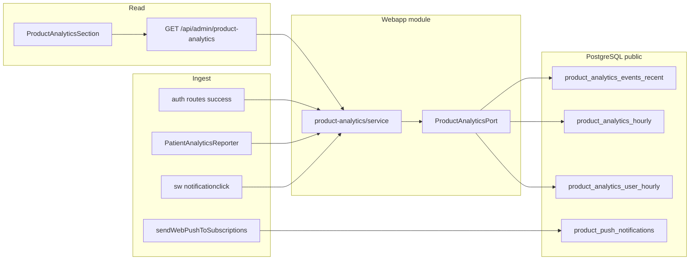

# План: продуктовая аналитика (заходы, страницы, push-open, активность клиентов)

## Цель

Собирать метрики использования приложения **без тяжёлых process-логов**: короткий raw-слой + **почасовые rollups** (как [`media_playback_stats_hourly`](apps/webapp/db/schema/schema.ts)) и **per-user hourly** для активности клиентов. Admin: **отдельная вкладка** в `/app/settings` (не путать с существующей «Статистика» = `reminder-stats`).

## Архитектура (целевой поток)



## Scope

**Разрешено трогать:**
- [`apps/webapp/db/schema/`](apps/webapp/db/schema/), [`apps/webapp/db/drizzle-migrations/`](apps/webapp/db/drizzle-migrations/), [`apps/webapp/drizzle.config.ts`](apps/webapp/drizzle.config.ts)
- [`apps/webapp/src/modules/product-analytics/`](apps/webapp/src/modules/product-analytics/) (новый)
- [`apps/webapp/src/infra/repos/pgProductAnalytics.ts`](apps/webapp/src/infra/repos/pgProductAnalytics.ts) + inMemory
- [`apps/webapp/src/app-layer/di/buildAppDeps.ts`](apps/webapp/src/app-layer/di/buildAppDeps.ts)
- [`apps/webapp/src/app/api/patient/analytics/*`](apps/webapp/src/app/api/patient/analytics/), [`apps/webapp/src/app/api/admin/product-analytics/`](apps/webapp/src/app/api/admin/product-analytics/)
- [`apps/webapp/src/app/api/internal/product-analytics/retention/`](apps/webapp/src/app/api/internal/product-analytics/retention/)
- [`apps/webapp/public/sw.js`](apps/webapp/public/sw.js), web-push copy/send, patient shell bootstrap
- [`apps/webapp/src/app/app/settings/`](apps/webapp/src/app/app/settings/) — новая admin-вкладка + секция UI
- [`docs/PRODUCT_ANALYTICS_INITIATIVE/LOG.md`](docs/PRODUCT_ANALYTICS_INITIATIVE/LOG.md), [`apps/webapp/src/app/api/api.md`](apps/webapp/src/app/api/api.md)

**Вне scope (явно не делать в этом плане):**
- Новые env / `system_settings` для включения аналитики (всегда on; при необходимости feature flag — отдельная задача)
- Аналитика кликов в Telegram/MAX боте (только webapp/PWA)
- Изменение GitHub CI workflow
- Рефактор всех auth routes на единый helper (только перечисленные точки входа)

## Критические уточнения перед реализацией

1. **Один источник `app_open`:** не дублировать событие из [`/api/patient/pwa/launch`](apps/webapp/src/app/api/patient/pwa/launch/route.ts) и из `PatientAnalyticsReporter` в одном и том же клиентском цикле. Канон: `app_open` шлёт только reporter; `pwa/launch` остаётся совместимым endpoint-алиасом для snapshot, который проксирует в тот же service без второго инкремента.
2. **Auth hook-точка:** не внедрять `buildAppDeps()` внутрь [`setSessionFromUser`](apps/webapp/src/modules/auth/service.ts), чтобы не раздувать низкоуровневый auth helper. Канон: запись `auth_login` на уровне route/callback orchestration рядом с уже существующим `setSessionFromUser(...)`.
3. **SW click fallback:** `notificationclick` в [`sw.js`](apps/webapp/public/sw.js) пишет push-open best-effort; если `fetch` неуспешен, не блокировать `focus/navigate/openWindow` и не делать повторные попытки в цикле.
4. **Dedupe push-open:** dedupe на сервере обязателен по `push_tracking_id` (idempotent upsert), иначе повторный клик/двойной tap искажает open rate.
5. **PII и payload:** в analytics metadata не хранить `initData`, JWT token query, email/phone; только технические enum/ids/flags.

## Модель данных (Drizzle)

Добавить [`apps/webapp/db/schema/productAnalytics.ts`](apps/webapp/db/schema/productAnalytics.ts) и зарегистрировать в [`drizzle.config.ts`](apps/webapp/drizzle.config.ts).

### 1. `product_push_notifications` (факт отправки push)

Создаётся **до** `webpush.send`, одна строка на логическое уведомление.

| Поле | Назначение |
|------|------------|
| `id` (uuid, PK) | `pushTrackingId` в payload SW |
| `user_id` | `platform_users.id` |
| `topic_code`, `intent_type` | тема / тип (reminder, broadcast, …) |
| `occurrence_id` | nullable, связь с напоминанием |
| `push_kind` | `warmup` \| `training` \| `custom` \| `news` \| … |
| `warmup_slogan_key` | стабильный ключ фразы из пула (см. фаза push) |
| `warmup_slogan_text` | итоговый `body` (для админ-таблицы; короткий text) |
| `open_url`, `title` | deep link / заголовок |
| `created_at` | timestamptz |

Индексы: `(user_id, created_at)`, `(topic_code, created_at)`, `(push_kind, warmup_slogan_key, created_at)`.

### 2. `product_analytics_events_recent` (short retention, ~60–90 дней)

Только диагностика и drill-down; основные отчёты — из hourly.

| Поле | Назначение |
|------|------------|
| `event_type` | `auth_login` \| `app_open` \| `page_view` \| `push_open` \| `heartbeat` |
| `entry_channel` | `pwa` \| `telegram` \| `max` \| `browser` |
| `page_key` | нормализованный путь (см. ниже) |
| `user_id` | nullable для pre-auth (не писать PII в metadata) |
| `client_session_id` | uuid с клиента, сессия 30 мин idle |
| `push_tracking_id` | FK-логика к `product_push_notifications.id` |
| `topic_code`, `push_kind`, `warmup_slogan_key` | для push_open |
| `metadata` | jsonb, только enum/ids (authMethod, isStandalone) |

Индекс: `(occurred_at)`, `(event_type, occurred_at)`, partial на `push_tracking_id` where not null.

### 3. `product_analytics_hourly` (основной агрегат, UTC)

PK composite (все измерения nullable → пустая строка или sentinel `__all__`):

`bucket_hour`, `event_type`, `entry_channel`, `page_key`, `topic_code`, `push_kind`, `warmup_slogan_key` → `event_count`.

Запись: `INSERT … ON CONFLICT DO UPDATE SET event_count = event_count + EXCLUDED.event_count`.

### 4. `product_analytics_user_hourly` (активность клиента)

PK: `bucket_hour`, `user_id`, `entry_channel`, `page_key` (page_key `__all__` для session-level).

Счётчики: `app_opens`, `page_views`, `push_opens`, `active_minutes` (из heartbeat, cap 1 мин/событие), `last_seen_at`.

### Нормализация `page_key`

Новый pure-модуль [`apps/webapp/src/modules/product-analytics/normalizePageKey.ts`](apps/webapp/src/modules/product-analytics/normalizePageKey.ts):

- `/app/patient/treatment/<uuid>` → `/app/patient/treatment/:id`
- `/app/patient/content/<slug>` → `/app/patient/content/:slug`
- query **не** в ключе (кроме whitelist: `nav`, `planTab` — только если нужно для продукта; по умолчанию **без** query)
- вне `/app/patient/**` — не слать `page_view` с клиента

Тесты: таблица pathname → page_key.

## Модуль `product-analytics` (канон clean arch)

По образцу [`admin-platform-stats`](apps/webapp/src/modules/admin-platform-stats/):

| Файл | Ответственность |
|------|-----------------|
| [`ports.ts`](apps/webapp/src/modules/product-analytics/ports.ts) | `ProductAnalyticsPort` |
| [`types.ts`](apps/webapp/src/modules/product-analytics/types.ts) | DTO admin API, ingest types |
| [`service.ts`](apps/webapp/src/modules/product-analytics/service.ts) | debounce-правила на сервере, сбор ответа admin, retention |
| [`registrationTimeRange.ts`](apps/webapp/src/modules/product-analytics/timeRange.ts) | переиспользовать паттерн `windowHours` 1–720 как в [`loadAdminReminderStats.ts`](apps/webapp/src/app-layer/stats/loadAdminReminderStats.ts) |
| [`pgProductAnalytics.ts`](apps/webapp/src/infra/repos/pgProductAnalytics.ts) | Drizzle-only |
| [`inMemoryProductAnalytics.ts`](apps/webapp/src/infra/repos/inMemoryProductAnalytics.ts) | Vitest |

Регистрация: `deps.productAnalytics` в [`buildAppDeps.ts`](apps/webapp/src/app-layer/di/buildAppDeps.ts).

**Порт (минимальный контракт):**
- `recordEventsBatch(events[])` — upsert recent + hourly + user_hourly
- `createPushNotification(row)` / `recordPushOpen({ pushTrackingId, userId? })`
- `getAdminDashboard({ windowHours })` — структурированный JSON для UI
- `purgeRecentOlderThan(days)` / `purgeUserHourlyOlderThan(days)` — retention

## Ingest: канал входа и заход

### Канал (`entry_channel`)

| Значение | Правило |
|----------|---------|
| `telegram` | `/app/tg`, cookie `bersoncare_messenger_surface=telegram`, успешный `telegram-init` |
| `max` | `/app/max`, surface `max`, успешный `max-init` |
| `pwa` | `isStandalonePwa()` и не mini app |
| `browser` | остальное |

Клиент: читать [`platform.ts`](apps/webapp/src/shared/lib/platform.ts), [`pwaDisplay.ts`](apps/webapp/src/shared/lib/webPush/pwaDisplay.ts), [`messengerMiniApp.ts`](apps/webapp/src/shared/lib/messengerMiniApp.ts).

### Server: успешный логин

Composition root [`apps/webapp/src/app-layer/product-analytics/recordAuthLogin.ts`](apps/webapp/src/app-layer/product-analytics/recordAuthLogin.ts):

```ts
// buildAppDeps() → productAnalytics.recordEventsBatch({ eventType: 'auth_login', entryChannel, authMethod, userId })
```

Вызывать **после** `setSessionFromUser` в:
- [`telegram-init/route.ts`](apps/webapp/src/app/api/auth/telegram-init/route.ts)
- [`max-init/route.ts`](apps/webapp/src/app/api/auth/max-init/route.ts)
- [`exchange/route.ts`](apps/webapp/src/app/api/auth/exchange/route.ts) (и dev-bypass если нужен parity)
- OAuth callbacks: [`yandexOAuthCallbackHandler.ts`](apps/webapp/src/modules/auth/yandexOAuthCallbackHandler.ts), [`oauthWebSession.ts`](apps/webapp/src/modules/auth/oauthWebSession.ts) (+ google/apple routes по тому же паттерну)

`entry_channel` + `auth_method` в metadata; **не** логировать initData/JWT.

### Client: app_open, page_view, heartbeat

1. [`PatientAnalyticsReporter.tsx`](apps/webapp/src/shared/ui/patient/PatientAnalyticsReporter.tsx) — client-only, mount в [`PatientClientLayout.tsx`](apps/webapp/src/app/app/patient/PatientClientLayout.tsx).

2. Расширить [`POST /api/patient/pwa/launch`](apps/webapp/src/app/api/patient/pwa/launch/route.ts): вместо только `logger.info` — `recordEventsBatch` с `app_open` (сохранить logger как debug).

3. Новый **`POST /api/patient/analytics/events`** (batch до 20 событий, Zod):
   - auth: `requirePatientApiBusinessAccess`
   - server dedupe: тот же `client_session_id` + `event_type` + `page_key` в пределах 30 с (in-memory не нужно — SQL optional или app-layer Set с TTL недостаточен на serverless; лучше **клиентский debounce** + idempotency key в body)

4. Debounce на клиенте:
   - `app_open`: 1 раз на client session (sessionStorage, 30 мин idle)
   - `page_view`: тот же page_key не чаще 30 с
   - `heartbeat`: 60 с, только `document.visibilityState === 'visible'`

5. `client_session_id`: `sessionStorage` uuid, rotate после 30 мин без активности.

## Ingest: push-open, тема, слоган разминки

### Расширить payload push

1. [`pushNotificationCopy.ts`](apps/webapp/src/modules/web-push/pushNotificationCopy.ts):
   - `buildWarmupPushCopy` / `buildTrainingPushCopy` возвращают `{ title, body, sloganKey }` (`sloganKey` = индекс/имя варианта в `WARMUP_BODY_POOL`, детерминированно от `stableKey`)
   - экспорт `getWarmupSloganKey(stableKey, ctx)` для тестов

2. [`resolveReminderWebPushPayload.ts`](apps/webapp/src/modules/web-push/resolveReminderWebPushPayload.ts): прокинуть `sloganKey`, `pushKind` в результат.

3. Перед отправкой в:
   - [`integratorNotifyChannels.ts`](apps/webapp/src/modules/patient-reminders/integratorNotifyChannels.ts)
   - [`platformUserReminderWebPushNotify.ts`](apps/webapp/src/modules/reminders/platformUserReminderWebPushNotify.ts)
   - [`patientWebPushNotify.ts`](apps/webapp/src/modules/patient-notifications/patientWebPushNotify.ts)
   - [`fanOutBroadcastWebPush.ts`](apps/webapp/src/modules/doctor-broadcasts/fanOutBroadcastWebPush.ts) (kind `news`, slogan null)

   → `createPushNotification` → `sendWebPushToSubscriptions` с расширенным JSON:

   `{ title, body, url, tag, trackingId, topicCode?, intentType?, pushKind?, warmupSloganKey? }`

4. [`sendWebPushToSubscriptions.ts`](apps/webapp/src/modules/web-push/sendWebPushToSubscriptions.ts): сериализовать новые поля в JSON (SW их сохранит в `notification.data`).

5. [`notification_delivery_attempts.metadata`](apps/webapp/src/modules/notification-delivery/types.ts): при `recordDeliveryAttempt` добавлять `trackingId`, `pushKind`, `warmupSloganKey` (без дублирования всего body).

### Service Worker

[`public/sw.js`](apps/webapp/public/sw.js) в `notificationclick`:
- читать `data.trackingId`, `topicCode`, `pushKind`, `warmupSloganKey`
- `fetch('/api/patient/analytics/push-open', { method:'POST', credentials:'include', keepalive:true, body })` **до** navigate
- endpoint: **`POST /api/patient/analytics/push-open`** — auth patient, dedupe unique `(push_tracking_id)` в recent или отдельная таблица opens

Ограничения (зафиксировать в LOG): scope `/app`, mini app без SW, iOS PWA, open без сессии → событие с `user_id` null, связь только по `tracking_id`.

### Метрики push-open для UI

Admin API отдаёт:
- `pushSentByTopic` / `pushOpenByTopic` → conversion %
- `pushOpenByWarmupSlogan` (только `push_kind=warmup`)
- `pushOpenByPushKind`
- hourly series `push_open` vs `push_sent` (sent = increment при `createPushNotification` в hourly как `push_sent` event_type)

## Admin API

**`GET /api/admin/product-analytics?windowHours=168`**

- Guard: `requireAdminModeSession` (как [`reminder-stats`](apps/webapp/src/app/api/admin/reminder-stats/route.ts))
- Ответ (примерная форма):
  - `windowHours`, `generatedAt`
  - `summary`: uniqueActiveUsers, totalAppOpens, totalPageViews, totalPushOpens, pushOpenRate
  - `entryChannelHourly[]`: bucket, pwa, telegram, max, browser
  - `topPages[]`: pageKey, views, uniqueUsers
  - `pushByTopic[]`: topicCode, sent, opened, openRate
  - `warmupSlogans[]`: sloganKey, sent, opened, openRate, sampleText
  - `activeUsersDaily[]` (опционально из user_hourly): day, activeUsers

Загрузчик можно вынести в [`apps/webapp/src/app-layer/product-analytics/loadAdminProductAnalytics.ts`](apps/webapp/src/app-layer/product-analytics/loadAdminProductAnalytics.ts) **только как thin wrapper** над `deps.productAnalytics` (бизнес-агрегации — в service).

Обновить [`api.md`](apps/webapp/src/app/api/api.md).

## Admin UI (полная вкладка Settings)

Пользователь выбрал **развёрнутый UI** — отдельная вкладка, не расширение `reminder-stats`.

1. [`AdminSettingsTabsClient.tsx`](apps/webapp/src/app/app/settings/AdminSettingsTabsClient.tsx):
   - новый tab: `{ value: "product-analytics", label: "Использование" }` (или «Аналитика приложения»)
   - prop `productAnalytics: ReactNode`

2. [`settings/page.tsx`](apps/webapp/src/app/app/settings/page.tsx): передать `<ProductAnalyticsSection />`

3. [`ProductAnalyticsSection.tsx`](apps/webapp/src/app/app/settings/ProductAnalyticsSection.tsx) — client, по паттерну [`ReminderStatsSection.tsx`](apps/webapp/src/app/app/settings/ReminderStatsSection.tsx):
   - preset окна: 24ч / 7д / 30д (`Select` + `displayLabel`)
   - блоки (без лишних вводных абзацев — правило UI):
     - **Заходы по каналу** — line chart (reuse chart primitives from [`AdminRegistrationLineChart.tsx`](apps/webapp/src/app/app/doctor/stats/AdminRegistrationLineChart.tsx) или простые таблицы как в ReminderStats)
     - **Страницы** — top-N table
     - **Push** — таблица topic + open rate; подтаблица слоганов разминки
     - **Активные клиенты** — summary + daily series
   - loading/error states как в ReminderStats

4. Обновить [`settings.md`](apps/webapp/src/app/app/settings/settings.md): `?adminTab=product-analytics`

**Не** дублировать существующий `GET /api/admin/reminder-stats` — напоминания остаются там; product analytics — отдельный контракт.

## Retention (housekeeping)

По образцу [`playbackHourlyRetention.ts`](apps/webapp/src/app-layer/media/playbackHourlyRetention.ts):

- **`POST /api/internal/product-analytics/retention`** + Bearer `INTERNAL_JOB_SECRET`
- Query: `recentDays=90`, `userHourlyDays=180`, `dryRun=1`
- Документировать cron в [`deploy/HOST_DEPLOY_README.md`](deploy/HOST_DEPLOY_README.md) (редкий weekly cron, рядом с playback retention)
- `product_analytics_hourly` и `product_push_notifications` — дольше (12–24 мес) или purge по `created_at` отдельным параметром

## Смысловые цельные блоки для Composer (one-pass)

Ниже блоки сформированы так, чтобы каждый можно было выполнить одним заходом без параллельной правки тех же файлов.

### Блок 1 — Data foundation

**Содержимое:** Drizzle schema + migration + module skeleton + DI wiring.

**Файлы:** `db/schema/productAnalytics.ts`, `drizzle.config.ts`, `db/drizzle-migrations/*`, `modules/product-analytics/*`, `infra/repos/pgProductAnalytics.ts`, `infra/repos/inMemoryProductAnalytics.ts`, `app-layer/di/buildAppDeps.ts`.

**Критерий завершения:** компиляция проходит, новые таблицы/типы доступны через `deps.productAnalytics`.

### Блок 2 — Ingest входов и страниц

**Содержимое:** `auth_login` из auth entry routes/callbacks, `POST /api/patient/analytics/events`, `PatientAnalyticsReporter`, гармонизация с `pwa/launch`.

**Файлы:** `app/api/auth/*`, `modules/auth/*oauth*`, `app/api/patient/analytics/events/route.ts`, `app/api/patient/pwa/launch/route.ts`, `shared/ui/patient/PatientAnalyticsReporter.tsx`, `app/app/patient/PatientClientLayout.tsx`.

**Критерий завершения:** при login + навигации по patient разделам пишутся `auth_login/app_open/page_view` без дублей.

### Блок 3 — Push tracking и open

**Содержимое:** `trackingId`, `pushKind`, `warmupSloganKey` по пайплайну отправки, запись `product_push_notifications`, обработка `notificationclick`, endpoint `push-open`.

**Файлы:** `modules/web-push/*`, `modules/patient-reminders/*`, `modules/patient-notifications/patientWebPushNotify.ts`, `public/sw.js`, `app/api/patient/analytics/push-open/route.ts`, `modules/notification-delivery/types.ts`.

**Критерий завершения:** для test push есть связка `sent -> trackingId -> open` и корректный dedupe open.

### Блок 4 — Admin read API

**Содержимое:** агрегации `windowHours`, DTO, `GET /api/admin/product-analytics`, контракт в `api.md`.

**Файлы:** `modules/product-analytics/service.ts`, `app/api/admin/product-analytics/route.ts`, `app-layer/product-analytics/loadAdminProductAnalytics.ts` (если нужен), `app/api/api.md`.

**Критерий завершения:** API стабильно отдаёт summary + срезы channel/page/topic/slogan/userActivity.

### Блок 5 — Admin Settings UI

**Содержимое:** новая вкладка и секция в `/app/settings`.

**Файлы:** `app/app/settings/AdminSettingsTabsClient.tsx`, `app/app/settings/page.tsx`, `app/app/settings/ProductAnalyticsSection.tsx`, `app/app/settings/settings.md`.

**Критерий завершения:** вкладка доступна только admin-mode и визуализирует ключевые метрики без избыточного UI-текста.

### Блок 6 — Retention + docs + финализация

**Содержимое:** internal retention route, хостовый cron runbook, инициативный LOG, финальные targeted тесты.

**Файлы:** `app/api/internal/product-analytics/retention/route.ts`, `deploy/HOST_DEPLOY_README.md`, `docs/PRODUCT_ANALYTICS_INITIATIVE/LOG.md`, test files.

**Критерий завершения:** housekeeping описан copy-paste командами, dryRun/real режимы проверены, тесты зелёные.

## Тесты (lean)

| Область | Файлы |
|---------|--------|
| normalizePageKey | `normalizePageKey.test.ts` |
| sloganKey | `pushNotificationCopy.test.ts` (extend) |
| service aggregation | `service.test.ts` + inMemory port |
| patient events API | `api/patient/analytics/events/route.test.ts` |
| push-open API | `api/patient/analytics/push-open/route.test.ts` |
| admin API | `api/admin/product-analytics/route.test.ts` |
| retention | `internal/.../retention/route.test.ts` |

**Не** добавлять cold `import` patient pages в e2e; route tests достаточно.

## Проверки по фазам

После каждой фазы:
- `pnpm --dir apps/webapp exec vitest run <затронутые tests>`
- `pnpm --dir apps/webapp run typecheck`

Финал задачи (не после каждого шага):
- `pnpm --dir apps/webapp run migrate` (dev) + проверка таблиц
- smoke: login → patient home → смена страницы; отправить test push → клик → строка в admin UI
- при полном закрытии инициативы: один `pnpm run ci` перед merge (см. [.cursor/rules/pre-push-ci.mdc](.cursor/rules/pre-push-ci.mdc))

## Execution log

**Журнал (канон):** [`docs/PRODUCT_ANALYTICS_INITIATIVE/LOG.md`](../../docs/PRODUCT_ANALYTICS_INITIATIVE/LOG.md) — решения, проверки, smoke, ограничения SW.

### Block 1 (2026-05-27) — закрыт

См. раздел «2026-05-27 — Block 1» в LOG: schema, migration 0083, module + DI, review-fixes (page_view filter, push_open dedupe 23505).

### Block 2 (2026-05-27) — закрыт

См. раздел «2026-05-27 — Block 2» в [`docs/PRODUCT_ANALYTICS_INITIATIVE/LOG.md`](../../docs/PRODUCT_ANALYTICS_INITIATIVE/LOG.md): ingest, post-review (UUID guard, тесты канала).

### Block 3 (2026-05-27) — закрыт

См. раздел «2026-05-27 — Block 3» в [`docs/PRODUCT_ANALYTICS_INITIATIVE/LOG.md`](../../docs/PRODUCT_ANALYTICS_INITIATIVE/LOG.md): trackingId, SW push-open, post-review (occurrence UUID guard).

### Block 4 (2026-05-27) — закрыт

См. раздел «2026-05-27 — Block 4» в [`docs/PRODUCT_ANALYTICS_INITIATIVE/LOG.md`](../../docs/PRODUCT_ANALYTICS_INITIATIVE/LOG.md): `buildAdminDashboard`, `GET /api/admin/product-analytics`, `api.md`.

### Block 5 (2026-05-27) — закрыт

См. раздел «2026-05-27 — Block 5» в [`docs/PRODUCT_ANALYTICS_INITIATIVE/LOG.md`](../../docs/PRODUCT_ANALYTICS_INITIATIVE/LOG.md): вкладка «Использование», `ProductAnalyticsSection`.

## Definition of Done

- [ ] Миграции применены; 4 таблицы + индексы на prod-совместимой схеме `public`
- [ ] Заход фиксируется с каналом `pwa|telegram|max|browser` (server login + client app_open)
- [ ] `page_view` агрегируется по `page_key` почасово
- [ ] Push: при отправке создаётся `product_push_notifications` с `topic_code`, `push_kind`, `warmup_slogan_key`
- [ ] Клик по push пишет `push_open` с dedupe по `trackingId`
- [ ] `product_analytics_user_hourly` даёт активность по `user_id`
- [ ] Admin: вкладка Settings «Использование» + `GET /api/admin/product-analytics` с конверсиями push/topic/slogan
- [ ] Retention internal endpoint задокументирован для host cron
- [ ] Unit/route tests зелёные; LOG.md заполнен
