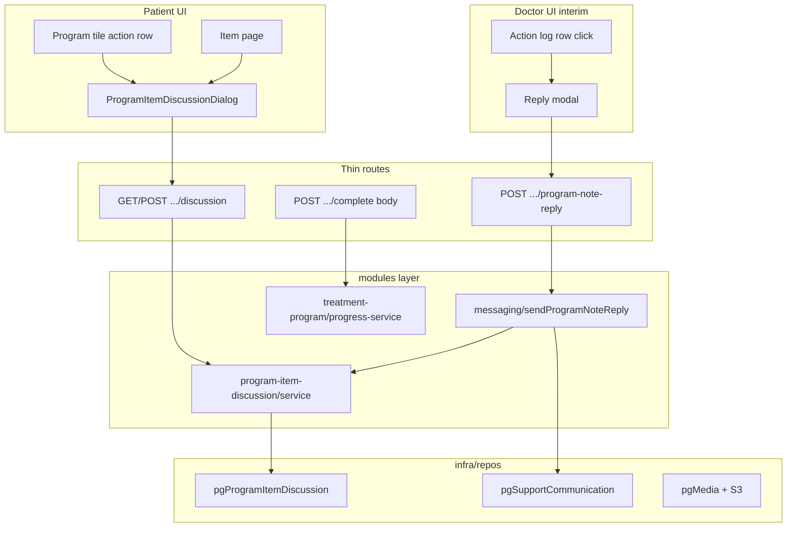

# Обсуждение элементов программы реабилитации (patient + interim doctor)

## Этапы плана (сводка)

1. **Этап 0** — Инициатива и контракты  
2. **Этап 1** — Схема + `sendProgramNoteReply` + interim doctor reply  
3. **Этап 2** — Patient discussion API + dual-write observation  
4. **Этап 3** — Patient UI: плитка программы  
5. **Этап 4** — Patient UI: страница элемента  
6. **Этап 5** — Unread indicators  
7. **Этап 6** — Patient media submission  
8. **Этап 7** — Документация и финальный CI  

**Итого этапов: 8.**

## Продуктовые решения (зафиксированы явно)

| # | Решение |
|---|---------|
| P1 | Фича только для программ **`assignment_source === doctor`**. Promo/course — без изменений; существующие guards в [`patient-program-actions.ts`](apps/webapp/src/modules/treatment-program/patient-program-actions.ts) сохраняются. |
| P2 | В patient UX «ЛФК» = **программа реабилитации**; не возвращать «комплекс ЛФК» как навигационную сущность ([`patient-lfk-means-rehab-program.mdc`](.cursor/rules/patient-lfk-means-rehab-program.mdc)). |
| P3 | Статический текст назначения (`item.effectiveComment`) в UI пациента переименовать в **«Инструкция от специалиста»**; это не thread и не смешивается с обсуждением. |
| P4 | **Источник правды для thread UI** — новая таблица `program_item_discussion_messages`, а не `program_action_log` и не только `support_conversation_messages`. |
| P5 | **Dual-write при ответе врача:** сообщение пишется в discussion **и** в общий support-чат с префиксом (как сейчас Telegram) — для push и `/app/patient/messages`. Канон префикса: [`programNoteReplyContext.ts`](apps/webapp/src/modules/messaging/programNoteReplyContext.ts). |
| P6 | **Dual-write при комментарии пациента:** `POST observation-note` продолжает писать `program_action_log` (журнал врача) **и** строку в discussion. Уведомление врачу в Telegram — без изменений ([`notifyDoctorPatientProgramNote.ts`](apps/webapp/src/modules/messaging/notifyDoctorPatientProgramNote.ts)). |
| P7 | **Interim-ответ врача из webapp:** клик по строке `patient_observation` в «Журнале выполнения» на странице программы → модалка → API с `stageItemId`. **Не** использовать `/app/doctor/messages` без контекста (переработка UI специалиста — **вне scope**). |
| P8 | **Legacy-ответы врача** (только в support-чат с префиксом, без строки в discussion): показывать в thread через **read-time merge** по `support_conversation_messages` + парсинг префикса `formatPatientExerciseCommentReplyText`; отдельный backfill migration для admin-сообщений **не делаем** в v1. |
| P9 | **Backfill v1:** одноразово перенести исторические `program_action_log` (`action_type=note`, `payload.source=patient_observation`) в `program_item_discussion_messages`. |
| P10 | **Непрочитанное per-item** — отдельная модель `program_item_discussion_reads` `(patient_user_id, instance_stage_item_id, last_read_at)`. Сброс при: открытии модалки thread, тапе по превью на странице элемента, прочтении связанного admin-сообщения в общем чате. |
| P11 | Badge на иконке чата: заменить **точку** на **красный кружок с белой цифрой** (как у напоминаний) в [`PatientTopNav.tsx`](apps/webapp/src/shared/ui/PatientTopNav.tsx), [`PatientHeader.tsx`](apps/webapp/src/shared/ui/PatientHeader.tsx), [`PatientPrimaryNavStrip.tsx`](apps/webapp/src/shared/ui/patient/PatientPrimaryNavStrip.tsx). |
| P12 | **«Отметить выполнение»** открывает модалку: «Делать было» (`легко` / `средне` / `тяжело`), «Выполнено» (повторений + вес кг), кнопка «Записать». Payload в `program_action_log` при `done`: `{ source: "simple_item_complete", perceivedDifficulty, reps, weightKg }`. Переиспользовать семантику `easy|medium|hard` из [`formatLfkPostSessionDifficultyRu`](apps/webapp/src/modules/treatment-program/types.ts). |
| P13 | Строка «В прошлый раз сделано N повторений с весом N кг» — из **последней** записи `done` по элементу (не из `completedAt` на item). |
| P14 | **Медиа от пациента:** отдельный `usage_purpose = program_item_submission` на `media_files`; доступ только пациент + doctor/admin; **480p MP4 progressive**, исходник удаляется после transcode; **HLS не генерировать**; в чате — превью + плеер через `PatientMediaPlaybackVideo` c progressive-only payload; **не учитывать** в `recordPlaybackResolutionStat` / material-ratings. |
| P15 | Patient upload — **новый** scoped API (`/api/patient/...`), не расширять doctor-only [`/api/media/upload`](apps/webapp/src/app/api/media/upload/route.ts). Переиспользовать S3 infra + ownership через `uploaded_by`. |
| P16 | UI-тексты — лаконично, без лишних подписей ([`ui-copy-no-excess-labels.mdc`](.cursor/rules/ui-copy-no-excess-labels.mdc)). |
| P17 | Новых env для интеграций **не добавлять** ([`000-critical-integration-config-in-db.mdc`](.cursor/rules/000-critical-integration-config-in-db.mdc)). |
| P18 | `POST .../progress/complete` делаем **backward-compatible**: body опционален. Старый клиент без body продолжает работать (server defaults), новый клиент передаёт difficulty/reps/weight. |
| P19 | `sendProgramNoteReply` и ingest интегратора должны быть **идемпотентны** по `integratorMessageId`/`support_message_id` (повторный запрос не создаёт дубликат в discussion/support). |
| P20 | `GET .../discussion` сразу проектировать с пагинацией (`cursor`, `limit`) и стабильной сортировкой по `(created_at,id)`; summary-эндпойнт для плиток делать batch, без N+1. |
| P21 | Для новых сообщений врача обязательно сохранять связку `support_message_id -> discussion_message`; для legacy ответов использовать read-time fallback parsing, а при неоднозначности **не автопривязывать** (не показывать неверный тред). |
| P22 | Видео в patient pages рендерить через [`PatientMediaPlaybackVideo`](apps/webapp/src/shared/ui/media/PatientMediaPlaybackVideo.tsx), а не `<video>`; при этом для submission-медиа backend выдаёт progressive-only профиль (без HLS). |
| P23 | Rollout через DB-config (`system_settings`, scope `admin`): отдельные флаги на doctor-reply-from-log, patient-discussion-ui и media-submission; default = off до smoke-проверки на stage. |
| P24 | Для patient-списков/превью соблюдать правило static-thumb: в чате/списках только статичная миниатюра видео; воспроизведение — только в отдельном player view/модалке. |

---

## Архитектурные решения

- **Новый модуль** [`apps/webapp/src/modules/program-item-discussion/`](apps/webapp/src/modules/program-item-discussion/): `ports.ts`, `types.ts`, `service.ts` — list/post/markRead/unreadCounts, merge legacy support replies.
- **Shared messaging:** вынести [`sendProgramNoteReply`](apps/webapp/src/modules/messaging/sendProgramNoteReply.ts) из логики [`integratorSupportBridge.applyAdminReply`](apps/webapp/src/modules/messaging/integratorSupportBridge.ts); integrator route делегирует в него.
- **DI:** регистрация в [`buildAppDeps.ts`](apps/webapp/src/app-layer/di/buildAppDeps.ts); route handlers — parse → validate → auth → service → JSON.
- **Запреты:** no `@/infra/repos/*` в `modules/*`; no raw SQL; no business logic in routes ([`clean-architecture-module-isolation.mdc`](.cursor/rules/clean-architecture-module-isolation.mdc), [`TREATMENT_PROGRAM_EXECUTION_RULES.md`](docs/RULES/TREATMENT_PROGRAM_EXECUTION_RULES.md)).
- **Миграции:** Drizzle schema в [`apps/webapp/db/schema/`](apps/webapp/db/schema/) + `drizzle-kit generate`; backfill SQL/script в migration или отдельный idempotent script в `apps/webapp/db/`.

### DDL (ориентир)

**`program_item_discussion_messages`**
- `id`, `instance_stage_item_id` (FK), `patient_user_id` (FK), `sender_role` (`patient`|`admin`), `origin` (`patient_note`|`doctor_reply_webapp`|`doctor_reply_integrator`|`media_upload`), `body` (nullable), `media_file_id` (nullable FK), `support_message_id` (nullable FK), `created_at`
- index `(instance_stage_item_id, created_at)`
- unique partial index on `support_message_id is not null`

**`program_item_discussion_reads`**
- PK `(patient_user_id, instance_stage_item_id)`, `last_read_at`

**`media_files`** — колонка `usage_purpose` (`text`, nullable): `null` = CMS; `program_item_submission` = контрольные снимки/видео пациента.

---

## Scope boundaries

**Разрешено трогать:**
- `apps/webapp/src/modules/program-item-discussion/**` (новый)
- `apps/webapp/src/modules/messaging/**` (sendProgramNoteReply, bridge refactor)
- `apps/webapp/src/modules/treatment-program/**` (complete payload, observation dual-write hook)
- `apps/webapp/src/modules/media/**` (access assert, stats skip, transcode enqueue flag)
- `apps/webapp/src/app/api/patient/treatment-program-instances/**`
- `apps/webapp/src/app/api/doctor/treatment-program-instances/**`
- `apps/webapp/src/app/api/patient/media/**` (новый)
- `apps/webapp/src/app/app/patient/treatment/**`
- `apps/webapp/src/app/app/doctor/clients/**/treatment-programs/**`
- `apps/webapp/src/shared/ui/PatientTopNav.tsx`, `PatientHeader.tsx`, `PatientPrimaryNavStrip.tsx`
- `apps/webapp/db/schema/**`, migrations
- `apps/media-worker/**` (ветка 480p-only job)
- docs: новая папка инициативы + обновление [`DOCTOR_TELEGRAM_PROGRAM_NOTE_REPLY.md`](docs/ARCHITECTURE/DOCTOR_TELEGRAM_PROGRAM_NOTE_REPLY.md), [`program-detail/README.md`](apps/webapp/src/app/app/patient/treatment/program-detail/README.md)

**Вне scope:**
- Переработка `/app/doctor/messages`
- Promo/course patient flows
- Изменение GitHub CI workflow
- Rubitime/integrator сценариев кроме рефактора делегирования в `sendProgramNoteReply`
- HLS для submission-медиа
- Учёт submission-медиа в analytics/material-ratings

**Execution log:** [`docs/archive/2026-05-initiatives/PROGRAM_ITEM_DISCUSSION_INITIATIVE/LOG.md`](docs/archive/2026-05-initiatives/PROGRAM_ITEM_DISCUSSION_INITIATIVE/LOG.md) — обязателен с первого коммита.

## Rollout и rollback

- Перед началом Фазы 1 завести `system_settings` ключи (scope `admin`) для feature-gates:
  - `patient_program_discussion_doctor_reply_from_log_enabled`
  - `patient_program_discussion_ui_enabled`
  - `patient_program_discussion_media_submission_enabled`
- Rollout: включать по одному флагу после gate соответствующей фазы (1 -> 3 -> 6).
- Rollback: отключение флага должно мгновенно выключать новую поверхность UI/API без отката миграций и без потери данных.
- Добавление ключей выполнить по правилам `system_settings`: обновить [`types.ts`](apps/webapp/src/modules/system-settings/types.ts), admin settings API/UI и синхронизацию `public` + `integrator`.

---

## Фаза 0 — Инициатива и контракты

- Создать `docs/PROGRAM_ITEM_DISCUSSION_INITIATIVE/` с `LOG.md` и кратким `README.md` (ссылка на этот план, решения P1–P24).
- Зафиксировать API-контракты в `LOG.md`:
  - `GET /api/patient/treatment-program-instances/{id}/items/{itemId}/discussion` → `{ messages, totalCount, unreadCount, lastMessage?, lastDoneSummary? }`
  - `POST .../discussion` → `{ body }` (текст)
  - `POST .../discussion/read` → mark read
  - `POST .../discussion/media` → `{ mediaFileId }` после upload
  - `POST .../progress/complete` → body `{ perceivedDifficulty, reps?, weightKg? }`
  - `POST /api/doctor/treatment-program-instances/{id}/items/{itemId}/program-note-reply` → `{ text }`
  - `POST /api/patient/media/program-submission/presign` → body `{ filename, mimeType, size }`, response `{ ok, mediaId, uploadUrl, readUrl }`
  - `POST /api/patient/media/program-submission/confirm` → body `{ mediaId }`, response `{ ok, mediaId, url }`

**Gate 0:** `LOG.md` явно фиксирует `P1–P24` и API-контракты без отложенных пунктов; `rg program-item-discussion` — только docs.

---

## Фаза 1 — Схема + sendProgramNoteReply + interim doctor reply

### 1.1 Drizzle schema + migrate
- Таблицы discussion + reads; `media_files.usage_purpose`.
- Backfill script: `patient_observation` notes → discussion rows.
- Добавить `origin` + `support_message_id` unique partial index для idempotent dual-write.

**Checklist:**
- `pnpm --dir apps/webapp run db:verify-public-table-count` (при локальной БД)
- migrate на dev
- проверка идемпотентности backfill (повторный запуск не плодит дубликаты)

### 1.2 Module `program-item-discussion`
- Port: `insertMessage`, `listMessagesForItem`, `countMessagesForItem`, `getUnreadCount`, `markRead`, `mergeLegacyAdminReplies` (query support messages by patient + prefix match on `stageItemId` title).
- Service: guards (doctor-assigned instance, item belongs to instance, active item).

### 1.3 `sendProgramNoteReply`
- Extract from bridge: resolve context → format prefix → `appendWebappMessage` → `insertMessage(admin)` → `notifyPatientDoctorReply`.
- Refactor [`integratorSupportBridge.applyAdminReply`](apps/webapp/src/modules/messaging/integratorSupportBridge.ts) to delegate when `programNoteStageItemId` set.
- Tests: `sendProgramNoteReply.test.ts`, update `integratorSupportBridge.test.ts`.
- В `sendProgramNoteReply` добавить идемпотентный guard по `integratorMessageId`/`support_message_id` и строгую ошибку на mismatch `platformUserId`.

### 1.4 Doctor API + UI (interim)
- Route: `POST .../program-note-reply` — doctor auth, thin handler.
- [`TreatmentProgramInstanceDetailClient.tsx`](apps/webapp/src/app/app/doctor/clients/[userId]/treatment-programs/[instanceId]/TreatmentProgramInstanceDetailClient.tsx) (~986–1013):
  - Строки `note` + `payload.source === 'patient_observation'` — `cursor-pointer`, hover, `onClick`.
  - Dialog: цитата заметки, textarea, «Отправить».
  - POST → refresh не обязателен (ответ не в action log); toast success.

**Gate 1 (phase-level webapp):**
- `pnpm --dir apps/webapp test -- sendProgramNoteReply integratorSupportBridge program-item-discussion`
- `pnpm --dir apps/webapp typecheck`
- Ручной smoke: врач кликает заметку → пациент видит prefixed message в `/app/patient/messages`

---

## Фаза 2 — Patient discussion API + dual-write observation

### 2.1 Patient discussion endpoints
- GET list (with merge legacy), POST text, POST read.
- Wire `patientAppendObservationNote` to also `insertMessage(patient)` via injected discussion service.
- GET контракт: `cursor` + `limit` + `direction=backward`; default page size и max limit зафиксировать в API doc/LOG.

### 2.2 Shared UI component
- [`ProgramItemDiscussionDialog.tsx`](apps/webapp/src/app/app/patient/treatment/ProgramItemDiscussionDialog.tsx) — client component:
  - Reuse [`ChatView`](apps/webapp/src/modules/messaging/components/ChatView.tsx) + composer (extend ChatView later for media bubbles in F6).
  - Props: `instanceId`, `itemId`, `open`, `onOpenChange`, `onRead`.
  - On open: GET discussion + POST read.

**Gate 2:**
- `pnpm --dir apps/webapp test -- patient-program-actions program-item-discussion observation-note`
- Contract test: observation creates both action_log and discussion row
- Contract test: `GET discussion` stable order and pagination boundaries

---

## Фаза 3 — Patient UI: плитка программы

Файл: [`PatientTreatmentProgramStagePageProgramSection.tsx`](apps/webapp/src/app/app/patient/treatment/PatientTreatmentProgramStagePageProgramSection.tsx)

| Было | Станет |
|------|--------|
| «Добавить комментарий» | **«Комментарии»** |
| Равные `flex-1` кнопки | «Комментарии» **уже** (`shrink`, ~min-width icon+text+badge); «Отметить выполнение» **шире** (`flex-[1.4]` или фикс. пропорция) |
| — | Кнопка-иконка **Camera** (`lucide-react`) слева от complete или между (по макету: камера + комментарии слева, complete справа) |
| — | Badge count (синий border/text) справа от «Комментарии» |
| — | Красная точка после badge при `unreadCount > 0` |
| Модалка «Наблюдение» | `ProgramItemDiscussionDialog` |

- Prefetch unread/counts: расширить checklist/instance payload **или** lightweight `GET .../discussion/summary?instanceId=` (batch by items) — **решение:** batch summary endpoint на instance для N items одним запросом (избежать N+1 на плитках).
- Не добавлять в patient UI лишние описательные подписи/подзаголовки вне явного требования.

**Gate 3:**
- RTL smoke в существующем treatment test file (не новый e2e файл без нужды)
- Visual: текст «Отметить выполнение» в одну строку на типичной ширине
- Visual: badge count + unread dot не ломают компактность строки действий на mobile width

---

## Фаза 4 — Patient UI: страница элемента

Файл: [`PatientProgramStageItemPageClient.tsx`](apps/webapp/src/app/app/patient/treatment/PatientProgramStageItemPageClient.tsx)

1. **Под видео:** убрать кнопку комментария; layout `[Camera][Отметить выполнение wide]`; complete **не** one-click.
2. **«Комментарий специалиста»** → **«Инструкция от специалиста»**.
3. **Блок обсуждения:** если есть сообщения — последний комментарий; иначе скрыт. Плоская кнопка: «Открыть комментарии» / «Оставить комментарий к выполнению» (если пусто).
4. **Модалка выполнения** [`ProgramItemCompleteDialog.tsx`](apps/webapp/src/app/app/patient/treatment/ProgramItemCompleteDialog.tsx): radio/select difficulty, inputs reps/weight, «Записать».
5. **Под кнопкой комментариев** (на item page — в блоке обсуждения/CTA): мелко «В прошлый раз сделано N повторений с весом N кг» (скрыть если нет данных).
6. API complete route принимает старый пустой POST и новый body (backward-compatible migration без flag-day).

**Gate 4:**
- `pnpm --dir apps/webapp test -- progress-service complete route PatientProgramStageItemPageClient` (если есть/добавить точечные)
- Extend `patientCompleteSimpleItem` tests for payload

---

## Фаза 5 — Unread indicators

### 5.1 Per-item unread
- API summary возвращает `unreadCount` per item.
- Tile: dot на «Комментарии»; item page: badge «новых: n» на превью-блоке.

### 5.2 General chat badge upgrade
- [`usePatientSupportUnreadCount`](apps/webapp/src/modules/messaging/hooks/useSupportUnreadPolling.ts) уже возвращает count — использовать цифру в UI (как Bell badge).

### 5.3 Mark-read sync
- При `POST /api/patient/messages/read`: если последние unread admin messages match program note prefix for `stageItemId` — вызвать `markRead` для соответствующих items (parse title from prefix or store `support_message_id` link on discussion admin rows going forward).
- Opening discussion modal / tapping preview → `markRead`.
- Если связь не установлена однозначно (legacy parsing ambiguous), не сбрасывать per-item unread вслепую; логировать событие для диагностики в LOG.md.

**Gate 5:**
- Unit tests mark-read cascade
- Manual: ответ врача → dot на tile + chat count → прочтение в модалке снимает оба

---

## Фаза 6 — Patient media submission

### 6.1 Upload API
- `POST /api/patient/media/program-submission/presign` + `confirm` (patient session, MIME image/video subset, size cap e.g. 100MB).
- On confirm: `usage_purpose=program_item_submission`, enqueue **480p-only** transcode job (new worker mode: output single MP4, delete source, set `video_processing_status=ready`, **no** HLS keys).
- Подтвердить same-user ownership (`uploaded_by == session.user.userId`) при attach в discussion.

### 6.2 Discussion media messages
- Camera button → modal «Записать / галерея / файлы» (input capture + file picker).
- After confirm → `POST .../discussion/media` with `mediaFileId`.
- Chat bubble: thumbnail + tap → player modal через `PatientMediaPlaybackVideo` с progressive-only playback payload; images — ``.

### 6.3 Access + stats
- [`assertMediaPlaybackAccess`](apps/webapp/src/modules/media/assertMediaPlaybackAccess.ts): for `program_item_submission` allow only uploader patient + doctor/admin.
- Skip `recordPlaybackResolutionStat` when `usage_purpose === program_item_submission`.
- Doctor: видит media в discussion на карточке программы (read same GET API scoped for doctor).

**Gate 6 (phase-level + media-worker tests):**
- `pnpm --dir apps/webapp test -- program-submission media`
- `pnpm --dir apps/media-worker test` (if worker changed)
- Manual upload video → 480p in chat, no HLS, no stats row
- Manual access test: чужой пациент не может открыть media id другого пациента; doctor/admin могут

---

## Фаза 7 — Документация и финальный CI

- Update [`DOCTOR_TELEGRAM_PROGRAM_NOTE_REPLY.md`](docs/ARCHITECTURE/DOCTOR_TELEGRAM_PROGRAM_NOTE_REPLY.md): webapp doctor reply from journal in scope.
- Update [`program-detail/README.md`](apps/webapp/src/app/app/patient/treatment/program-detail/README.md).
- Close `LOG.md` with gate verdicts per phase.
- **Full CI once:** `pnpm install --frozen-lockfile && pnpm run ci` (per [`pre-push-ci.mdc`](.cursor/rules/pre-push-ci.mdc) before merge/push).

---

## Definition of Done (весь план)

- [x] Пациент doctor-program: плитка — «Комментарии» + complete-модалка (без камеры); item page — камера при media-flag, source dialog, complete-модалка, инструкция, preview thread.
- [x] Thread modal показывает историю patient + admin (+ legacy merge) только по данному элементу.
- [x] Врач: ответ из журнала (reply-модалка) + read-only thread (`GET .../discussion`, «Обсуждение»); пациент получает push/prefix как из Telegram.
- [x] Unread: badge count на «Комментарии», «новых: n» на item, белая цифра на иконке чата; сброс при прочтении.
- [x] Выполнение с difficulty/reps/weight (tile + item через модалку); строка «В прошлый раз…» под «Выполнялось» (P13).
- [x] Submission media: upload, 480p MP4, в thread; превью static thumb без play-overlay (P24); плеер только по явному открытию.
- [x] Архивные этапы: без action-кнопок (readOnly guard).
- [x] Архитектура: modules/ports/DI, Drizzle migrations, thin routes, LOG.md актуален.
- [x] Rollback-путь подтверждён: каждый включённый шаг управляется `system_settings` feature-flag и может быть выключен без schema rollback.
- [x] Независимый аудит P0 (`mediaSubmissionEnabled` props) — закрыт.
- [x] Integrator `program_reply` stage-smoke gate — PASS (2026-06-01, integrator vitest regression).
- [x] Инициатива перенесена в `docs/archive/2026-05-initiatives/PROGRAM_ITEM_DISCUSSION_INITIATIVE/`.
- [ ] `pnpm run ci` зелёный перед merge — барьер push (todo `phase-ci-merge-barrier`: cancelled в frontmatter; прогон при стабильном worktree).

---

## Порядок исполнения и gate-правило

Фазы **строго последовательны** (не смешивать фазы 2 и 4 в одном merge без gate предыдущей) — [`TREATMENT_PROGRAM_EXECUTION_RULES.md`](docs/RULES/TREATMENT_PROGRAM_EXECUTION_RULES.md) §7.

**Минимальный shippable increment после Фазы 1:** врач может отвечать из webapp; patient UI ещё старый, но delivery работает.

Между фазами: **step-level** тесты; после каждой фазы — **phase-level** `pnpm --dir apps/webapp test`; full CI — только фаза 7.
