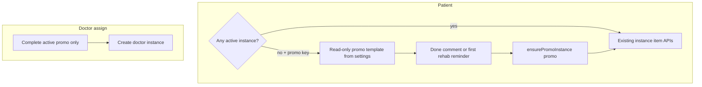

# План: источник назначения + промо по умолчанию (усиленный)

## Контекст в коде (факты)

- Экземпляр создаётся в Drizzle: [`apps/webapp/src/infra/repos/pgTreatmentProgramInstance.ts`](apps/webapp/src/infra/repos/pgTreatmentProgramInstance.ts) (`insert(instTable)` — сейчас только `templateId`, `patientUserId`, `assignedBy`, `title`, `status`).
- Врач при назначении: [`apps/webapp/src/app/api/doctor/clients/[userId]/treatment-program-instances/route.ts`](apps/webapp/src/app/api/doctor/clients/[userId]/treatment-program-instances/route.ts) — `assignedBy: session.user.userId`.
- Пустой индивидуальный план: [`createBlankIndividualPlan`](apps/webapp/src/modules/treatment-program/instance-service.ts) из того же route — тоже врач, `templateId: null` → **`assignment_source = doctor`** (клиническое сопровождение, не промо).
- Курс: [`apps/webapp/src/modules/courses/service.ts`](apps/webapp/src/modules/courses/service.ts) — `assignedBy: null` при `enrollPatient` → **`assignment_source = course`**.
- «На сопровождении» / клиенты с программой: [`apps/webapp/src/infra/repos/pgDoctorClients.ts`](apps/webapp/src/infra/repos/pgDoctorClients.ts) — любой `status = 'active'` без фильтра источника; тот же JOIN в `getDashboardPatientMetrics` (`onSupportCount`).
- Другие потребители флага «есть активная программа» (обязательный аудит при реализации): [`apps/webapp/src/modules/doctor-broadcasts/*`](apps/webapp/src/modules/doctor-broadcasts/) (моки с `activeTreatmentProgram`), любые новые SQL по `treatment_program_instances` — см. чеклист в §4.
- Напоминания `rehab_program` требуют непустой `linkedObjectId` ([`validateLinkedFields`](apps/webapp/src/modules/reminders/service.ts)); UI опирается на активный экземпляр из `listForPatient` ([`RemindersPageBody.tsx`](apps/webapp/src/app/app/patient/reminders/RemindersPageBody.tsx)).
- Действия пациента по пунктам: [`/api/patient/treatment-program-instances/[instanceId]/...`](apps/webapp/src/app/api/patient/treatment-program-instances/) — без `instanceId` текущий контракт не выполняется.

## Scope и не-цели

**В scope (v1):**

- Колонка + семантика `assignment_source`, backfill, врачебный фильтр «только клиника» (`doctor`).
- Ключ `system_settings` (admin) для UUID шаблона промо + чтение на сервере пациентом/сервисом.
- Виртуальный показ опубликованного шаблона промо, если **нет ни одного** `active` экземпляра.
- Материализация `promo` при первом «Выполнено» / комментарии к пункту промо / первом создании `rehab_program` напоминания (пациентский API).
- Авто-`completed` для активного `promo` при успешном назначении врача (одна транзакция с созданием `doctor`).
- Admin UI: выбор шаблона промо + минимальная статистика по `promo` (см. §7).
- Документация и backlog-пункт про смену промо-шаблона с уведомлением (без реализации смены в v1).

**Вне scope (v1, зафиксировать в backlog):**

- Мультиактивные планы и перелистывание UI.
- Миграция существующих пациентов на новый промо-шаблон после смены в админке («есть обновление, загрузить?»).
- Воронка/полноценная аналитика продуктовых конверсий.

**После утверждения плана:** перенос файла плана в репозиторий по конвенции проекта — `git mv` из `~/.cursor/plans/` в [`BersonCareBot/.cursor/plans/archive/`](.cursor/plans/archive/) (см. `.cursor/rules/plan-authoring-execution-standard.mdc`).

## Продуктовая модель (DoD / LOG)

| Состояние | Поведение |
|-----------|-----------|
| Есть любой `active` экземпляр (`doctor` / `course` / `promo`) | **Не** показывать виртуальный промо-оверлей; напоминания `rehab_program` ведут на реальный `instanceId` текущего плана. |
| Нет `active` экземпляра и в настройке задан опубликованный шаблон промо | Пациент видит контент **шаблона промо** (просмотр, в т.ч. видео) без строки `treatment_program_instances`. |
| Первое «Выполнено» или комментарий по пункту в контексте промо | Транзакция: **материализация** `promo` + то же действие на созданных `stageItem` id (или один вызов сервиса, который внутри делает два шага атомарно). |
| Первое создание напоминания `rehab_program` (пациентский POST) | Перед `createObjectReminder`: если нет `active` — `ensurePromoInstance` → подставить `linkedObjectId`, затем правило и sync интегратора. |
| Назначение врачом новой программы при активном `promo` | В одной транзакции: завершить активный `promo` (событие/причина), создать `doctor`. |
| Активный `course` (или `doctor`) | Не создавать второй `promo`; `ensurePromoInstance` **не** вызывается в обход проверки «нет active». |

### 2.1 Строгая семантика `ensurePromoInstanceForPatient` (не путать с «любой active»)

- Если есть **`active` с любым `assignment_source`** → **не** создавать промо; вернуть ошибку домена для чисто-промо операций **или** для напоминаний — использовать существующий `instanceId` активного плана (продукт: напоминание привязано к текущей программе, не к промо).
- Если **нет `active`** и ключ промо валиден → создать ровно один `promo` (идемпотентность: повторный вызов при гонке — см. §2.2).
- Если **нет `active`** и ключ промо пуст/невалиден → 4xx на операциях, требующих инстанс/напоминание по программе.

## 2.2 Гонки и целостность «один active на пациента»

Сейчас в схеме **нет** partial UNIQUE на «один active на пациента» (только приложение бросает [`SECOND_ACTIVE_TREATMENT_PROGRAM_MESSAGE`](apps/webapp/src/modules/treatment-program/instance-service.ts)).

**Обязательно в реализации (выбрать один подход, зафиксировать в LOG):**

- **Вариант A (предпочтительный для жёсткости):** partial unique index  
  `UNIQUE (patient_user_id) WHERE status = 'active'`  
  + обработка `23505` в `ensurePromoInstance` повторным `SELECT` активного и возвратом id.  
  **Риск:** при будущем multi-active индекс придётся снять/заменить — заложить в backlog multi-plan.
- **Вариант B:** транзакция `SERIALIZABLE` или `SELECT … FOR UPDATE` по строке пациента/экземпляра внутри `ensurePromoInstance` без нового индекса.

## 1. Данные и миграции

- **Колонка** `assignment_source` `text NOT NULL` + `CHECK (assignment_source IN ('doctor','promo','course'))` (значение `subscription` — добавить в CHECK при появлении продукта).
- **Backfill:**
  - `assigned_by IS NOT NULL` → `doctor`;
  - иначе → `course` (покрывает `enrollPatient`; прочие `null` до релиза — проверить одноразовым SQL в LOG, при нахождении — ручной разбор).
- **Индекс для врача:** составной/частичный индекс под запрос «последний active doctor на пациента» (оценить `EXPLAIN` после смены `WHERE` в [`pgDoctorClients`](apps/webapp/src/infra/repos/pgDoctorClients.ts)); минимум — убедиться, что фильтр по `assignment_source` не ломает план запроса.
- **Drizzle:** [`apps/webapp/db/schema/treatmentProgramInstances.ts`](apps/webapp/db/schema/treatmentProgramInstances.ts) + миграция по конвенции репозитория.
- **Типы:** [`apps/webapp/src/modules/treatment-program/types.ts`](apps/webapp/src/modules/treatment-program/types.ts), `CreateTreatmentProgramInstanceTreeInput`, summary/detail.
- **In-memory порт** тестов: поле `assignment_source` + поведение фильтров.

## 2. Сервис экземпляров

Файл: [`apps/webapp/src/modules/treatment-program/instance-service.ts`](apps/webapp/src/modules/treatment-program/instance-service.ts).

- `assignTemplateToPatient`: параметр `assignmentSource`; врачебный route → `doctor`; `enrollPatient` → `course`.
- `createBlankIndividualPlan`: всегда `doctor` при вызове из врачебного API (при других вызовах — явно в коде/тестах).
- `ensurePromoInstanceForPatient`: реализовать по §2.1–2.2; чтение шаблона только из **доверенного** чтения `system_settings` (модуль system-settings, не query из route).
- `assignTemplateToPatient` (врач): перед созданием — `complete` всех активных с `assignment_source = 'promo'` (не трогать `course` без отдельного продуктового решения).
- **События:** [`treatment_program_events`](apps/webapp/db/schema/treatmentProgramEvents.ts) — тип/причина auto-complete; сверка с `docs/RULES/TREATMENT_PROGRAM_EXECUTION_RULES.md` и не расширять схему без необходимости.

Порт: [`ports.ts`](apps/webapp/src/modules/treatment-program/ports.ts) + [`pgTreatmentProgramInstance.ts`](apps/webapp/src/infra/repos/pgTreatmentProgramInstance.ts).

## 3. Конфиг промо (только БД)

- Новый ключ в [`ALLOWED_KEYS`](apps/webapp/src/modules/system-settings/types.ts), scope **`admin`**, значение — UUID шаблона (формат как у соседних ключей JSON).
- **Валидация при сохранении (admin):** шаблон существует и `status = published` (отклонить архив/черновик).
- **Зеркало** через существующий [`updateSetting`](apps/webapp/src/modules/system-settings/service.ts) только (без второго sync в route handlers).
- Запрет новых env для шаблона (правило репозитория).

## 3.1 Безопасность (обязательные проверки)

- Пациентский API **не** принимает `templateId` для самовольного промо: источник истины — только `system_settings`.
- Любой путь «материализация промо» проверяет: пациент = текущий пользователь; шаблон published; после создания `getInstanceForPatient` должен разрешать только свои id.
- Admin-only на запись ключа промо (существующие guards admin settings).

## 4. Врачебный кабинет и смежные домены: только клиника = `doctor`

- [`pgDoctorClients.ts`](apps/webapp/src/infra/repos/pgDoctorClients.ts): активный экземпляр для флага клиента и ссылок — `status = 'active' AND assignment_source = 'doctor'`.
- `getDashboardPatientMetrics.onSupportCount` — тот же фильтр.
- **Аудит grep:** `activeTreatmentProgram`, `treatment_program_instances` + `active`, `hasActiveTreatmentProgram`, `onSupport` — включая [`doctor-broadcasts`](apps/webapp/src/modules/doctor-broadcasts/), чтобы рассылки не использовали устаревшую семантику «любой active».

**Usage-счётчики шаблонов/курсов** ([`pgTreatmentProgram.ts`](apps/webapp/src/infra/repos/pgTreatmentProgram.ts), [`pgCourses.ts`](apps/webapp/src/infra/repos/pgCourses.ts)): v1 **не менять** агрегаты без отдельного решения; в LOG записать, что «клиническая нагрузка на шаблон» ≠ «все инстансы по шаблону» если промо использует тот же шаблон что и курс (редкий кейс — оговорить).

## 5. Пациент: виртуальный промо + материализация

- **Условие показа:** `listForPatient` не содержит `status === 'active'` (ни одного) **и** ключ промо валиден.
- **RSC / home / treatment entry:** подмешивать дерево шаблона через `treatmentProgram.getTemplate` (read-only). Терминология UX: «программа реабилитации» ([`.cursor/rules/patient-lfk-means-rehab-program.mdc`](.cursor/rules/patient-lfk-means-rehab-program.mdc)).
- **Контракт материализации:** один задокументированный путь (рекомендация: внутренний сервисный метод + вызов из нескольких route handlers, без дублирования бизнес-логики в каждом `route.ts`).
- После материализации: [`revalidatePatientTreatmentProgramUi`](apps/webapp/src/app-layer/cache/revalidatePatientTreatmentProgramUi.ts) + пути напоминаний/главной.

## 6. Напоминания `rehab_program`

- В цепочке [`create/route.ts`](apps/webapp/src/app/api/patient/reminders/create/route.ts) / [`createRemindersService`](apps/webapp/src/modules/reminders/service.ts): если создаётся первое `rehab_program` и нет активного инстанса — `ensurePromoInstance` **до** записи правила и **до** [`tryNotifyIntegrator`](apps/webapp/src/modules/reminders/service.ts) (чтобы deep link имел валидный `instanceId`).
- UI не должен слать «магический» uuid: либо сервер подменяет пустой специальный sentinel на ensure (лучше **не** вводить sentinel в БД), либо UI вызывает ensure endpoint и потом create с реальным id — выбрать один контракт.

## 7. Админ: страница промо

- Новый маршрут под [`apps/webapp/src/app/app/admin/`](apps/webapp/src/app/app/admin/) по паттерну соседних экранов.
- Модалка выбора шаблона — переиспользование/вынос shared с врачебным назначением (без копипасты тяжёлого графа).
- Блок stats v1: SQL/Drizzle отчёт фильтр `assignment_source = 'promo'` (создания, completed, count по событиям если типы позволяют); не обещать метрики, которых нет в БД (просмотры видео/звёзды — только если уже пишутся в существующие таблицы).

## 8. Обход всех вызовов создания экземпляра

- [`courses/service.ts`](apps/webapp/src/modules/courses/service.ts) — `course`.
- Врачебные API — `doctor`.
- [`lfk-assignments`](apps/webapp/src/modules/lfk-assignments/service.ts) если ещё используется в прод-путях — явный источник (вероятно `doctor` или отдельный legacy; не оставлять default NULL в SQL insert).
- Тестовые in-memory / factory — обновить конструкторы.

## 9. Документация и backlog

- `docs/LOG/<инициатива>.md` — решения по §2.2, usage-метрикам, гонкам.
- **Backlog запись** (отдельный файл инициативы или существующий BACKLOG в docs): «Смена глобального промо-шаблона: уведомление + согласие + миграция инстансов/напоминаний» — **out of scope v1**.
- При исполнении: перенос этого plan-файла в [`BersonCareBot/.cursor/plans/archive/`](.cursor/plans/archive/) и обновление frontmatter по стандарту планов.

## 10. Тесты

- Clinical filter: `promo` / `course` не в `hasActiveTreatmentProgram`; `doctor` — внутри.
- Авто-complete `promo` при врачебном assign.
- `ensurePromoInstance`: два параллельных запроса (имитация гонки) — один инстанс (при варианте A — конфликт и retry).
- Reminder create: нет active → появился `promo` + rule с корректным `linkedObjectId`.
- Нет ключа промо / шаблон не published → отказ с понятной ошибкой.
- Регрессия: курс, врач, blank plan.

## Definition of Done

- [ ] `assignment_source` в схеме, миграция, backfill, типы, in-memory.
- [ ] Все пути создания экземпляра задают источник явно; grep по репо без «забытых» insert.
- [ ] Врачебные списки + `onSupportCount` + audit смежных модулей используют клинический фильтр `doctor`.
- [ ] Промо: виртуальный показ только при отсутствии любого active; материализация по трём триггерам; транзакции; безопасность §3.1.
- [ ] Напоминания: порядок ensure → create → integrator sync.
- [ ] Admin: ключ в `ALLOWED_KEYS` + UI + валидация published.
- [ ] LOG + backlog про смену шаблона; план перенесён в репозиторий archive.
- [ ] Тесты из §10; перед merge — полный `pnpm run ci` по правилам репозитория.
