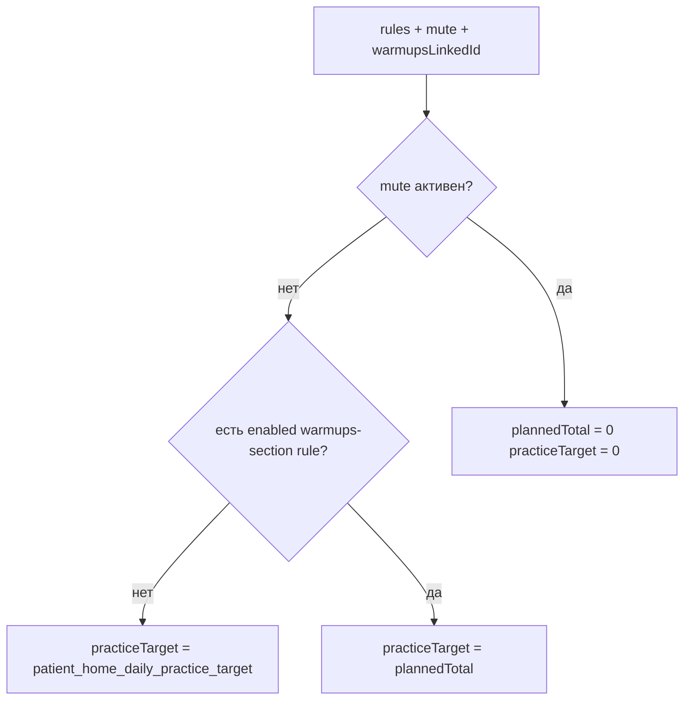

# План: дефолты напоминаний, цель на главной, разбивка UI

## Scope

- **В scope:** `apps/webapp` — константы слотов, формы создания/редактирования напоминаний пациента, [`nextReminderOccurrence.ts`](apps/webapp/src/modules/patient-home/nextReminderOccurrence.ts), [`PatientHomeToday.tsx`](apps/webapp/src/app/app/patient/home/PatientHomeToday.tsx), [`PatientHomeProgressBlock.tsx`](apps/webapp/src/app/app/patient/home/PatientHomeProgressBlock.tsx), связанные тесты и модульные README/архитектурные строки, где зашиты старые 12/15/17.
- **Вне scope:** смена семантики `patient_practice_completions.countToday` / отдельный числитель «без разминки» (отложено до продуктового решения); **GitHub CI workflow**; новые ключи `system_settings`; продуктовая логика **integrator** (новые правила диспатча).
- **Обязательно в рамках PR (если `rg` находит следы старых дефолтов):** поправить **тесты/фикстуры/доки** в `apps/integrator` (и любых других пакетах), без изменения продуктового поведения integrator, чтобы репозиторий не оставался с противоречивым каноном 12/15/17.

### Ранее было «мягко» — теперь обязательно к исполнению

| Было в плане | Статус |
|--------------|--------|
| Переименование rehab-константы | **Обязательно** (ясность + поиск по репо) |
| Выровнять `reminderDaySummary` с `plannedTotal` | **Обязательно** (единый источник в одном RSC-блоке) |
| Поведение mute для микротекста | **Обязательно** скрывать разбивку, без «0/0» |
| Варианты вёрстки `items-baseline` / `items-start` | **Обязательно** один вариант: `items-baseline` + бар ниже ряда |
| «Склонения или короткие подписи» | **Обязательно** компактные подписи (минимум слов, без тяжёлого склонения), в духе ui-copy |
| Тесты ProgressBlock «при наличии» | **Обязательно** покрытие разбивки / отсутствия при `null` |
| Правки integrator «если найдётся» | **Обязательно** закрыть все вхождения, найденные `rg`, в том же PR |

## Продуктовые решения

- **Разминка первична** и **входит** в сумму слотов на день; из знаменателя **не** вычитаем.
- **Цель на главной (`practiceTarget`):**
  - Нет **включённого** правила на раздел разминок → цель = **`patient_home_daily_practice_target`** ([`todayConfig.ts`](apps/webapp/src/modules/patient-home/todayConfig.ts), админка).
  - Есть **включённое** правило на раздел разминок → цель = **`plannedTotal`** за календарный день в TZ главной ([`countPlannedHomeReminderOccurrencesInUtcRange`](apps/webapp/src/modules/patient-home/nextReminderOccurrence.ts)), **включая** разминку и все остальные типы из `LINKED_TYPES`.

**Критерий «правило на раздел разминок»** (как на экране напоминаний): `linkedObjectType === "content_section"` и `linkedObjectId` совпадает с **резолвнутым** slug раздела разминок — тот же путь, что [`RemindersPageBody.tsx`](apps/webapp/src/app/app/patient/reminders/RemindersPageBody.tsx): `resolvePatientContentSectionSlug` + [`DEFAULT_WARMUPS_SECTION_SLUG`](apps/webapp/src/modules/patient-home/warmupsSection.ts). Если раздел переименован в CMS, в БД у правила может быть новый slug — сравнивать с **resolved** slug, не только литералом `warmups`.

- **UI разбивки** (только когда показываем цель из `plannedTotal` и день не заглушен mute для счётчика, см. ниже): справа от числа **N** в «из N» — микроколонка из двух строк:
  - **Разминки:** сумма слотов за сегодня по **всем** enabled правилам с `content_section` + `linkedObjectId === warmupsLinkedId` (несколько правил — **суммировать**).
  - **Остальное («занятий ЛФК»):** `plannedTotal - warmupPlanned` (по определению **N_w + N_l = N**). Семантика строки «ЛФК» = всё остальное из домашнего агрегата (`rehab_program`, `treatment_program_item`, `lfk_complex`, `content_page`, `custom`), не только `lfk_complex`.

## Матрица «было → станет» (главная, tier patient)

| Ситуация | Сейчас ([`PatientHomeToday.tsx`](apps/webapp/src/app/app/patient/home/PatientHomeToday.tsx)) | Станет |
|----------|-----------------------------------------------------------------------------------------------|--------|
| Есть любые linked enabled rules | Если `hasConfiguredHomeLinkedReminders` → `practiceTarget = plannedTotal` | Если **нет** warmups-section rule enabled → **`todayCfg.practiceTarget`** (даже при rehab-only и др.) |
| Есть warmups-section rule enabled | Как строка выше | `practiceTarget = plannedTotal` |
| Mute активен | `plannedTotal = 0`, но `practiceTarget` всё ещё мог переключаться на 0 при hasConfigured | **Обязательно:** `plannedTotal = 0` → `practiceTarget = 0`; микроколонку разбивки **не рендерить** (никаких «0 / 0»), только строка «из 0» и полоса как сейчас |

## Краевые случаи (чеклист реализации)

- **Гость / без `personalTierOk`:** не трогать текущий путь; `getProgress` с админской целью из `todayCfg` как сейчас, если применимо.
- **Несколько правил на один warmups slug:** суммировать слоты; `practiceTarget` всё равно полный `plannedTotal` по всем типам.
- **Правило warmups есть, но disabled:** считать как «нет расписания разминок» → ветка **admin target**.
- **Интервал 180 и окно 12–18:** убедиться в тесте на [`countIntervalWindowOccurrencesInRange`](apps/webapp/src/modules/patient-home/nextReminderOccurrence.ts), что на будний день получается **ровно три** срабатывания (12, 15, 18) при inclusive-цикле `m <= winEnd` (как сейчас в коде).
- **Rehab `slots_v1` в форме:** при `weekly_mask` пресеты «все дни / будни» в [`ReminderScheduleForm.tsx`](apps/webapp/src/modules/reminders/components/ReminderScheduleForm.tsx) не должны затирать `daysMask` дефолта rehab без действия пользователя.

## 1. Дефолты `slots_v1` для rehab

- [`scheduleSlots.ts`](apps/webapp/src/modules/reminders/scheduleSlots.ts): `timesLocal: ["09:00", "19:00"]`, `dayFilter: "weekly_mask"`, `daysMask: "1111111"`.
- **Обязательно:** переименовать экспорт в однозначное имя (например `DEFAULT_REHAB_DAILY_SLOTS`) и обновить **все** импорты — иначе название `…WEEKDAY…` вводит в заблуждение после смены семантики.
- Репозитории [`pgReminderRules.ts`](apps/webapp/src/infra/repos/pgReminderRules.ts), [`inMemoryReminderRules.ts`](apps/webapp/src/infra/repos/inMemoryReminderRules.ts), [`service.ts`](apps/webapp/src/modules/reminders/service.ts) — поведение «пустой `scheduleData` при rehab + slots_v1» должно подставлять **новый** JSON.
- [`ReminderCreateDialog.tsx`](apps/webapp/src/modules/reminders/components/ReminderCreateDialog.tsx): при reset для `rehab_program` выставить `slotsDayFilter`/`daysMask` в согласовании с константой (не оставлять UI на `weekdays`, если данные стали `weekly_mask`).

## 2. Дефолт «Офисный день» для не-rehab

- Общий модуль констант (например `reminderFormDefaults.ts` рядом со `scheduleSlots`): `windowStartMinute = 12*60`, `windowEndMinute = 18*60`, `intervalMinutes = 180`, `daysMask = "1111100"`.
- [`ReminderCreateDialog.tsx`](apps/webapp/src/modules/reminders/components/ReminderCreateDialog.tsx) и [`LegacyReminderScheduleDialog.tsx`](apps/webapp/src/app/app/patient/reminders/LegacyReminderScheduleDialog.tsx): заменить локальные дефолты для ветки **не** `rehab_program`; при сбросе слотов без rehab — не противоречить «офису» без лишних микротекстов в UI ([`ui-copy-no-excess-labels`](.cursor/rules/ui-copy-no-excess-labels.mdc)).

## 3. Главная: счётчики, цель, `getProgress`

- Рефактор счёта: один внутренний helper «считать одно правило за UTC-диапазон» + обёртка по списку с предикатом; избежать дублирования тел [`countSlotsV1OccurrencesInRange`](apps/webapp/src/modules/patient-home/nextReminderOccurrence.ts) / `countIntervalWindowOccurrencesInRange`.
- [`PatientHomeToday.tsx`](apps/webapp/src/app/app/patient/home/PatientHomeToday.tsx):
  - Резолв `warmupsLinkedId` (как RemindersPageBody).
  - После `rules`, `rangeStart`/`rangeEnd`, `muted`: `plannedTotal`, `warmupPlanned` (subset), `lfkPlanned = plannedTotal - warmupPlanned`.
  - **`practiceTarget`** по матрице выше.
  - **`getProgress`:** для `session && personalTierOk` вызывать **после** финального `practiceTarget` с этим аргументом; для остальных сессий — оставить прежний порядок/значение без регрессий.
  - Прокинуть в прогресс-блок структуру для микротекста (например `progressGoalBreakdown: { warmup: number; lfk: number } | null`).
- **Обязательно:** `reminderDaySummary.plannedTotal` и прогресс-блок используют **одно и то же** значение `plannedTotal` из одного блока вычислений в RSC (без второго прохода с другим `now`/mute); иначе «n из N» в карточке следующего напоминания разъедется с главной целью.

## 4. Вёрстка [`PatientHomeProgressBlock.tsx`](apps/webapp/src/app/app/patient/home/PatientHomeProgressBlock.tsx)

- **Обязательно:** ряд `flex flex-row items-baseline gap-*`: слева **`{done} из {N}`**, справа узкий столбец `text-[10px]` или `text-xs` с двумя строками; **прогрессбар** на **следующей** строке на **100%** ширины карточки (не внутри flex-ряда с микротекстом).
- При `breakdown == null` или `N === 0` после mute — не раздувать блок пустыми строками.
- **a11y:** расширить `aria-label` у строки прогресса / `progressbar`, когда есть разбивка, чтобы скринридер слышал сумму.

## 5. Тесты и документация

- **Обязательно:** `rg` по монорепо на старые канонические дефолты (`12:00.*15:00`, `15:00.*17:00`, старое имя константы rehab и т.д.); каждое вхождение — либо обновление, либо явный комментарий `legacy` с обоснованием.
- **Обязательно:** обновить/добавить тесты минимум по цепочке: [`scheduleSlots.test.ts`](apps/webapp/src/modules/reminders/scheduleSlots.test.ts), [`service.test.ts`](apps/webapp/src/modules/reminders/service.test.ts) (createObjectReminder rehab defaults), [`nextReminderOccurrence.test.ts`](apps/webapp/src/modules/patient-home/nextReminderOccurrence.test.ts) (subset + офисное окно 12–18/180 на будни), [`PatientHomeToday.test.tsx`](apps/webapp/src/app/app/patient/home/PatientHomeToday.test.tsx) (матрица цели + mute + один plannedTotal), [`create/route.test.ts`](apps/webapp/src/app/api/patient/reminders/create/route.test.ts) при смене контрактных ожиданий, **тест разбивки UI** для [`PatientHomeProgressBlock`](apps/webapp/src/app/app/patient/home/PatientHomeProgressBlock.tsx) (новый узкий файл или расширение существующего — без раздувания графа импортов по правилам webapp-тестов).
- Доки: [`patient-home.md`](apps/webapp/src/modules/patient-home/patient-home.md), [`reminders.md`](apps/webapp/src/modules/reminders/reminders.md), при упоминаниях — [`CONFIGURATION_ENV_VS_DATABASE.md`](docs/ARCHITECTURE/CONFIGURATION_ENV_VS_DATABASE.md).
- Во время работы: `pnpm exec vitest run` по затронутым путям; **перед merge в main:** полный `pnpm run ci` по политике репозитория.

## Definition of Done

- [x] Rehab default slots: **09:00, 19:00**, **7/7**; константа **переименована**; API create без `scheduleData` для rehab+slots — тот же payload.
- [x] Форма не-rehab по умолчанию: **12–18**, **180 мин**, **Пн–Пт** (`1111100`).
- [x] Главная patient tier: цель по **матрице** warmups-section / admin; **`getProgress(..., todayTarget)`** согласован с отображаемым `N`; **`plannedTotal` единый** для `reminderDaySummary` и прогресса.
- [x] При цели из `plannedTotal` и **не**-mute: микротекст **N разминок / N остальных**, **N_w + N_l = N**; вёрстка **строго** как в §4 (бар ниже ряда); при mute или `N===0` для ветки суммы — **без** микротекста.
- [x] Тесты (включая ProgressBlock и create route при необходимости) и доки обновлены; `rg` по монорепо чистый или только помеченный legacy.
- [x] Если `rg` находит старые дефолты в **integrator** (или др. пакетах) — правки **включены в тот же PR**, без откладывания «на потом».

## Отложенно (не в этом PR)

- Согласование **числителя** «выполнено сегодня» с разбиением (исключать/включать `daily_warmup`, журнал напоминаний и т.д.) — отдельная продуктовая задача.
