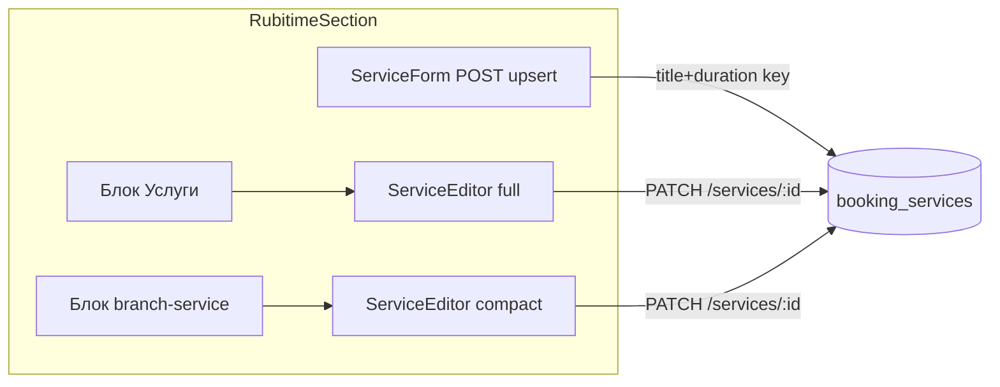

# Rubitime catalog: production UX для редактирования услуг

## Цель

Сделать поведение каталога v2 (`RubitimeSection` на `/app/doctor/admin/booking/integrations`) предсказуемым для операторов: одна точка редактирования услуги, явное создание vs изменение, человекочитаемые ошибки, видимый эффект на `branch-service`.

## Текущее состояние (до фикса)



Проблемы: два PATCH-редактора одной записи; POST выглядит как «обновить», но upsert по `(title, duration_minutes)`; `409 unique_violation` без перевода.

## Scope

**Разрешено:**
- [`apps/webapp/src/app/app/settings/RubitimeSection.tsx`](apps/webapp/src/app/app/settings/RubitimeSection.tsx)
- [`apps/webapp/src/app/app/settings/RubitimeSection.test.tsx`](apps/webapp/src/app/app/settings/RubitimeSection.test.tsx)
- [`apps/webapp/src/app/app/settings/rubitimeCatalogErrors.ts`](apps/webapp/src/app/app/settings/rubitimeCatalogErrors.ts)

**Вне scope:**
- миграции, изменение `uq_booking_services_title_duration`, POST upsert-логики в [`pgBookingCatalog.ts`](apps/webapp/src/infra/repos/pgBookingCatalog.ts)
- канонический `be_*` / `BookingEngineSection`
- новые API-эндпойнты

---

## Шаг 1 — Один редактор услуги (убрать compact в branch-service)

**DoD:** в DOM один набор полей редактирования на услугу; из связки нельзя сохранить PATCH напрямую.

---

## Шаг 2 — Свёрнутый редактор + явное «Изменить»

**DoD:** список услуг компактный; редактирование — осознанное действие.

---

## Шаг 3 — Форма «Добавить услугу» только для создания

**DoD:** оператор не может случайно «обновить» через нижнюю форму; дубликат ведёт к существующей карточке.

---

## Шаг 4 — Человекочитаемые ошибки API

Маппинг: `rubitimeCatalogErrors.ts` → `mapBookingCatalogApiError(code, "create" | "edit")`.

---

## Шаг 5 — Предупреждение о влиянии на связки

Строка при изменении `durationMinutes` / `priceMinor` и `linkedBranchServiceCount > 0`.

---

## Шаг 6 — Тесты

**Проверки:**
```bash
pnpm --dir apps/webapp exec vitest run \
  src/app/app/settings/RubitimeSection.test.tsx \
  src/app/app/settings/rubitimeCatalogErrors.test.ts \
  src/app/api/admin/booking-catalog/services/route.test.ts \
  'src/app/api/admin/booking-catalog/services/[id]/route.test.ts'
pnpm --dir apps/webapp exec eslint \
  src/app/app/settings/RubitimeSection.tsx \
  src/app/app/settings/RubitimeSection.test.tsx \
  src/app/app/settings/rubitimeCatalogErrors.ts
```

---

## Definition of Done

- [x] Один PATCH-редактор на услугу; branch-service — read-only + «К услуге».
- [x] Редактор свёрнут по умолчанию; «Изменить» / «Отмена» работают.
- [x] Форма внизу — только создание; дубликат даёт понятную подсказку.
- [x] `unique_violation` и прочие коды — человекочитаемый RU-текст.
- [x] При изменении price/duration показывается счётчик затронутых связок.
- [x] Тесты обновлены и зелёные; lint без ошибок.

## Намеренно не делаем (backlog)

- Смена unique-ключа БД с `(title, duration)` на `id`-only — отдельное продуктовое/миграционное решение.
- POST `/services` → strict create-only (409 вместо upsert) — можно позже, если upsert создаёт путаницу на уровне API.

---

## Исполнение (2026-06-02)

**Сделано:**
- `RubitimeSection`: один `ServiceEditor`, якорь `rubitime-catalog-service-{id}`, «К услуге» + scroll + автофокус; `expandedServiceId` / `focusServiceId`.
- `ServiceForm`: «Создать услугу», очистка полей, `fetch` + `mapBookingCatalogApiError(..., "create")`.
- `rubitimeCatalogErrors.ts` + unit-тесты.
- POST `services/route.ts`: `httpFromDatabaseError` в `catch` (симметрия с PATCH).
- PATCH inline-edit услуг (`services/[id]`) — без изменений контракта.

**Проверки:** vitest (RubitimeSection 9 кейсов, rubitimeCatalogErrors 4, services route 4, services/[id] 5); eslint по затронутым файлам.

**Журналы:** [`docs/archive/2026-04-initiatives/BRANCH_UX_CMS_BOOKING/BOOKING_REWORK_CITY_SERVICE/EXECUTION_LOG.md`](../../../docs/archive/2026-04-initiatives/BRANCH_UX_CMS_BOOKING/BOOKING_REWORK_CITY_SERVICE/EXECUTION_LOG.md) §Rubitime catalog UX fix; [`docs/OWN_BOOKING_ENGINE_INITIATIVE/LOG.md`](../../../docs/OWN_BOOKING_ENGINE_INITIATIVE/LOG.md) §2026-06-02.
