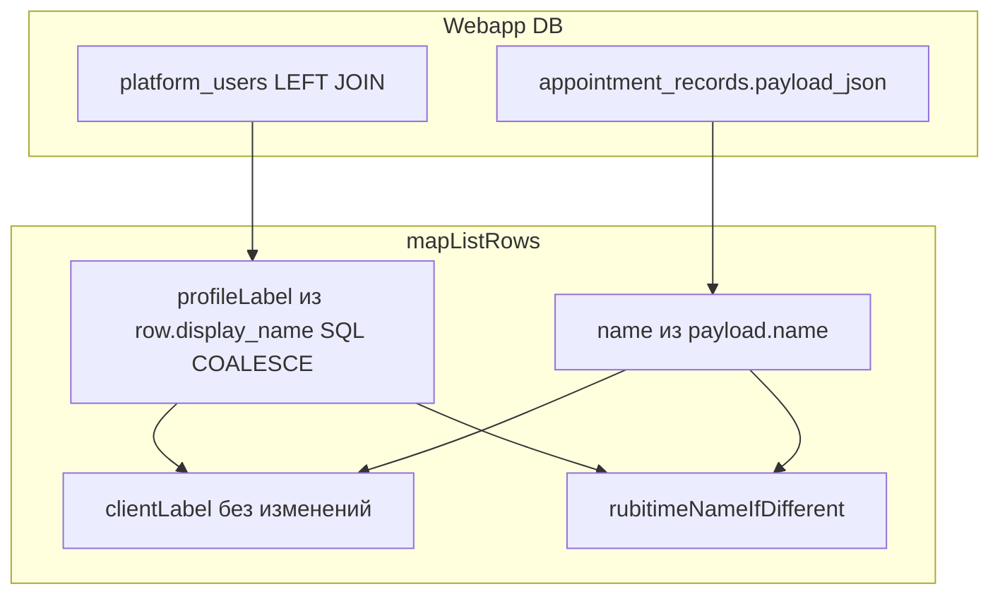

# План: подсказка «имя в Rubitime» при расхождении с профилем

## Проблема

В [`apps/webapp/src/infra/repos/pgDoctorAppointments.ts`](apps/webapp/src/infra/repos/pgDoctorAppointments.ts) поле `clientLabel` строится как **профиль первым** (`COALESCE` из `platform_users` в `LIST_SELECT`), затем `payload_json.name`, телефон, «Неизвестный клиент». Если в Rubitime другое ФИО, врач его **не видит**, пока профиль непустой.

## Цель продукта

Показать врачу **имя из записи Rubitime**, когда оно **осмысленно отличается** от подписи профиля, **дополнительной одной строкой**, не меняя приоритет основной строки (`clientLabel`).

## Разрешённый scope (можно менять)

| Область | Пути |
|--------|------|
| Чистая логика сравнения | `apps/webapp/src/shared/lib/*` (новый файл, экспорт из `shared/lib` по существующему паттерну) |
| Тип и маппинг записи | [`apps/webapp/src/modules/doctor-appointments/ports.ts`](apps/webapp/src/modules/doctor-appointments/ports.ts), [`apps/webapp/src/infra/repos/pgDoctorAppointments.ts`](apps/webapp/src/infra/repos/pgDoctorAppointments.ts) |
| Сервис (проброс поля) | [`apps/webapp/src/modules/doctor-appointments/service.ts`](apps/webapp/src/modules/doctor-appointments/service.ts) — только если тип потребует явного spread (сейчас `{ ...row, time }` уже пробрасывает новые поля) |
| UI | [`apps/webapp/src/app/app/doctor/appointments/page.tsx`](apps/webapp/src/app/app/doctor/appointments/page.tsx), [`apps/webapp/src/app/app/doctor/loadDoctorTodayDashboard.ts`](apps/webapp/src/app/app/doctor/loadDoctorTodayDashboard.ts), [`apps/webapp/src/app/app/doctor/DoctorTodayDashboard.tsx`](apps/webapp/src/app/app/doctor/DoctorTodayDashboard.tsx) |
| Тесты | новый `*.test.ts` рядом с helper; [`loadDoctorTodayDashboard.test.ts`](apps/webapp/src/app/app/doctor/loadDoctorTodayDashboard.test.ts), [`DoctorTodayDashboard.test.tsx`](apps/webapp/src/app/app/doctor/DoctorTodayDashboard.test.tsx), [`service.test.ts`](apps/webapp/src/modules/doctor-appointments/service.test.ts) по факту падений |
| Док | [`docs/ARCHITECTURE/RUBITIME_BOOKING_PIPELINE.md`](docs/ARCHITECTURE/RUBITIME_BOOKING_PIPELINE.md) |

## Вне scope (не делать без отдельного запроса)

- Карточка клиента, `ClientAppointmentHistoryItem`, [`buildAppDeps.ts`](apps/webapp/src/app-layer/di/buildAppDeps.ts) `listAppointmentHistoryForPhone` — другой UX-поверхности.
- Смена приоритета `clientLabel` на Rubitime-first.
- Миграции БД, `patient_bookings.contact_name`, integrator, webhook — данные уже в `appointment_records.payload_json`.
- Отдельная папка initiative + `LOG.md` — не требуется; достаточно правки `RUBITIME_BOOKING_PIPELINE.md`.

## Правила перед исполнением (прочитать)

- [`.cursor/rules/ui-copy-no-excess-labels.mdc`](.cursor/rules/ui-copy-no-excess-labels.mdc) — одна короткая строка-подсказка, без вводных абзацев.
- Модульная изоляция: не тянуть `@/infra/db` в `shared/lib` — только чистые строки/даты.

## Поток данных (без изменения SQL)



[`createDoctorAppointmentsService`](apps/webapp/src/modules/doctor-appointments/service.ts) добавляет только `time` через spread — новое поле на `AppointmentRow` уйдёт в UI автоматически.

## Этап 1 — чистая функция + тесты

**Содержание:** файл вроде `apps/webapp/src/shared/lib/appointmentRubitimeNameMismatch.ts`:

- `normalizeClientNameForCompare(s: string | null | undefined): string | null` — `trim`, пустое → `null`, схлопнуть `\s+` → один пробел.
- `rubitimeNameIfDifferent(profileLabel: string | null, rubitimeName: string | null): string | null` — если после нормализации оба не `null` и строки **не равны**, вернуть **оригинальный** `rubitimeName` с одним `trim` (для отображения в UI); иначе `null`.

**Краевые случаи (таблица ожиданий в тестах):**

| profileLabel (SQL) | payload.name | Подсказка |
|--------------------|--------------|-----------|
| `Иван` | `Иван` (лишние пробелы) | нет |
| `Иван` | `Пётр` | да, «Пётр» |
| `null` / пусто | `Иван` | нет (`clientLabel` уже берётся из `nameFromPayload`; вторая строка дублировала бы то же) |
| `Иван` | отсутствует / пусто | нет |
| Нет строки `platform_users` (`user_id` null, `display_name` null), `name` в payload пусто, `clientLabel` = телефон | — | нет подсказки (нет пары имён для сравнения) |

**Чек-лист закрытия этапа:**

- [x] `vitest` на все кейсы из таблицы + граница «один null».
- [x] Нет импортов infra/repos из `shared/lib`.

## Этап 2 — контракт и маппер

**Содержание:**

- В `AppointmentRow` добавить поле, например `rubitimeNameIfDifferent: string | null` (всегда задавать в маппере как `string | null`, без «дырявого» optional — проще потребителям).
- В `mapListRows`: передать в helper **`row.display_name` как из SQL** (уже COALESCE профиля) и **`nameFromPayload`**; внутри helper — нормализация и сравнение; отображаемое значение подсказки — trimmed Rubitime-строка при `null` из helper’а не показывать.

**Чек-лист:**

- [x] `clientLabel` побуквенно тот же приоритет, что сейчас.
- [x] `inMemoryDoctorAppointments` — пустой массив; типы компилируются без правок или с минимальной правкой возвращаемого литерала, если где-то есть явный `AppointmentRow` литерал.

## Этап 3 — UI

**Содержание:**

1. [`appointments/page.tsx`](apps/webapp/src/app/app/doctor/appointments/page.tsx): под блоком с `Link` (или сразу под строкой с временем/именем) — **одна** строка при `a.rubitimeNameIfDifferent`, текст фиксированный короткий, например: `В Rubitime: {значение}`.
2. [`loadDoctorTodayDashboard.ts`](apps/webapp/src/app/app/doctor/loadDoctorTodayDashboard.ts): поле в `TodayAppointmentItem`; проброс в `mapAppointmentToTodayItem`.
3. [`DoctorTodayDashboard.tsx`](apps/webapp/src/app/app/doctor/DoctorTodayDashboard.tsx): **два** места — «Записи сегодня» и «Ближайшие записи» — идентичный паттерн подписи.

**Чек-лист:**

- [x] Два одинаковых фрагмента `<p className=…>` допустимы; вынос в локальный компонент только если появится третий потребитель в том же PR.
- [x] `id`/`data-testid` не обязательны; при добавлении теста RTL — стабильный селектор по тексту или `id` на контейнер.

## Этап 4 — документация

В [`RUBITIME_BOOKING_PIPELINE.md`](docs/ARCHITECTURE/RUBITIME_BOOKING_PIPELINE.md) в блок про имена / UI врача (рядом с описанием join к `platform_users`): одно предложение — вторая строка при mismatch, маршруты `/app/doctor/appointments` и «Сегодня».

## Этап 5 — верификация

**После всех правок (один прогон, не после каждого шага):**

```bash
cd apps/webapp && pnpm exec vitest run src/shared/lib/appointmentRubitimeNameMismatch.test.ts src/app/app/doctor/loadDoctorTodayDashboard.test.ts src/app/app/doctor/DoctorTodayDashboard.test.tsx src/modules/doctor-appointments/service.test.ts
```

При ошибках типов — расширить список файлов или `pnpm exec tsc --noEmit` в `apps/webapp` по проектной привычке.

**Не требовать** полный корневой `pnpm run ci` в теле плана для закрытия задачи; перед merge по политике репозитория — по усмотству команды.

## Definition of Done

1. [x] При непустом `payload_json.name` и отличии от профильного `display_name` (после `normalizeClientNameForCompare`) вторая строка видна на `/app/doctor/appointments` и на дашборде «Сегодня» (оба списка записей).
2. [x] `clientLabel` и SQL-запросы списка записей **без** изменения семантики.
3. [x] Юнит-тесты на чистую функцию; затронутые webapp-тесты обновлены и зелёные.
4. [x] Документация отражает поведение (см. `doc-pipeline` в frontmatter).
5. [x] Вне scope (карточка клиента / `ClientAppointmentHistoryItem`) не трогалось.

## Канон и дубликаты

Канон плана — этот файл в репозитории. Дубликаты во `~/.cursor/plans/rubitime_name_mismatch_ui_*.plan.md` удалены; `status` / `todos` синхронизированы с фактом выполнения (**2026-05-15**).
