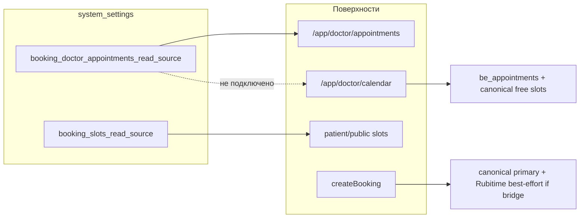
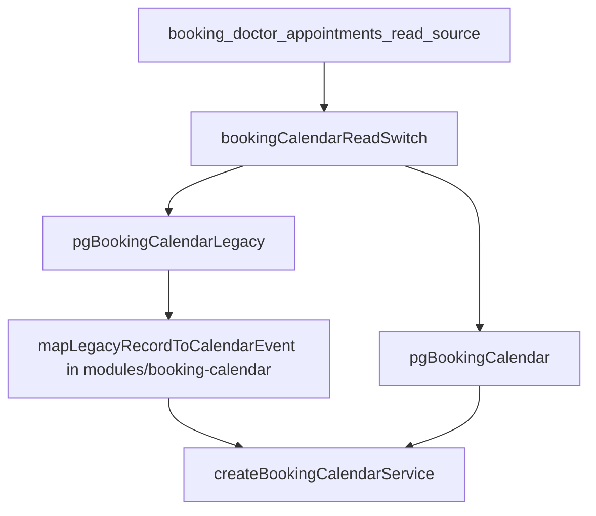
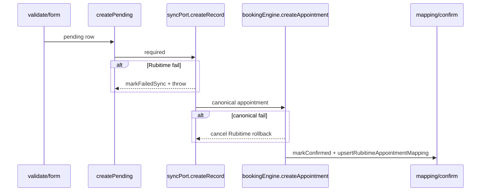

# Стабилизация Rubitime-transition

> **Для исполнения:** после старта — `git mv` в [`.cursor/plans/archive/rubitime_transition_stabilize.plan.md`](.cursor/plans/archive/rubitime_transition_stabilize.plan.md) и вести [`docs/OWN_BOOKING_ENGINE_INITIATIVE/LOG.md`](docs/OWN_BOOKING_ENGINE_INITIATIVE/LOG.md) (execution log по `.cursor/rules/plan-authoring-execution-standard.mdc`).

## Контекст и проблемы



| Проблема | Где | Риск |
|----------|-----|------|
| Календарь не читает `appointment_records` | [`pgBookingCalendar`](apps/webapp/src/infra/repos/pgBookingCalendar.ts) | Пустой календарь при `rubitime_legacy` |
| Canonical free slots при Rubitime read | [`booking-calendar/service.ts`](apps/webapp/src/modules/booking-calendar/service.ts) | Ложные «Свободно» |
| Hybrid slots≠create | `booking_slots_read_source` vs [`canonicalCreate.ts`](apps/webapp/src/modules/patient-booking/canonicalCreate.ts) | Пациент бронирует Rubitime-слот, create идёт в канон |
| `assertSlotAvailable` до Rubitime | `canonicalCreate.ts` ~159–180 | Отклоняет валидные Rubitime-слоты |
| Rubitime mirror только при bridge | `canonicalCreate.ts` ~287–328, `catch` гасит ошибку | Silent drift |
| Defaults расходятся | seed [`0099_*`](apps/webapp/db/drizzle-migrations/0099_booking_doctor_appointments_read_source.sql) только appointments; slots → parser default `canonical` | Production hybrid «из коробки» |
| Working hours read-only | [`pgBookingScheduling.listWorkingHours`](apps/webapp/src/infra/repos/pgBookingScheduling.ts) | UI-паритет stage 2 не закрыт |
| Schedule blocks org-wide only | [`BookingScheduleBlocksSection`](apps/webapp/src/app/app/settings/BookingScheduleBlocksSection.tsx) | Scoped blocks в API есть, UI не шлёт |

**Целевая transitional-модель:**

| Режим | Список | Календарь | Слоты пациента | Create |
|-------|--------|-----------|----------------|--------|
| Rubitime | `appointment_records` | `appointment_records` | Rubitime API | Rubitime-first (не зависит от bridge) |
| Canonical | `be_appointments` | `be_appointments` + free slots | `booking-scheduling` | canonical + bridge best-effort |

---

## Порядок исполнения

1. **П.0** — выровнять defaults (иначе hybrid сразу после деплоя)
2. **П.2 + П.3** — критические риски (можно параллельно двум агентам: calendar / create)
3. **П.1** — labels + статус (можно параллельно с П.2, статус опирается на setting, не на код календаря)
4. **П.4** — быстрый UX-фикс
5. **П.5 + П.6** — UI-паритет расписания
6. **П.7 + П.8** — доки и CI

---

## П.0 — Выровнять defaults read sources

**Scope:** новая миграция `0100_booking_slots_read_source.sql` (+ meta journal), дублировать row в `integrator.system_settings` (правило mirror).

**Сделать:**

- Seed `booking_slots_read_source` = `rubitime` для default org (ON CONFLICT DO NOTHING), симметрично `rubitime_legacy` для appointments.
- **Не** менять parser default в [`slotsReadSource.ts`](apps/webapp/src/modules/patient-booking/slotsReadSource.ts) — seed покрывает prod; parser `canonical` остаётся fallback для пустой БД в dev.

**Проверки:**

- `rg 'booking_slots_read_source' apps/webapp/db/drizzle-migrations`
- При необходимости smoke: overview возвращает `rubitime` на fresh migrate

---

## П.1 — Режим источников в admin UI

**Scope (разрешено):** [`BookingEngineSection.tsx`](apps/webapp/src/app/app/settings/BookingEngineSection.tsx), [`overview/route.ts`](apps/webapp/src/app/api/admin/booking-engine/overview/route.ts). **Не трогать:** логику calendar/create (только отображение).

**UI:**

- Видимые короткие labels (не `sr-only`), без длинных hints ([`ui-copy-no-excess-labels.mdc`](.cursor/rules/ui-copy-no-excess-labels.mdc)):
  - «Список записей врача» → Rubitime / Канон
  - «Свободные слоты пациента» → Rubitime / Канон
- `displayLabel` на `SelectTrigger` ([`ui-select-trigger-display-label.mdc`](.cursor/rules/ui-select-trigger-display-label.mdc)).
- Статус одной строкой: «Календарь сейчас: Rubitime» / «… Канон» — из `doctorAppointmentsReadSource` (`rubitime_legacy` → Rubitime).
- **Предупреждение при опасном hybrid:** если appointments=`rubitime_legacy` и slots=`canonical` (или наоборот до cutover) — одна строка «Источники расходятся» (без простыни текста). После П.0 оба default Rubitime — warning только при ручном переключении одного select.

**API:** overview — поле `calendarReadSource` (alias, без нового setting key).

**Checklist:**

- [ ] `rg 'sr-only.*Источник' apps/webapp/src/app/app/settings/BookingEngineSection.tsx` — labels видимы
- [ ] PATCH valid/invalid enum в [`admin/settings/route.test.ts`](apps/webapp/src/app/api/admin/settings/route.test.ts)
- [ ] GET overview smoke (оба read source)
- [ ] `pnpm --dir apps/webapp run lint`

---

## П.2 — Календарь в Rubitime transition mode

**Scope (разрешено):** [`modules/booking-calendar/*`](apps/webapp/src/modules/booking-calendar/), новый [`infra/repos/pgBookingCalendarLegacy.ts`](apps/webapp/src/infra/repos/pgBookingCalendarLegacy.ts), новый [`infra/repos/bookingCalendarReadSwitch.ts`](apps/webapp/src/infra/repos/bookingCalendarReadSwitch.ts), [`buildAppDeps.ts`](apps/webapp/src/app-layer/di/buildAppDeps.ts), [`doctor|admin/booking-engine/calendar/route.ts`](apps/webapp/src/app/api/doctor/booking-engine/calendar/route.ts), [`DoctorBookingCalendarClient.tsx`](apps/webapp/src/app/app/doctor/calendar/DoctorBookingCalendarClient.tsx).

**Вне scope:** не тянуть [`pgDoctorAppointments`](apps/webapp/src/infra/repos/pgDoctorAppointments.ts) в calendar module imports — отдельный legacy calendar repo.

### Архитектура



### 2.1 Legacy repo (критично: не копировать list-фильтры)

[`pgDoctorAppointments`](apps/webapp/src/infra/repos/pgDoctorAppointments.ts) для списка использует `record_at >= NOW()` ([`AR_ACTIVE_UPCOMING_SQL`](apps/webapp/src/infra/repos/pgDoctorAppointments.ts)). **Календарь** должен брать **overlap с диапазоном view**:

```sql
record_at IS NOT NULL
AND record_at < :rangeEnd
AND (record_at + duration) > :rangeStart  -- duration из payload или 60 min
AND deleted_at IS NULL
AND status IN ('created', 'updated')  -- canceled: опционально mapped cancelled для strikethrough
```

Переиспользовать [`AR_CANCELLATION_LAST_EVENT_EXCLUSION_SQL`](apps/webapp/src/infra/repos/pgDoctorAppointments.ts) где применимо.

### 2.2 Mapper (modules, не infra)

Файл [`modules/booking-calendar/mapLegacyRecordToCalendarEvent.ts`](apps/webapp/src/modules/booking-calendar/mapLegacyRecordToCalendarEvent.ts):

| Legacy | CalendarAppointmentEvent |
|--------|--------------------------|
| `integrator_record_id` | `id` |
| `record_at` | `startAt` |
| payload duration / 60 min | `endAt` |
| — | `source: "rubitime_legacy"` |
| `created`/`updated` | `status: "confirmed"` |
| join `platform_users` / payload | patient fields |
| `branch_id` если есть | `branchId`; specialist/room/service — null или mapping best-effort |

Dedupe в Rubitime mode: если есть `be_external_entity_mappings` / projection в `be_appointments` с тем же rubitime id — показывать **только legacy row** (не дублировать).

### 2.3 Read switch + service

- [`bookingCalendarReadSwitch.ts`](apps/webapp/src/infra/repos/bookingCalendarReadSwitch.ts) — зеркало [`doctorAppointmentsReadSwitch.ts`](apps/webapp/src/infra/repos/doctorAppointmentsReadSwitch.ts), reuse `parseDoctorAppointmentsReadSource`.
- [`createBookingCalendarService`](apps/webapp/src/modules/booking-calendar/service.ts): inject `resolveCalendarReadSource`.
- Если `rubitime_legacy` → **не вызывать** `listFreeSlotEvents` (canonical green slots).
- **`be_schedule_blocks` оставить** — admin-инструмент; в Rubitime mode blocks по-прежнему из канона (документировать в LOG: не влияют на Rubitime slots).

### 2.4 API + UI contract

Расширить [`CalendarAggregate`](apps/webapp/src/modules/booking-calendar/types.ts):

```typescript
readSource: "rubitime_legacy" | "canonical";
freeSlotsEnabled: boolean; // false в rubitime_legacy
```

Пробросить в JSON обоих calendar routes (doctor + admin). UI [`DoctorBookingCalendarClient`](apps/webapp/src/app/app/doctor/calendar/DoctorBookingCalendarClient.tsx):

- Не слать `includeFreeSlots=1` если `freeSlotsEnabled === false`.
- Legacy events: read-only panel / disable canonical lifecycle actions (manual reschedule/cancel через `be_appointments` id).

`listFilterMeta` — без изменений (каталог `be_*` для фильтров; legacy rows без scope могут не match filter — **не скрывать** при пустом filter, при активном filter — soft match по `branchId` если есть).

### Checklist

- [ ] Unit: mapper `record_at` + duration → event
- [ ] [`service.test.ts`](apps/webapp/src/modules/booking-calendar/service.test.ts): free slots `[]` при `rubitime_legacy`
- [ ] [`calendar/route.test.ts`](apps/webapp/src/app/api/doctor/booking-engine/calendar/route.test.ts): legacy events + `freeSlotsEnabled: false`
- [ ] `rg 'listAppointmentsInRange' apps/webapp/src/infra/repos/pgBookingCalendarLegacy.ts` — range overlap, не `>= NOW()`
- [ ] Admin calendar route — те же поля в response

---

## П.3 — Rubitime-first create при `booking_slots_read_source=rubitime`

**Scope:** [`canonicalCreate.ts`](apps/webapp/src/modules/patient-booking/canonicalCreate.ts), [`service.ts`](apps/webapp/src/modules/patient-booking/service.ts), [`buildAppDeps.ts`](apps/webapp/src/app-layer/di/buildAppDeps.ts).

### Политика (уточнения vs первой версии плана)

| Вопрос | Решение |
|--------|---------|
| Привязка | `booking_slots_read_source === "rubitime"` |
| Bridge flag | **Игнорировать** для Rubitime-first — `syncPort.createRecord` обязателен; bridge = mirror **только** в canonical mode |
| `assertSlotAvailable` | В Rubitime mode **пропустить** (canonical WH/slots не SoT); safety: overlap check через `createAppointment` exclusion / optional light overlap query |
| Concurrency | Портировать `inFlightCreateBySlot` из legacy [`service.ts`](apps/webapp/src/modules/patient-booking/service.ts) на Rubitime-first canonical path |
| Prepayment | Сохранить порядок: Rubitime create **до** `markAwaitingPayment` return (как сейчас bridge после `createAppointment`), но Rubitime step **fail-hard**. Тест: prepayment + rubitime mode — отдельный `it` |

### Порядок Rubitime-first (in_person / online)



Рефактор: вынести `createRubitimeRecord(...)` (общий для online/v2) — не дублировать блок ~292–316.

**Canonical mode** (`slotsReadSource === "canonical"`): текущий порядок без изменений; Rubitime только if `isRubitimeBridgeEnabled()`, swallow в catch допустим.

### Checklist

- [ ] Rubitime mode + `createRecord` throws → `markFailedSync`, не confirmed
- [ ] Rubitime mode + missing `rubitimeId` → fail
- [ ] Rubitime mode + `assertSlotAvailable` **not called** (mock assert rejects, create still succeeds if Rubitime ok)
- [ ] Canonical mode + bridge → best-effort unchanged
- [ ] `rg 'Rubitime sync is best-effort' apps/webapp/src/modules/patient-booking/canonicalCreate.ts` — только в canonical branch
- [ ] Public + patient create routes: `rubitime_*` → 503 сохранён

---

## П.4 — Убрать «Длительность» из slot UI

**Scope:** [`SlotStepClient.tsx`](apps/webapp/src/app/app/patient/booking/new/slot/SlotStepClient.tsx), [`useBookingSlots.ts`](apps/webapp/src/app/app/patient/cabinet/useBookingSlots.ts). Public page использует тот же `SlotStepClient` — отдельная правка не нужна.

- Удалить select «Длительность» (~105–124).
- Убрать `useState(slotCount)`; константа `1` в `useBookingSlots`.
- `buildConfirmQuery`: не derive multi-slot from span; не добавлять `slotCount` в URL.
- Backend `slotCount` query param — **оставить** (compat 1–8).

**Checklist:**

- [ ] [`SlotStepClient.test.tsx`](apps/webapp/src/app/app/patient/booking/new/slot/SlotStepClient.test.tsx): нет «Длительность»
- [ ] Existing [`computeSlots.test.ts`](apps/webapp/src/modules/booking-scheduling/computeSlots.test.ts) green

---

## П.5 — UI рабочих часов `be_working_hours`

**Scope:** новый [`BookingWorkingHoursSection.tsx`](apps/webapp/src/app/app/settings/BookingWorkingHoursSection.tsx), route [`/api/admin/booking-engine/working-hours`](apps/webapp/src/app/api/admin/booking-engine/working-hours/route.ts), [`booking-scheduling/ports.ts`](apps/webapp/src/modules/booking-scheduling/ports.ts) + [`service.ts`](apps/webapp/src/modules/booking-scheduling/service.ts), [`pgBookingScheduling.ts`](apps/webapp/src/infra/repos/pgBookingScheduling.ts), [`doctor/admin/booking/page.tsx`](apps/webapp/src/app/app/doctor/admin/booking/page.tsx) — секция `#booking-operations` после schedule-blocks.

**Port (новые методы):**

- `listWorkingHoursAdmin(orgId, filters?)` — все rows incl. inactive для таблицы
- `createWorkingHours(input)` / `updateWorkingHours(id, input)` / `deactivateWorkingHours(id, orgId)`

**Конвенции:** `weekday` **1 = Пн … 7 не используется** — как seed [`0089`](apps/webapp/db/drizzle-migrations/0089_booking_stage2_scheduling_and_forms.sql) и [`computeSlots.ts`](apps/webapp/src/modules/booking-scheduling/computeSlots.ts). UI: чекбоксы Пн–Вс → weekday 1–5/6/0 (0=Вс — сверить с `weekdayIndex` в computeSlots перед реализацией).

**Fallback indicator:** вызвать `pickWorkingHours` logic — если для scope нет active rows → «Используется fallback 09:00–18:00».

**UI:** specialist / branch / room (optional null = org-wide); время start/end; таблица + disable. Catalog — GET overview (как П.6). `displayLabel` на selects.

**Checklist:**

- [ ] Route tests CRUD + validation (start < end, weekday bounds)
- [ ] Repo/service: scope resolution vs org-default
- [ ] Manual smoke `/app/doctor/admin/booking`

---

## П.6 — Scoped блокировки расписания

**Scope:** [`BookingScheduleBlocksSection.tsx`](apps/webapp/src/app/app/settings/BookingScheduleBlocksSection.tsx), [`schedule-blocks/route.ts`](apps/webapp/src/app/api/admin/booking-engine/schedule-blocks/route.ts), [`pgBookingScheduling.listScheduleBlocks`](apps/webapp/src/infra/repos/pgBookingScheduling.ts).

- Form: optional selects specialist / branch / room (catalog from overview).
- POST: передать scope ids.
- GET: query params `specialistId`, `branchId`, `roomId` + SQL filter (сейчас только date range).
- List columns: короткие scope labels (или «Вся клиника»).
- Filter bar для списка (те же поля).
- `displayLabel` на selects.

**Checklist:**

- [ ] Route: POST scoped + GET filter
- [ ] [`listBusyIntervals`](apps/webapp/src/infra/repos/pgBookingScheduling.ts): block с `specialistId` режет busy (existing logic — verify test)

---

## П.7 — Документация

**Файлы:**

| Файл | Что исправить |
|------|----------------|
| [`MASTER_PLAN.md`](docs/OWN_BOOKING_ENGINE_INITIATIVE/MASTER_PLAN.md) | §2 Read + calendar; §2 Календарь — убрать «список → pgDoctorCanonicalAppointments»; DoD §6 — transitional exception |
| [`STAGE_CHECKLISTS.md`](docs/OWN_BOOKING_ENGINE_INITIATIVE/STAGE_CHECKLISTS.md) | §8.1 «оба читают канон» |
| [`LOG.md`](docs/OWN_BOOKING_ENGINE_INITIATIVE/LOG.md) | Execution log П.0–П.8 |
| [`api.md`](apps/webapp/src/app/api/api.md) | calendar `readSource`, working-hours, schedule-blocks filters |
| [`DOCTOR_CABINET_NAVIGATION.md`](docs/ARCHITECTURE/DOCTOR_CABINET_NAVIGATION.md) | calendar read switch |
| [`UI_SURFACES_CHECKLIST.md`](docs/OWN_BOOKING_ENGINE_INITIATIVE/UI_SURFACES_CHECKLIST.md) | working-hours + scoped blocks closed |

**Transitional matrix** — в MASTER_PLAN (см. таблицу в контексте).

**Не помечать** stage 2 scheduling UI-parity done до merge этой работы.

---

## П.8 — Проверки

**Targeted (после каждого пункта):**

```bash
pnpm --dir apps/webapp exec vitest run <paths>
pnpm --dir apps/webapp run lint
pnpm --dir apps/webapp exec tsc --noEmit -p tsconfig.json
```

**Перед push:**

```bash
pnpm install --frozen-lockfile && pnpm run ci
```

**Не добавлять** новые файлы в ESLint allowlist ([`clean-architecture-module-isolation.mdc`](.cursor/rules/clean-architecture-module-isolation.mdc)).

---

## Scope boundaries (не трогать)

- GitHub CI workflow; env для integration config
- Отдельный setting key для calendar (reuse appointments read source)
- Rubitime free slots в doctor calendar (только suppress canonical)
- Full backfill `be_external_entity_mappings`
- Patient «ЛФК» / unrelated modules
- `be_availability_rules` admin UI (out of scope)

---

## Definition of Done

- [ ] П.0: defaults aligned (`rubitime_legacy` + `rubitime` slots)
- [ ] Календарь: `appointment_records` в range при `rubitime_legacy`; не пустой при данных
- [ ] Canonical free slots скрыты в Rubitime calendar mode (`freeSlotsEnabled: false`)
- [ ] Admin UI: labels + «Календарь сейчас» + warning при расхождении источников
- [ ] Patient slot UI без «Длительность»; `slotCount=1`
- [ ] `booking_slots_read_source=rubitime` → Rubitime-first, fail-hard, без bridge gate
- [ ] Working hours CRUD + fallback indicator
- [ ] Schedule blocks scoped + filter
- [ ] Docs честны; LOG.md обновлён
- [ ] Targeted tests + полный `pnpm run ci` перед push
