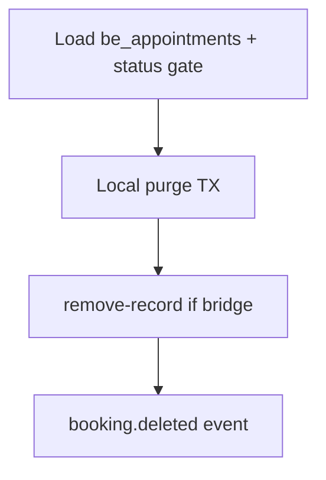

# Тихое удаление отменённых записей (doctor + admin) — усиленный план

## Продуктовое решение (зафиксировано)

| Контекст | Поведение |
|----------|-----------|
| **Наш кабинет** | Сначала **Отменить** (`manual-cancel`) → одно уведомление. Потом **Удалить** — тихо. |
| **Rubitime UI** | Можно удалить без отмены — **не копируем**; у нас delete только для уже отменённых. |
| **Активная запись** | Delete **запрещён** → API `409 not_cancelled`, кнопки в UI нет. |
| **Канон `be_appointments`** | **Не** hard-delete — audit/lifecycle (`be_appointment_cancellations`) сохраняются. |

### Допустимые статусы delete (строгий whitelist)

```ts
// новый export — НЕ isCancelledAppointmentStatus (там есть no_show)
STAFF_DELETABLE_STATUSES = [
  "cancelled_by_patient",
  "cancelled_by_specialist",
  "late_cancellation",
] as const;
```

| Статус | Delete | Почему |
|--------|--------|--------|
| `cancelled_by_*`, `late_cancellation` | да | явная отмена |
| `confirmed`, `rescheduled`, `awaiting_payment`, … | нет | `not_cancelled` |
| `no_show` | нет | не «отмена» в продуктовом смысле |
| `completed`, `visit_confirmed` | нет | завершённый визит |
| `failed_sync` (ghost) | нет | ops/SQL, не doctor UI |

---

## Контракт API

### Endpoints (новые)

- `POST /api/doctor/booking-engine/appointments/[id]/delete`
- `POST /api/admin/booking-engine/appointments/[id]/delete`

Body: `{}` или пустой. Auth/guards: как [`manual-cancel`](apps/webapp/src/app/api/doctor/booking-engine/appointments/[id]/manual-cancel/route.ts) / [`requireAdminBookingEngine`](apps/webapp/src/app/api/admin/booking-engine/_requireAdminBookingEngine.ts).

### Ответы

| HTTP | `error` / body | Когда |
|------|----------------|-------|
| 200 | `{ ok: true }` | purge выполнен или уже был (idempotent) |
| 200 | `{ ok: true, rubitimeMirrorFailed: true }` | локально ок, `remove-record` упал |
| 404 | `not_found` | нет `be_appointments` в org |
| 409 | `not_cancelled` | статус ∉ whitelist |
| 403 | `forbidden` | guard |
| 503 | `lifecycle_unavailable` | только если критичный deps null (как cancel) |

**Partial outcomes (симметрия mirror contract):** delete path **не** 502 при сбое Rubitime после локального purge — `ok: true` + `rubitimeMirrorFailed`.

**Запрещено на delete path:** `staffCancel`, `applyStaffCancelSideEffects`, `syncStaffCancelToRubitime`, `emitBookingEvent(booking.cancelled)`.

---

## Порядок side-effects (канонический)



1. **Gate** — org + appointmentId + `isStaffDeletableCancelledStatus`.
2. **Local TX** (одна транзакция в projection port):
   - `appointment_records.deleted_at = now()` по `integrator_record_id` (rubitime id **или** `be:{uuid}`);
   - `DELETE patient_bookings` WHERE `rubitime_id = $1` OR `canonical_appointment_id = $2` (включая уже `cancelled` — убрать из [`listHistoryByUser`](apps/webapp/src/infra/repos/pgPatientBookings.ts));
   - если row уже `deleted_at` — skip UPDATE, но DELETE patient_bookings всё равно idempotent.
3. **Rubitime** — только если `booking_rubitime_bridge_enabled` **и** `rubitimeId`: `syncPort.deleteRecord` (`remove-record`). **Не** `cancelRecord` (уже status 4).
4. **`booking.deleted`** — [`recordM2mRoute`](apps/integrator/src/integrations/rubitime/recordM2mRoute.ts) L549: только GCal cleanup, **без** messenger/push. Idempotency key: `booking.deleted:staff:{appointmentId}`.

**Почему local перед Rubitime:** пациентский кабинет и календарь перестают показывать запись даже при `rubitimeMirrorFailed`.

---

## Архитектура модулей

```
route.ts (doctor/admin, thin)
  → buildAppDeps()
  → staffPurgeCancelledAppointment({ deps, organizationId, appointmentId, actorId, getRubitimeAppointmentId })
       → bookingEngine.getAppointment
       → isStaffDeletableCancelledStatus
       → resolveRubitimeIdForAppointment + resolveDoctorProjectionIntegratorRecordId
       → appointmentProjection.softDeleteByCanonicalAppointmentId | softDeleteByIntegratorId
       → isStaffRubitimeOutboundEnabled → deleteRecord
       → emitBookingDeletedEvent (shared)
```

**Reuse (обязательно):**

| Существующее | Роль |
|--------------|------|
| [`projectCanonicalAppointment.ts`](apps/webapp/src/modules/patient-booking/projectCanonicalAppointment.ts) `resolveDoctorProjectionIntegratorRecordId` | ключ projection |
| [`pgAppointmentProjection.softDeleteByIntegratorId`](apps/webapp/src/infra/repos/pgAppointmentProjection.ts) | база local purge |
| [`bookingM2mApi.deleteRecord`](apps/webapp/src/modules/integrator/bookingM2mApi.ts) | M2M remove-record |
| [`admin/.../soft-delete/route.ts`](apps/webapp/src/app/api/admin/appointment-records/[integratorRecordId]/soft-delete/route.ts) | источник для `emitBookingDeletedEvent` refactor |
| [`staffManualCancelAfterCanonical`](apps/webapp/src/app-layer/booking/staffManualCancelAfterCanonical.ts) | **не** вызывать |

**Новые файлы:**

- `apps/webapp/src/app-layer/booking/staffPurgeCancelledAppointment.ts`
- `apps/webapp/src/app-layer/booking/emitBookingDeletedEvent.ts` (или `staffBookingDeletedEvent.ts`)
- `apps/webapp/src/app-layer/booking/staffPurgeCancelledAppointment.test.ts`
- doctor/admin `.../delete/route.ts` + `route.test.ts`

**Порты / infra sync:**

- [`AppointmentProjectionPort`](apps/webapp/src/infra/repos/pgAppointmentProjection.ts) — расширить сигнатуру; обновить [`inMemoryAppointmentProjection.ts`](apps/webapp/src/infra/repos/inMemoryAppointmentProjection.ts) **в том же PR** (иначе in-memory тесты разъедутся).

---

## Шаг P0 — Domain + projection purge

### P0.1 Helpers

Файл: [`appointmentStatusLabels.ts`](apps/webapp/src/modules/booking-calendar/appointmentStatusLabels.ts)

- `STAFF_DELETABLE_STATUSES` (const array)
- `isStaffDeletableCancelledStatus(status: string): boolean`
- Экспорт для UI (`DoctorCalendarEventPanel`, `DoctorAppointmentActions`) — **один источник**, не дублировать в компонентах.

**Checklist:**

- [x] `appointmentStatusLabels.test.ts`: deletable vs `no_show` vs `confirmed`
- [x] `rg 'isStaffDeletableCancelledStatus' apps/webapp/src/app/app/doctor` — UI импортирует helper

### P0.2 Projection port

Файлы: `pgAppointmentProjection.ts`, `inMemoryAppointmentProjection.ts`, тип в `AppointmentProjectionPort`.

**`softDeleteByIntegratorId(id, opts?: { cancelReason?: string; canonicalAppointmentId?: string })`:**

1. `UPDATE appointment_records SET deleted_at = now() WHERE integrator_record_id = $1 AND deleted_at IS NULL`
2. `DELETE FROM patient_bookings WHERE rubitime_id = $1` (если id — rubitime)
3. Если `canonicalAppointmentId` передан: `DELETE FROM patient_bookings WHERE canonical_appointment_id = $2` (покрывает `be:`-only rows)
4. Сохранить legacy ветку `UPDATE patient_bookings SET status=cancelled` для **active** statuses с `cancelReason` (для admin legacy soft-delete); для staff delete primary path — **DELETE**.

**`softDeleteByCanonicalAppointmentId(appointmentId)`:**

- `primaryId = resolveDoctorProjectionIntegratorRecordId(appointmentId, rubitimeFromMapping)`
- try `softDeleteByIntegratorId(primaryId, { canonicalAppointmentId: appointmentId, cancelReason: 'staff_delete' })`
- fallback: try `be:{appointmentId}` если primary был rubitime и row не найден
- tombstone: `purgeCanonicalStaffDeleteTombstone` если projection row отсутствует (idempotent 200)

**`isIntegratorRecordPurged(integratorRecordId): Promise<boolean>`** — для idempotent gate / inbound.

**Checklist:**

- [x] `pgAppointmentProjection.softDelete.test.ts`: DELETE cancelled patient_bookings; cancelReason `staff_delete`; idempotent second call
- [x] inMemory port — те же контракты (+ tombstone path)

---

## Шаг P1 — Orchestrator + API

### P1.1 `staffPurgeCancelledAppointment`

Файл: `apps/webapp/src/app-layer/booking/staffPurgeCancelledAppointment.ts`

**Возврат:** `{ ok: true, rubitimeMirrorFailed?: true } | { ok: false, error: 'not_found' | 'not_cancelled' }`

**Idempotency matrix (обязательные тесты):**

| Состояние до вызова | Локальный purge | remove-record | booking.deleted | HTTP |
|---------------------|-----------------|---------------|-----------------|------|
| cancelled, not purged | да | да | да | 200 |
| cancelled, already `deleted_at` | skip UPDATE | best-effort | да | 200 |
| confirmed | — | — | — | 409 |
| no_show | — | — | — | 409 |
| missing appt | — | — | — | 404 |
| bridge off | да | skip | да | 200 |
| remove-record throws | да | fail flag | да | 200 + `rubitimeMirrorFailed` |

**Negative test (критично):** mock `emitBookingEvent` — на delete path **ни разу** не `booking.cancelled`.

### P1.2 `emitBookingDeletedEvent`

Вынести payload builder из admin soft-delete route. Admin legacy route **рефактор** на helper (поведение не менять).

### P1.3 Routes

Зеркало `manual-cancel`: `requireDoctorBookingEngine` / `requireAdminBookingEngine`, `buildAppDeps()`, вызов orchestrator.

**Checklist:**

- [x] `doctor/.../delete/route.test.ts` — 403/404/409/503/200/partial
- [x] `admin/.../delete/route.test.ts` — то же

---

## Шаг P2 — Read surfaces + inbound

### P2.1 Canonical calendar + list

[`pgBookingCalendar.listAppointmentsInRange`](apps/webapp/src/infra/repos/pgBookingCalendar.ts):

- После select `be_appointments` (или в WHERE): exclude если EXISTS purged `appointment_records` по:
  - `integrator_record_id = be_external_entity_mappings.external_id` (rubitime), **или**
  - `integrator_record_id = 'be:' || be_appointments.id`

Helper (shared): `apps/webapp/src/infra/repos/doctorAppointmentPurgeFilter.ts` — **не** дублировать join в 3 местах.

[`pgDoctorCanonicalAppointments`](apps/webapp/src/infra/repos/pgDoctorCanonicalAppointments.ts) — тот же filter для `listAppointmentsForSpecialist` (все `filter.kind`).

### P2.2 Analytics KPI

[`pgDoctorAnalyticsMetricAccounts`](apps/webapp/src/infra/repos/pgDoctorAnalyticsMetricAccounts.ts) при `readSource=canonical`: cancelled/past metrics **не** считать purged appointments (join/filter как в calendar). Иначе KPI «отмены» останутся, но это ок — cancel event в `be_appointment_cancellations` сохраняется; **удалённые из UI** не должны дублировать в «предстоящих»/календарных срезах.

**Checklist:**

- [x] `pgBookingCalendar.test.ts` + `doctorAppointmentPurgeFilter.test.ts` — purged excluded
- [x] `pgDoctorCanonicalAppointments.test.ts` — list filter + stats `BE_APPOINTMENTS_NOT_PURGED`

### P2.3 Legacy read source `rubitime_legacy`

[`pgDoctorAppointments`](apps/webapp/src/infra/repos/pgDoctorAppointments.ts) уже фильтрует `ar.deleted_at IS NULL`. После soft-delete по rubitime `integrator_record_id` строка **должна** исчезнуть из legacy list автоматически.

**Checklist:**

- [x] `pgDoctorAppointments.test.ts` — list `deleted_at IS NULL`
- [x] Не ломать `AR_CANCELLATION_LAST_EVENT_EXCLUSION_SQL` (remove-record events)

### P2.4 Inbound anti-revive

Риск: после staff delete приходит delayed Rubitime webhook `event-update-record` / create — **не** должен восстановить `appointment_records.deleted_at` или `patient_bookings`.

**Минимальный fix (в scope):**

- В inbound upsert path ([`events.ts`](apps/webapp/src/modules/integrator/events.ts) / `upsertPatientBookingFromRubitime`): если `appointment_records.deleted_at IS NOT NULL` для integrator id → skip fanout / `skipped_purged` outcome (не ошибка, не revive).

**Checklist:**

- [x] Тест: purged record + inbound upsert → `skipped_purged`, без revive
- [x] `events.test.ts` — `skipped_purged`

---

## Шаг P3 — UI

### Surfaces

| Surface | Файл | Изменение |
|---------|------|-----------|
| Календарь (primary) | [`DoctorCalendarEventPanel.tsx`](apps/webapp/src/app/app/doctor/calendar/DoctorCalendarEventPanel.tsx) | «Удалить» рядом с «Отменить» только если `isStaffDeletableCancelledStatus` |
| Список записей | [`DoctorAppointmentActions.tsx`](apps/webapp/src/app/app/doctor/appointments/DoctorAppointmentActions.tsx) | то же; нужен `status` в props (сейчас только `recordId` — **расширить** из list row) |
| Admin calendar | если admin использует тот же panel — delete доступен через admin `apiBase` |

### UX rules (doctor UI style guide)

- `Button` `variant="outline"` `size="sm"`; destructive — `text-destructive` на label или отдельный outline (как соседние actions в panel).
- `window.confirm` одна строка перед delete.
- `panelErrorLabel`: добавить `not_cancelled` → «Сначала отмените запись».
- После delete success — `onChanged()`; событие исчезает из календаря после refetch.
- **Не** показывать disabled «Удалить» на активных — кнопки нет.

**Checklist:**

- [x] `DoctorAppointmentsListClient` передаёт `status`; `onChanged` → `router.refresh()`
- [x] Кнопка «Удалить» только в `DoctorCalendarEventPanel` + `DoctorAppointmentActions` (booking)

---

## Шаг P3 — Mirror matrix extension

Файл: [`bookingMirrorDesyncMatrix.test.ts`](apps/webapp/src/modules/patient-booking/bookingMirrorDesyncMatrix.test.ts)

**Сценарий #10 (новый):** staff cancel → staff delete →

- `patient_bookings` row deleted (not in `listHistoryByUser`)
- `emitBookingEvent` вызван с `booking.deleted`, **не** второй `booking.cancelled`
- `appointment_records.deleted_at` set

---

## Шаг P4 — Документация и приёмка

### Docs (обязательно)

| Doc | Что добавить |
|-----|--------------|
| [`BOOKING_MIRROR_INTEGRITY_CONTRACT.md`](docs/BOOKING_REWORK_INITIATIVE/BOOKING_MIRROR_INTEGRITY_CONTRACT.md) | § Staff delete: whitelist statuses; delete ≠ cancel; no `booking.cancelled`; local-before-Rubitime |
| [`ACCEPTANCE_MIRROR_SYNC.md`](docs/BOOKING_REWORK_INITIATIVE/ACCEPTANCE_MIRROR_SYNC.md) | Smoke **#10** staff delete |
| [`api.md`](apps/webapp/src/app/api/api.md) | doctor/admin delete endpoints |
| [`INTEGRATOR_CONTRACT.md`](apps/webapp/INTEGRATOR_CONTRACT.md) | staff delete = `remove-record` after cancel, not for active |
| [`patient-booking.md`](apps/webapp/src/modules/patient-booking/patient-booking.md) | patient history: row removed on staff delete |
| [`LOG.md`](docs/BOOKING_REWORK_INITIATIVE/LOG.md) | execution entry |

### Ручной smoke (post-deploy)

| ID | Шаг | Ожидание |
|----|-----|----------|
| SD-1 | Календарь: активная запись | нет кнопки «Удалить» |
| SD-2 | Отменить (free) | одно уведомление пациенту; статус cancelled в panel |
| SD-3 | Удалить | запись пропала из календаря и списка; **второго** уведомления нет |
| SD-4 | Кабинет пациента → прошлые записи | записи нет |
| SD-5 | Повторный delete (API) | 200 idempotent |
| SD-6 | Rubitime journal | запись удалена (remove-record), если bridge on |

---

## Scope boundaries

### Разрешено

- `apps/webapp/src/app-layer/booking/**`
- `apps/webapp/src/app/api/doctor|admin/booking-engine/appointments/**`
- `apps/webapp/src/infra/repos/pgAppointmentProjection.ts`, `inMemoryAppointmentProjection.ts`
- `apps/webapp/src/infra/repos/pgBookingCalendar.ts`, `pgDoctorCanonicalAppointments.ts`, `pgDoctorAnalyticsMetricAccounts.ts`
- `apps/webapp/src/modules/booking-calendar/appointmentStatusLabels.ts`
- `apps/webapp/src/modules/integrator/events.ts` (только inbound purge guard)
- `apps/webapp/src/app/app/doctor/calendar/**`, `appointments/**`
- docs из P4

### Вне scope

- DDL `be_appointments.deleted_at` / hard delete канона
- Patient self-delete
- Delete для `no_show` / `completed` / `failed_sync`
- Изменение integrator `remove-record` semantics
- Prod ops SQL (8449506/8449507)
- Полный редизайн admin `AdminDangerActions` (legacy integrator id soft-delete остаётся)
- Web Push / reminder cancel на delete path (reminders уже отменены на cancel step)

---

## Авто-проверки (финальный bundle)

```bash
pnpm --dir apps/webapp exec vitest run \
  src/modules/booking-calendar/appointmentStatusLabels.test.ts \
  src/infra/repos/pgAppointmentProjection.softDelete.test.ts \
  src/app-layer/booking/staffPurgeCancelledAppointment.test.ts \
  src/app/api/doctor/booking-engine/appointments/\[id\]/delete/route.test.ts \
  src/app/api/admin/booking-engine/appointments/\[id\]/delete/route.test.ts \
  src/infra/repos/doctorAppointmentPurgeFilter.test.ts \
  src/infra/repos/pgBookingCalendar.test.ts \
  src/infra/repos/pgDoctorCanonicalAppointments.test.ts \
  src/modules/patient-booking/bookingMirrorDesyncMatrix.test.ts \
  src/modules/integrator/events.test.ts \
  src/infra/repos/pgDoctorAnalyticsMetricAccounts.test.ts \
  src/infra/repos/pgDoctorAppointments.test.ts

pnpm --dir apps/webapp run typecheck
# полный барьер перед push:
pnpm run ci
```

Перед push: полный `pnpm run ci` (правило репо).

---

## Definition of Done

- [x] Whitelist gate `not_cancelled` на API и UI
- [x] Delete path никогда не эмитит `booking.cancelled` (unit proof — `bookingMirrorDesyncMatrix` #10)
- [x] `patient_bookings` удалены из upcoming **и** history
- [x] Purged скрыты из canonical calendar + doctor list + analytics KPI + legacy `deleted_at` list
- [x] Inbound не revive purged rows (`skipped_purged` + `events.test.ts`)
- [x] Idempotent повторный delete → 200 (включая tombstone без projection row)
- [x] `rubitimeMirrorFailed` partial flag документирован
- [x] Docs + ACCEPTANCE #10 + LOG
- [x] Targeted vitest bundle green (48 tests); `pnpm run ci` green (2026-06-07)
- [x] Ручной smoke SD-1..SD-6 — **cancelled** (post-deploy оператор, вне scope агента)

---

## Риски и mitigations

| Риск | Mitigation |
|------|------------|
| Календарь показывает отменённую после delete | purge filter по `appointment_records.deleted_at` |
| Пациент видит «Отменена» в истории | DELETE `patient_bookings`, не только UPDATE |
| Двойное уведомление | delete без `booking.cancelled`; тест mock |
| Delayed webhook revive | inbound `skipped_purged` guard |
| `rubitime_legacy` list drift | soft-delete по rubitime id → `deleted_at` уже в legacy SQL |
| Нет `appointment_records` row | fallback `be:{id}` soft-delete; tombstone INSERT + DELETE `patient_bookings` если row отсутствует |
