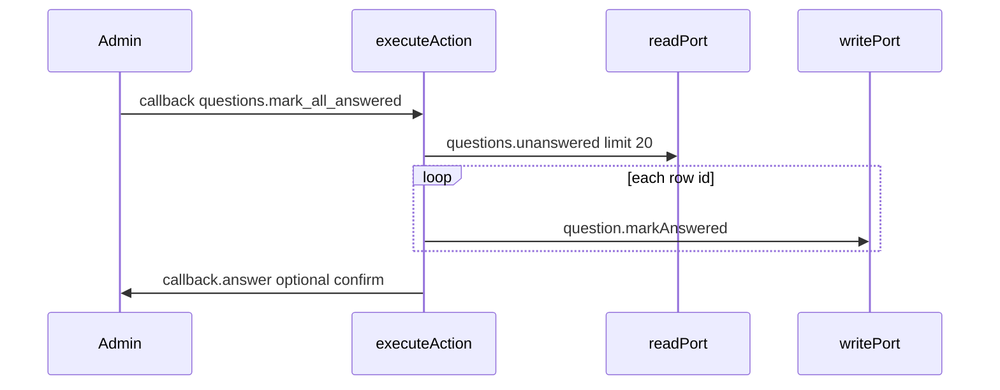

# План: меню Telegram (админ + reply) и неотвеченные

**Статус:** выполнен; frontmatter **`status: completed`**. Файл в **`.cursor/plans/archive/`** (см. [`.cursor/plans/archive/README.md`](README.md)).

## Scope boundaries

**Разрешено трогать**

- [apps/integrator/src/integrations/telegram/setupMenuButton.ts](apps/integrator/src/integrations/telegram/setupMenuButton.ts)
- [apps/integrator/src/integrations/telegram/mapIn.ts](apps/integrator/src/integrations/telegram/mapIn.ts), [apps/integrator/src/integrations/telegram/mapIn.test.ts](apps/integrator/src/integrations/telegram/mapIn.test.ts)
- [apps/integrator/src/kernel/domain/executor/executeAction.ts](apps/integrator/src/kernel/domain/executor/executeAction.ts), [apps/integrator/src/kernel/domain/executor/executeAction.test.ts](apps/integrator/src/kernel/domain/executor/executeAction.test.ts)
- [apps/integrator/src/content/telegram/user/replyMenu.json](apps/integrator/src/content/telegram/user/replyMenu.json), [templates.json](apps/integrator/src/content/telegram/user/templates.json), [scripts.json](apps/integrator/src/content/telegram/user/scripts.json)
- [apps/integrator/src/content/telegram/user/contentConfig.test.ts](apps/integrator/src/content/telegram/user/contentConfig.test.ts)
- [apps/integrator/src/content/telegram/admin/scripts.json](apps/integrator/src/content/telegram/admin/scripts.json), [templates.json](apps/integrator/src/content/telegram/admin/templates.json)
- [apps/integrator/src/content/max/admin/scripts.json](apps/integrator/src/content/max/admin/scripts.json) (зеркальный `callback.received` для того же `input.action`)

**Вне scope (отдельное решение / другой PR)**

- WebApp-приложение: `Telegram.WebApp.expand` / fullscreen — только клиент.
- Постоянная reply-клавиатура в MAX (в API MAX нет аналога Telegram reply keyboard).

**Сделано сверх изначального scope:** [menu.json](apps/integrator/src/content/telegram/user/menu.json) и [max/user/menu.json](apps/integrator/src/content/max/user/menu.json) — ключ `main`: **паритет** с reply (две кнопки: запись + WebApp на `links.webappHomeUrl`) — см. `contentConfig.test.ts`, `MAX_CAPABILITY_MATRIX.md`.

**Не менять без причины**

- [apps/integrator/src/kernel/orchestrator/resolver.ts](apps/integrator/src/kernel/orchestrator/resolver.ts) множество `MESSAGE_MENU_ACTIONS_NEED_PHONE`: там остаются `diary.open`, `menu.more` и т.д., чтобы гейт по телефону срабатывал при **ручном вводе** текста («Дневник», «Меню») и старых клавиатурах у пользователей. План касается только `TELEGRAM_REPLY_MENU_ACTIONS` (маппинг текста reply-кнопки → action).

---

## 1. Админ: slash-команды

**Файл:** [setupMenuButton.ts](apps/integrator/src/integrations/telegram/setupMenuButton.ts)

Из `setMyCommands` для admin scope (`chat_id: adminChatId`) удалить команды **`start`** и **`show_my_id`**. Оставить: `admin_bookings`, `admin_users`, `unanswered`.

**Поведение:** `/start` и ручной ввод по-прежнему обрабатываются вебхуком; этот шаг только меняет **меню команд** у админа после вызова `setupTelegramMenuButton` при старте webhook.

**Проверка:** после деплоя у админа в UI команд нет удалённых пунктов.

---

## 2. Админ: «Пометить все как отвеченные»

### 2.1 Текущее состояние

В [executeAction.ts](apps/integrator/src/kernel/domain/executor/executeAction.ts) ветка `question.listUnanswered`: текст списка до **20** строк (`limit` из скрипта), инлайн «Ответить» — только у строк с `conversation_id`, максимум **15** кнопок. Это уже существующее расхождение «текст vs кнопки».

### 2.2 Правило продукта для «Пометить все» (зафиксировать в коде/комменте)

**Рекомендуемое правило:** экшен `question.markAllUnansweredAnswered` выполняет один read `questions.unanswered` с **тем же лимитом, что и список** (по умолчанию **20**, совпадает с [telegram/admin/scripts.json](apps/integrator/src/content/telegram/admin/scripts.json) `question.listUnanswered`), и для **каждой** строки ответа с непустым `id` вызывает цепочку мутаций `question.markAnswered` (через [persistWrites](apps/integrator/src/kernel/domain/executor/helpers.ts)), как при одиночной пометке в [writePort.ts](apps/integrator/src/infra/db/writePort.ts).

Так «все» = **все неотвеченные в текущей выборке запроса (до 20 по времени)**, согласовано с текстом сообщения, а не только с 15 кнопками «Ответить».

### 2.3 Реализация по шагам

| Шаг | Действие                                                                                                                                                                                                                                                                                                                                                                                                                                                                         | Проверка                                                                  |
| --- | -------------------------------------------------------------------------------------------------------------------------------------------------------------------------------------------------------------------------------------------------------------------------------------------------------------------------------------------------------------------------------------------------------------------------------------------------------------------------------- | ------------------------------------------------------------------------- |
| A   | В [mapIn.ts](apps/integrator/src/integrations/telegram/mapIn.ts) в `normalizeChannelCallbackPayload` до fallback: если `trimmed === 'questions.mark_all_answered'` → `{ action: 'questions.mark_all_answered' }`. Длина `callback_data` в пределах лимита Telegram (64 байта).                                                                                                                                                                                                   | `mapIn.test.ts`                                                           |
| B   | В `question.listUnanswered`: при `rows.length > 0` добавить ряд `inline_keyboard` с одной кнопкой; `callback_data: 'questions.mark_all_answered'`; подпись через `renderText` + ключ в **admin** templates (например `telegram:admin.questions.markAllButton`).                                                                                                                                                                                                                  | Визуально в коде + при необходимости снапшот текста в тесте               |
| C   | Новый `case` в executeAction: `question.markAllUnansweredAnswered` — read + цикл `persistWrites`; при 0 строк — success без записей; опционально вернуть `values: { markedCount: n }` для шаблона подтверждения.                                                                                                                                                                                                                                                                 | `executeAction.test.ts` с моками read/write                               |
| D   | Скрипты: [telegram/admin/scripts.json](apps/integrator/src/content/telegram/admin/scripts.json) и [max/admin/scripts.json](apps/integrator/src/content/max/admin/scripts.json) — `event: callback.received`, `actor.isAdmin`, `input.action: questions.mark_all_answered`, шаги: sync экшен из п. C → async `callback.answer` → при желании `message.send` с шаблоном «отмечено N» ([telegram/admin/templates.json](apps/integrator/src/content/telegram/admin/templates.json)). | Ручной smoke или e2e при наличии                                          |
| E   | При необходимости добавить `questions.mark_all_answered` в `excludeActions` у сценария admin reply message, если матчинг по тексту/callback может пересечься (оценка по факту после реализации).                                                                                                                                                                                                                                                                                 | **Сделано:** в `telegram.admin.reply.message` и `max.admin.reply.message` |

**Замечание:** центральный callback-gate по телефону в [resolver.ts](apps/integrator/src/kernel/orchestrator/resolver.ts) админов не блокирует — менять resolver не требуется.

---

## 3. Reply-меню пользователя (две кнопки)

**Подтверждено:** вторая кнопка — WebApp на **`links.webappHomeUrl`** ([webhook.ts](apps/integrator/src/integrations/telegram/webhook.ts): `next=/app/patient`).

| Элемент                                                                         | Содержимое                                                                                                                                                                                                           |
| ------------------------------------------------------------------------------- | -------------------------------------------------------------------------------------------------------------------------------------------------------------------------------------------------------------------- |
| [replyMenu.json](apps/integrator/src/content/telegram/user/replyMenu.json)      | Одна строка: `telegram:menu.book` (без web_app); `telegram:menu.app` + `webAppUrlFact: links.webappHomeUrl`                                                                                                          |
| [templates.json](apps/integrator/src/content/telegram/user/templates.json)      | Ключ `menu.app` → подпись кнопки «Приложение» (или согласованный короткий текст)                                                                                                                                     |
| [scripts.json](apps/integrator/src/content/telegram/user/scripts.json)          | Все `message.replyKeyboard.show` с тройкой `menu.diary` / `menu.more` заменены на пару `menu.book` + `menu.app` (WebApp)                                                                                             |
| [executeAction.ts](apps/integrator/src/kernel/domain/executor/executeAction.ts) | Блок `webapp.channelLink.complete` (~welcome keyboard): та же двухкнопочная строка                                                                                                                                   |
| [mapIn.ts](apps/integrator/src/integrations/telegram/mapIn.ts)                  | `TELEGRAM_REPLY_MENU_ACTIONS`: убрать `diary.open`, `menu.more` (reply больше не шлёт эти тексты как кнопки). **Не** убирать `diary.open`/`menu.more` из `MESSAGE_TEXT_TO_ACTION` — ручной ввод и старые клавиатуры. |

**Инлайн [menu.json](apps/integrator/src/content/telegram/user/menu.json):** паритет с reply выполнен (две кнопки в `main`).

**Тесты:** [contentConfig.test.ts](apps/integrator/src/content/telegram/user/contentConfig.test.ts); при изменении welcome-keyboard в executeAction — соответствующий фрагмент в `executeAction.test.ts`.

---

## Definition of Done

- [x] 1. У админа в меню команд Telegram нет `start` и `show_my_id`; остальные админские команды на месте.
- [x] 2. В сообщении со списком неотвеченных (TG и MAX, т.к. один builder) есть кнопка «пометить все»; callback обрабатывается; в БД помечаются ответы по правилу п. 2.2; есть unit-тесты на mapIn + executeAction.
- [x] 3. Reply-меню, инлайн `menu.json` `main` и welcome-keyboard после линка — две кнопки; в user `scripts.json` нет reply-тройки `menu.diary` / `menu.more`.
- [x] 4. `TELEGRAM_REPLY_MENU_ACTIONS` согласован с фактическими reply-кнопками; `MESSAGE_MENU_ACTIONS_NEED_PHONE` не «очищали» от `diary`/`menu.more`.
- [x] 5. Прогон целевых тестов integrator по затронутым файлам; полный `pnpm run ci` перед пушем — по правилам репозитория (на момент закрытия плана).
- [x] 6. Документация (`docs/ARCHITECTURE/*`, `docs/README.md`) и этот план синхронизированы с кодом; план перенесён в archive с `status: completed`.

---

## Ссылки на исходный черновик

Черновик вне репозитория (история): `~/.cursor/plans/telegram_menu_updates_c6bf2302.plan.md`. **Канон выполненной работы:** этот файл в репозитории — `.cursor/plans/archive/telegram_menu_reply_admin.plan.md`.
