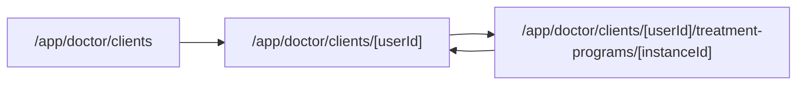

# Единая Карточка Пациента

## Статус исполнения (2026-06-03)

**План закрыт.** Журнал: [`docs/DOCTOR_PATIENT_CARD_TREATMENT_PROGRAM_INITIATIVE/LOG.md`](../../docs/DOCTOR_PATIENT_CARD_TREATMENT_PROGRAM_INITIATIVE/LOG.md) §2026-06-03.

Ключевые артефакты в коде:

- Список: [`apps/webapp/src/app/app/doctor/clients/page.tsx`](../../apps/webapp/src/app/app/doctor/clients/page.tsx) — только список; legacy `?selected=<uuid>` → redirect.
- Карточка: [`apps/webapp/src/app/app/doctor/clients/[userId]/page.tsx`](../../apps/webapp/src/app/app/doctor/clients/[userId]/page.tsx) + [`loadDoctorClientProfileCardProps.ts`](../../apps/webapp/src/app/app/doctor/clients/loadDoctorClientProfileCardProps.ts).
- Дерево программы: [`buildDoctorClientActiveProgramTree.ts`](../../apps/webapp/src/modules/doctor-client-card/buildDoctorClientActiveProgramTree.ts), UI [`DoctorClientActiveProgramPanel.tsx`](../../apps/webapp/src/app/app/doctor/clients/DoctorClientActiveProgramPanel.tsx).
- Href helper: [`doctorClientProfileHref.ts`](../../apps/webapp/src/app/app/doctor/clients/doctorClientProfileHref.ts).
- Удалён legacy: `ClientListLink.tsx` (desktop `?selected`).

Проверки: 49 vitest в 10 файлах по зоне; `pnpm --dir apps/webapp exec tsc --noEmit`.

---

## Вывод По Исследованию (исходная постановка)

Раньше проблема возникала из-за двух входов:

- [`clients/page.tsx`](../../apps/webapp/src/app/app/doctor/clients/page.tsx) открывал карточку внутри списка через `?selected=...` с урезанным набором props.
- [`clients/[userId]/page.tsx`](../../apps/webapp/src/app/app/doctor/clients/[userId]/page.tsx) — полная карточка.
- Редактор [`treatment-programs/[instanceId]/page.tsx`](../../apps/webapp/src/app/app/doctor/clients/[userId]/treatment-programs/[instanceId]/page.tsx) вёл обратно на полную карточку.

Целевое решение (реализовано): `/app/doctor/clients/[userId]` — единственная карточка; список — фильтры и строки; редактор — отдельный экран; состав активной программы читается на табе «Программа».

## Scope Boundaries

Разрешено трогать:

- `apps/webapp/src/app/app/doctor/clients/**`
- `apps/webapp/src/app/app/doctor/DoctorToday*`
- `apps/webapp/src/app/app/doctor/mapPendingProgramTestsForToday*`
- `apps/webapp/src/modules/doctor-client-card/**`
- точечно тесты в `apps/webapp/src/app/app/doctor/clients/*.test.tsx` и `apps/webapp/src/modules/doctor-client-card/*.test.ts`
- точечно документацию инициативы `docs/DOCTOR_PATIENT_CARD_TREATMENT_PROGRAM_INITIATIVE/LOG.md`, `apps/webapp/src/app/api/api.md`, `docs/ARCHITECTURE/PLATFORM_USER_MERGE.md`

Вне scope:

- не встраивать полный редактор инстанса внутрь карточки;
- не менять схему БД, Drizzle-миграции и treatment-program domain model;
- не менять patient UX и пациентские маршруты;
- не менять глобальную навигацию врача шире списка/карточки пациента;
- не переносить бизнес-логику в route handlers и не добавлять прямые импорты `@/infra/db/*` / `@/infra/repos/*` в modules/routes.

## Зафиксированные Решения По Вопросам Перед Исполнением

1. **Desktop split-view убираем полностью.** `/app/doctor/clients` остаётся экраном списка и фильтров; карточка пациента всегда открывается на canonical route `/app/doctor/clients/[userId]`. Старый режим `?selected=...` не рендерит карточку справа.
2. **Строка пациента всегда ведёт в карточку.** Даже при фильтре `treatmentProgram=1` клик по пациенту не открывает сразу editor инстанса; быстрый вход в editor остаётся внутри карточки в блоках программы.
3. **Legacy `?selected=uuid` поддерживаем через redirect.** Если внешний/старый URL пришёл на `/app/doctor/clients?...&selected=<uuid>`, сервер редиректит на `/app/doctor/clients/<uuid>?scope=...`. Для canonical card сохраняем только смысловой `scope`; списоковые фильтры (`q`, `telegram`, `max`, `appointment`, `treatmentProgram`, `visitedMonth`, `support`) не тащим в карточку, потому что они относятся к экрану списка. Если `selected` не UUID — редирект на список с текущим `scope`.
4. **Ссылки из name-match hints переводим на canonical route.** Старые ссылки `scope=all&selected=<uuid>` заменить на `/app/doctor/clients/<uuid>?scope=all`, чтобы новые переходы не зависели от legacy redirect.
5. **Общий loader карточки обязателен.** Для props `ClientProfileCard` завести общий server helper рядом с doctor clients route/app-layer, чтобы полный набор данных карточки собирался в одном месте и не появился второй урезанный loader.
6. **Пункты программы показываем только для активного инстанса.** Полный read-only список пунктов строится по `pickActivePlanInstance` и `getInstanceById(active.id)`. Завершённые/исторические программы остаются в списке «Назначенные программы» с переходом в editor/detail, без раскрытия всех пунктов в карточке.
7. **Глубина списка пунктов: read-only, не editor.** В карточке показываем этапы активной программы и активные пункты (`status=active`), сгруппированные по stage/group в порядке editor data. `disabled` пункты по умолчанию не показываем, чтобы карточка оставалась рабочей сводкой, а не вторым редактором. Этап 0 «Общие рекомендации» показываем как отдельный блок, если в нём есть активные пункты.
8. **Раскрытие по умолчанию.** Текущий рабочий этап раскрыт сразу; остальные этапы компактно свёрнуты/collapsible. Новый route, DnD и editor controls в карточке не добавлять.
9. **Клик по пункту ведёт в editor с deep link.** Пункт в карточке ссылается на `/app/doctor/clients/[userId]/treatment-programs/[instanceId]?scope=...&discussionItem=<stageItemId>`. Для тестов, ожидающих оценки, сохраняется существующий `focusItemId`.
10. **Блок Care Plan на «Обзоре» сохраняем как краткую сводку.** Он остаётся compact above-the-fold: текущий этап, прогресс и до 6 пунктов. Полный список активной программы живёт на табе «Программа».
11. **Возврат из editor ведёт на вкладку программы.** `patientProfileHref` и `backHref` из editor должны вести на `/app/doctor/clients/[userId]?scope=...#doctor-client-section-treatment-programs`; `useDoctorClientAnchorTab` уже отвечает за открытие нужного таба по hash, это нужно покрыть тестом/ручным smoke.
12. **Объём списка без virtualization.** Для текущего изменения показываем весь активный program tree обычным collapsible list. Если реальные программы станут слишком длинными, это отдельная оптимизация, не часть текущего плана.
13. **Документацию синхронизируем точечно.** Обновить `LOG.md`, `api.md` и устаревшее упоминание карточки/колонки деталей в `docs/ARCHITECTURE/PLATFORM_USER_MERGE.md`. `SPECIALIST_CABINET_STRUCTURE.md` проверить через `rg`; править только строки, которые прямо утверждают наличие карточки в колонке деталей.
14. **Переходы из «Сегодня» идут в карточку пациента.** Любые ссылки на пациента в блоках «Сегодня» (включая pending tests) должны вести на `/app/doctor/clients/[userId]?scope=appointments#doctor-client-section-treatment-programs`; переход в editor инстанса остаётся действием внутри карточки, а не стартовой точкой из dashboard.

## Порядок Исполнения И Инварианты

1. Сначала убрать второй вход (`?selected`) и привести ссылки к canonical card, затем добавлять новый program-tree UI. Так проще отличить навигационный регресс от регресса данных.
2. До UI полного списка завести общий loader `loadDoctorClientProfileCardProps` рядом с route `apps/webapp/src/app/app/doctor/clients/`. Helper может импортировать `buildAppDeps` только как route-level server helper; `modules/*` не должны импортировать composition root.
3. Новый builder program-tree держать в `apps/webapp/src/modules/doctor-client-card/`, потому что это доменная view-model карточки, а не route logic.
4. Route handlers/pages остаются тонкими: auth, params/searchParams, вызов helper, рендер.
5. Документацию и тесты обновлять в том же logical batch, чтобы план закрывался без скрытых хвостов.

## Шаг 1. Убрать Вторую Карточку Из Списка

- [x] В `DoctorClientsPanel` убрать desktop-перехват `onRowClick`, который заменяет переход на `?selected=...`.
- [x] Оставить обычный `Link` на `/app/doctor/clients/[userId]?scope=...` для всех viewport.
- [x] Для фильтра `treatmentProgram=1` не вести строку сразу в редактор инстанса.
- [x] В `clients/page.tsx` удалить `selectedData` и колонку деталей; redirect legacy `selected`.
- [x] Name-match hints → canonical URL.
- [x] Subscribers + `selected` → canonical через clients list.
- [x] «Сегодня» → карточка с hash программы.

## Шаг 2. Добавить В Карточку Список Пунктов Активной Программы

- [x] `loadDoctorClientProfileCardProps` с `{ kind: "found" | "not_found" }`.
- [x] Типы `DoctorClientActiveProgramTree*`.
- [x] `buildDoctorClientActiveProgramTree` из detail активного инстанса.
- [x] `DoctorClientActiveProgramPanel` выше списка назначений.
- [x] Care Plan на обзоре без полного дерева.

## Шаг 3. Выравнять Обратные Ссылки Из Редактора

- [x] `backHref` / `patientProfileHref` с `#doctor-client-section-treatment-programs`.
- [x] `InstanceEditorToolbar` через тот же href.
- [x] Тест hash → таб «Программа».

## Шаг 4. Документация И Regression-Сетка

- [x] `LOG.md`, `api.md`, `PLATFORM_USER_MERGE.md`, `SPECIALIST_CABINET_STRUCTURE.md`, `ADMIN_NAME_MATCH_HINTS_*`.
- [x] Vitest (49 тестов), `tsc --noEmit`.

## Regression Matrix

- [x] `/app/doctor/clients?scope=appointments` — список без правой карточки.
- [x] `treatmentProgram=1` — строка в карточку.
- [x] `?selected=<uuid>` — redirect на `[userId]`.
- [x] name-match-hints — canonical card.
- [x] «Сегодня» — карточка + hash программы.
- [x] `[userId]` — таб «Программа» + `activeProgramTree`.
- [x] editor — deep links; Back/имя → карточка + таб программы.

## Definition Of Done

- [x] Из списка пациентов любой клик открывает canonical route `/app/doctor/clients/[userId]`.
- [x] Старый `?selected=...` не рендерит урезанную карточку; redirect или не используется.
- [x] В карточке видны назначенные программы и read-only пункты активной программы.
- [x] Editor доступен из карточки; возврат на вкладку «Программа».
- [x] «Сегодня» не открывает editor напрямую.
- [x] Общий loader `loadDoctorClientProfileCardProps`.
- [x] Документация и тесты обновлены.
- [x] Целевые тесты и typecheck webapp проходят.
