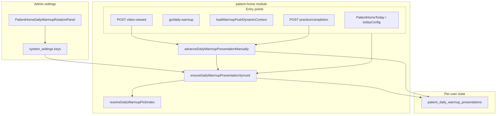

# План: ротация разминок дня по расписанию

## Цель

Пациент видит **разные** разминки в течение дня без обязательного открытия видео. Круг продолжается через полночь. Ручное действие (видео **или** completion) сдвигает круг и **пропускает ровно одну** ближайшую смену по расписанию.

## Аудит: настройки «Главная пациента» и конфликты

Единая страница: [`/app/doctor/patient-home`](apps/webapp/src/app/app/doctor/patient-home/page.tsx). Legacy [`/app/settings/patient-home`](apps/webapp/src/app/app/settings/patient-home/page.tsx) — только redirect.

| Панель / ключ | Роль | Конфликт с новой ротацией |
|---------------|------|---------------------------|
| **Блоки `daily_warmup`** (CMS) | Состав и порядок круга | Нет — источник ordered list |
| **`patient_home_daily_practice_target`** | Цель «Сегодня выполнено» | Нет — ортогонально |
| **`patient_home_mood_icons`** | Иконки самочувствия | Нет |
| **`patient_home_daily_warmup_repeat_cooldown_minutes`** | Hero «Разминка выполнена» | **Частичный:** только при `dailyWarmupCount === 1`; при 2+ CTA всегда виден — ротация работает. Лишним не является |
| **`patient_treatment_plan_item_done_repeat_cooldown_minutes`** | Пауза пунктов плана | Нет |
| **`patient_home_morning_ping_*`** | Один слот, **app TZ**, бот → `/app/patient` | **Смысловое пересечение**, не кодовое — развести подписи в UI (см. §Admin UI) |
| **`patient_home_warmup_skip_to_next_available_enabled`** | Legacy boolean | **Мёртвый ключ:** парсер есть, runtime pick **не читает**. Задокументировать deprecated, не в UI |
| **Напоминания пациента** (warmup rules) | Персональные push | Нет — deeplink `go/daily-warmup?from=reminder` использует тот же synced pick |

**Лишних панелей удалять не нужно.** Добавить одну — «Автосмена разминок».

## Принятые продуктовые решения

| Вопрос | Решение |
|--------|---------|
| Слоты при деплое для существующих users | **Без ретро** — backfill `last_rotation_at = updated_at`; только будущие слоты |
| Видео + completion на одном визите | **Один сдвиг** — CAS `presented === anchorPageId` |
| Действие не на текущей presented (pager/quick list) | **Не сдвигать** главную |
| `rotation_enabled` по умолчанию | **`false`** до первого сохранения админом |
| Шаблон при первом включении в UI | `08:00` / `14:00` / `20:00` (редактируемый) |
| Долгое отсутствие (неделя+) | При следующем заходе **догонять все** пропущенные слоты; skip одноразовый на первый due-слот после manual |
| Включение ротации при старой строке presentation | Первый визит после `enabled=true` догоняет слоты от `last_rotation_at` (backfill = `updated_at`); для «спящих» users возможен многодневный catch-up |

## Текущее состояние (gap) — закрыто

| Было | Стало |
|------|-------|
| Сдвиг только после `video-viewed` | + completion `daily_warmup` (CAS) |
| Нет смены по времени | Lazy sync слотов при pick/read |
| Fallback = **та же** last completed | Fallback = **следующая** после last completed |
| `presented` = только `content_page_id` | + `last_rotation_at`, `skip_next_scheduled_rotation` |

Ключевые файлы: [`todayConfig.ts`](apps/webapp/src/modules/patient-home/todayConfig.ts), [`resolveDailyWarmupHomePickIndex.ts`](apps/webapp/src/modules/patient-home/resolveDailyWarmupHomePickIndex.ts), [`advanceDailyWarmupPresentationManually.ts`](apps/webapp/src/modules/patient-home/advanceDailyWarmupPresentationManually.ts), [`syncDailyWarmupScheduledRotation.ts`](apps/webapp/src/modules/patient-home/syncDailyWarmupScheduledRotation.ts), [`pgPatientDailyWarmupPresentation.ts`](apps/webapp/src/infra/repos/pgPatientDailyWarmupPresentation.ts).

## Архитектура



### `ensureDailyWarmupPresentationSynced`

Единая точка перед любым pick (home / push / go):

1. Прочитать state + schedule + patient IANA + ordered pages.
2. Применить due scheduled slots (см. ниже).
3. Upsert если изменилось.
4. Вернуть актуальный `contentPageId`.

**Примечание:** sync пишет в БД при read (mutation on read) — идемпотентен, одна обёртка на все entry points.

### Scheduled slots

1. Если `rotation_enabled === false` или 0 времён — no-op.
2. Слоты в patient IANA строго **после** `last_rotation_at` и **≤ now** (через полночь, несколько дней).
3. Для каждого слота по порядку:
   - `skip_next_scheduled_rotation` → сброс флага, **без** сдвига `content_page_id`, `last_rotation_at := slotInstant`;
   - иначе → `content_page_id := nextInCircle`, `last_rotation_at := slotInstant`.
4. Нет строки presentation → anchor: **next after last completed** (или index 0), `last_rotation_at := now()` (**без** ретро-слотов за сегодня).

### `advanceDailyWarmupPresentationManually`

1. `ensureDailyWarmupPresentationSynced` (догнать слоты).
2. Если `anchorPageId !== presented` → **return no-op** (video-viewed всё ещё пишет view в journal).
3. Если `anchorPageId === presented` → `presented := next`, `skip_next := true`, `last_rotation_at := now`.

### Pick

- `home` → index synced `presented`.
- `push_reminder` → `pickDailyWarmupFromOrderedList(pages, home pick page id)`.

**TZ слотов:** [`resolveCalendarDayIanaForPatient`](apps/webapp/src/modules/system-settings/calendarIana.ts) — не `app_display_timezone`.

## Изменения по слоям

### 1. DDL + backfill

[`patientDailyWarmupPresentation.ts`](apps/webapp/db/schema/patientDailyWarmupPresentation.ts):

- `lastRotationAt` — `timestamptz`, nullable
- `skipNextScheduledRotation` — `boolean`, NOT NULL, default `false`

SQL backfill в миграции: `UPDATE patient_daily_warmup_presentations SET last_rotation_at = COALESCE(updated_at, now()) WHERE last_rotation_at IS NULL`.

[`pgPlatformUserMerge.ts`](packages/platform-merge/src/pgPlatformUserMerge.ts): merge по max(`last_rotation_at`, `updated_at`); перенос `skip_next_scheduled_rotation` от «победившей» строки.

### 2. `system_settings`

Ключи в [`types.ts`](apps/webapp/src/modules/system-settings/types.ts):

- `patient_home_daily_warmup_rotation_enabled` — boolean, **default false** (парсер)
- `patient_home_daily_warmup_rotation_times` — `string[]`, 1–3 уникальных `HH:MM` при enabled

Парсеры: [`patientHomeDailyWarmupRotationSettings.ts`](apps/webapp/src/modules/patient-home/patientHomeDailyWarmupRotationSettings.ts).

PATCH: [`route.ts`](apps/webapp/src/app/api/admin/settings/route.ts) + [`route.test.ts`](apps/webapp/src/app/api/admin/settings/route.test.ts).

### 3. Port

[`dailyWarmupPresentationPorts.ts`](apps/webapp/src/modules/patient-home/dailyWarmupPresentationPorts.ts):

```typescript
type DailyWarmupPresentationState = {
  contentPageId: string;
  lastRotationAt: string | null;
  skipNextScheduledRotation: boolean;
};

getPresentationState(userId): Promise<DailyWarmupPresentationState | null>;
upsertPresentationState(userId, state): Promise<void>;
```

Реализации: pg + inMemory. `get/setPresentedContentPageId` — deprecated thin wrappers.

### 4. Pure-модули

| Файл | Ответственность |
|------|-----------------|
| `collectDailyWarmupRotationSlotInstants.ts` | Слоты между `lastRotationAt` и `now` |
| `applyDailyWarmupScheduledRotations.ts` | Advance + skip (pure) |
| `syncDailyWarmupScheduledRotation.ts` | Read settings/state → apply → upsert |
| `advanceDailyWarmupPresentationManually.ts` | ensureSync + CAS manual |
| `ensureDailyWarmupPresentationSynced.ts` | Фасад для pick/deps |

Изменён [`resolveDailyWarmupHomePickIndex.ts`](apps/webapp/src/modules/patient-home/resolveDailyWarmupHomePickIndex.ts): fallback last completed → **next**.

### 5. Entry points

| Точка | Действие |
|-------|----------|
| `resolveDailyWarmupPickIndex` + callers | `ensureDailyWarmupPresentationSynced` (patient tier) |
| [`resolveDailyWarmupStartPathForPatient`](apps/webapp/src/app/app/patient/go/resolvePatientReminderGoTargets.ts) | через общий pick |
| [`loadWarmupPushDynamicContext`](apps/webapp/src/modules/web-push/loadWarmupPushDynamicContext.ts) | через общий pick |
| [`recordDailyWarmupVideoView`](apps/webapp/src/modules/patient-home/recordDailyWarmupVideoView.ts) | manual advance после journal |
| [`POST practice/completion`](apps/webapp/src/app/api/patient/practice/completion/route.ts) | manual advance при `source === daily_warmup` |

### 6. Admin UI

[`PatientHomeDailyWarmupRotationPanel.tsx`](apps/webapp/src/app/app/settings/patient-home/PatientHomeDailyWarmupRotationPanel.tsx) на doctor page (admin only):

- Рядом с `PatientHomeMorningPingPanel`, **разные подписи**
- Checkbox + 1–3 time inputs + add/remove
- `doctorSectionCardClass` / `doctorSectionTitleClass`
- Сохранение: `patchAdminSetting`

### 7. Документация

- [`patient-home.md`](apps/webapp/src/modules/patient-home/patient-home.md)
- [`PATIENT_DAILY_WARMUP_UX/LOG.md`](docs/PATIENT_DAILY_WARMUP_UX/LOG.md)
- [`CONFIGURATION_ENV_VS_DATABASE.md`](docs/ARCHITECTURE/CONFIGURATION_ENV_VS_DATABASE.md)
- [`patient-practice.md`](apps/webapp/src/modules/patient-practice/patient-practice.md)
- [`api.md`](apps/webapp/src/app/api/api.md)

### 8. Тесты

| Область | Файлы |
|---------|-------|
| Slot math + skip + midnight | `collectDailyWarmupRotationSlotInstants.test.ts`, `applyDailyWarmupScheduledRotations.test.ts` |
| Sync + backfill + skip consume | `syncDailyWarmupScheduledRotation.test.ts` |
| CAS manual (video→completion, off-presented) | `advanceDailyWarmupPresentationManually.test.ts` |
| Ensure facade | `ensureDailyWarmupPresentationSynced.test.ts` |
| Pick / go / push | `todayConfig.test.ts`, `resolvePatientReminderGoTargets.test.ts`, `loadWarmupPushDynamicContext.test.ts` |
| Completion route | `completion/route.test.ts` |
| Admin settings | `route.test.ts` |
| Fallback index | `resolveDailyWarmupHomePickIndex.test.ts` |

Финал: `pnpm run ci` перед merge.

## Scope boundaries

**В scope:** webapp rotation, admin panel, completion hook, DDL+backfill, platform-merge, docs, vitest.

**Вне scope:**

- Cron / background job
- Per-user title в morning ping
- Пациентский UI расписания
- Удаление ключа `patient_home_warmup_skip_to_next_available_enabled` из БД (только doc deprecated)
- Изменение `dailyWarmupHeroCooldownGate`
- Unit-тест SQL platform-merge (merge покрыт code review + интеграция на хосте)

## Definition of Done

- [x] Admin: 1–3 времени; disabled = только ручная/CAS ротация
- [x] Главная / go / push используют synced presented
- [x] Видео и completion сдвигают при `presented === anchor`; второй триггер — no-op
- [x] Деплой без ретро-слотов (backfill `last_rotation_at`)
- [x] Круг через полночь; fallback last completed = следующая
- [x] Targeted vitest + финальный `pnpm run ci`
- [x] Документация; legacy `skip_to_next` помечен deprecated

## Риски

- **Гонка двух вкладок:** CAS `presented === anchor` снижает двойной manual; scheduled sync — last-write-wins, допустимо.
- **1 разминка в блоке:** слоты крутят тот же id — визуально без смены; cooldown hero актуален.
- **Morning ping vs первый слот:** независимы; подсказки в UI разведены.

## Журнал исполнения

**2026-06-09:** реализация закрыта. Migration `0110`, core modules, entry points, admin UI, docs, targeted vitest, `pnpm run ci` зелёный. Legacy `advanceDailyWarmupPresentationAfterVideoView` удалён. Пост-аудит: JSDoc/types/api.md, тесты с `presentationSyncDeps`, doctor UI панелей, упрощён `buildPatientHomeWarmupPickContext`.
