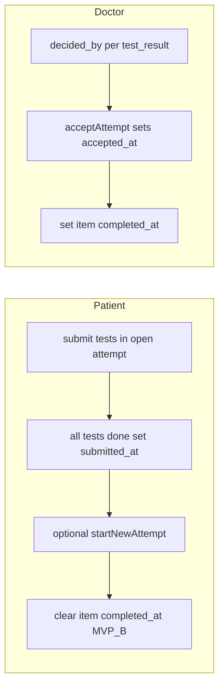

# План: неограниченные полные попытки клинтестов + история + приём врачом

## Продуктовые инварианты (зафиксировано)

| Понятие | Смысл |
|--------|--------|
| **Открытая попытка** | Ровно одна строка `test_attempts` с **`submitted_at IS NULL`** на пару `(instance_stage_item_id, patient_user_id)`. Сейчас индекс завязан на `completed_at IS NULL` — в миграции **пересоздать** partial unique index на `submitted_at` (и удалить старый после переноса данных). |
| **Пациент отправил полный набор** | Все тесты из снимка имеют `test_results` в рамках этой попытки; попытка получает **`submitted_at`** (новое поле; смысл текущего `completed_at` у попытки). |
| **Новая полная попытка** | Пациент **в любой момент** может начать следующую попытку после того, как предыдущая **отправлена** (`submitted_at` задан), **не дожидаясь** `decided_by` по старой попытке (ответ в уточняющем вопросе). |
| **Оценка врача** | На уровне **`test_results`**: `decided_by` / PATCH override; **обязательно** действие **`acceptAttempt`** на попытке для засчёта пункта в чеклисте (`item.completed_at`, MVP-B). |
| **`completed_at` пункта `clinical_test`** | **Не** выставляется пациентом при `allDone`. Связь с чеклистом/«пункт выполнен» — только после решения врача (см. **MVP-B** ниже). |

## MVP-B (рекомендуемая одна линия реализации — без «или» в коде)

1. **`test_attempts`**: добавить `submitted_at`, `accepted_at`, `accepted_by`; миграция: значения из нынешнего `completed_at` попытки перенести в `submitted_at`; колонку `completed_at` у попытки после деплоя удалить или оставить только как deprecated с триггером в одном релизе — **выбрать один вариант в PR** (предпочтительно rename-миграция без двойной семантики).
2. **При `patientStartNewTestAttempt`** (явный старт новой попытки после `submitted_at` у текущей): для пункта `clinical_test` выставить **`treatment_program_instance_stage_items.completed_at := null`**, чтобы пункт снова считался «в работе» до нового приёма врачом (история попыток и результатов в БД **сохраняется**).
3. **`acceptAttempt` (MVP)**: при нажатии врача «Принять попытку» — `accepted_at`/`accepted_by` на попытке и **`item.completed_at := now()`** (одна транзакция). Повторный приём другой попытки обновляет зачёт на «последнюю принятую» (и при необходимости перезаписывает `completed_at` пункта).
4. **Без отдельного `acceptAttempt` в v0**: не рекомендуется — придётся выводить «пункт выполнен» из комбинации «все `decided_by` не null у последней попытки», что ломается при новой попытке до оценки старой.

## Контекст (как сейчас)

- Partial unique (до миграции): [`apps/webapp/db/schema/treatmentProgramTestAttempts.ts`](apps/webapp/db/schema/treatmentProgramTestAttempts.ts) — `idx_test_attempts_one_open_per_item_patient` при `completed_at IS NULL`; после миграции — эквивалент на **`submitted_at IS NULL`**.
- [`pgTreatmentProgramTestAttempts.ts`](apps/webapp/src/infra/repos/pgTreatmentProgramTestAttempts.ts): `createAttempt` возвращает открытую попытку; после закрытия попытки новая вставка возможна.
- Блокер пересдачи: [`progress-service.ts`](apps/webapp/src/modules/treatment-program/progress-service.ts) — `item.completedAt` → «Тест уже завершён»; при `allDone` выставляется `completed_at` **пункта** — закрывает пункт навсегда.
- Врач по строке результата: [`.../test-results/[resultId]/route.ts`](apps/webapp/src/app/api/doctor/treatment-program-instances/[instanceId]/test-results/[resultId]/route.ts), UI в [`TreatmentProgramInstanceDetailClient.tsx`](apps/webapp/src/app/app/doctor/clients/[userId]/treatment-programs/[instanceId]/TreatmentProgramInstanceDetailClient.tsx), inbox в [`ClientProfileCard.tsx`](apps/webapp/src/app/app/doctor/clients/ClientProfileCard.tsx).

## Связь с doctor-only этапами

- Закрытие **этапа** остаётся только врачом (текущий инвариант из `LOG_DOCTOR_ONLY_STAGE_COMPLETION.md` / FSM).
- Этот план затрагивает только **жизненный цикл пункта `clinical_test`** и отображение истории; не возвращать автозакрытие этапа по `completed_at` пунктов.

## Scope

**Разрешено:** `db/schema/treatmentProgramTestAttempts.ts`, новая миграция Drizzle, [`ports.ts`](apps/webapp/src/modules/treatment-program/ports.ts), [`pgTreatmentProgramTestAttempts.ts`](apps/webapp/src/infra/repos/pgTreatmentProgramTestAttempts.ts), [`inMemoryTreatmentProgramInstance.ts`](apps/webapp/src/infra/repos/inMemoryTreatmentProgramInstance.ts), [`progress-service.ts`](apps/webapp/src/modules/treatment-program/progress-service.ts), patient/doctor API routes под `treatment-program-instances`, [`PatientTestSetProgressForm.tsx`](apps/webapp/src/app/app/patient/treatment/PatientTestSetProgressForm.tsx), страницы/RSC передающие `completed`/`serverSnapshot`, [`TreatmentProgramInstanceDetailClient.tsx`](apps/webapp/src/app/app/doctor/clients/[userId]/treatment-programs/[instanceId]/TreatmentProgramInstanceDetailClient.tsx), [`types.ts`](apps/webapp/src/modules/treatment-program/types.ts), тесты модуля, `docs/ARCHITECTURE/*`, опциональный `docs/.../LOG_*.md`.

**Вне scope:** legacy-таблицы ЛФК; новые ключи в env; изменение GitHub CI workflow; массовый prod backfill без runbook (отдельно по необходимости).

## Фаза 1 — Данные и сервис

1. Drizzle + миграция (см. MVP-B); обновить `completeAttempt` → выставлять `submitted_at` вместо/в дополнение к старому полю.
2. **`rg` аудит** до правок: `completedAt`, `clinical_test`, `getPatientTestSetPageServerSnapshot`, `patientEnsureTestAttempt`, `PatientTestSetProgressForm` props `completed` — список всех веток для правки.
3. Порт: `listAttemptsForStageItem`, `acceptAttempt`, при необходимости `getLatestSubmittedAttemptId`.
4. **`patientSubmitTestResult`**: для `clinical_test` убрать безусловный throw по `item.completedAt`; если нет открытой попытки — **ошибка** «Сначала начните попытку», кроме случая первого входа (создать попытку при первом submit **или** только через `patientStartNewTestAttempt` — **зафиксировать в PR один вариант**; рекомендация: первый `submit` создаёт попытку как сейчас `createAttempt`, новая попытка **только** через явный POST, чтобы не плодить строки при случайных запросах).
5. **`patientEnsureTestAttempt`**: согласовать с новым правилом (не конфликтовать с «нет open после submit»).
6. **`getPatientTestSetPageServerSnapshot`**: варианты `none` / `open_attempt` / `submitted_attempts_history` + id активной открытой попытки; убрать опору только на `item.completedAt` для отображения «только read-only завершено» — различать «есть принятая попытка» vs «есть только отправленные».

## Фаза 2 — Пациентский UI

- История попыток (сортировка по `started_at` / `submitted_at`); раскрытие результатов; без лишних поясняющих абзацев ([`ui-copy-no-excess-labels`](.cursor/rules/ui-copy-no-excess-labels.mdc)).
- Кнопка «Новая попытка» → POST start; disabled при `interactionDisabled`, при уже открытой незакрытой попытке (нет `submitted_at`), при read-only этапа.
- Лимит строк в API при большой истории (например последние N попыток + «все» на отдельном запросе) — заложить в порт при нагрузочном риске.

## Фаза 3 — Врачебный UI и API

- Группировка списка результатов по `attemptId`; заголовок попытки: даты, `submitted_at`, `accepted_at`, счётчик «без оценки» (`decided_by IS NULL`).
- PATCH per-result сохранить; добавить **`PATCH .../test-attempts/[attemptId]/accept`** (или эквивалент под существующим префиксом API) → `acceptAttempt`.
- Карта клиента: минимум — текущий inbox; улучшение — группировка по попытке (косметика, можно фазой 3.1).

## Фаза 4 — Тесты, доки, CI

- Юнит: две попытки подряд без `decided_by` на первой; `startNewAttempt` сбрасывает `item.completed_at`; после `acceptAttempt` пункт снова с `completed_at`.
- Регрессия: `pnpm exec vitest run apps/webapp/src/modules/treatment-program/` (или каталог из правил webapp).
- Документация: [`PATIENT_TREATMENT_PROGRAM_STAGE_SURFACES.md`](docs/ARCHITECTURE/PATIENT_TREATMENT_PROGRAM_STAGE_SURFACES.md), [`DB_STRUCTURE.md`](docs/ARCHITECTURE/DB_STRUCTURE.md) § test_attempts/test_results; короткий LOG при необходимости.
- **`pnpm run ci`** перед merge.

## Миграция существующих данных

- Попытки с заполненным `completed_at` → `submitted_at`.
- Пункты `clinical_test` с уже выставленным `item.completed_at` от старой логики: **MVP-B** при первом же `patientStartNewTestAttempt` после релиза может обнулить `completed_at` — предупредить в release notes; либо одноразовый SQL «проставить `accepted_at` на последней submitted попытке для всех уже зачтённых пунктов» для избежания мигательного UI — **выбрать в PR**.

## Риски

- Двойной POST «новая попытка» — идемпотентность или 409 при открытой попытке.
- Пациентский UI и кэш RSC после смены попытки — инвалидация `onDone` / router refresh.
- Inbox врача раздувается при многих неоценённых строках — пагинация позже.

## Definition of Done

- Неограниченные полные попытки с правилом «в любой момент после отправки предыдущей».
- История видна врачу (деталь программы) и пациенту (форма/прогресс).
- Засчёт пункта `clinical_test` для чеклиста — через врача (`acceptAttempt` + `item.completed_at`, MVP-B).
- Drizzle-миграция, in-memory, тесты, доки, зелёный `pnpm run ci`.
