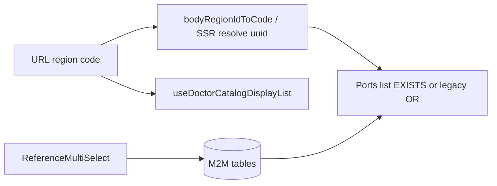

**Канон:** единственный актуальный план задачи по регионам каталога врача — **этот файл** ([`.cursor/plans/doctor_catalog_regions_ux.plan.md`](.cursor/plans/doctor_catalog_regions_ux.plan.md)). Дубликаты вне репозитория не поддерживаются.

# План: регионы в каталоге врача — проверенная и улучшенная версия

## 0. Исправления относительно предыдущего черновика

- **Критично:** фильтр по региону в каталогах упражнений, рекомендаций и клинических тестов сейчас выполняется **на клиенте** в [`useDoctorCatalogDisplayList`](apps/webapp/src/shared/hooks/useDoctorCatalogDisplayList.ts) (`getItemRegionCode(x) === regionCode`), при этом RSC-страницы отдают **полный список** с `regionRefId: null` в вызове list (например [`doctor/exercises/page.tsx`](apps/webapp/src/app/app/doctor/exercises/page.tsx), [`recommendations/page.tsx`](apps/webapp/src/app/app/doctor/recommendations/page.tsx), [`clinical-tests/page.tsx`](apps/webapp/src/app/app/doctor/clinical-tests/page.tsx)). Для режима «у сущности несколько регионов» **обязательно** менять контракт хука (напр. `getItemRegionCodes` и условие «код фильтра входит в набор кодов по элементу»); иначе мультивыбор в БД не совпадёт с тем, что видит пользователь.
- Явно разделены **два слоя фильтра**: (1) данные и семантика «uuid в M2M» при серверном list (можно включить уже на этапе оптимизации); (2) клиентский хук — должен совпадать по семантике, пока SSR не передаёт `regionRefId` в list.
- Уточнён **периметр тестов**: [`useDoctorCatalogDisplayList.test.ts`](apps/webapp/src/shared/hooks/useDoctorCatalogDisplayList.test.ts) — обязательный апдейт/кейсы для множества регионов.
- **Шаблоны программ лечения:** в [`treatment-program-templates/page.tsx`](apps/webapp/src/app/app/doctor/treatment-program-templates/page.tsx) `region` в типе `searchParams` не пробрасывается в клиент — вынести в **отдельный backlog-эпик** (агрегация по библиотеке стадий), не смешивать с этим планом без оценки.

## 1. Контекст из кода (кратко)

- Баг «пропадают варианты»: [`ReferenceSelect`](apps/webapp/src/shared/ui/ReferenceSelect.tsx) + поисковый режим; в [`ExerciseForm`](apps/webapp/src/app/app/doctor/exercises/ExerciseForm.tsx) и [`ClinicalTestForm`](apps/webapp/src/app/app/doctor/clinical-tests/ClinicalTestForm.tsx) у региона нет защиты `showAllOnFocus` / `searchable={false}`; в [`RecommendationForm`](apps/webapp/src/app/app/doctor/recommendations/RecommendationForm.tsx) уже есть.
- Toolbar: [`DoctorCatalogFiltersForm`](apps/webapp/src/shared/ui/doctor/DoctorCatalogFiltersForm.tsx) — single-select по **коду** в `?region=`; **не менять** контракт URL.
- Порты list: [`pgLfkExercises`](apps/webapp/src/infra/repos/pgLfkExercises.ts) — `e.region_ref_id = $1`; [`pgRecommendations`](apps/webapp/src/infra/repos/pgRecommendations.ts) / [`pgClinicalTests`](apps/webapp/src/infra/repos/pgClinicalTests.ts) — `eq(bodyRegionId, regionId)`.
- Производные: [`LfkTemplatesPageClient`](apps/webapp/src/app/app/doctor/lfk-templates/LfkTemplatesPageClient.tsx), [`TestSetsPageClient`](apps/webapp/src/app/app/doctor/test-sets/TestSetsPageClient.tsx) — своя логика по одному `regionRefId` / `bodyRegionId`.

## 2. Границы scope

**В scope**

- `apps/webapp/db/schema/*`, Drizzle-миграции, порты `pg*` / `inMemory*`, модули `lfk-exercises`, `recommendations`, `tests`, server actions `actionsShared` врача для трёх сущностей.
- [`ReferenceSelect`](apps/webapp/src/shared/ui/ReferenceSelect.tsx), новый multi-компонент в `shared/ui`, [`useDoctorCatalogDisplayList`](apps/webapp/src/shared/hooks/useDoctorCatalogDisplayList.ts), страницы клиентов каталогов врача под перечисленные сущности.
- Отображение регионов в списках каталога: компактно (не раздувать подписи; см. [.cursor/rules/ui-copy-no-excess-labels.mdc](.cursor/rules/ui-copy-no-excess-labels.mdc)).

**Вне scope (без отдельного решения)**

- Пациентский кабинет и напоминания (терминология «ЛФК» — по [patient-lfk-means-rehab-program.mdc](.cursor/rules/patient-lfk-means-rehab-program.mdc); схема может меняться без смены patient UX-текста).
- Фильтр `region` для списка **шаблонов программ** (см. §0).
- Массовый рефакторинг всех выпадающих списков проекта под scroll-hint — только `ReferenceSelect` в DoD, остальное по желанию через общий хук позже.

## 3. Данные: M2M и миграция

Три таблицы связей, FK на `reference_items.id`, уникальность пары `(entity_id, region_id)`:

| Домен | Предложение таблицы | Примечание |
|-------|---------------------|------------|
| Упражнения | `lfk_exercise_regions` | `(exercise_id, region_ref_id)` |
| Рекомендации | `recommendation_regions` | после [`recommendations`](apps/webapp/db/schema/recommendations.ts) |
| Клинические тесты (`tests`) | например `clinical_test_regions` | `(clinical_test_id, body_region_id)` — имя согласовать с `tests`/`clinicalTests` в Drizzle |

**Семантика пустого набора:** как сейчас при отсутствии региона — элемент **не** попадает под активный фильтр по региону (строгость сохранять).

Опционально колонка `sort_order` в M2M для стабильного порядка чипов — только если нужен явный порядок, не «как попало из БД».

**Legacy-колонки** `lfk_exercises.region_ref_id`, `recommendations.body_region_id`, `tests.body_region_id`: в PR зафиксировать одну стратегию — **dual-write** (запись первого/всех — задать) на один релиз, либо **только M2M** после backfill и единовременное чтение из M2M; второй PR на `DROP COLUMN` допустим для снижения риска.

**Индексы:** btree по `region_ref_id` / `body_region_id` в M2M для условий `EXISTS … AND region = $id`.

## 4. Порты и фильтр list

- Условие при переданном `filter.regionRefId` (uuid): строка попадает в выдачу, если `EXISTS (SELECT 1 FROM m2m WHERE parent_id = … AND region_id = :uuid)` **или** (на переходном этапе) совпадение с legacy столбцом, если колонка ещё используется.
- [`pgLfkExercises`](apps/webapp/src/infra/repos/pgLfkExercises.ts): правка сырого SQL.
- Recommendations / clinical tests: Drizzle-query в соответствующих repo.
- In-memory реализации — та же семантика для тестов модулей.

**Опциональная оптимизация (после корректности):** прокидывать `regionRefId` с RSC в `listExercises` / `listRecommendations` / `listClinicalTests`, чтобы уменьшить полезную нагрузку; тогда клиентский фильтр по региону может стать избыточным — решать в том же PR или отдельным, без изменения URL.

## 5. Клиентский каталожный хук

Расширить [`DoctorCatalogDisplayListOptions`](apps/webapp/src/shared/hooks/useDoctorCatalogDisplayList.ts):

- Вместо или вместе с `getItemRegionCode` ввести, например, **`getItemRegionCodes?: (item) => readonly string[]`** (коды из `bodyRegionIdToCode` для всех id региона сущности).
- Условие фильтра: `regionCode` задан → `codes.includes(regionCode)` (при отсутствии регионов у элемента — `false`).
- Обновить все call sites каталогов, где передаётся регион: упражнения, рекомендации, клинические тесты (+ проверить другие пользователи хука через `rg getItemRegionCode`).

## 6. UI

- **`ReferenceMultiSelect`:** справочник через `loadReferenceItems`, чипы с удалением, без отдельной строки «Выбрано: …», если информация уже в чипах.
- **`ExerciseForm`** / типы [`Exercise`](apps/webapp/src/modules/lfk-exercises/types.ts): массив id регионов; [`page.tsx`](apps/webapp/src/app/app/doctor/lfk-templates/page.tsx) уже строит `exerciseMetaById` — расширить под массив для фильтра шаблонов.
- **`RecommendationForm`**, **`ClinicalTestForm`**: заменить одиночный селект.
- Парсинг FormData в [`actionsShared`](apps/webapp/src/app/app/doctor/exercises/actionsShared.ts) и аналогах: массив UUID, Zod/валидация, отклонение неизвестных id.

**Опция (отдельный маленький PR):** изменить [`ReferenceSelect`](apps/webapp/src/shared/ui/ReferenceSelect.tsx) так, чтобы при `onFocus` для `searchable=true` не подставлять целиком `selectedLabel` в `query` (или по умолчанию очищать query) — снимает класс багов для всех форм; оценить влияние на сценарии «фильтровать список с клавиатуры».

## 7. Подсказка прокрутки

- Реализовать на контейнере списка в [`ReferenceSelect`](apps/webapp/src/shared/ui/ReferenceSelect.tsx) с `scroll` listener / `ResizeObserver`, не ломая `role="listbox"` и клики по пунктам.

## 8. Definition of Done (проверяемо)

- [ ] Регион в формах упражнения и клинического теста не «схлопывает» список вариантов (hotfix или глобальный ReferenceSelect).
- [ ] У трёх сущностей в UI — мультивыбор регионов; в БД — M2M + backfill; чтение/запись согласованы с выбранной стратегией legacy-колонок.
- [ ] Фильтр toolbar по `region` (код): элемент виден, если **выбранный регион среди связей** — на портах list и в `useDoctorCatalogDisplayList`.
- [ ] [`LfkTemplatesPageClient`](apps/webapp/src/app/app/doctor/lfk-templates/LfkTemplatesPageClient.tsx) и [`TestSetsPageClient`](apps/webapp/src/app/app/doctor/test-sets/TestSetsPageClient.tsx) используют ту же семантику.
- [ ] `ReferenceSelect` показывает визуальную подсказку неполного списка при вертикальном overflow.
- [ ] Обновлены/добавлены Vitest; `pnpm run ci` зелёный перед merge основного объёма.

## 9. Порядок работ (рекомендуемый)

1. Hotfix форм региона (и при согласии — маленький фикс `ReferenceSelect`).
2. Scroll-hint в `ReferenceSelect`.
3. M2M миграции + типы + порты + сервисы + in-memory.
4. Хук `useDoctorCatalogDisplayList` + клиенты каталогов + производные фильтры.
5. `ReferenceMultiSelect` + формы + actions + отображение в списках.

