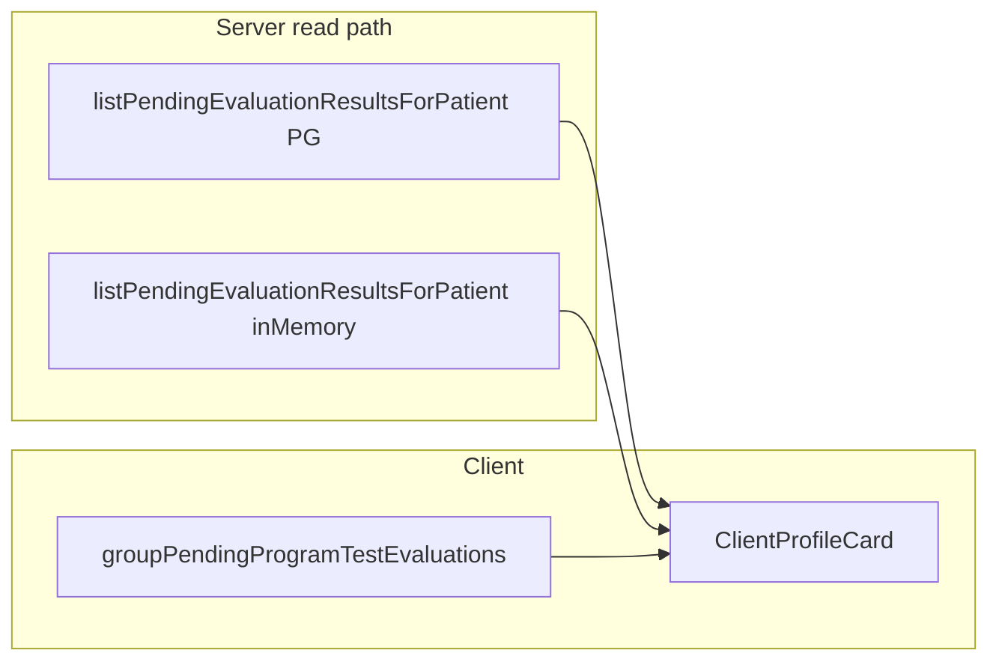

**Канон плана:** только этот файл — `.cursor/plans/doctor_inbox_by_attempt.plan.md` в корне репозитория BersonCareBot.

# Группировка инбокса «К проверке» по попытке

## Зачем

Сейчас в инбоксе **одна строка на каждый** `test_result` без оценки врача (`decided_by IS NULL`) при уже **отправленной** попытке (`submitted_at`). В наборе из нескольких тестов врач видит **дублирующиеся** карточки с одной и той же программой и одной ссылкой. Нужно агрегировать по **попытке** (`test_attempts.id`).

## Контекст (факты в коде)

- **UI:** [`apps/webapp/src/app/app/doctor/clients/ClientProfileCard.tsx`](apps/webapp/src/app/app/doctor/clients/ClientProfileCard.tsx) — секция `doctor-client-section-pending-program-tests`, проп `pendingProgramTestEvaluations`.
- **Данные (RSC):** [`apps/webapp/src/app/app/doctor/clients/[userId]/page.tsx`](apps/webapp/src/app/app/doctor/clients/[userId]/page.tsx) и [`apps/webapp/src/app/app/doctor/clients/page.tsx`](apps/webapp/src/app/app/doctor/clients/page.tsx) — `deps.treatmentProgramProgress.listPendingTestEvaluationsForPatient` → порт `listPendingEvaluationResultsForPatient`.
- **Реализация read:** [`apps/webapp/src/infra/repos/pgTreatmentProgramTestAttempts.ts`](apps/webapp/src/infra/repos/pgTreatmentProgramTestAttempts.ts) (`listPendingEvaluationResultsForPatient`), зеркало — [`apps/webapp/src/infra/repos/inMemoryTreatmentProgramInstance.ts`](apps/webapp/src/infra/repos/inMemoryTreatmentProgramInstance.ts).
- **Тип строки:** [`apps/webapp/src/modules/treatment-program/types.ts`](apps/webapp/src/modules/treatment-program/types.ts) — `PendingProgramTestEvaluationRow` (**пока без** `attemptId`).
- **Якорь на детали программы:** `id="doctor-program-instance-test-results"` в [`TreatmentProgramInstanceDetailClient.tsx`](apps/webapp/src/app/app/doctor/clients/[userId]/treatment-programs/[instanceId]/TreatmentProgramInstanceDetailClient.tsx).

## Scope

**Разрешено:** `types.ts` (DTO), `pgTreatmentProgramTestAttempts.ts`, `inMemoryTreatmentProgramInstance.ts`, новый модуль группировки + тест под `apps/webapp/src/app/app/doctor/clients/`, `ClientProfileCard.tsx`, при необходимости **одна** правка ожиданий в [`progress-service.test.ts`](apps/webapp/src/modules/treatment-program/progress-service.test.ts) (если появятся жёсткие проверки полей pending), короткий **LOG** в `docs/DOCTOR_PATIENT_CARD_TREATMENT_PROGRAM_INITIATIVE/LOG.md` или строка в [`docs/APP_RESTRUCTURE_INITIATIVE/E2E_ACCEPTANCE_AFTER_AB.md`](docs/APP_RESTRUCTURE_INITIATIVE/E2E_ACCEPTANCE_AFTER_AB.md).

**Вне scope:** новые публичные REST-маршруты; cross-patient инбокс на «Сегодня»; автоподсветка конкретной попытки на странице инстанса (только якорь на секцию); изменение GitHub CI workflow; фильтр по `accepted_at` без отдельного продуктового решения (см. ниже).

## Продуктовое решение (зафиксировать в PR)

1. **Фильтр SQL / in-memory** — **не менять:** как сейчас, `decided_by IS NULL`, `submitted_at IS NOT NULL`, активный инстанс. Строки по **уже принятой** попытке (`accepted_at` задан), но с непроставленным `decided_by`, формально остаются в выборке — это согласовано с MVP-B (приём попытки ≠ PATCH каждого результата). Отдельное скрытие таких строк — **только** после явного решения продукта.
2. **Бейдж «К проверке»:** число на бейдже = **количество неоценённых результатов** (сумма длины `results` по всем группам), чтобы не выглядело как «пропало 4 из 5 задач» при переходе с плоского списка на группы. Альтернатива (число групп) — хуже без второй подписи; в плане зафиксировано: **суммарно тестов без оценки**.
3. **Тексты:** лаконично ([`ui-copy-no-excess-labels`](.cursor/rules/ui-copy-no-excess-labels.mdc)) — без вводных абзацев; одна кнопка/ссылка **«Открыть»** на группу с `href` … `#doctor-program-instance-test-results`.

## Шаги реализации

### 1. DTO и репозитории

- В `PendingProgramTestEvaluationRow` добавить поля:
  - `attemptId: string`
  - `attemptSubmittedAt: string` (ISO, не null при текущем фильтре — всегда задано для попадания в выборку)
- В PG-`select` / in-memory `push` заполнить их из попытки.

**Проверки:** `rg PendingProgramTestEvaluationRow` — все места сборки объекта обновлены; `pnpm --filter @bersoncare/webapp run typecheck`.

### 2. Чистая функция группировки

- Новый файл, например [`apps/webapp/src/app/app/doctor/clients/groupPendingProgramTestEvaluations.ts`](apps/webapp/src/app/app/doctor/clients/groupPendingProgramTestEvaluations.ts):
  - Вход: `PendingProgramTestEvaluationRow[]`
  - Выход: массив групп с полями для заголовка: `attemptId`, `attemptSubmittedAt`, `instanceId`, `instanceTitle`, `stageTitle`, `stageItemId`, `results` (исходные строки).
  - Сортировка групп: по `attemptSubmittedAt` **убывание**; при равенстве — по **лексикографически большему** `attemptId` (или по `max(createdAt)` в группе — выбрать **один** стабильный tie-break и зафиксировать в тесте).
  - Внутри группы: сортировка `results` по `createdAt` по возрастанию, затем по `resultId`.

**Проверки:** [`apps/webapp/src/app/app/doctor/clients/groupPendingProgramTestEvaluations.test.ts`](apps/webapp/src/app/app/doctor/clients/groupPendingProgramTestEvaluations.test.ts) — проект **`fast`** ([`webapp-tests-lean-no-bloat.mdc`](.cursor/rules/webapp-tests-lean-no-bloat.mdc)): минимум три кейса (одна группа; две попытки; tie-break).

### 3. ClientProfileCard

- `useMemo`: входной массив → `groupPendingProgramTestEvaluations(pendingProgramTestEvaluations)`.
- Рендер: `groups.map` — одна карточка на группу; внутри — кратко список названий тестов или только **«Без оценки: N»** (достаточно одного варианта для компактности; не раздувать).
- Ссылка: существующий базовый URL + `scopeQs` + `#doctor-program-instance-test-results`.
- Бейдж: `pendingProgramTestEvaluations.length` (как выше — совпадает с суммой неоценённых результатов до и после группировки).

**Проверки:** eslint на затронутых файлах; ручной smoke: два теста в одной попытке → одна группа.

### 4. Документация и CI

- Одна запись в `docs/DOCTOR_PATIENT_CARD_TREATMENT_PROGRAM_INITIATIVE/LOG.md` (предпочтительно) **или** правка строки в `E2E_ACCEPTANCE_AFTER_AB.md` про инбокс / «Открыть тест».
- Перед merge: **`pnpm run ci`** ([`pre-push-ci.mdc`](.cursor/rules/pre-push-ci.mdc)).

## Риски и смягчение

| Риск | Смягчение |
|------|-----------|
| Якорь не скроллит при длинной странице | Приёмлемо для v1; позже — query `?focus=attempt` при отдельной задаче |
| Расхождение PG vs in-memory в тестах | Одинаковые поля в обоих портах; общий тип DTO |

## Definition of Done

- [ ] Несколько `test_results` с одним `attempt_id` в инбоксе — **одна** группа, **одна** ссылка.
- [ ] Бейдж «К проверке» отражает **число неоценённых результатов** (как сейчас по смыслу нагрузки на врача).
- [ ] Новый unit-тест группировки (проект `fast`); typecheck зелёный.
- [ ] Короткая запись в выбранном doc-файле; **`pnpm run ci`** зелёный.
