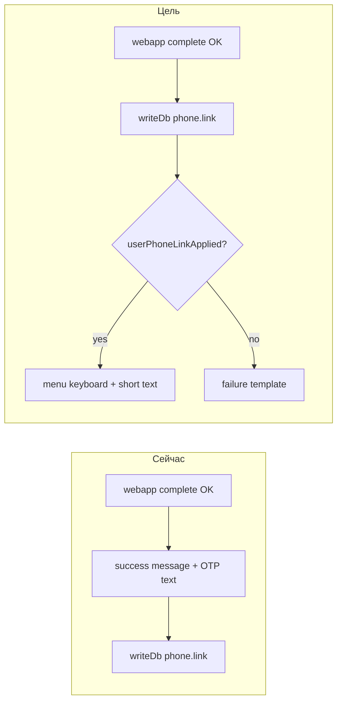

# План B: UX бота после привязки контакта (Telegram + Max)

**Связанный план:** [phone_messenger_bind_pwa_autologin.plan.md](phone_messenger_bind_pwa_autologin.plan.md) (автовход PWA).

**Порядок:** выполнять **вторым** или параллельно после merge `messenger-bind/finish`. Полный приёмочный smoke — когда оба плана закрыты.

## Контекст (подтверждено кодом)

| Симптом | Причина |
|---------|---------|
| После «Аккаунт создан» снова «Предоставить контакт» | `login`: только `message.send` с кодом, без `replyKeyboard` меню; `oneTimeKeyboard` контакта не снимается |
| Повторный гейт контакта | `linkedPhone === false` или success **до** проверки `user.phone.link` |
| «Отмена» → «Отправить ваш вопрос Дмитрию?» | [telegram.menu.default](apps/integrator/src/content/telegram/user/scripts.json) / [max.default](apps/integrator/src/content/max/user/scripts.json) + [telegram.draft.replace](apps/integrator/src/content/telegram/user/scripts.json) матчат текст в `await_phoneauth:*` (`$notIn` только diary) |
| «Вернуться в меню» не работает в phoneauth | [telegram.contact.link.cancel](apps/integrator/src/content/telegram/user/scripts.json) только `await_contact:subscription` |

**Критический баг порядка** в [executeAction.ts](apps/integrator/src/kernel/domain/executor/executeAction.ts) (~324–430): success-intents собираются **до** `writeDb(user.phone.link)`, результат write не проверяется.



## Scope

### Разрешено

| Область | Файлы |
|---------|--------|
| Executor | [apps/integrator/src/kernel/domain/executor/executeAction.ts](apps/integrator/src/kernel/domain/executor/executeAction.ts), [executeAction.test.ts](apps/integrator/src/kernel/domain/executor/executeAction.test.ts) |
| Scripts | [apps/integrator/src/content/telegram/user/scripts.json](apps/integrator/src/content/telegram/user/scripts.json), [apps/integrator/src/content/max/user/scripts.json](apps/integrator/src/content/max/user/scripts.json) |
| Templates | [apps/integrator/src/content/telegram/user/templates.json](apps/integrator/src/content/telegram/user/templates.json), [apps/integrator/src/content/max/user/templates.json](apps/integrator/src/content/max/user/templates.json) |
| Orchestrator tests | [apps/integrator/src/kernel/orchestrator/buildPlan.test.ts](apps/integrator/src/kernel/orchestrator/buildPlan.test.ts) |
| Docs | [docs/OPERATIONS/PHONE_MESSENGER_AUTH_RUNBOOK.md](docs/OPERATIONS/PHONE_MESSENGER_AUTH_RUNBOOK.md), [docs/LOGIN_REGISTER_NEW_LOGIC/LOG.md](docs/LOGIN_REGISTER_NEW_LOGIC/LOG.md) |

### Вне scope

- `POST /api/auth/phone/messenger-bind/finish` (план A).
- Рефакторинг всего draft/support pipeline.
- Расширение `resolver` с `$notStartsWith` (не делаем, если хватает cancel scripts priority 57 + excludeTexts).
- Изменение GitHub CI workflow.

## Шаги

### 1. `executeAction`: writes first + guard

В `webapp.phoneMessengerBind.complete`:

1. После успешного M2M `completePhoneMessengerBind` — **сначала** `writeDb`: `user.phone.link`, `user.state.set` → `idle`.
2. Проверить `userPhoneLinkApplied` (и `phoneLinkReason` при false).
3. Если `false` — failure template (`phoneAuthFailed` / reason), **без** success и меню.
4. Если `true` — success-intents (см. шаг 2).

По образцу уже сделанного для `webapp.channelLink.complete` в [phone_bind_mismatch_ux.plan.md](archive/phone_bind_mismatch_ux.plan.md).

**Проверка:** `executeAction.test.ts` — mock `userPhoneLinkApplied: false` → нет success/menu intents.

### 2. Главное меню после `purpose: login`

Сейчас меню только для `profile_bind` (~349–375 в executeAction).

Для `login` после успешного link:

- **Telegram:** `message.replyKeyboard.show` — `menu.book` + `menu.app` (как profile_bind).
- **Max:** текст `max:phoneAuthPhoneLinked` + inline меню (существующий паттерн).

Вынести повтор в локальный helper внутри executor (не новый модуль).

**Проверка:** `executeAction.test.ts` — login path содержит reply keyboard intent.

### 3. Шаблоны бота без вводящего в заблуждение OTP

При автовходе PWA (план A) код в TG не нужен пользователю.

- Добавить `phoneAuthReturnToApp` (TG/Max): «Вернитесь в приложение — вход продолжится автоматически».
- Ветка `login` в executeAction — новый template вместо `phoneAuthLoginCode` / `phoneAuthAccountCreated` **или** короткий success без `{{code}}`.

**Проверка:** `rg phoneAuthLoginCode executeAction` — login branch не шлёт код в TG после изменения.

### 4. Cancel-сценарии phoneauth (priority 57)

`$notIn` в menu.default **не** поддерживает префиксы `await_phoneauth:*` — только точные state ([resolver.ts](apps/integrator/src/kernel/orchestrator/resolver.ts)).

Новые скрипты (TG + Max), **priority 57** (выше `telegram.contact.phoneauth` 54):

| Match | Steps |
|-------|--------|
| `conversationState.$startsWith: "await_phoneauth:"` + (`text: Отмена` **или** `action: phone.request.cancel`) | `state` → `idle`; если `linkedPhone` — главное меню; иначе коротко «привязка отменена», без повторного contact без нового `/start auth_*` |

Не вызывать `draft.upsertFromMessage`.

**Проверка:** `buildPlan.test.ts` — «Отмена» в `await_phoneauth:auth_x` не выбирает `telegram.menu.default`.

### 5. Защита catch-all

В **telegram.menu.default**, **max.default**, **telegram.draft.replace**:

- `excludeActions`: `phone.request.cancel`, `start.phoneauth`
- `excludeTexts`: `Отмена`, `Вернуться в меню`

Расширить [telegram.contact.link.cancel](apps/integrator/src/content/telegram/user/scripts.json): match `await_phoneauth:*` **или** дублировать скрипт phoneauth.cancel.

Max: зеркало (сейчас нет `contact.link.cancel`).

**Проверка:** ручной — «Отмена» и «Вернуться в меню» не показывают `confirmQuestion`.

### 6. Регрессии

- `profile_bind` — без изменений логики consumed / меню.
- `buildLinkedPhoneMessageMenuGatePlan` — после success `linkedPhone: true`, `booking.open` не re-gate contact.
- `telegram.contact.link.remind` — только `await_contact:subscription` (не трогать idle).

### 7. Execution log

[docs/LOGIN_REGISTER_NEW_LOGIC/LOG.md](docs/LOGIN_REGISTER_NEW_LOGIC/LOG.md) — фаза 0 (4 кейса) + результат фиксов.

## Definition of Done

- [ ] После контакта в TG/Max видно главное меню, нет залипшей кнопки «Предоставить контакт».
- [ ] При сбое `user.phone.link` пользователь **не** видит success «аккаунт создан».
- [ ] «Отмена» / «Вернуться в меню» во время phoneauth **не** открывают «Отправить ваш вопрос Дмитрию?».
- [ ] Max паритет с TG по cancel + menu после bind.
- [ ] `executeAction` + `buildPlan` тесты зелёные.
- [ ] Runbook / LOG обновлены.
- [ ] Ручной smoke с планом A: PWA автовход + бот меню + отмена.

## Проверки

```bash
pnpm --dir apps/integrator exec vitest run src/kernel/domain/executor/executeAction.test.ts -t phoneMessengerBind
pnpm --dir apps/integrator exec vitest run src/kernel/orchestrator/buildPlan.test.ts
```

Перед merge: `pnpm run ci`.

## Риски

| Риск | Митигация |
|------|-----------|
| Старый draft + «Отмена» | excludeTexts + cancel priority 57 |
| menu.default перебивает cancel | priority 57 > 0, высокая specificity match |
| Текст без кода в TG при закрытой PWA | короткая строка «откройте приложение снова» в шаблоне |

## Не делаем в этом плане

- Удаление OTP challenge на сервере (нужен для finish в плане A).
- Backfill рассинхрона integrator/public.
