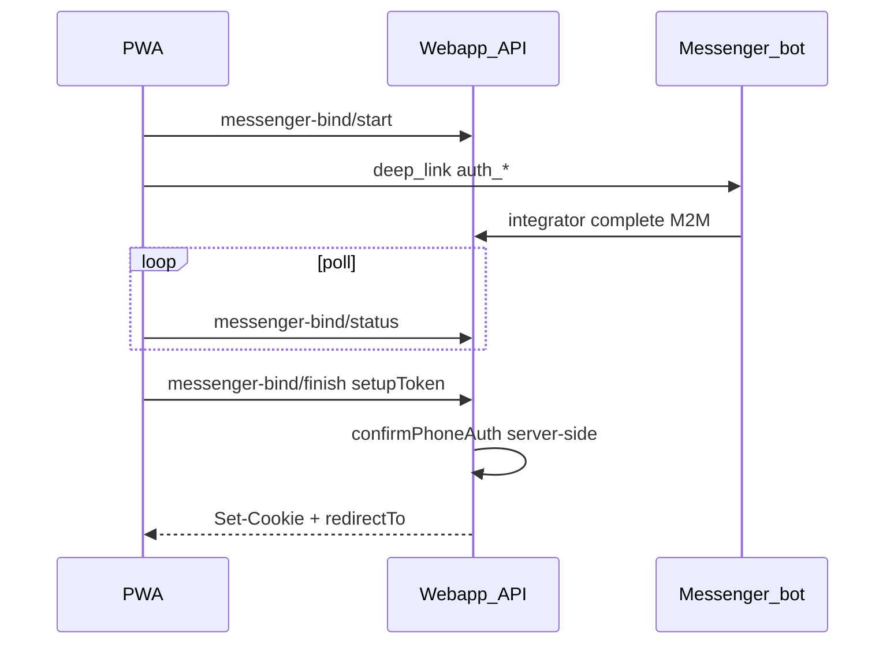

# План A: PWA автовход после контакта в мессенджере

**Связанный план:** [phone_messenger_bind_bot_ux.plan.md](phone_messenger_bind_bot_ux.plan.md) (меню бота, cancel, `user.phone.link`).

**Порядок:** этот план — **первый**. План B можно начинать параллельно после merge API `finish`, но smoke «полный сценарий» — после обоих.

## Контекст

Сейчас (`purpose: login`):

1. PWA → `messenger-bind/start` → deep link `auth_*` в боте.
2. Контакт → integrator M2M `phone-messenger-bind/complete` → secret `otp_ready`.
3. PWA poll → показ **OtpCodeForm** → `POST /api/auth/phone/confirm`.

Контакт в мессенджере уже доказывает владение номером; браузер, начавший bind, держит `setupToken`. OTP в PWA избыточен.



## Scope

### Разрешено

| Область | Файлы |
|---------|--------|
| Bind module | [apps/webapp/src/modules/auth/phoneMessengerBind.ts](apps/webapp/src/modules/auth/phoneMessengerBind.ts), [phoneMessengerBind.test.ts](apps/webapp/src/modules/auth/phoneMessengerBind.test.ts) |
| API | [apps/webapp/src/app/api/auth/phone/messenger-bind/finish/route.ts](apps/webapp/src/app/api/auth/phone/messenger-bind/finish/route.ts) (+ test) |
| DI | [apps/webapp/src/app-layer/di/buildAppDeps.ts](apps/webapp/src/app-layer/di/buildAppDeps.ts) |
| UI | [apps/webapp/src/shared/ui/auth/PhoneMessengerAuthFlow.tsx](apps/webapp/src/shared/ui/auth/PhoneMessengerAuthFlow.tsx), [PhoneMessengerAuthFlow.test.tsx](apps/webapp/src/shared/ui/auth/PhoneMessengerAuthFlow.test.tsx) |
| Docs | [docs/OPERATIONS/PHONE_MESSENGER_AUTH_RUNBOOK.md](docs/OPERATIONS/PHONE_MESSENGER_AUTH_RUNBOOK.md), [apps/webapp/src/modules/auth/auth.md](apps/webapp/src/modules/auth/auth.md), [apps/webapp/INTEGRATOR_CONTRACT.md](apps/webapp/INTEGRATOR_CONTRACT.md), [docs/LOGIN_REGISTER_NEW_LOGIC/LOG.md](docs/LOGIN_REGISTER_NEW_LOGIC/LOG.md) |

### Вне scope

- Integrator scripts / `executeAction` (план B).
- Удаление OTP из текста бота (план B, шаблоны).
- Изменения `profile_bind` (остаётся poll `consumed` → `onProfileComplete`).
- Путь «уже привязан TG» → `phone/start` + ручной OTP (без изменений).

## Шаги

### 1. `resolvePhoneMessengerBindLoginChallenge`

- Вход: `setupToken` (`auth_*`).
- Условия: row `purpose === login`, `status === otp_ready`, есть `challenge_id`; код **только** из `challengeStore` (не в ответ клиенту).
- Ошибки: `invalid_token`, `not_found`, `not_ready`, `challenge_expired`, `wrong_purpose`, `already_consumed` / `used_token`.

**Проверка:** `rg resolvePhoneMessengerBindLoginChallenge apps/webapp`.

### 2. `POST /api/auth/phone/messenger-bind/finish`

- Body: `setupToken`, опционально `browserCalendarIana` (как [phone/confirm/route.ts](apps/webapp/src/app/api/auth/phone/confirm/route.ts)).
- Flow: `resolveLoginChallenge` → `deps.auth.confirmPhoneAuth` → `setSessionFromUser` → calendar TZ.
- **Идемпотентность:** повтор после `consumed` — если сессия уже есть, `200` + `redirectTo`; иначе `409` с понятным `error`.
- OTP-код **не** принимать в body.

**Проверка:** route test; `rg 'messenger-bind/finish' apps/webapp` — один канонический route.

### 3. `PhoneMessengerAuthFlow`

- `purpose === login` + poll `status === otp_ready` → `POST finish`, UI «Завершаем вход…».
- `finishingRef` — защита от двойного finish при интервале poll.
- Успех: `markFreshLoginAfterAuth` + `getPostAuthRedirectTarget` + `window.location.assign`.
- Ошибка finish: toast + `resetBindAttempt`.
- **`profile_bind`:** без изменений (consumed / otp_ready → `onProfileComplete`).

**Проверка:** обновить тест «polls until otp_ready» — нет `getByLabelText('Код подтверждения')`, есть fetch finish.

### 4. Документация

- Runbook § login: poll → **finish**, не ручной `phone/confirm`.
- INTEGRATOR_CONTRACT: finish не меняет M2M complete (integrator по-прежнему получает `otpCode` для своих сообщений до плана B).

### 5. Execution log

Запись в [docs/LOGIN_REGISTER_NEW_LOGIC/LOG.md](docs/LOGIN_REGISTER_NEW_LOGIC/LOG.md): дата, что сделано, какие тесты, что сознательно не трогали (бот).

## Definition of Done

- [ ] После контакта в TG/Max PWA **автоматически** получает cookie сессии и редирект в приложение (без ввода OTP в браузере).
- [ ] `profile_bind` и существующий `phone/confirm` для других потоков не сломаны.
- [ ] Unit/route тесты по затронутым файлам зелёные.
- [ ] Runbook + auth.md + LOG обновлены.
- [ ] Ручной smoke (фаза 0 из umbrella): PWA login → TG → контакт → кабинет.

## Проверки (не полный CI на каждый шаг)

```bash
pnpm --dir apps/webapp exec vitest run src/modules/auth/phoneMessengerBind.test.ts
pnpm --dir apps/webapp exec vitest run src/shared/ui/auth/PhoneMessengerAuthFlow.test.tsx
pnpm --dir apps/webapp exec vitest run src/app/api/auth/phone/messenger-bind/finish
```

Перед merge в main: `pnpm run ci` (или `ci:resume:*` после локального падения — см. `.cursor/rules/pre-push-ci.mdc`).

## Риски

| Риск | Митигация |
|------|-----------|
| Украденный `setupToken` | TTL secret 15 мин, one-time consume, HTTPS |
| Двойной poll → два finish | `finishingRef` + server idempotent на consumed |
| PWA в фоне | poll продолжается; при возврате finish уже выполнен |
